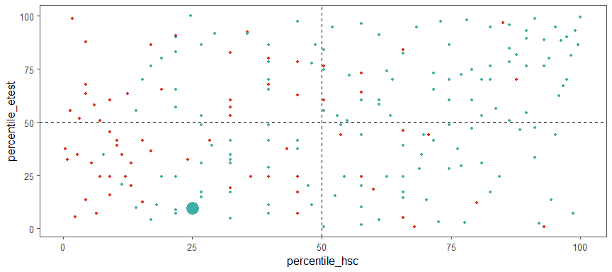

---
    output:
      html_document:
              
        toc: true
        toc_float: false
        toc_depth: 3
        number_sections: true
        
        code_folding: hide
        code_download: true
        
        fig_width: 9 
        fig_height: 4
        fig_align: "center"
        
        highlight: pygments
        theme: cerulean
        
        keep_md: true
        
    title: "Job Offer Prediction - MBA Students"
    subtitle: "I'm... hired? Can we predict which student received a placement offer?"
    author: "by Peter Hontaru"
---


```r
knitr::opts_chunk$set(
    echo = TRUE, # show all code
    tidy = FALSE, # cleaner code printing
    size = "small", # smaller code
    
    fig.path = "figures/", #graphics location
    out.width = "100%",

    message = FALSE,
    warning = FALSE
    )
```


```r
setwd("~/DS/AHT/Data")

#import data
raw_data <- read_csv("~/DS/Job-Offer-Prediction-MBA-Students/raw data/Placement_Data_Full_Class.csv")%>%
  mutate(gender = as.factor(gender),
               ssc_b = as.factor(ssc_b),
               hsc_b = as.factor(hsc_b),
               hsc_s = as.factor(hsc_s),
               degree_t = as.factor(make.names(degree_t)),
               specialisation = as.factor(make.names(specialisation)),
               workex = as.factor(workex),
               status = as.factor(status))
```


# Introduction


## Problem Statement:

Can we predict which candiates was placed in a role? If so, which factors helped the most (ie. work experience, degree, school results, gender, etc)?

## Key takeaways


#### Students {-}

The LDA2 model might be more suitable as it did not have any false positives. This means that it correctly predicted if a student shouldn't apply for a role. 

The most important factors, as shown by the Random Forrest model were secondary scores, higher secondary schores and work experience.


#### Hiring Managers {-}

The second model might be more suitable as it achieved a higher overall accuracy and more student were predicted correctly.


The model achieved 


## Dataset information:


```r
attribute <- names(raw_data)

description <- c(
"Serial Number",
"Gender: Male='M', Female='F'",
"Secondary Education Percentage (grades 9 and 10) - exam at the end of 10th grade",
"Board of Education - Central/Others",
"Higher Secondary Education (grades 11 and 12) - exam at the end of 12th grade",
"Board of Education - Central/Others",
"Specialization in Higher Secondary Education",
"Degree Percentage",
"Undergraduate (Degree type) - Field of degree education",
"Work Experience - Yes/No",
"Employability test Percentage (conducted by college)",
"Post Graduation (MBA) - Specialization",
"MBA percentage",
"Status of placement - Placed/Not placed",
"Salary offered by corporate to candidates")

type <- c(
"numeric",
"factor",
"numeric",
"factor",
"numeric",
"factor",
"factor",
"numeric",
"factor",
"factor",
"numeric",
"factor",
"numeric",
"factor",
"numeric")

dataset_table <-as.data.frame(cbind(attribute, type, description))

dataset_table %>%
  kbl(align = c("r", "l", "l"))%>%
  kable_paper("hover", full_width = F)%>%
  column_spec(1, bold = TRUE)%>%
  column_spec(2, italic = TRUE)
```

<table class=" lightable-paper lightable-hover" style='font-family: "Arial Narrow", arial, helvetica, sans-serif; width: auto !important; margin-left: auto; margin-right: auto;'>
 <thead>
  <tr>
   <th style="text-align:right;"> attribute </th>
   <th style="text-align:left;"> type </th>
   <th style="text-align:left;"> description </th>
  </tr>
 </thead>
<tbody>
  <tr>
   <td style="text-align:right;font-weight: bold;"> sl_no </td>
   <td style="text-align:left;font-style: italic;"> numeric </td>
   <td style="text-align:left;"> Serial Number </td>
  </tr>
  <tr>
   <td style="text-align:right;font-weight: bold;"> gender </td>
   <td style="text-align:left;font-style: italic;"> factor </td>
   <td style="text-align:left;"> Gender: Male='M', Female='F' </td>
  </tr>
  <tr>
   <td style="text-align:right;font-weight: bold;"> ssc_p </td>
   <td style="text-align:left;font-style: italic;"> numeric </td>
   <td style="text-align:left;"> Secondary Education Percentage (grades 9 and 10) - exam at the end of 10th grade </td>
  </tr>
  <tr>
   <td style="text-align:right;font-weight: bold;"> ssc_b </td>
   <td style="text-align:left;font-style: italic;"> factor </td>
   <td style="text-align:left;"> Board of Education - Central/Others </td>
  </tr>
  <tr>
   <td style="text-align:right;font-weight: bold;"> hsc_p </td>
   <td style="text-align:left;font-style: italic;"> numeric </td>
   <td style="text-align:left;"> Higher Secondary Education (grades 11 and 12) - exam at the end of 12th grade </td>
  </tr>
  <tr>
   <td style="text-align:right;font-weight: bold;"> hsc_b </td>
   <td style="text-align:left;font-style: italic;"> factor </td>
   <td style="text-align:left;"> Board of Education - Central/Others </td>
  </tr>
  <tr>
   <td style="text-align:right;font-weight: bold;"> hsc_s </td>
   <td style="text-align:left;font-style: italic;"> factor </td>
   <td style="text-align:left;"> Specialization in Higher Secondary Education </td>
  </tr>
  <tr>
   <td style="text-align:right;font-weight: bold;"> degree_p </td>
   <td style="text-align:left;font-style: italic;"> numeric </td>
   <td style="text-align:left;"> Degree Percentage </td>
  </tr>
  <tr>
   <td style="text-align:right;font-weight: bold;"> degree_t </td>
   <td style="text-align:left;font-style: italic;"> factor </td>
   <td style="text-align:left;"> Undergraduate (Degree type) - Field of degree education </td>
  </tr>
  <tr>
   <td style="text-align:right;font-weight: bold;"> workex </td>
   <td style="text-align:left;font-style: italic;"> factor </td>
   <td style="text-align:left;"> Work Experience - Yes/No </td>
  </tr>
  <tr>
   <td style="text-align:right;font-weight: bold;"> etest_p </td>
   <td style="text-align:left;font-style: italic;"> numeric </td>
   <td style="text-align:left;"> Employability test Percentage (conducted by college) </td>
  </tr>
  <tr>
   <td style="text-align:right;font-weight: bold;"> specialisation </td>
   <td style="text-align:left;font-style: italic;"> factor </td>
   <td style="text-align:left;"> Post Graduation (MBA) - Specialization </td>
  </tr>
  <tr>
   <td style="text-align:right;font-weight: bold;"> mba_p </td>
   <td style="text-align:left;font-style: italic;"> numeric </td>
   <td style="text-align:left;"> MBA percentage </td>
  </tr>
  <tr>
   <td style="text-align:right;font-weight: bold;"> status </td>
   <td style="text-align:left;font-style: italic;"> factor </td>
   <td style="text-align:left;"> Status of placement - Placed/Not placed </td>
  </tr>
  <tr>
   <td style="text-align:right;font-weight: bold;"> salary </td>
   <td style="text-align:left;font-style: italic;"> numeric </td>
   <td style="text-align:left;"> Salary offered by corporate to candidates </td>
  </tr>
</tbody>
</table>

```r
#clear variables from environment
rm(attribute, type, description, dataset_table)
```


Check for *NULL*s:


```r
#check for nulls
raw_data %>% summarise_all(~ sum(is.null(.))) %>% sum() %>% 
  kbl(col.names = "Number of NULLs",
      align = c("c", "c")) %>%
  kable_paper("hover", full_width = F)%>%
  column_spec(1, color = "green", bold = TRUE)
```

<table class=" lightable-paper lightable-hover" style='font-family: "Arial Narrow", arial, helvetica, sans-serif; width: auto !important; margin-left: auto; margin-right: auto;'>
 <thead>
  <tr>
   <th style="text-align:center;"> Number of NULLs </th>
  </tr>
 </thead>
<tbody>
  <tr>
   <td style="text-align:center;font-weight: bold;color: green !important;"> 0 </td>
  </tr>
</tbody>
</table>


Check for *NA*s:


```r
#check NAs
raw_data %>% summarise_all(~ sum(is.na(.))) %>% sum() %>%
    kbl(col.names = "Number of NAs",
      align = c("c", "c")) %>%
  kable_paper("hover", full_width = F)%>%
  column_spec(1, color = "red", bold = TRUE)
```

<table class=" lightable-paper lightable-hover" style='font-family: "Arial Narrow", arial, helvetica, sans-serif; width: auto !important; margin-left: auto; margin-right: auto;'>
 <thead>
  <tr>
   <th style="text-align:center;"> Number of NAs </th>
  </tr>
 </thead>
<tbody>
  <tr>
   <td style="text-align:center;font-weight: bold;color: red !important;"> 67 </td>
  </tr>
</tbody>
</table>


Let's dig deeper and see why we have 67 NAs.


```r
#we have 67 NAs - let's see which category has these values
raw_data %>% summarise_all(~ sum(is.na(.))) %>%
    kbl()%>%
  kable_paper("hover", full_width = F)%>%
  column_spec(15, color = "red", bold = TRUE)%>%
  column_spec(1:14, color = "green", bold = TRUE)
```

<table class=" lightable-paper lightable-hover" style='font-family: "Arial Narrow", arial, helvetica, sans-serif; width: auto !important; margin-left: auto; margin-right: auto;'>
 <thead>
  <tr>
   <th style="text-align:right;"> sl_no </th>
   <th style="text-align:right;"> gender </th>
   <th style="text-align:right;"> ssc_p </th>
   <th style="text-align:right;"> ssc_b </th>
   <th style="text-align:right;"> hsc_p </th>
   <th style="text-align:right;"> hsc_b </th>
   <th style="text-align:right;"> hsc_s </th>
   <th style="text-align:right;"> degree_p </th>
   <th style="text-align:right;"> degree_t </th>
   <th style="text-align:right;"> workex </th>
   <th style="text-align:right;"> etest_p </th>
   <th style="text-align:right;"> specialisation </th>
   <th style="text-align:right;"> mba_p </th>
   <th style="text-align:right;"> status </th>
   <th style="text-align:right;"> salary </th>
  </tr>
 </thead>
<tbody>
  <tr>
   <td style="text-align:right;font-weight: bold;color: green !important;"> 0 </td>
   <td style="text-align:right;font-weight: bold;color: green !important;"> 0 </td>
   <td style="text-align:right;font-weight: bold;color: green !important;"> 0 </td>
   <td style="text-align:right;font-weight: bold;color: green !important;"> 0 </td>
   <td style="text-align:right;font-weight: bold;color: green !important;"> 0 </td>
   <td style="text-align:right;font-weight: bold;color: green !important;"> 0 </td>
   <td style="text-align:right;font-weight: bold;color: green !important;"> 0 </td>
   <td style="text-align:right;font-weight: bold;color: green !important;"> 0 </td>
   <td style="text-align:right;font-weight: bold;color: green !important;"> 0 </td>
   <td style="text-align:right;font-weight: bold;color: green !important;"> 0 </td>
   <td style="text-align:right;font-weight: bold;color: green !important;"> 0 </td>
   <td style="text-align:right;font-weight: bold;color: green !important;"> 0 </td>
   <td style="text-align:right;font-weight: bold;color: green !important;"> 0 </td>
   <td style="text-align:right;font-weight: bold;color: green !important;"> 0 </td>
   <td style="text-align:right;font-weight: bold;color: red !important;"> 67 </td>
  </tr>
</tbody>
</table>


Lastly, we need to check why we have these 67 NAs in the salary category. Is this missing data or another reason behind it? 


```r
#let's check that this is because some students did not get placed and thus, had no salary
raw_data %>% group_by(status) %>% count() %>%     
  kbl(col.names = c("Status", "n"),
      align = c("c", "c")) %>%
  kable_paper("hover", full_width = F)%>%
  row_spec(1, color = "red", bold = TRUE)%>%
  row_spec(2, color = "green", bold = TRUE)
```

<table class=" lightable-paper lightable-hover" style='font-family: "Arial Narrow", arial, helvetica, sans-serif; width: auto !important; margin-left: auto; margin-right: auto;'>
 <thead>
  <tr>
   <th style="text-align:center;"> Status </th>
   <th style="text-align:center;"> n </th>
  </tr>
 </thead>
<tbody>
  <tr>
   <td style="text-align:center;font-weight: bold;color: red !important;"> Not Placed </td>
   <td style="text-align:center;font-weight: bold;color: red !important;"> 67 </td>
  </tr>
  <tr>
   <td style="text-align:center;font-weight: bold;color: green !important;"> Placed </td>
   <td style="text-align:center;font-weight: bold;color: green !important;"> 148 </td>
  </tr>
</tbody>
</table>


It looks like we have 67 NAs in the salary column due to the fact that 67 students did not get a placement. That makes sense and no further investigation is needed.


# Exploratory Data Analysis (EDA)


## Correlation plot


**Key findings**:

* we can observe **medium correlations between the academic scores**. This suggests that students who performed well in secondary school were likely to also perform well within further education (higher secondary, university and MBA)
* interestingly, **employability test scores only had a low correlation with academic scores**. **Perhaps**, this suggests that these tests were more practical than theoretical


```r
#select all to start
raw_data_corr <- select_if(raw_data, is.numeric)%>%
  select(-sl_no, -salary)

# Compute a correlation matrix
corr <- round(cor(raw_data_corr),2)

# Compute a matrix of correlation p-values
p.mat <- cor_pmat(raw_data_corr)

# Visualize the correlation matrix
ggcorrplot(corr, method = "square", 
           ggtheme = ggthemes::theme_few, 
           
           outline.col = "black",
           colors = c("#00AFBB","white", "red"),
           
           lab = TRUE,
           lab_size = 5,
           digits = 2,
           
           type = "lower",
           legend = "",
           tl.cex = 12,
           
           title = "We can observe low to medium correlations \nbetween our main variables")
```


```r
#clear variables from the environment
rm(corr, p.mat, raw_data_corr)
```


## Grade distribution {.tabset .tabset-fade .tabset-pills}


**Key findings**:

* the distribution becomes more concentated around the median (60-70) as a student progresses in their education, **from secondary** (wide distribution) **to MBA** (narrow distribution)
* the **employability test** has a different trend, with a very wide and almost equal distribution of each score group


### secondary {-}


```r
raw_data %>%
  ggplot(aes(ssc_p))+
  geom_histogram(binwidth = 5, fill = "#00AFBB", col = "black")+
  coord_cartesian(xlim=c(30,100),
                  ylim=c(0,70))+
  labs(x = "Score",
       y = "Number of students")+
  theme_few()
```


### higher secondary {-}


```r
raw_data %>%
  ggplot(aes(hsc_p))+
  geom_histogram(binwidth = 5, fill = "#00AFBB", col = "black")+
  coord_cartesian(xlim=c(30,100),
                  ylim=c(0,70))+
  labs(x = "Score",
       y = "Number of students")+
  theme_few()
```


### university {-}


```r
raw_data %>%
  ggplot(aes(degree_p))+
  geom_histogram(binwidth = 5, fill = "#00AFBB", col = "black")+
  coord_cartesian(xlim=c(30,100),
                  ylim=c(0,70))+
  labs(x = "Score",
       y = "Number of students")+
  theme_few()
```


### MBA {-}


```r
raw_data %>%
  ggplot(aes(mba_p))+
  geom_histogram(binwidth = 5, fill = "#00AFBB", col = "black")+
  coord_cartesian(xlim=c(30,100),
                  ylim=c(0,70))+
  labs(x = "Score",
       y = "Number of students")+
  theme_few()
```


### employability (non-academic) {-}


```r
raw_data %>%
  ggplot(aes(etest_p))+
  geom_histogram(binwidth = 5, fill = "#E69F00", col = "black")+
  coord_cartesian(xlim=c(30,100),
                  ylim=c(0,70))+
  labs(x = "Score",
       y = "Number of Students")+
  theme_few()
```


## Are there any gender-specific differences in performance scores? {.tabset .tabset-fade .tabset-pills}


**Key findings**:

* females scored significantly higher than men at **university** and **MBA** level
* no significant differences in performance during **secondary**, **higher secondary** and **employability test**


### university {-}


```r
t_test_degree <- raw_data%>%
  t_test(degree_p ~ gender)%>%
  add_significance()

raw_data %>% ggplot(aes(degree_p, fill = gender, col = gender))+
  geom_density(alpha = 0.3, lwd = 1, show.legend = FALSE)+
  geom_rug()+
  scale_fill_manual(values = c("#00AFBB", "#E69F00"))+
  scale_colour_manual(values = c("#00AFBB", "#E69F00"))+
  labs(title = paste("Females scored significantly higher (", t_test_degree$p.signif, ") than males at the university level"),
       col = "Gender",
       x = "Score",
       y = "Density")+
  theme_few()
```


```r
t_test_degree%>%
  kbl() %>%
  kable_paper("hover", full_width = F)
```

<table class=" lightable-paper lightable-hover" style='font-family: "Arial Narrow", arial, helvetica, sans-serif; width: auto !important; margin-left: auto; margin-right: auto;'>
 <thead>
  <tr>
   <th style="text-align:left;"> .y. </th>
   <th style="text-align:left;"> group1 </th>
   <th style="text-align:left;"> group2 </th>
   <th style="text-align:right;"> n1 </th>
   <th style="text-align:right;"> n2 </th>
   <th style="text-align:right;"> statistic </th>
   <th style="text-align:right;"> df </th>
   <th style="text-align:right;"> p </th>
   <th style="text-align:left;"> p.signif </th>
  </tr>
 </thead>
<tbody>
  <tr>
   <td style="text-align:left;"> degree_p </td>
   <td style="text-align:left;"> F </td>
   <td style="text-align:left;"> M </td>
   <td style="text-align:right;"> 76 </td>
   <td style="text-align:right;"> 139 </td>
   <td style="text-align:right;"> 2.431405 </td>
   <td style="text-align:right;"> 132.0024 </td>
   <td style="text-align:right;"> 0.0164 </td>
   <td style="text-align:left;"> * </td>
  </tr>
</tbody>
</table>


### MBA {-}


```r
t_test_mba <- raw_data%>%
  t_test(mba_p ~ gender)%>%
  add_significance()

raw_data %>% ggplot(aes(mba_p, fill = gender, col = gender))+
  geom_density(alpha = 0.3, lwd = 1, show.legend = FALSE)+
  geom_rug()+
  scale_fill_manual(values = c("#00AFBB", "#E69F00"))+
  scale_colour_manual(values = c("#00AFBB", "#E69F00"))+
  labs(title = paste("Females scored significantly higher (", t_test_mba$p.signif, ") than males at the MBA level"),
       col = "Gender",
       x = "Score",
       y = "Density")+
  theme_few()
```


```r
t_test_mba %>%
  kbl() %>%
  kable_paper("hover", full_width = F)
```

<table class=" lightable-paper lightable-hover" style='font-family: "Arial Narrow", arial, helvetica, sans-serif; width: auto !important; margin-left: auto; margin-right: auto;'>
 <thead>
  <tr>
   <th style="text-align:left;"> .y. </th>
   <th style="text-align:left;"> group1 </th>
   <th style="text-align:left;"> group2 </th>
   <th style="text-align:right;"> n1 </th>
   <th style="text-align:right;"> n2 </th>
   <th style="text-align:right;"> statistic </th>
   <th style="text-align:right;"> df </th>
   <th style="text-align:right;"> p </th>
   <th style="text-align:left;"> p.signif </th>
  </tr>
 </thead>
<tbody>
  <tr>
   <td style="text-align:left;"> mba_p </td>
   <td style="text-align:left;"> F </td>
   <td style="text-align:left;"> M </td>
   <td style="text-align:right;"> 76 </td>
   <td style="text-align:right;"> 139 </td>
   <td style="text-align:right;"> 4.725214 </td>
   <td style="text-align:right;"> 166.8781 </td>
   <td style="text-align:right;"> 4.9e-06 </td>
   <td style="text-align:left;"> **** </td>
  </tr>
</tbody>
</table>


## Did the academic peformance help in receiving an offer? {.tabset .tabset-fade .tabset-pills}


Since we know that the results got more concentrated around the median (60-70) as the student progressed in their education, we could infer that there was less of a chance to differentiate themselves based on grade and more based on other factors such as:
* *employability score*
* *work experience*
* *technical skills*
* *soft skills*
* *better interviewing skills*

Unfortunately, out of these factors, we only have data on the employability score.


**Key findings**:

The score differences between those who received an offer and those who did not:

* were highly significant at the **secondary**, **higher secondary** and **university** level
* significant at **employability test**
* no significance at the **MBA** level


### secondary {-}


```r
t_test <- raw_data %>%
  t_test(ssc_p ~ status)%>%
  add_significance()

raw_data %>% 
  ggplot(aes(ssc_p, fill=status, col = status))+
  geom_density(alpha = 0.3, show.legend = FALSE, lwd = 1)+
  geom_rug()+
  scale_fill_manual(values = c("#DC3220", "#40B0A6"))+
  scale_colour_manual(values = c("#DC3220", "#40B0A6"))+
  labs(x = "Score",
       y = "Density",
       col = "Status")+
  theme_few()
```


```r
t_test %>%
  kbl() %>%
  kable_paper("hover", full_width = F)
```

<table class=" lightable-paper lightable-hover" style='font-family: "Arial Narrow", arial, helvetica, sans-serif; width: auto !important; margin-left: auto; margin-right: auto;'>
 <thead>
  <tr>
   <th style="text-align:left;"> .y. </th>
   <th style="text-align:left;"> group1 </th>
   <th style="text-align:left;"> group2 </th>
   <th style="text-align:right;"> n1 </th>
   <th style="text-align:right;"> n2 </th>
   <th style="text-align:right;"> statistic </th>
   <th style="text-align:right;"> df </th>
   <th style="text-align:right;"> p </th>
   <th style="text-align:left;"> p.signif </th>
  </tr>
 </thead>
<tbody>
  <tr>
   <td style="text-align:left;"> ssc_p </td>
   <td style="text-align:left;"> Not Placed </td>
   <td style="text-align:left;"> Placed </td>
   <td style="text-align:right;"> 67 </td>
   <td style="text-align:right;"> 148 </td>
   <td style="text-align:right;"> -11.33316 </td>
   <td style="text-align:right;"> 132.0192 </td>
   <td style="text-align:right;"> 0 </td>
   <td style="text-align:left;"> **** </td>
  </tr>
</tbody>
</table>


### higher secondary {-}


```r
t_test <- raw_data%>%
  t_test(hsc_p ~ status)%>%
  add_significance()

raw_data %>% 
  ggplot(aes(hsc_p, fill=status, col = status))+
  geom_density(alpha = 0.3, show.legend = FALSE, lwd = 1)+
  geom_rug()+
  scale_fill_manual(values = c("#DC3220", "#40B0A6"))+
  scale_colour_manual(values = c("#DC3220", "#40B0A6"))+
  labs(x = "Score",
       y = "Density",
       col = "Status")+
  theme_few()
```


```r
t_test %>%
  kbl() %>%
  kable_paper("hover", full_width = F)
```

<table class=" lightable-paper lightable-hover" style='font-family: "Arial Narrow", arial, helvetica, sans-serif; width: auto !important; margin-left: auto; margin-right: auto;'>
 <thead>
  <tr>
   <th style="text-align:left;"> .y. </th>
   <th style="text-align:left;"> group1 </th>
   <th style="text-align:left;"> group2 </th>
   <th style="text-align:right;"> n1 </th>
   <th style="text-align:right;"> n2 </th>
   <th style="text-align:right;"> statistic </th>
   <th style="text-align:right;"> df </th>
   <th style="text-align:right;"> p </th>
   <th style="text-align:left;"> p.signif </th>
  </tr>
 </thead>
<tbody>
  <tr>
   <td style="text-align:left;"> hsc_p </td>
   <td style="text-align:left;"> Not Placed </td>
   <td style="text-align:left;"> Placed </td>
   <td style="text-align:right;"> 67 </td>
   <td style="text-align:right;"> 148 </td>
   <td style="text-align:right;"> -8.043664 </td>
   <td style="text-align:right;"> 120.8047 </td>
   <td style="text-align:right;"> 0 </td>
   <td style="text-align:left;"> **** </td>
  </tr>
</tbody>
</table>


### university {-}


```r
t_test <- raw_data%>%
  t_test(degree_p ~ status)%>%
  add_significance()

raw_data %>% 
  ggplot(aes(degree_p, fill=status, col = status))+
  geom_density(alpha = 0.3, show.legend = FALSE, lwd = 1)+
  geom_rug()+
  scale_fill_manual(values = c("#DC3220", "#40B0A6"))+
  scale_colour_manual(values = c("#DC3220", "#40B0A6"))+
  labs(x = "Score",
       y = "Density",
       col = "Status")+
  theme_few()
```


```r
t_test %>%
  kbl() %>%
  kable_paper("hover", full_width = F)
```

<table class=" lightable-paper lightable-hover" style='font-family: "Arial Narrow", arial, helvetica, sans-serif; width: auto !important; margin-left: auto; margin-right: auto;'>
 <thead>
  <tr>
   <th style="text-align:left;"> .y. </th>
   <th style="text-align:left;"> group1 </th>
   <th style="text-align:left;"> group2 </th>
   <th style="text-align:right;"> n1 </th>
   <th style="text-align:right;"> n2 </th>
   <th style="text-align:right;"> statistic </th>
   <th style="text-align:right;"> df </th>
   <th style="text-align:right;"> p </th>
   <th style="text-align:left;"> p.signif </th>
  </tr>
 </thead>
<tbody>
  <tr>
   <td style="text-align:left;"> degree_p </td>
   <td style="text-align:left;"> Not Placed </td>
   <td style="text-align:left;"> Placed </td>
   <td style="text-align:right;"> 67 </td>
   <td style="text-align:right;"> 148 </td>
   <td style="text-align:right;"> -8.054153 </td>
   <td style="text-align:right;"> 130.335 </td>
   <td style="text-align:right;"> 0 </td>
   <td style="text-align:left;"> **** </td>
  </tr>
</tbody>
</table>


### MBA {-}


```r
t_test <- raw_data%>%
  t_test(mba_p ~ status)%>%
  add_significance()

raw_data %>% 
  ggplot(aes(mba_p, fill=status, col = status))+
  geom_density(alpha = 0.3, show.legend = FALSE, lwd = 1)+
  geom_rug()+
  scale_fill_manual(values = c("#DC3220", "#40B0A6"))+
  scale_colour_manual(values = c("#DC3220", "#40B0A6"))+
  labs(x = "Score",
       y = "Density",
       col = "Status")+
  theme_few()
```


```r
t_test %>%
  kbl() %>%
  kable_paper("hover", full_width = F)
```

<table class=" lightable-paper lightable-hover" style='font-family: "Arial Narrow", arial, helvetica, sans-serif; width: auto !important; margin-left: auto; margin-right: auto;'>
 <thead>
  <tr>
   <th style="text-align:left;"> .y. </th>
   <th style="text-align:left;"> group1 </th>
   <th style="text-align:left;"> group2 </th>
   <th style="text-align:right;"> n1 </th>
   <th style="text-align:right;"> n2 </th>
   <th style="text-align:right;"> statistic </th>
   <th style="text-align:right;"> df </th>
   <th style="text-align:right;"> p </th>
   <th style="text-align:left;"> p.signif </th>
  </tr>
 </thead>
<tbody>
  <tr>
   <td style="text-align:left;"> mba_p </td>
   <td style="text-align:left;"> Not Placed </td>
   <td style="text-align:left;"> Placed </td>
   <td style="text-align:right;"> 67 </td>
   <td style="text-align:right;"> 148 </td>
   <td style="text-align:right;"> -1.139201 </td>
   <td style="text-align:right;"> 131.2069 </td>
   <td style="text-align:right;"> 0.257 </td>
   <td style="text-align:left;"> ns </td>
  </tr>
</tbody>
</table>


### employability (non-academic) {-}


```r
t_test <- raw_data%>%
  t_test(etest_p ~ status)%>%
  add_significance()

raw_data %>% 
  ggplot(aes(etest_p, fill=status, col = status))+
  geom_density(alpha = 0.3, show.legend = FALSE, lwd = 1)+
  geom_rug()+
  scale_fill_manual(values = c("#DC3220", "#40B0A6"))+
  scale_colour_manual(values = c("#DC3220", "#40B0A6"))+
  labs(x = "Score",
       y = "Density",
       col = "Status")+
  theme_few()
```


```r
t_test %>%
  kbl() %>%
  kable_paper("hover", full_width = F)
```

<table class=" lightable-paper lightable-hover" style='font-family: "Arial Narrow", arial, helvetica, sans-serif; width: auto !important; margin-left: auto; margin-right: auto;'>
 <thead>
  <tr>
   <th style="text-align:left;"> .y. </th>
   <th style="text-align:left;"> group1 </th>
   <th style="text-align:left;"> group2 </th>
   <th style="text-align:right;"> n1 </th>
   <th style="text-align:right;"> n2 </th>
   <th style="text-align:right;"> statistic </th>
   <th style="text-align:right;"> df </th>
   <th style="text-align:right;"> p </th>
   <th style="text-align:left;"> p.signif </th>
  </tr>
 </thead>
<tbody>
  <tr>
   <td style="text-align:left;"> etest_p </td>
   <td style="text-align:left;"> Not Placed </td>
   <td style="text-align:left;"> Placed </td>
   <td style="text-align:right;"> 67 </td>
   <td style="text-align:right;"> 148 </td>
   <td style="text-align:right;"> -1.980112 </td>
   <td style="text-align:right;"> 145.392 </td>
   <td style="text-align:right;"> 0.0496 </td>
   <td style="text-align:left;"> * </td>
  </tr>
</tbody>
</table>


## Did the different boards make a significant difference in school peformance/placement offer? {.tabset .tabset-fade .tabset-pills}


**Key findings**:

* no significant differences in school performance between the two boards at either **secondary** or **higher secondary** level
* there was also no significant difference in the number of people that received an offer from either board at the **secondary** or **higher secondary** level


### secondary {-}


```r
#vs performance
raw_data %>% 
  ggplot(aes(ssc_p, fill=ssc_b, col = ssc_b))+
  geom_density(alpha = 0.3, show.legend = FALSE, lwd = 1)+
  geom_rug()+
  scale_colour_manual(values = c("#00AFBB", "#E69F00"))+
  scale_fill_manual(values = c("#00AFBB", "#E69F00"))+
  labs(col = "Board",
       x = "Score",
       y = "Density")+
  theme_few()
```


```r
#t-test
t_test <- raw_data%>%
  t_test(ssc_p ~ ssc_b)%>%
  add_significance()%>%
  kbl() %>%
  kable_paper("hover", full_width = F)

t_test
```

<table class=" lightable-paper lightable-hover" style='font-family: "Arial Narrow", arial, helvetica, sans-serif; width: auto !important; margin-left: auto; margin-right: auto;'>
 <thead>
  <tr>
   <th style="text-align:left;"> .y. </th>
   <th style="text-align:left;"> group1 </th>
   <th style="text-align:left;"> group2 </th>
   <th style="text-align:right;"> n1 </th>
   <th style="text-align:right;"> n2 </th>
   <th style="text-align:right;"> statistic </th>
   <th style="text-align:right;"> df </th>
   <th style="text-align:right;"> p </th>
   <th style="text-align:left;"> p.signif </th>
  </tr>
 </thead>
<tbody>
  <tr>
   <td style="text-align:left;"> ssc_p </td>
   <td style="text-align:left;"> Central </td>
   <td style="text-align:left;"> Others </td>
   <td style="text-align:right;"> 116 </td>
   <td style="text-align:right;"> 99 </td>
   <td style="text-align:right;"> -1.690651 </td>
   <td style="text-align:right;"> 197.3488 </td>
   <td style="text-align:right;"> 0.0925 </td>
   <td style="text-align:left;"> ns </td>
  </tr>
</tbody>
</table>

```r
#vs placement
raw_data %>% 
  ggplot(aes(ssc_b, fill = status))+
  geom_bar(position = "fill", col = "black")+
  scale_fill_manual(values = c("#DC3220", "#40B0A6"))+
  scale_colour_manual(values = c("#DC3220", "#40B0A6"))+
  labs(fill = "Status",
       x = "Board",
       y = "Percentage of students")+
  scale_y_continuous(label = percent)+
  theme_few()
```


```r
#categorical variables
chisq.test(table(raw_data$ssc_b, raw_data$status))
```

```
## 
## 	Pearson's Chi-squared test with Yates' continuity correction
## 
## data:  table(raw_data$ssc_b, raw_data$status)
## X-squared = 0.15933, df = 1, p-value = 0.6898
```


### higher secondary {-}


```r
#vs performance
raw_data %>% 
  ggplot(aes(hsc_p, fill=hsc_b, col = hsc_b))+
  geom_density(alpha = 0.3, show.legend = FALSE, lwd = 1)+
  geom_rug()+
  scale_colour_manual(values = c("#00AFBB", "#E69F00"))+
  scale_fill_manual(values = c("#00AFBB", "#E69F00"))+
  labs(col = "Board",
       x = "Score",
       y = "Density")+
  theme_few()
```


```r
#t-test for performance
t_test <- raw_data%>%
  t_test(hsc_p ~ hsc_b)%>%
  add_significance()%>%
  kbl() %>%
  kable_paper("hover", full_width = F)

t_test
```

<table class=" lightable-paper lightable-hover" style='font-family: "Arial Narrow", arial, helvetica, sans-serif; width: auto !important; margin-left: auto; margin-right: auto;'>
 <thead>
  <tr>
   <th style="text-align:left;"> .y. </th>
   <th style="text-align:left;"> group1 </th>
   <th style="text-align:left;"> group2 </th>
   <th style="text-align:right;"> n1 </th>
   <th style="text-align:right;"> n2 </th>
   <th style="text-align:right;"> statistic </th>
   <th style="text-align:right;"> df </th>
   <th style="text-align:right;"> p </th>
   <th style="text-align:left;"> p.signif </th>
  </tr>
 </thead>
<tbody>
  <tr>
   <td style="text-align:left;"> hsc_p </td>
   <td style="text-align:left;"> Central </td>
   <td style="text-align:left;"> Others </td>
   <td style="text-align:right;"> 84 </td>
   <td style="text-align:right;"> 131 </td>
   <td style="text-align:right;"> 0.2993721 </td>
   <td style="text-align:right;"> 202.6011 </td>
   <td style="text-align:right;"> 0.765 </td>
   <td style="text-align:left;"> ns </td>
  </tr>
</tbody>
</table>

```r
#vs placement
raw_data %>% 
  ggplot(aes(hsc_b, fill = status))+
  geom_bar(position = "fill", col = "black")+
  scale_fill_manual(values = c("#DC3220", "#40B0A6"))+
  scale_colour_manual(values = c("#DC3220", "#40B0A6"))+
  labs(fill = "Status",
       x = "Board",
       y = "Percentage of students")+
  scale_y_continuous(label = percent)+
  theme_few()
```


```r
#categorical variables
chisq.test(table(raw_data$hsc_b, raw_data$status))
```

```
## 
## 	Pearson's Chi-squared test with Yates' continuity correction
## 
## data:  table(raw_data$hsc_b, raw_data$status)
## X-squared = 0.0095175, df = 1, p-value = 0.9223
```


## Did the specialisation help in getting a role? {.tabset .tabset-fade .tabset-pills}


**Key findings**:

* **higher secondary**:
  * Commerce students scored significantly lower than Science students
  * no significant difference between any groups in placement offers (however, this might not be accurate given that there were only 11 students in Arts versus 113 in Commerce and 91 in Science)
* **university**:
  * Science and Technology students scored significantly higher than those in Others
  * there were no significant differences between the different groups regarding as it regarded the amount of students that received an offer (results might not be accurate due to a very low sample sample size in Others of 11 versus 145 in Commerce and Management and 59 in Science and Technology)
* **MBA**:
  * there were no significant differences in performance between the two groups
  * significantly more Marketing and Finance students received an offer when compared to those specialised in Marketing and HR
* **employabiity test**:
  * Marketing and Finance students scored significantly better than Marketing and HR students


### higher secondary {-}


```r
#vs performance
raw_data %>% 
  ggplot(aes(hsc_p, fill=hsc_s, col = hsc_s))+
  geom_density(alpha = 0.3, show.legend = FALSE, lwd = 1)+
  geom_rug()+
  scale_colour_manual(values = c("#00AFBB", "#E69F00", "blueviolet"))+
  scale_fill_manual(values = c("#00AFBB", "#E69F00", "blueviolet"))+
  labs(col = "Specialisation",
       x = "Score",
       y = "Density")+
  theme(legend.position = "none")+
  theme_few()
```


```r
#t-test
t_test <- raw_data%>%
  t_test(hsc_p ~ hsc_s)%>%
  add_significance()%>%
  kbl() %>%
  kable_paper("hover", full_width = F)

t_test
```

<table class=" lightable-paper lightable-hover" style='font-family: "Arial Narrow", arial, helvetica, sans-serif; width: auto !important; margin-left: auto; margin-right: auto;'>
 <thead>
  <tr>
   <th style="text-align:left;"> .y. </th>
   <th style="text-align:left;"> group1 </th>
   <th style="text-align:left;"> group2 </th>
   <th style="text-align:right;"> n1 </th>
   <th style="text-align:right;"> n2 </th>
   <th style="text-align:right;"> statistic </th>
   <th style="text-align:right;"> df </th>
   <th style="text-align:right;"> p </th>
   <th style="text-align:right;"> p.adj </th>
   <th style="text-align:left;"> p.adj.signif </th>
  </tr>
 </thead>
<tbody>
  <tr>
   <td style="text-align:left;"> hsc_p </td>
   <td style="text-align:left;"> Arts </td>
   <td style="text-align:left;"> Commerce </td>
   <td style="text-align:right;"> 11 </td>
   <td style="text-align:right;"> 113 </td>
   <td style="text-align:right;"> -1.6172999 </td>
   <td style="text-align:right;"> 11.57211 </td>
   <td style="text-align:right;"> 0.133000 </td>
   <td style="text-align:right;"> 0.266000 </td>
   <td style="text-align:left;"> ns </td>
  </tr>
  <tr>
   <td style="text-align:left;"> hsc_p </td>
   <td style="text-align:left;"> Arts </td>
   <td style="text-align:left;"> Science </td>
   <td style="text-align:right;"> 11 </td>
   <td style="text-align:right;"> 91 </td>
   <td style="text-align:right;"> -0.1837289 </td>
   <td style="text-align:right;"> 11.60227 </td>
   <td style="text-align:right;"> 0.857000 </td>
   <td style="text-align:right;"> 0.857000 </td>
   <td style="text-align:left;"> ns </td>
  </tr>
  <tr>
   <td style="text-align:left;"> hsc_p </td>
   <td style="text-align:left;"> Commerce </td>
   <td style="text-align:left;"> Science </td>
   <td style="text-align:right;"> 113 </td>
   <td style="text-align:right;"> 91 </td>
   <td style="text-align:right;"> 3.7950536 </td>
   <td style="text-align:right;"> 199.16642 </td>
   <td style="text-align:right;"> 0.000196 </td>
   <td style="text-align:right;"> 0.000588 </td>
   <td style="text-align:left;"> *** </td>
  </tr>
</tbody>
</table>

```r
#vs placement
raw_data %>% 
  ggplot(aes(hsc_s, fill = status))+
  geom_bar(position = "fill", col = "black")+
  scale_fill_manual(values = c("#DC3220", "#40B0A6"))+
  scale_colour_manual(values = c("#DC3220", "#40B0A6"))+
  labs(fill = "Status",
       x = "Specialisation",
       y = "Percentage of students")+
  scale_y_continuous(label = percent)+
  theme_few()
```


```r
#categorical variables
chisq.test(table(raw_data$hsc_s, raw_data$status))
```

```
## 
## 	Pearson's Chi-squared test
## 
## data:  table(raw_data$hsc_s, raw_data$status)
## X-squared = 1.1147, df = 2, p-value = 0.5727
```


### university {-}


```r
#vs performance
raw_data %>% 
  ggplot(aes(degree_p, fill=degree_t, col = degree_t))+
  geom_density(alpha = 0.3, show.legend = FALSE, lwd = 1)+
  geom_rug()+
  scale_colour_manual(values = c("#00AFBB", "#E69F00", "blueviolet"))+
  scale_fill_manual(values = c("#00AFBB", "#E69F00", "blueviolet"))+
  labs(col = "Specialisation",
       x = "Score",
       y = "Specialisation")+
  theme_few()
```


```r
#t-test
t_test <- raw_data%>%
  t_test(degree_p ~ degree_t)%>%
  add_significance()%>%
  kbl() %>%
  kable_paper("hover", full_width = F)

t_test
```

<table class=" lightable-paper lightable-hover" style='font-family: "Arial Narrow", arial, helvetica, sans-serif; width: auto !important; margin-left: auto; margin-right: auto;'>
 <thead>
  <tr>
   <th style="text-align:left;"> .y. </th>
   <th style="text-align:left;"> group1 </th>
   <th style="text-align:left;"> group2 </th>
   <th style="text-align:right;"> n1 </th>
   <th style="text-align:right;"> n2 </th>
   <th style="text-align:right;"> statistic </th>
   <th style="text-align:right;"> df </th>
   <th style="text-align:right;"> p </th>
   <th style="text-align:right;"> p.adj </th>
   <th style="text-align:left;"> p.adj.signif </th>
  </tr>
 </thead>
<tbody>
  <tr>
   <td style="text-align:left;"> degree_p </td>
   <td style="text-align:left;"> Comm.Mgmt </td>
   <td style="text-align:left;"> Others </td>
   <td style="text-align:right;"> 145 </td>
   <td style="text-align:right;"> 11 </td>
   <td style="text-align:right;"> 2.368039 </td>
   <td style="text-align:right;"> 11.49141 </td>
   <td style="text-align:right;"> 0.036 </td>
   <td style="text-align:right;"> 0.073 </td>
   <td style="text-align:left;"> ns </td>
  </tr>
  <tr>
   <td style="text-align:left;"> degree_p </td>
   <td style="text-align:left;"> Comm.Mgmt </td>
   <td style="text-align:left;"> Sci.Tech </td>
   <td style="text-align:right;"> 145 </td>
   <td style="text-align:right;"> 59 </td>
   <td style="text-align:right;"> -1.496971 </td>
   <td style="text-align:right;"> 111.72355 </td>
   <td style="text-align:right;"> 0.137 </td>
   <td style="text-align:right;"> 0.137 </td>
   <td style="text-align:left;"> ns </td>
  </tr>
  <tr>
   <td style="text-align:left;"> degree_p </td>
   <td style="text-align:left;"> Others </td>
   <td style="text-align:left;"> Sci.Tech </td>
   <td style="text-align:right;"> 11 </td>
   <td style="text-align:right;"> 59 </td>
   <td style="text-align:right;"> -2.946941 </td>
   <td style="text-align:right;"> 13.47624 </td>
   <td style="text-align:right;"> 0.011 </td>
   <td style="text-align:right;"> 0.033 </td>
   <td style="text-align:left;"> * </td>
  </tr>
</tbody>
</table>

```r
#vs placement
raw_data %>% 
  ggplot(aes(degree_t, fill = status))+
  geom_bar(position = "fill", col = "black")+
  scale_fill_manual(values = c("#DC3220", "#40B0A6"))+
  scale_colour_manual(values = c("#DC3220", "#40B0A6"))+
  labs(fill = "Status",
       x = "Specialisation",
       y = "Percentage of students")+
  scale_y_continuous(label = percent)+
  theme_few()
```


```r
#categorical variables
chisq.test(table(raw_data$degree_t, raw_data$status))
```

```
## 
## 	Pearson's Chi-squared test
## 
## data:  table(raw_data$degree_t, raw_data$status)
## X-squared = 2.969, df = 2, p-value = 0.2266
```


### MBA {-}


```r
#vs performance
raw_data %>% 
  ggplot(aes(mba_p, fill=specialisation, col = specialisation))+
  geom_density(alpha = 0.3, show.legend = FALSE, lwd = 1)+
  geom_rug()+
  scale_colour_manual(values = c("#00AFBB", "#E69F00"))+
  scale_fill_manual(values = c("#00AFBB", "#E69F00"))+
  labs(col = "Specialisation",
       x = "Score",
       y = "Density")+
  theme_few()
```


```r
#t-test
t_test <- raw_data%>%
  t_test(mba_p ~ specialisation)%>%
  add_significance()%>%
  kbl() %>%
  kable_paper("hover", full_width = F)

t_test
```

<table class=" lightable-paper lightable-hover" style='font-family: "Arial Narrow", arial, helvetica, sans-serif; width: auto !important; margin-left: auto; margin-right: auto;'>
 <thead>
  <tr>
   <th style="text-align:left;"> .y. </th>
   <th style="text-align:left;"> group1 </th>
   <th style="text-align:left;"> group2 </th>
   <th style="text-align:right;"> n1 </th>
   <th style="text-align:right;"> n2 </th>
   <th style="text-align:right;"> statistic </th>
   <th style="text-align:right;"> df </th>
   <th style="text-align:right;"> p </th>
   <th style="text-align:left;"> p.signif </th>
  </tr>
 </thead>
<tbody>
  <tr>
   <td style="text-align:left;"> mba_p </td>
   <td style="text-align:left;"> Mkt.Fin </td>
   <td style="text-align:left;"> Mkt.HR </td>
   <td style="text-align:right;"> 120 </td>
   <td style="text-align:right;"> 95 </td>
   <td style="text-align:right;"> 1.568831 </td>
   <td style="text-align:right;"> 208.8404 </td>
   <td style="text-align:right;"> 0.118 </td>
   <td style="text-align:left;"> ns </td>
  </tr>
</tbody>
</table>

```r
#vs placement
raw_data %>% 
  ggplot(aes(specialisation, fill = status))+
  geom_bar(position = "fill", col = "black")+
  scale_fill_manual(values = c("#DC3220", "#40B0A6"))+
  scale_colour_manual(values = c("#DC3220", "#40B0A6"))+
  labs(fill = "Status",
       x = "Specialisation",
       y = "Percentage of students")+
  scale_y_continuous(label = percent)+
  theme_few()
```


```r
#categorical variables
chisq.test(table(raw_data$specialisation, raw_data$status))
```

```
## 
## 	Pearson's Chi-squared test with Yates' continuity correction
## 
## data:  table(raw_data$specialisation, raw_data$status)
## X-squared = 12.44, df = 1, p-value = 0.0004202
```


### MBA - employability test {-}


```r
#vs performance (e-test)
raw_data %>% 
  ggplot(aes(etest_p, fill=specialisation, col = specialisation))+
  geom_density(alpha = 0.3, show.legend = FALSE, lwd = 1)+
  geom_rug()+
  scale_colour_manual(values = c("#00AFBB", "#E69F00"))+
  scale_fill_manual(values = c("#00AFBB", "#E69F00"))+
  labs(col = "Specialisation",
       x = "Score",
       y = "Density")+
  theme_few()
```


```r
#t-test (e-test)
t_test <- raw_data%>%
  t_test(etest_p ~ specialisation)%>%
  add_significance()%>%
  kbl() %>%
  kable_paper("hover", full_width = F)

t_test
```

<table class=" lightable-paper lightable-hover" style='font-family: "Arial Narrow", arial, helvetica, sans-serif; width: auto !important; margin-left: auto; margin-right: auto;'>
 <thead>
  <tr>
   <th style="text-align:left;"> .y. </th>
   <th style="text-align:left;"> group1 </th>
   <th style="text-align:left;"> group2 </th>
   <th style="text-align:right;"> n1 </th>
   <th style="text-align:right;"> n2 </th>
   <th style="text-align:right;"> statistic </th>
   <th style="text-align:right;"> df </th>
   <th style="text-align:right;"> p </th>
   <th style="text-align:left;"> p.signif </th>
  </tr>
 </thead>
<tbody>
  <tr>
   <td style="text-align:left;"> etest_p </td>
   <td style="text-align:left;"> Mkt.Fin </td>
   <td style="text-align:left;"> Mkt.HR </td>
   <td style="text-align:right;"> 120 </td>
   <td style="text-align:right;"> 95 </td>
   <td style="text-align:right;"> 3.636649 </td>
   <td style="text-align:right;"> 212.8795 </td>
   <td style="text-align:right;"> 0.000346 </td>
   <td style="text-align:left;"> *** </td>
  </tr>
</tbody>
</table>


## Is there a difference between the two genders in getting a placement?


**Key findings**:

* there were no significant differences in gender between the students that received a role and those that did not


```r
#graph
raw_data %>%
  group_by(gender, status)%>%
  summarise(count = n()/100)%>%
  mutate(percentage = round(count/sum(count),2))%>%
  
ggplot(aes(gender, count, fill = status))+
  geom_col(position = "fill", col = "black")+
  geom_label(aes(x=gender, 
                 y = ifelse(percentage>.5, percentage - .25, percentage + .5), 
                 label = paste(percentage*100, "%")), 
             show.legend = FALSE)+
  scale_fill_manual(values = c("#DC3220", "#40B0A6"))+
  scale_y_continuous(label = percent)+
  labs(x = "Gender",
       y = "% of students",
       fill = "Status",
       subtitle = "Proportionaly, more males were offered a role but this was not statistically significant")+
  theme_few()
```


```r
#categorical variables
chisq.test(table(raw_data$gender, raw_data$status)) %>% print()
```

```
## 
## 	Pearson's Chi-squared test with Yates' continuity correction
## 
## data:  table(raw_data$gender, raw_data$status)
## X-squared = 1.3818, df = 1, p-value = 0.2398
```


## Does work experience matter in getting a role?


**Key findings**:

* significantly more students with work experience received offers than those without any work experience


```r
#graph
raw_data %>% group_by(workex, status)%>% 
  summarise(count = n())%>%
  mutate(percentage = round(count / sum(count),2))%>%
        
  ggplot(aes(workex, percentage, fill = status))+
  geom_col(col = "black")+
  scale_fill_manual(values = c("#DC3220", "#40B0A6"))+
  geom_label(aes(x=workex, 
                 y = ifelse(percentage>.46, percentage - .25, 
                            ifelse(percentage>.65, -.20, 
                                   .92)), 
                 label = paste(percentage*100, "%")), 
             show.legend = FALSE)+
  labs(title = "Work experience significantly increases the chance of getting placed",
       subtitle = "87% of peple with work experience were placed versus 60% of those without work experience",
       x = "Work Experience",
       y = "% of students",
       fill = "Status")+
  theme_few()+
  theme(axis.ticks.y = element_blank(),
        axis.text.y = element_blank())
```


```r
#categorical variables
chisq.test(table(raw_data$workex, raw_data$status)) %>% print()
```

```
## 
## 	Pearson's Chi-squared test with Yates' continuity correction
## 
## data:  table(raw_data$workex, raw_data$status)
## X-squared = 15.154, df = 1, p-value = 9.907e-05
```


# Classification


## Data split


Based on the previous Exploratory Data Analysis, we're not very clear on whether any of the features are insignificant, so none of them are to be removed from the modelling.

Let's split the dataset into the following:

* a train dataset of 80% of the raw data to train our prediction model on
* a test dataset of 20% of the raw data to then test it on


```r
set.seed(123)

#clean model data
raw_data_model <- raw_data %>%
  select(-salary)%>%
  mutate(status = as.factor(make.names(status)))

#split into two datasets
split <- createDataPartition(raw_data_model$status,
                             p =0.8, 
                             list = FALSE)

train_data <- raw_data_model[split,]
test_data <- raw_data_model[-split,]
```


## Pre-processing


Before we dive into the model building, we need to think about any pre-processing that might need doing.


### missing values {-}


We've seen before that there was no missing data to worry about, so we can skip that step.


### one hot encoding {-}


### range normalisation {-}


Let's use some basic standardisation offered by the caret package such as **centering** (subtract mean from values) and **scaling** (divide values by standard deviation).


```r
#store the ID variable in its original format
y_test <- test_data$sl_no
y_train <- train_data$sl_no

#take out y variable temporarily as we do not want this to be processed
test_data <- test_data %>% select (-sl_no)
train_data <- train_data %>% select (-sl_no)

#center and scale our data
preProcess_range_model <- preProcess(train_data, method=c("center", "scale"))

train_data <- predict(preProcess_range_model, newdata = train_data)
test_data <- predict(preProcess_range_model, newdata = test_data)
```


## Resampling


We will perform a 10-fold Cross Validation 5 times. This means we will be dividing the training dataset randomly into 10 parts, use each of the 10 parts as a "testing dataset" for the model and "train" on the remaining 9. 

Essentially, we are "pretending" that some of our data is new and use the rest of the data to model on. We then take the average error of each of the 10 models and repeat this process 5 times. Doing it more than once will give a more realistic sense of how the model will perform on new data.


```r
train.control <- trainControl(method = "repeatedcv", 
                              number = 10, #10
                              repeats = 5, #5
                              #search = "random",
                              classProbs = T)

tune.Length <- 10

clusters <- 4
```


## Model building {.tabset .tabset-fade .tabset-pills}

The data has a higher number of observations than features so we will be choosing appropriates algorithms  KNN, Decision trees, or kernel SVM). Let's build a few of these models and see how they compare.


### 1 - GLM {-}


```r
#run them all in paralel
cl <- makeCluster(clusters, type = "SOCK")
 
#register cluster train in paralel
registerDoSNOW(cl)

#train model
model_glm <- train(status ~ .,
                   data = train_data,
                   method = "glm",
                   trControl = train.control,
                   tuneLength = tune.Length)

#shut the instances of R down
stopCluster(cl)

#show results
summary(model_glm)

#get info
#names(model_glm)

#AccuracySD
model_glm$results #gives us an esitmate of the uncertainty in our accuracy estimate

#add prediction column to test dataset
test_data$glm <- predict(model_glm, newdata = test_data)

#get probabilities instead
head(predict(model_glm, newdata = test_data, type = "prob"))
```


```r
preds <- predict(model_glm, newdata = test_data)

confusionMatrix(preds, test_data$status)
```

```
## Confusion Matrix and Statistics
## 
##             Reference
## Prediction   Not.Placed Placed
##   Not.Placed          6      1
##   Placed              7     28
##                                          
##                Accuracy : 0.8095         
##                  95% CI : (0.6588, 0.914)
##     No Information Rate : 0.6905         
##     P-Value [Acc > NIR] : 0.06218        
##                                          
##                   Kappa : 0.4894         
##                                          
##  Mcnemar's Test P-Value : 0.07710        
##                                          
##             Sensitivity : 0.4615         
##             Specificity : 0.9655         
##          Pos Pred Value : 0.8571         
##          Neg Pred Value : 0.8000         
##              Prevalence : 0.3095         
##          Detection Rate : 0.1429         
##    Detection Prevalence : 0.1667         
##       Balanced Accuracy : 0.7135         
##                                          
##        'Positive' Class : Not.Placed     
## 
```


### 2 - Decision tree {-}


```r
#run them all in paralel
cl <- makeCluster(clusters, type = "SOCK")
 
#register cluster train in paralel
registerDoSNOW(cl)

#train model
model_rpart <- train(status ~ .,
                      data = train_data,
                      method = "rpart",
                      trControl = train.control,
                      tuneLength = tune.Length)

#shut the instances of R down
stopCluster(cl)

#show results
summary(model_rpart)

#get info
#names(model_rpart)

#AccuracySD
model_rpart$results #gives us an esitmate of the uncertainty in our accuracy estimate

#add prediction column to test dataset
test_data$rpart <- predict(model_rpart, newdata = test_data)

#get probabilities instead
head(predict(model_rpart, newdata = test_data, type = "prob"))
```


```r
preds <- predict(model_rpart, newdata = test_data)

confusionMatrix(preds, test_data$status)
```

```
## Confusion Matrix and Statistics
## 
##             Reference
## Prediction   Not.Placed Placed
##   Not.Placed          5      1
##   Placed              8     28
##                                          
##                Accuracy : 0.7857         
##                  95% CI : (0.6319, 0.897)
##     No Information Rate : 0.6905         
##     P-Value [Acc > NIR] : 0.1194         
##                                          
##                   Kappa : 0.4112         
##                                          
##  Mcnemar's Test P-Value : 0.0455         
##                                          
##             Sensitivity : 0.3846         
##             Specificity : 0.9655         
##          Pos Pred Value : 0.8333         
##          Neg Pred Value : 0.7778         
##              Prevalence : 0.3095         
##          Detection Rate : 0.1190         
##    Detection Prevalence : 0.1429         
##       Balanced Accuracy : 0.6751         
##                                          
##        'Positive' Class : Not.Placed     
## 
```


### 3 - LDA2 {-}


```r
#run them all in paralel
cl <- makeCluster(clusters, type = "SOCK")
 
#register cluster train in paralel
registerDoSNOW(cl)

#train model
model_lda2 <- train(status ~ .,
                        data = train_data,
                        method = "lda2",
                        trControl = train.control,
                        tuneLength = tune.Length)

#shut the instances of R down
stopCluster(cl)

#show results
summary(model_lda2)

#get info
#names(model_lda2)

#AccuracySD
model_lda2$results #gives us an esitmate of the uncertainty in our accuracy estimate

#add prediction column to test dataset
test_data$lda2 <- predict(model_lda2, newdata = test_data)

#get probabilities instead
head(predict(model_lda2, newdata = test_data, type = "prob"))

#get probabilities
lda2_prob <- predict(model_lda2, newdata = test_data, type = "prob")*100
```


```r
preds <- predict(model_lda2, newdata = test_data)

confusionMatrix(preds, test_data$status)
```

```
## Confusion Matrix and Statistics
## 
##             Reference
## Prediction   Not.Placed Placed
##   Not.Placed         10      1
##   Placed              3     28
##                                           
##                Accuracy : 0.9048          
##                  95% CI : (0.7738, 0.9734)
##     No Information Rate : 0.6905          
##     P-Value [Acc > NIR] : 0.001009        
##                                           
##                   Kappa : 0.7673          
##                                           
##  Mcnemar's Test P-Value : 0.617075        
##                                           
##             Sensitivity : 0.7692          
##             Specificity : 0.9655          
##          Pos Pred Value : 0.9091          
##          Neg Pred Value : 0.9032          
##              Prevalence : 0.3095          
##          Detection Rate : 0.2381          
##    Detection Prevalence : 0.2619          
##       Balanced Accuracy : 0.8674          
##                                           
##        'Positive' Class : Not.Placed      
## 
```


### 4 - SVM Linear {-}


```r
#run them all in paralel
cl <- makeCluster(clusters, type = "SOCK")
 
#register cluster train in paralel
registerDoSNOW(cl)

#train model
model_svm <- train(status ~ .,
                   data = train_data,
                   method = "svmLinear",
                   trControl = train.control,
                   tuneLength = tune.Length)

#shut the instances of R down
stopCluster(cl)

#show results
summary(model_svm)

#get info
#names(model_svm)

#AccuracySD
model_svm$results #gives us an esitmate of the uncertainty in our accuracy estimate

#add prediction column to test dataset
test_data$svm <- predict(model_svm, newdata = test_data)

#get probabilities instead
head(predict(model_svm, newdata = test_data, type = "prob"))
```


```r
preds <- predict(model_svm, newdata = test_data)

confusionMatrix(preds, test_data$status)
```

```
## Confusion Matrix and Statistics
## 
##             Reference
## Prediction   Not.Placed Placed
##   Not.Placed          6      1
##   Placed              7     28
##                                          
##                Accuracy : 0.8095         
##                  95% CI : (0.6588, 0.914)
##     No Information Rate : 0.6905         
##     P-Value [Acc > NIR] : 0.06218        
##                                          
##                   Kappa : 0.4894         
##                                          
##  Mcnemar's Test P-Value : 0.07710        
##                                          
##             Sensitivity : 0.4615         
##             Specificity : 0.9655         
##          Pos Pred Value : 0.8571         
##          Neg Pred Value : 0.8000         
##              Prevalence : 0.3095         
##          Detection Rate : 0.1429         
##    Detection Prevalence : 0.1667         
##       Balanced Accuracy : 0.7135         
##                                          
##        'Positive' Class : Not.Placed     
## 
```


### 5 - KNN {-}


```r
#run them all in paralel
cl <- makeCluster(clusters, type = "SOCK")

#register cluster train in paralel
registerDoSNOW(cl)

#train model
model_knn <- train(status ~ .,
                   data = train_data,
                   method = "knn",
                   trControl = train.control,
                   tuneLength = tune.Length)

#shut the instances of R down
stopCluster(cl)

#show results
summary(model_knn)

#get info
#names(model_knn)

#AccuracySD
model_knn$results #gives us an esitmate of the uncertainty in our accuracy estimate

#add prediction column to test dataset
test_data$knn <- predict(model_knn, newdata = test_data)

#get probabilities instead
head(predict(model_knn, newdata = test_data, type = "prob"))
```


```r
preds <- predict(model_knn, newdata = test_data)

confusionMatrix(preds, test_data$status)
```

```
## Confusion Matrix and Statistics
## 
##             Reference
## Prediction   Not.Placed Placed
##   Not.Placed          5      1
##   Placed              8     28
##                                          
##                Accuracy : 0.7857         
##                  95% CI : (0.6319, 0.897)
##     No Information Rate : 0.6905         
##     P-Value [Acc > NIR] : 0.1194         
##                                          
##                   Kappa : 0.4112         
##                                          
##  Mcnemar's Test P-Value : 0.0455         
##                                          
##             Sensitivity : 0.3846         
##             Specificity : 0.9655         
##          Pos Pred Value : 0.8333         
##          Neg Pred Value : 0.7778         
##              Prevalence : 0.3095         
##          Detection Rate : 0.1190         
##    Detection Prevalence : 0.1429         
##       Balanced Accuracy : 0.6751         
##                                          
##        'Positive' Class : Not.Placed     
## 
```


### 6 - Random Forrest (ranger) {-}


```r
#run them all in paralel
cl <- makeCluster(clusters, type = "SOCK")

#register cluster train in paralel
registerDoSNOW(cl)

#train model
model_ranger <- train(status ~ .,
                  data = train_data,
                  method = "ranger",
                  trControl = train.control,
                  tuneLength = tune.Length)

#shut the instances of R down
stopCluster(cl)

#show results
summary(model_ranger)

#get info
#names(model_ranger)

#AccuracySD
model_ranger$results #gives us an esitmate of the uncertainty in our accuracy estimate

#add prediction column to test dataset
test_data$ranger <- predict(model_ranger, newdata = test_data)

#get probabilities instead
head(predict(model_ranger, newdata = test_data, type = "prob"))

#get probabilities
ranger_prob <- predict(model_ranger, newdata = test_data, type = "prob")*100
```


```r
preds <- predict(model_ranger, newdata = test_data)

confusionMatrix(preds, test_data$status)
```

```
## Confusion Matrix and Statistics
## 
##             Reference
## Prediction   Not.Placed Placed
##   Not.Placed          6      0
##   Placed              7     29
##                                           
##                Accuracy : 0.8333          
##                  95% CI : (0.6864, 0.9303)
##     No Information Rate : 0.6905          
##     P-Value [Acc > NIR] : 0.02840         
##                                           
##                   Kappa : 0.5421          
##                                           
##  Mcnemar's Test P-Value : 0.02334         
##                                           
##             Sensitivity : 0.4615          
##             Specificity : 1.0000          
##          Pos Pred Value : 1.0000          
##          Neg Pred Value : 0.8056          
##              Prevalence : 0.3095          
##          Detection Rate : 0.1429          
##    Detection Prevalence : 0.1429          
##       Balanced Accuracy : 0.7308          
##                                           
##        'Positive' Class : Not.Placed      
## 
```


### 7 - Random Forrest (rf) {-}


```r
#run them all in paralel
cl <- makeCluster(clusters, type = "SOCK")

#register cluster train in paralel
registerDoSNOW(cl)

#train model
model_rf <- train(status ~ .,
                   data = train_data,
                   method = "rf",
                   trControl = train.control,
                   tuneLength = tune.Length)

#shut the instances of R down
stopCluster(cl)

#show results
summary(model_rf)

#get info
#names(model_rf)

#AccuracySD
model_rf$results #gives us an esitmate of the uncertainty in our accuracy estimate

#add prediction column to test dataset
test_data$rf <- predict(model_rf, newdata = test_data)

#get probabilities instead
head(predict(model_rf, newdata = test_data, type = "prob"))
```


```r
preds <- predict(model_rf, newdata = test_data)

confusionMatrix(preds, test_data$status)
```

```
## Confusion Matrix and Statistics
## 
##             Reference
## Prediction   Not.Placed Placed
##   Not.Placed          5      0
##   Placed              8     29
##                                          
##                Accuracy : 0.8095         
##                  95% CI : (0.6588, 0.914)
##     No Information Rate : 0.6905         
##     P-Value [Acc > NIR] : 0.06218        
##                                          
##                   Kappa : 0.4633         
##                                          
##  Mcnemar's Test P-Value : 0.01333        
##                                          
##             Sensitivity : 0.3846         
##             Specificity : 1.0000         
##          Pos Pred Value : 1.0000         
##          Neg Pred Value : 0.7838         
##              Prevalence : 0.3095         
##          Detection Rate : 0.1190         
##    Detection Prevalence : 0.1190         
##       Balanced Accuracy : 0.6923         
##                                          
##        'Positive' Class : Not.Placed     
## 
```


### 8 - MARS {-}


```r
#run them all in paralel
cl <- makeCluster(clusters, type = "SOCK")

#register cluster train in paralel
registerDoSNOW(cl)

#train model
model_mars <- train(status ~ .,
                    data = train_data,
                    method = "earth",
                    trControl = train.control,
                    tuneLength = tune.Length)

#shut the instances of R down
stopCluster(cl)

#show results
summary(model_mars)

#get info
#names(model_mars)

#AccuracySD
model_mars$results #gives us an esitmate of the uncertainty in our accuracy estimate

#add prediction column to test dataset
test_data$mars <- predict(model_mars, newdata = test_data)

#get probabilities instead
head(predict(model_mars, newdata = test_data, type = "prob"))
```


```r
preds <- predict(model_mars, newdata = test_data)

confusionMatrix(preds, test_data$status)
```

```
## Confusion Matrix and Statistics
## 
##             Reference
## Prediction   Not.Placed Placed
##   Not.Placed          9      4
##   Placed              4     25
##                                          
##                Accuracy : 0.8095         
##                  95% CI : (0.6588, 0.914)
##     No Information Rate : 0.6905         
##     P-Value [Acc > NIR] : 0.06218        
##                                          
##                   Kappa : 0.5544         
##                                          
##  Mcnemar's Test P-Value : 1.00000        
##                                          
##             Sensitivity : 0.6923         
##             Specificity : 0.8621         
##          Pos Pred Value : 0.6923         
##          Neg Pred Value : 0.8621         
##              Prevalence : 0.3095         
##          Detection Rate : 0.2143         
##    Detection Prevalence : 0.3095         
##       Balanced Accuracy : 0.7772         
##                                          
##        'Positive' Class : Not.Placed     
## 
```


## Which model should we use?


#The xgbDART model appears to be the be best performing model overall because of the high ROC. But if you need a model that predicts the positives better, you might want to consider MARS, given its high sensitivity.


**Key findings**:

*overall, e also need to consider that while the SVM model was the most accurate, there is a difference between the type of error that a model can make
*in other words, predicting that one person will get the job when they ended up not getting the job is not as bad as predicting that a person won't get the job when they will end up getting the job
*asda
  * **scenario a)** if the first case is seen as favourable, the SVM model is more appropriate because it has a higher overall accuracy as it cause **one false positive** and **three false positive**
  * **scenario b)** if the second is favourable, then the Random Forrest might be a better alternative. While it had a lower overall accuracy, it did not cause any X errors


```r
#create a vector list
models_compare <- resamples(list(glm=model_glm,
                                 lda2 = model_lda2,
                                 rpart = model_rpart,
                                 ranger = model_ranger,
                                 svm = model_svm,
                                 knn = model_knn,
                                 rf = model_rf,
                                 mars = model_mars))

#create a scales vector
scales <- list(x=list(relation="free"), y=list(relation="free"))

#draw a box to compare models
bwplot(models_compare, scales=scales)
```


```r
# Summary of the models performances
summary(models_compare)
```

```
## 
## Call:
## summary.resamples(object = models_compare)
## 
## Models: glm, lda2, rpart, ranger, svm, knn, rf, mars 
## Number of resamples: 50 
## 
## Accuracy 
##             Min.   1st Qu.    Median      Mean   3rd Qu. Max. NA's
## glm    0.6666667 0.8259804 0.8823529 0.8780637 0.9402574    1    0
## lda2   0.7058824 0.8235294 0.8823529 0.8750490 0.9411765    1    0
## rpart  0.6470588 0.7777778 0.8333333 0.8419036 0.8888889    1    0
## ranger 0.6666667 0.8259804 0.8823529 0.8726389 0.9411765    1    0
## svm    0.6470588 0.8259804 0.8823529 0.8730229 0.9411765    1    0
## knn    0.6111111 0.8235294 0.8541667 0.8454493 0.9281046    1    0
## rf     0.7058824 0.8235294 0.8823529 0.8740686 0.9411765    1    0
## mars   0.6666667 0.8235294 0.8578431 0.8566013 0.8888889    1    0
## 
## Kappa 
##              Min.   1st Qu.    Median      Mean   3rd Qu. Max. NA's
## glm     0.2500000 0.6009928 0.7166667 0.7058227 0.8487066    1    0
## lda2    0.2857143 0.5984252 0.6979560 0.7026152 0.8495575    1    0
## rpart   0.1414141 0.4545455 0.6086957 0.6024481 0.7386364    1    0
## ranger  0.1000000 0.5714286 0.6941681 0.6808215 0.8495575    1    0
## svm     0.1500000 0.6009928 0.7128788 0.6903251 0.8495575    1    0
## knn    -0.1052632 0.4848485 0.6439705 0.6043877 0.8246681    1    0
## rf      0.1414141 0.5781777 0.7128788 0.6870177 0.8495575    1    0
## mars    0.1818182 0.5121681 0.6587716 0.6564610 0.7490672    1    0
```


## LDA2 vs Ranger


We can observe that there are statistically significant differences between these two main models.


```r
compare_models(model_lda2, model_ranger)
```

```
## 
## 	One Sample t-test
## 
## data:  x
## t = 0.17129, df = 49, p-value = 0.8647
## alternative hypothesis: true mean is not equal to 0
## 95 percent confidence interval:
##  -0.02586618  0.03068645
## sample estimates:
##   mean of x 
## 0.002410131
```


## Predictions table


We can see the actual predictions of each model below.


**Key findings**:

* whenever the LDA2 algorithm made a wrong prediction on someone who did not actually get a role, all others models made the same prediction. In simple terms, ALL algorithms said "these people should've received a role based on the data" but did not. This could be due to a multitude of factors that were not captured here
* the most accurate model had one wrong prediction on a student who did get a role, which was predicted not to (we'd like to avoid this as possible in order to not discourage students from applying to a role they're likely to get)

We should investigate to see what's special about these two groups of students.


```r
test_data%>%
  select(status, lda2, ranger, svm, glm, rf, knn, mars, rpart)%>%
  rename(Actual = status)%>%
  mutate(lda2 = ifelse(Actual == lda2, 
                      cell_spec(lda2, "html", color = "limegreen", bold = T), 
                      cell_spec(lda2, "html", color = "red", bold = T)),
         ranger = ifelse(Actual == ranger, 
                      cell_spec(ranger, "html", color = "limegreen", bold = T), 
                      cell_spec(ranger, "html", color = "red", bold = T)),
         svm = ifelse(Actual == svm, 
                      cell_spec(svm, "html", color = "limegreen", bold = T), 
                      cell_spec(svm, "html", color = "red", bold = T)),
         glm = ifelse(Actual == glm, 
                      cell_spec(glm, "html", color = "limegreen", bold = T), 
                      cell_spec(glm, "html", color = "red", bold = T)),
         rf = ifelse(Actual == rf, 
                      cell_spec(rf, "html", color = "limegreen", bold = T), 
                      cell_spec(rf, "html", color = "red", bold = T)),
         knn = ifelse(Actual == knn, 
                      cell_spec(knn, "html", color = "limegreen", bold = T), 
                      cell_spec(knn, "html", color = "red", bold = T)),
         mars = ifelse(Actual == mars, 
                      cell_spec(mars, "html", color = "limegreen", bold = T), 
                      cell_spec(mars, "html", color = "red", bold = T)),
         rpart = ifelse(Actual == rpart, 
                      cell_spec(rpart, "html", color = "limegreen", bold = T), 
                      cell_spec(rpart, "html", color = "red", bold = T))) %>%
  
  kbl(escape = FALSE,
    caption = "Actual performance vs prediction (in order of descending accuracy performance)")%>%
  kable_paper(c("hover", "striped"), full_width = F)%>%
  column_spec(1, bold = T, color = "black")%>%
  scroll_box(height = "400px")
```

<div style="border: 1px solid #ddd; padding: 0px; overflow-y: scroll; height:400px; "><table class=" lightable-paper lightable-striped lightable-hover" style='font-family: "Arial Narrow", arial, helvetica, sans-serif; width: auto !important; margin-left: auto; margin-right: auto;'>
<caption>Actual performance vs prediction (in order of descending accuracy performance)</caption>
 <thead>
  <tr>
   <th style="text-align:left;position: sticky; top:0; background-color: #FFFFFF;"> Actual </th>
   <th style="text-align:left;position: sticky; top:0; background-color: #FFFFFF;"> lda2 </th>
   <th style="text-align:left;position: sticky; top:0; background-color: #FFFFFF;"> ranger </th>
   <th style="text-align:left;position: sticky; top:0; background-color: #FFFFFF;"> svm </th>
   <th style="text-align:left;position: sticky; top:0; background-color: #FFFFFF;"> glm </th>
   <th style="text-align:left;position: sticky; top:0; background-color: #FFFFFF;"> rf </th>
   <th style="text-align:left;position: sticky; top:0; background-color: #FFFFFF;"> knn </th>
   <th style="text-align:left;position: sticky; top:0; background-color: #FFFFFF;"> mars </th>
   <th style="text-align:left;position: sticky; top:0; background-color: #FFFFFF;"> rpart </th>
  </tr>
 </thead>
<tbody>
  <tr>
   <td style="text-align:left;font-weight: bold;color: black !important;"> Not.Placed </td>
   <td style="text-align:left;"> <span style=" font-weight: bold;    color: red !important;">Placed</span> </td>
   <td style="text-align:left;"> <span style=" font-weight: bold;    color: red !important;">Placed</span> </td>
   <td style="text-align:left;"> <span style=" font-weight: bold;    color: red !important;">Placed</span> </td>
   <td style="text-align:left;"> <span style=" font-weight: bold;    color: red !important;">Placed</span> </td>
   <td style="text-align:left;"> <span style=" font-weight: bold;    color: red !important;">Placed</span> </td>
   <td style="text-align:left;"> <span style=" font-weight: bold;    color: red !important;">Placed</span> </td>
   <td style="text-align:left;"> <span style=" font-weight: bold;    color: red !important;">Placed</span> </td>
   <td style="text-align:left;"> <span style=" font-weight: bold;    color: red !important;">Placed</span> </td>
  </tr>
  <tr>
   <td style="text-align:left;font-weight: bold;color: black !important;"> Placed </td>
   <td style="text-align:left;"> <span style=" font-weight: bold;    color: limegreen !important;">Placed</span> </td>
   <td style="text-align:left;"> <span style=" font-weight: bold;    color: limegreen !important;">Placed</span> </td>
   <td style="text-align:left;"> <span style=" font-weight: bold;    color: limegreen !important;">Placed</span> </td>
   <td style="text-align:left;"> <span style=" font-weight: bold;    color: limegreen !important;">Placed</span> </td>
   <td style="text-align:left;"> <span style=" font-weight: bold;    color: limegreen !important;">Placed</span> </td>
   <td style="text-align:left;"> <span style=" font-weight: bold;    color: limegreen !important;">Placed</span> </td>
   <td style="text-align:left;"> <span style=" font-weight: bold;    color: limegreen !important;">Placed</span> </td>
   <td style="text-align:left;"> <span style=" font-weight: bold;    color: limegreen !important;">Placed</span> </td>
  </tr>
  <tr>
   <td style="text-align:left;font-weight: bold;color: black !important;"> Placed </td>
   <td style="text-align:left;"> <span style=" font-weight: bold;    color: red !important;">Not.Placed</span> </td>
   <td style="text-align:left;"> <span style=" font-weight: bold;    color: limegreen !important;">Placed</span> </td>
   <td style="text-align:left;"> <span style=" font-weight: bold;    color: red !important;">Not.Placed</span> </td>
   <td style="text-align:left;"> <span style=" font-weight: bold;    color: red !important;">Not.Placed</span> </td>
   <td style="text-align:left;"> <span style=" font-weight: bold;    color: limegreen !important;">Placed</span> </td>
   <td style="text-align:left;"> <span style=" font-weight: bold;    color: limegreen !important;">Placed</span> </td>
   <td style="text-align:left;"> <span style=" font-weight: bold;    color: limegreen !important;">Placed</span> </td>
   <td style="text-align:left;"> <span style=" font-weight: bold;    color: limegreen !important;">Placed</span> </td>
  </tr>
  <tr>
   <td style="text-align:left;font-weight: bold;color: black !important;"> Placed </td>
   <td style="text-align:left;"> <span style=" font-weight: bold;    color: limegreen !important;">Placed</span> </td>
   <td style="text-align:left;"> <span style=" font-weight: bold;    color: limegreen !important;">Placed</span> </td>
   <td style="text-align:left;"> <span style=" font-weight: bold;    color: limegreen !important;">Placed</span> </td>
   <td style="text-align:left;"> <span style=" font-weight: bold;    color: limegreen !important;">Placed</span> </td>
   <td style="text-align:left;"> <span style=" font-weight: bold;    color: limegreen !important;">Placed</span> </td>
   <td style="text-align:left;"> <span style=" font-weight: bold;    color: limegreen !important;">Placed</span> </td>
   <td style="text-align:left;"> <span style=" font-weight: bold;    color: limegreen !important;">Placed</span> </td>
   <td style="text-align:left;"> <span style=" font-weight: bold;    color: limegreen !important;">Placed</span> </td>
  </tr>
  <tr>
   <td style="text-align:left;font-weight: bold;color: black !important;"> Placed </td>
   <td style="text-align:left;"> <span style=" font-weight: bold;    color: limegreen !important;">Placed</span> </td>
   <td style="text-align:left;"> <span style=" font-weight: bold;    color: limegreen !important;">Placed</span> </td>
   <td style="text-align:left;"> <span style=" font-weight: bold;    color: limegreen !important;">Placed</span> </td>
   <td style="text-align:left;"> <span style=" font-weight: bold;    color: limegreen !important;">Placed</span> </td>
   <td style="text-align:left;"> <span style=" font-weight: bold;    color: limegreen !important;">Placed</span> </td>
   <td style="text-align:left;"> <span style=" font-weight: bold;    color: limegreen !important;">Placed</span> </td>
   <td style="text-align:left;"> <span style=" font-weight: bold;    color: limegreen !important;">Placed</span> </td>
   <td style="text-align:left;"> <span style=" font-weight: bold;    color: limegreen !important;">Placed</span> </td>
  </tr>
  <tr>
   <td style="text-align:left;font-weight: bold;color: black !important;"> Placed </td>
   <td style="text-align:left;"> <span style=" font-weight: bold;    color: limegreen !important;">Placed</span> </td>
   <td style="text-align:left;"> <span style=" font-weight: bold;    color: limegreen !important;">Placed</span> </td>
   <td style="text-align:left;"> <span style=" font-weight: bold;    color: limegreen !important;">Placed</span> </td>
   <td style="text-align:left;"> <span style=" font-weight: bold;    color: limegreen !important;">Placed</span> </td>
   <td style="text-align:left;"> <span style=" font-weight: bold;    color: limegreen !important;">Placed</span> </td>
   <td style="text-align:left;"> <span style=" font-weight: bold;    color: limegreen !important;">Placed</span> </td>
   <td style="text-align:left;"> <span style=" font-weight: bold;    color: limegreen !important;">Placed</span> </td>
   <td style="text-align:left;"> <span style=" font-weight: bold;    color: limegreen !important;">Placed</span> </td>
  </tr>
  <tr>
   <td style="text-align:left;font-weight: bold;color: black !important;"> Placed </td>
   <td style="text-align:left;"> <span style=" font-weight: bold;    color: limegreen !important;">Placed</span> </td>
   <td style="text-align:left;"> <span style=" font-weight: bold;    color: limegreen !important;">Placed</span> </td>
   <td style="text-align:left;"> <span style=" font-weight: bold;    color: limegreen !important;">Placed</span> </td>
   <td style="text-align:left;"> <span style=" font-weight: bold;    color: limegreen !important;">Placed</span> </td>
   <td style="text-align:left;"> <span style=" font-weight: bold;    color: limegreen !important;">Placed</span> </td>
   <td style="text-align:left;"> <span style=" font-weight: bold;    color: limegreen !important;">Placed</span> </td>
   <td style="text-align:left;"> <span style=" font-weight: bold;    color: limegreen !important;">Placed</span> </td>
   <td style="text-align:left;"> <span style=" font-weight: bold;    color: limegreen !important;">Placed</span> </td>
  </tr>
  <tr>
   <td style="text-align:left;font-weight: bold;color: black !important;"> Not.Placed </td>
   <td style="text-align:left;"> <span style=" font-weight: bold;    color: limegreen !important;">Not.Placed</span> </td>
   <td style="text-align:left;"> <span style=" font-weight: bold;    color: limegreen !important;">Not.Placed</span> </td>
   <td style="text-align:left;"> <span style=" font-weight: bold;    color: limegreen !important;">Not.Placed</span> </td>
   <td style="text-align:left;"> <span style=" font-weight: bold;    color: limegreen !important;">Not.Placed</span> </td>
   <td style="text-align:left;"> <span style=" font-weight: bold;    color: limegreen !important;">Not.Placed</span> </td>
   <td style="text-align:left;"> <span style=" font-weight: bold;    color: limegreen !important;">Not.Placed</span> </td>
   <td style="text-align:left;"> <span style=" font-weight: bold;    color: limegreen !important;">Not.Placed</span> </td>
   <td style="text-align:left;"> <span style=" font-weight: bold;    color: limegreen !important;">Not.Placed</span> </td>
  </tr>
  <tr>
   <td style="text-align:left;font-weight: bold;color: black !important;"> Placed </td>
   <td style="text-align:left;"> <span style=" font-weight: bold;    color: limegreen !important;">Placed</span> </td>
   <td style="text-align:left;"> <span style=" font-weight: bold;    color: limegreen !important;">Placed</span> </td>
   <td style="text-align:left;"> <span style=" font-weight: bold;    color: limegreen !important;">Placed</span> </td>
   <td style="text-align:left;"> <span style=" font-weight: bold;    color: limegreen !important;">Placed</span> </td>
   <td style="text-align:left;"> <span style=" font-weight: bold;    color: limegreen !important;">Placed</span> </td>
   <td style="text-align:left;"> <span style=" font-weight: bold;    color: limegreen !important;">Placed</span> </td>
   <td style="text-align:left;"> <span style=" font-weight: bold;    color: red !important;">Not.Placed</span> </td>
   <td style="text-align:left;"> <span style=" font-weight: bold;    color: limegreen !important;">Placed</span> </td>
  </tr>
  <tr>
   <td style="text-align:left;font-weight: bold;color: black !important;"> Not.Placed </td>
   <td style="text-align:left;"> <span style=" font-weight: bold;    color: limegreen !important;">Not.Placed</span> </td>
   <td style="text-align:left;"> <span style=" font-weight: bold;    color: limegreen !important;">Not.Placed</span> </td>
   <td style="text-align:left;"> <span style=" font-weight: bold;    color: limegreen !important;">Not.Placed</span> </td>
   <td style="text-align:left;"> <span style=" font-weight: bold;    color: limegreen !important;">Not.Placed</span> </td>
   <td style="text-align:left;"> <span style=" font-weight: bold;    color: limegreen !important;">Not.Placed</span> </td>
   <td style="text-align:left;"> <span style=" font-weight: bold;    color: limegreen !important;">Not.Placed</span> </td>
   <td style="text-align:left;"> <span style=" font-weight: bold;    color: limegreen !important;">Not.Placed</span> </td>
   <td style="text-align:left;"> <span style=" font-weight: bold;    color: limegreen !important;">Not.Placed</span> </td>
  </tr>
  <tr>
   <td style="text-align:left;font-weight: bold;color: black !important;"> Placed </td>
   <td style="text-align:left;"> <span style=" font-weight: bold;    color: limegreen !important;">Placed</span> </td>
   <td style="text-align:left;"> <span style=" font-weight: bold;    color: limegreen !important;">Placed</span> </td>
   <td style="text-align:left;"> <span style=" font-weight: bold;    color: limegreen !important;">Placed</span> </td>
   <td style="text-align:left;"> <span style=" font-weight: bold;    color: limegreen !important;">Placed</span> </td>
   <td style="text-align:left;"> <span style=" font-weight: bold;    color: limegreen !important;">Placed</span> </td>
   <td style="text-align:left;"> <span style=" font-weight: bold;    color: limegreen !important;">Placed</span> </td>
   <td style="text-align:left;"> <span style=" font-weight: bold;    color: limegreen !important;">Placed</span> </td>
   <td style="text-align:left;"> <span style=" font-weight: bold;    color: limegreen !important;">Placed</span> </td>
  </tr>
  <tr>
   <td style="text-align:left;font-weight: bold;color: black !important;"> Not.Placed </td>
   <td style="text-align:left;"> <span style=" font-weight: bold;    color: limegreen !important;">Not.Placed</span> </td>
   <td style="text-align:left;"> <span style=" font-weight: bold;    color: red !important;">Placed</span> </td>
   <td style="text-align:left;"> <span style=" font-weight: bold;    color: red !important;">Placed</span> </td>
   <td style="text-align:left;"> <span style=" font-weight: bold;    color: red !important;">Placed</span> </td>
   <td style="text-align:left;"> <span style=" font-weight: bold;    color: red !important;">Placed</span> </td>
   <td style="text-align:left;"> <span style=" font-weight: bold;    color: red !important;">Placed</span> </td>
   <td style="text-align:left;"> <span style=" font-weight: bold;    color: limegreen !important;">Not.Placed</span> </td>
   <td style="text-align:left;"> <span style=" font-weight: bold;    color: red !important;">Placed</span> </td>
  </tr>
  <tr>
   <td style="text-align:left;font-weight: bold;color: black !important;"> Placed </td>
   <td style="text-align:left;"> <span style=" font-weight: bold;    color: limegreen !important;">Placed</span> </td>
   <td style="text-align:left;"> <span style=" font-weight: bold;    color: limegreen !important;">Placed</span> </td>
   <td style="text-align:left;"> <span style=" font-weight: bold;    color: limegreen !important;">Placed</span> </td>
   <td style="text-align:left;"> <span style=" font-weight: bold;    color: limegreen !important;">Placed</span> </td>
   <td style="text-align:left;"> <span style=" font-weight: bold;    color: limegreen !important;">Placed</span> </td>
   <td style="text-align:left;"> <span style=" font-weight: bold;    color: limegreen !important;">Placed</span> </td>
   <td style="text-align:left;"> <span style=" font-weight: bold;    color: limegreen !important;">Placed</span> </td>
   <td style="text-align:left;"> <span style=" font-weight: bold;    color: limegreen !important;">Placed</span> </td>
  </tr>
  <tr>
   <td style="text-align:left;font-weight: bold;color: black !important;"> Placed </td>
   <td style="text-align:left;"> <span style=" font-weight: bold;    color: limegreen !important;">Placed</span> </td>
   <td style="text-align:left;"> <span style=" font-weight: bold;    color: limegreen !important;">Placed</span> </td>
   <td style="text-align:left;"> <span style=" font-weight: bold;    color: limegreen !important;">Placed</span> </td>
   <td style="text-align:left;"> <span style=" font-weight: bold;    color: limegreen !important;">Placed</span> </td>
   <td style="text-align:left;"> <span style=" font-weight: bold;    color: limegreen !important;">Placed</span> </td>
   <td style="text-align:left;"> <span style=" font-weight: bold;    color: limegreen !important;">Placed</span> </td>
   <td style="text-align:left;"> <span style=" font-weight: bold;    color: limegreen !important;">Placed</span> </td>
   <td style="text-align:left;"> <span style=" font-weight: bold;    color: limegreen !important;">Placed</span> </td>
  </tr>
  <tr>
   <td style="text-align:left;font-weight: bold;color: black !important;"> Placed </td>
   <td style="text-align:left;"> <span style=" font-weight: bold;    color: limegreen !important;">Placed</span> </td>
   <td style="text-align:left;"> <span style=" font-weight: bold;    color: limegreen !important;">Placed</span> </td>
   <td style="text-align:left;"> <span style=" font-weight: bold;    color: limegreen !important;">Placed</span> </td>
   <td style="text-align:left;"> <span style=" font-weight: bold;    color: limegreen !important;">Placed</span> </td>
   <td style="text-align:left;"> <span style=" font-weight: bold;    color: limegreen !important;">Placed</span> </td>
   <td style="text-align:left;"> <span style=" font-weight: bold;    color: limegreen !important;">Placed</span> </td>
   <td style="text-align:left;"> <span style=" font-weight: bold;    color: limegreen !important;">Placed</span> </td>
   <td style="text-align:left;"> <span style=" font-weight: bold;    color: limegreen !important;">Placed</span> </td>
  </tr>
  <tr>
   <td style="text-align:left;font-weight: bold;color: black !important;"> Placed </td>
   <td style="text-align:left;"> <span style=" font-weight: bold;    color: limegreen !important;">Placed</span> </td>
   <td style="text-align:left;"> <span style=" font-weight: bold;    color: limegreen !important;">Placed</span> </td>
   <td style="text-align:left;"> <span style=" font-weight: bold;    color: limegreen !important;">Placed</span> </td>
   <td style="text-align:left;"> <span style=" font-weight: bold;    color: limegreen !important;">Placed</span> </td>
   <td style="text-align:left;"> <span style=" font-weight: bold;    color: limegreen !important;">Placed</span> </td>
   <td style="text-align:left;"> <span style=" font-weight: bold;    color: limegreen !important;">Placed</span> </td>
   <td style="text-align:left;"> <span style=" font-weight: bold;    color: limegreen !important;">Placed</span> </td>
   <td style="text-align:left;"> <span style=" font-weight: bold;    color: limegreen !important;">Placed</span> </td>
  </tr>
  <tr>
   <td style="text-align:left;font-weight: bold;color: black !important;"> Placed </td>
   <td style="text-align:left;"> <span style=" font-weight: bold;    color: limegreen !important;">Placed</span> </td>
   <td style="text-align:left;"> <span style=" font-weight: bold;    color: limegreen !important;">Placed</span> </td>
   <td style="text-align:left;"> <span style=" font-weight: bold;    color: limegreen !important;">Placed</span> </td>
   <td style="text-align:left;"> <span style=" font-weight: bold;    color: limegreen !important;">Placed</span> </td>
   <td style="text-align:left;"> <span style=" font-weight: bold;    color: limegreen !important;">Placed</span> </td>
   <td style="text-align:left;"> <span style=" font-weight: bold;    color: limegreen !important;">Placed</span> </td>
   <td style="text-align:left;"> <span style=" font-weight: bold;    color: limegreen !important;">Placed</span> </td>
   <td style="text-align:left;"> <span style=" font-weight: bold;    color: limegreen !important;">Placed</span> </td>
  </tr>
  <tr>
   <td style="text-align:left;font-weight: bold;color: black !important;"> Not.Placed </td>
   <td style="text-align:left;"> <span style=" font-weight: bold;    color: limegreen !important;">Not.Placed</span> </td>
   <td style="text-align:left;"> <span style=" font-weight: bold;    color: red !important;">Placed</span> </td>
   <td style="text-align:left;"> <span style=" font-weight: bold;    color: limegreen !important;">Not.Placed</span> </td>
   <td style="text-align:left;"> <span style=" font-weight: bold;    color: limegreen !important;">Not.Placed</span> </td>
   <td style="text-align:left;"> <span style=" font-weight: bold;    color: red !important;">Placed</span> </td>
   <td style="text-align:left;"> <span style=" font-weight: bold;    color: red !important;">Placed</span> </td>
   <td style="text-align:left;"> <span style=" font-weight: bold;    color: limegreen !important;">Not.Placed</span> </td>
   <td style="text-align:left;"> <span style=" font-weight: bold;    color: red !important;">Placed</span> </td>
  </tr>
  <tr>
   <td style="text-align:left;font-weight: bold;color: black !important;"> Placed </td>
   <td style="text-align:left;"> <span style=" font-weight: bold;    color: limegreen !important;">Placed</span> </td>
   <td style="text-align:left;"> <span style=" font-weight: bold;    color: limegreen !important;">Placed</span> </td>
   <td style="text-align:left;"> <span style=" font-weight: bold;    color: limegreen !important;">Placed</span> </td>
   <td style="text-align:left;"> <span style=" font-weight: bold;    color: limegreen !important;">Placed</span> </td>
   <td style="text-align:left;"> <span style=" font-weight: bold;    color: limegreen !important;">Placed</span> </td>
   <td style="text-align:left;"> <span style=" font-weight: bold;    color: limegreen !important;">Placed</span> </td>
   <td style="text-align:left;"> <span style=" font-weight: bold;    color: limegreen !important;">Placed</span> </td>
   <td style="text-align:left;"> <span style=" font-weight: bold;    color: limegreen !important;">Placed</span> </td>
  </tr>
  <tr>
   <td style="text-align:left;font-weight: bold;color: black !important;"> Placed </td>
   <td style="text-align:left;"> <span style=" font-weight: bold;    color: limegreen !important;">Placed</span> </td>
   <td style="text-align:left;"> <span style=" font-weight: bold;    color: limegreen !important;">Placed</span> </td>
   <td style="text-align:left;"> <span style=" font-weight: bold;    color: limegreen !important;">Placed</span> </td>
   <td style="text-align:left;"> <span style=" font-weight: bold;    color: limegreen !important;">Placed</span> </td>
   <td style="text-align:left;"> <span style=" font-weight: bold;    color: limegreen !important;">Placed</span> </td>
   <td style="text-align:left;"> <span style=" font-weight: bold;    color: limegreen !important;">Placed</span> </td>
   <td style="text-align:left;"> <span style=" font-weight: bold;    color: limegreen !important;">Placed</span> </td>
   <td style="text-align:left;"> <span style=" font-weight: bold;    color: limegreen !important;">Placed</span> </td>
  </tr>
  <tr>
   <td style="text-align:left;font-weight: bold;color: black !important;"> Placed </td>
   <td style="text-align:left;"> <span style=" font-weight: bold;    color: limegreen !important;">Placed</span> </td>
   <td style="text-align:left;"> <span style=" font-weight: bold;    color: limegreen !important;">Placed</span> </td>
   <td style="text-align:left;"> <span style=" font-weight: bold;    color: limegreen !important;">Placed</span> </td>
   <td style="text-align:left;"> <span style=" font-weight: bold;    color: limegreen !important;">Placed</span> </td>
   <td style="text-align:left;"> <span style=" font-weight: bold;    color: limegreen !important;">Placed</span> </td>
   <td style="text-align:left;"> <span style=" font-weight: bold;    color: limegreen !important;">Placed</span> </td>
   <td style="text-align:left;"> <span style=" font-weight: bold;    color: limegreen !important;">Placed</span> </td>
   <td style="text-align:left;"> <span style=" font-weight: bold;    color: limegreen !important;">Placed</span> </td>
  </tr>
  <tr>
   <td style="text-align:left;font-weight: bold;color: black !important;"> Placed </td>
   <td style="text-align:left;"> <span style=" font-weight: bold;    color: limegreen !important;">Placed</span> </td>
   <td style="text-align:left;"> <span style=" font-weight: bold;    color: limegreen !important;">Placed</span> </td>
   <td style="text-align:left;"> <span style=" font-weight: bold;    color: limegreen !important;">Placed</span> </td>
   <td style="text-align:left;"> <span style=" font-weight: bold;    color: limegreen !important;">Placed</span> </td>
   <td style="text-align:left;"> <span style=" font-weight: bold;    color: limegreen !important;">Placed</span> </td>
   <td style="text-align:left;"> <span style=" font-weight: bold;    color: limegreen !important;">Placed</span> </td>
   <td style="text-align:left;"> <span style=" font-weight: bold;    color: limegreen !important;">Placed</span> </td>
   <td style="text-align:left;"> <span style=" font-weight: bold;    color: limegreen !important;">Placed</span> </td>
  </tr>
  <tr>
   <td style="text-align:left;font-weight: bold;color: black !important;"> Placed </td>
   <td style="text-align:left;"> <span style=" font-weight: bold;    color: limegreen !important;">Placed</span> </td>
   <td style="text-align:left;"> <span style=" font-weight: bold;    color: limegreen !important;">Placed</span> </td>
   <td style="text-align:left;"> <span style=" font-weight: bold;    color: limegreen !important;">Placed</span> </td>
   <td style="text-align:left;"> <span style=" font-weight: bold;    color: limegreen !important;">Placed</span> </td>
   <td style="text-align:left;"> <span style=" font-weight: bold;    color: limegreen !important;">Placed</span> </td>
   <td style="text-align:left;"> <span style=" font-weight: bold;    color: limegreen !important;">Placed</span> </td>
   <td style="text-align:left;"> <span style=" font-weight: bold;    color: limegreen !important;">Placed</span> </td>
   <td style="text-align:left;"> <span style=" font-weight: bold;    color: limegreen !important;">Placed</span> </td>
  </tr>
  <tr>
   <td style="text-align:left;font-weight: bold;color: black !important;"> Not.Placed </td>
   <td style="text-align:left;"> <span style=" font-weight: bold;    color: limegreen !important;">Not.Placed</span> </td>
   <td style="text-align:left;"> <span style=" font-weight: bold;    color: red !important;">Placed</span> </td>
   <td style="text-align:left;"> <span style=" font-weight: bold;    color: red !important;">Placed</span> </td>
   <td style="text-align:left;"> <span style=" font-weight: bold;    color: red !important;">Placed</span> </td>
   <td style="text-align:left;"> <span style=" font-weight: bold;    color: red !important;">Placed</span> </td>
   <td style="text-align:left;"> <span style=" font-weight: bold;    color: red !important;">Placed</span> </td>
   <td style="text-align:left;"> <span style=" font-weight: bold;    color: limegreen !important;">Not.Placed</span> </td>
   <td style="text-align:left;"> <span style=" font-weight: bold;    color: red !important;">Placed</span> </td>
  </tr>
  <tr>
   <td style="text-align:left;font-weight: bold;color: black !important;"> Placed </td>
   <td style="text-align:left;"> <span style=" font-weight: bold;    color: limegreen !important;">Placed</span> </td>
   <td style="text-align:left;"> <span style=" font-weight: bold;    color: limegreen !important;">Placed</span> </td>
   <td style="text-align:left;"> <span style=" font-weight: bold;    color: limegreen !important;">Placed</span> </td>
   <td style="text-align:left;"> <span style=" font-weight: bold;    color: limegreen !important;">Placed</span> </td>
   <td style="text-align:left;"> <span style=" font-weight: bold;    color: limegreen !important;">Placed</span> </td>
   <td style="text-align:left;"> <span style=" font-weight: bold;    color: limegreen !important;">Placed</span> </td>
   <td style="text-align:left;"> <span style=" font-weight: bold;    color: red !important;">Not.Placed</span> </td>
   <td style="text-align:left;"> <span style=" font-weight: bold;    color: limegreen !important;">Placed</span> </td>
  </tr>
  <tr>
   <td style="text-align:left;font-weight: bold;color: black !important;"> Placed </td>
   <td style="text-align:left;"> <span style=" font-weight: bold;    color: limegreen !important;">Placed</span> </td>
   <td style="text-align:left;"> <span style=" font-weight: bold;    color: limegreen !important;">Placed</span> </td>
   <td style="text-align:left;"> <span style=" font-weight: bold;    color: limegreen !important;">Placed</span> </td>
   <td style="text-align:left;"> <span style=" font-weight: bold;    color: limegreen !important;">Placed</span> </td>
   <td style="text-align:left;"> <span style=" font-weight: bold;    color: limegreen !important;">Placed</span> </td>
   <td style="text-align:left;"> <span style=" font-weight: bold;    color: limegreen !important;">Placed</span> </td>
   <td style="text-align:left;"> <span style=" font-weight: bold;    color: limegreen !important;">Placed</span> </td>
   <td style="text-align:left;"> <span style=" font-weight: bold;    color: limegreen !important;">Placed</span> </td>
  </tr>
  <tr>
   <td style="text-align:left;font-weight: bold;color: black !important;"> Not.Placed </td>
   <td style="text-align:left;"> <span style=" font-weight: bold;    color: red !important;">Placed</span> </td>
   <td style="text-align:left;"> <span style=" font-weight: bold;    color: red !important;">Placed</span> </td>
   <td style="text-align:left;"> <span style=" font-weight: bold;    color: red !important;">Placed</span> </td>
   <td style="text-align:left;"> <span style=" font-weight: bold;    color: red !important;">Placed</span> </td>
   <td style="text-align:left;"> <span style=" font-weight: bold;    color: red !important;">Placed</span> </td>
   <td style="text-align:left;"> <span style=" font-weight: bold;    color: red !important;">Placed</span> </td>
   <td style="text-align:left;"> <span style=" font-weight: bold;    color: limegreen !important;">Not.Placed</span> </td>
   <td style="text-align:left;"> <span style=" font-weight: bold;    color: red !important;">Placed</span> </td>
  </tr>
  <tr>
   <td style="text-align:left;font-weight: bold;color: black !important;"> Placed </td>
   <td style="text-align:left;"> <span style=" font-weight: bold;    color: limegreen !important;">Placed</span> </td>
   <td style="text-align:left;"> <span style=" font-weight: bold;    color: limegreen !important;">Placed</span> </td>
   <td style="text-align:left;"> <span style=" font-weight: bold;    color: limegreen !important;">Placed</span> </td>
   <td style="text-align:left;"> <span style=" font-weight: bold;    color: limegreen !important;">Placed</span> </td>
   <td style="text-align:left;"> <span style=" font-weight: bold;    color: limegreen !important;">Placed</span> </td>
   <td style="text-align:left;"> <span style=" font-weight: bold;    color: limegreen !important;">Placed</span> </td>
   <td style="text-align:left;"> <span style=" font-weight: bold;    color: limegreen !important;">Placed</span> </td>
   <td style="text-align:left;"> <span style=" font-weight: bold;    color: limegreen !important;">Placed</span> </td>
  </tr>
  <tr>
   <td style="text-align:left;font-weight: bold;color: black !important;"> Placed </td>
   <td style="text-align:left;"> <span style=" font-weight: bold;    color: limegreen !important;">Placed</span> </td>
   <td style="text-align:left;"> <span style=" font-weight: bold;    color: limegreen !important;">Placed</span> </td>
   <td style="text-align:left;"> <span style=" font-weight: bold;    color: limegreen !important;">Placed</span> </td>
   <td style="text-align:left;"> <span style=" font-weight: bold;    color: limegreen !important;">Placed</span> </td>
   <td style="text-align:left;"> <span style=" font-weight: bold;    color: limegreen !important;">Placed</span> </td>
   <td style="text-align:left;"> <span style=" font-weight: bold;    color: limegreen !important;">Placed</span> </td>
   <td style="text-align:left;"> <span style=" font-weight: bold;    color: limegreen !important;">Placed</span> </td>
   <td style="text-align:left;"> <span style=" font-weight: bold;    color: limegreen !important;">Placed</span> </td>
  </tr>
  <tr>
   <td style="text-align:left;font-weight: bold;color: black !important;"> Not.Placed </td>
   <td style="text-align:left;"> <span style=" font-weight: bold;    color: red !important;">Placed</span> </td>
   <td style="text-align:left;"> <span style=" font-weight: bold;    color: red !important;">Placed</span> </td>
   <td style="text-align:left;"> <span style=" font-weight: bold;    color: red !important;">Placed</span> </td>
   <td style="text-align:left;"> <span style=" font-weight: bold;    color: red !important;">Placed</span> </td>
   <td style="text-align:left;"> <span style=" font-weight: bold;    color: red !important;">Placed</span> </td>
   <td style="text-align:left;"> <span style=" font-weight: bold;    color: red !important;">Placed</span> </td>
   <td style="text-align:left;"> <span style=" font-weight: bold;    color: red !important;">Placed</span> </td>
   <td style="text-align:left;"> <span style=" font-weight: bold;    color: red !important;">Placed</span> </td>
  </tr>
  <tr>
   <td style="text-align:left;font-weight: bold;color: black !important;"> Not.Placed </td>
   <td style="text-align:left;"> <span style=" font-weight: bold;    color: limegreen !important;">Not.Placed</span> </td>
   <td style="text-align:left;"> <span style=" font-weight: bold;    color: limegreen !important;">Not.Placed</span> </td>
   <td style="text-align:left;"> <span style=" font-weight: bold;    color: limegreen !important;">Not.Placed</span> </td>
   <td style="text-align:left;"> <span style=" font-weight: bold;    color: limegreen !important;">Not.Placed</span> </td>
   <td style="text-align:left;"> <span style=" font-weight: bold;    color: limegreen !important;">Not.Placed</span> </td>
   <td style="text-align:left;"> <span style=" font-weight: bold;    color: limegreen !important;">Not.Placed</span> </td>
   <td style="text-align:left;"> <span style=" font-weight: bold;    color: limegreen !important;">Not.Placed</span> </td>
   <td style="text-align:left;"> <span style=" font-weight: bold;    color: limegreen !important;">Not.Placed</span> </td>
  </tr>
  <tr>
   <td style="text-align:left;font-weight: bold;color: black !important;"> Placed </td>
   <td style="text-align:left;"> <span style=" font-weight: bold;    color: limegreen !important;">Placed</span> </td>
   <td style="text-align:left;"> <span style=" font-weight: bold;    color: limegreen !important;">Placed</span> </td>
   <td style="text-align:left;"> <span style=" font-weight: bold;    color: limegreen !important;">Placed</span> </td>
   <td style="text-align:left;"> <span style=" font-weight: bold;    color: limegreen !important;">Placed</span> </td>
   <td style="text-align:left;"> <span style=" font-weight: bold;    color: limegreen !important;">Placed</span> </td>
   <td style="text-align:left;"> <span style=" font-weight: bold;    color: limegreen !important;">Placed</span> </td>
   <td style="text-align:left;"> <span style=" font-weight: bold;    color: limegreen !important;">Placed</span> </td>
   <td style="text-align:left;"> <span style=" font-weight: bold;    color: limegreen !important;">Placed</span> </td>
  </tr>
  <tr>
   <td style="text-align:left;font-weight: bold;color: black !important;"> Not.Placed </td>
   <td style="text-align:left;"> <span style=" font-weight: bold;    color: limegreen !important;">Not.Placed</span> </td>
   <td style="text-align:left;"> <span style=" font-weight: bold;    color: red !important;">Placed</span> </td>
   <td style="text-align:left;"> <span style=" font-weight: bold;    color: red !important;">Placed</span> </td>
   <td style="text-align:left;"> <span style=" font-weight: bold;    color: red !important;">Placed</span> </td>
   <td style="text-align:left;"> <span style=" font-weight: bold;    color: red !important;">Placed</span> </td>
   <td style="text-align:left;"> <span style=" font-weight: bold;    color: red !important;">Placed</span> </td>
   <td style="text-align:left;"> <span style=" font-weight: bold;    color: red !important;">Placed</span> </td>
   <td style="text-align:left;"> <span style=" font-weight: bold;    color: red !important;">Placed</span> </td>
  </tr>
  <tr>
   <td style="text-align:left;font-weight: bold;color: black !important;"> Not.Placed </td>
   <td style="text-align:left;"> <span style=" font-weight: bold;    color: limegreen !important;">Not.Placed</span> </td>
   <td style="text-align:left;"> <span style=" font-weight: bold;    color: limegreen !important;">Not.Placed</span> </td>
   <td style="text-align:left;"> <span style=" font-weight: bold;    color: red !important;">Placed</span> </td>
   <td style="text-align:left;"> <span style=" font-weight: bold;    color: red !important;">Placed</span> </td>
   <td style="text-align:left;"> <span style=" font-weight: bold;    color: red !important;">Placed</span> </td>
   <td style="text-align:left;"> <span style=" font-weight: bold;    color: red !important;">Placed</span> </td>
   <td style="text-align:left;"> <span style=" font-weight: bold;    color: red !important;">Placed</span> </td>
   <td style="text-align:left;"> <span style=" font-weight: bold;    color: red !important;">Placed</span> </td>
  </tr>
  <tr>
   <td style="text-align:left;font-weight: bold;color: black !important;"> Placed </td>
   <td style="text-align:left;"> <span style=" font-weight: bold;    color: limegreen !important;">Placed</span> </td>
   <td style="text-align:left;"> <span style=" font-weight: bold;    color: limegreen !important;">Placed</span> </td>
   <td style="text-align:left;"> <span style=" font-weight: bold;    color: limegreen !important;">Placed</span> </td>
   <td style="text-align:left;"> <span style=" font-weight: bold;    color: limegreen !important;">Placed</span> </td>
   <td style="text-align:left;"> <span style=" font-weight: bold;    color: limegreen !important;">Placed</span> </td>
   <td style="text-align:left;"> <span style=" font-weight: bold;    color: limegreen !important;">Placed</span> </td>
   <td style="text-align:left;"> <span style=" font-weight: bold;    color: limegreen !important;">Placed</span> </td>
   <td style="text-align:left;"> <span style=" font-weight: bold;    color: limegreen !important;">Placed</span> </td>
  </tr>
  <tr>
   <td style="text-align:left;font-weight: bold;color: black !important;"> Not.Placed </td>
   <td style="text-align:left;"> <span style=" font-weight: bold;    color: limegreen !important;">Not.Placed</span> </td>
   <td style="text-align:left;"> <span style=" font-weight: bold;    color: limegreen !important;">Not.Placed</span> </td>
   <td style="text-align:left;"> <span style=" font-weight: bold;    color: limegreen !important;">Not.Placed</span> </td>
   <td style="text-align:left;"> <span style=" font-weight: bold;    color: limegreen !important;">Not.Placed</span> </td>
   <td style="text-align:left;"> <span style=" font-weight: bold;    color: limegreen !important;">Not.Placed</span> </td>
   <td style="text-align:left;"> <span style=" font-weight: bold;    color: limegreen !important;">Not.Placed</span> </td>
   <td style="text-align:left;"> <span style=" font-weight: bold;    color: limegreen !important;">Not.Placed</span> </td>
   <td style="text-align:left;"> <span style=" font-weight: bold;    color: limegreen !important;">Not.Placed</span> </td>
  </tr>
  <tr>
   <td style="text-align:left;font-weight: bold;color: black !important;"> Placed </td>
   <td style="text-align:left;"> <span style=" font-weight: bold;    color: limegreen !important;">Placed</span> </td>
   <td style="text-align:left;"> <span style=" font-weight: bold;    color: limegreen !important;">Placed</span> </td>
   <td style="text-align:left;"> <span style=" font-weight: bold;    color: limegreen !important;">Placed</span> </td>
   <td style="text-align:left;"> <span style=" font-weight: bold;    color: limegreen !important;">Placed</span> </td>
   <td style="text-align:left;"> <span style=" font-weight: bold;    color: limegreen !important;">Placed</span> </td>
   <td style="text-align:left;"> <span style=" font-weight: bold;    color: limegreen !important;">Placed</span> </td>
   <td style="text-align:left;"> <span style=" font-weight: bold;    color: limegreen !important;">Placed</span> </td>
   <td style="text-align:left;"> <span style=" font-weight: bold;    color: limegreen !important;">Placed</span> </td>
  </tr>
  <tr>
   <td style="text-align:left;font-weight: bold;color: black !important;"> Placed </td>
   <td style="text-align:left;"> <span style=" font-weight: bold;    color: limegreen !important;">Placed</span> </td>
   <td style="text-align:left;"> <span style=" font-weight: bold;    color: limegreen !important;">Placed</span> </td>
   <td style="text-align:left;"> <span style=" font-weight: bold;    color: limegreen !important;">Placed</span> </td>
   <td style="text-align:left;"> <span style=" font-weight: bold;    color: limegreen !important;">Placed</span> </td>
   <td style="text-align:left;"> <span style=" font-weight: bold;    color: limegreen !important;">Placed</span> </td>
   <td style="text-align:left;"> <span style=" font-weight: bold;    color: limegreen !important;">Placed</span> </td>
   <td style="text-align:left;"> <span style=" font-weight: bold;    color: red !important;">Not.Placed</span> </td>
   <td style="text-align:left;"> <span style=" font-weight: bold;    color: red !important;">Not.Placed</span> </td>
  </tr>
  <tr>
   <td style="text-align:left;font-weight: bold;color: black !important;"> Not.Placed </td>
   <td style="text-align:left;"> <span style=" font-weight: bold;    color: limegreen !important;">Not.Placed</span> </td>
   <td style="text-align:left;"> <span style=" font-weight: bold;    color: limegreen !important;">Not.Placed</span> </td>
   <td style="text-align:left;"> <span style=" font-weight: bold;    color: limegreen !important;">Not.Placed</span> </td>
   <td style="text-align:left;"> <span style=" font-weight: bold;    color: limegreen !important;">Not.Placed</span> </td>
   <td style="text-align:left;"> <span style=" font-weight: bold;    color: limegreen !important;">Not.Placed</span> </td>
   <td style="text-align:left;"> <span style=" font-weight: bold;    color: limegreen !important;">Not.Placed</span> </td>
   <td style="text-align:left;"> <span style=" font-weight: bold;    color: limegreen !important;">Not.Placed</span> </td>
   <td style="text-align:left;"> <span style=" font-weight: bold;    color: limegreen !important;">Not.Placed</span> </td>
  </tr>
  <tr>
   <td style="text-align:left;font-weight: bold;color: black !important;"> Placed </td>
   <td style="text-align:left;"> <span style=" font-weight: bold;    color: limegreen !important;">Placed</span> </td>
   <td style="text-align:left;"> <span style=" font-weight: bold;    color: limegreen !important;">Placed</span> </td>
   <td style="text-align:left;"> <span style=" font-weight: bold;    color: limegreen !important;">Placed</span> </td>
   <td style="text-align:left;"> <span style=" font-weight: bold;    color: limegreen !important;">Placed</span> </td>
   <td style="text-align:left;"> <span style=" font-weight: bold;    color: limegreen !important;">Placed</span> </td>
   <td style="text-align:left;"> <span style=" font-weight: bold;    color: limegreen !important;">Placed</span> </td>
   <td style="text-align:left;"> <span style=" font-weight: bold;    color: limegreen !important;">Placed</span> </td>
   <td style="text-align:left;"> <span style=" font-weight: bold;    color: limegreen !important;">Placed</span> </td>
  </tr>
  <tr>
   <td style="text-align:left;font-weight: bold;color: black !important;"> Placed </td>
   <td style="text-align:left;"> <span style=" font-weight: bold;    color: limegreen !important;">Placed</span> </td>
   <td style="text-align:left;"> <span style=" font-weight: bold;    color: limegreen !important;">Placed</span> </td>
   <td style="text-align:left;"> <span style=" font-weight: bold;    color: limegreen !important;">Placed</span> </td>
   <td style="text-align:left;"> <span style=" font-weight: bold;    color: limegreen !important;">Placed</span> </td>
   <td style="text-align:left;"> <span style=" font-weight: bold;    color: limegreen !important;">Placed</span> </td>
   <td style="text-align:left;"> <span style=" font-weight: bold;    color: limegreen !important;">Placed</span> </td>
   <td style="text-align:left;"> <span style=" font-weight: bold;    color: limegreen !important;">Placed</span> </td>
   <td style="text-align:left;"> <span style=" font-weight: bold;    color: limegreen !important;">Placed</span> </td>
  </tr>
  <tr>
   <td style="text-align:left;font-weight: bold;color: black !important;"> Placed </td>
   <td style="text-align:left;"> <span style=" font-weight: bold;    color: limegreen !important;">Placed</span> </td>
   <td style="text-align:left;"> <span style=" font-weight: bold;    color: limegreen !important;">Placed</span> </td>
   <td style="text-align:left;"> <span style=" font-weight: bold;    color: limegreen !important;">Placed</span> </td>
   <td style="text-align:left;"> <span style=" font-weight: bold;    color: limegreen !important;">Placed</span> </td>
   <td style="text-align:left;"> <span style=" font-weight: bold;    color: limegreen !important;">Placed</span> </td>
   <td style="text-align:left;"> <span style=" font-weight: bold;    color: red !important;">Not.Placed</span> </td>
   <td style="text-align:left;"> <span style=" font-weight: bold;    color: red !important;">Not.Placed</span> </td>
   <td style="text-align:left;"> <span style=" font-weight: bold;    color: limegreen !important;">Placed</span> </td>
  </tr>
</tbody>
</table></div>


```r
#Append the Y variable back on with original values
test_data$sl_no <- y_test  
train_data$sl_no <- y_train

#clear variables from memory
rm(y_test, y_train)

#backup test_data
test_data2 <- test_data

#bind the two newly formed data frames to the main test dataframe and rename the columns
test_data2 <- cbind(test_data2, ranger_prob)%>%
  rename("ranger_Not.Placed" = "Not.Placed",
         "ranger_Placed" = "Placed")

test_data2 <- cbind(test_data2, lda2_prob)%>%
  rename("lda2_Not.Placed" = "Not.Placed",
         "lda2_Placed" = "Placed")

#remove old dataframes from both sets
test_data2$ranger_prob <- NULL
test_data2$lda2_prob <- NULL

test_data <- test_data2

rm(test_data2)
```


### Why did the Random Forrest model wrongly predict that these people **will** get a placement? {.tabset .tabset-fade .tabset-pills -}


**Key findings**:

* the ranger alogorithm shown low (53%) to moderately high probabilities (84%) that these students will get a placement
* none of them had work experience
* we know that students that score somewhere in the middle in secondary and higher secondary have a high chance to be placed
* it is also possible that these students looked right on paper, but had major flaws in their interviewing skills or other similar factors that were not captured in the data


#### raw data {-}


```r
#get student's id
filter_ids <- test_data%>%
  filter(ranger!=status & status == "Not.Placed")%>%
  select(sl_no)

#get probabilities of errors
probabilities <- test_data%>% 
  filter(ranger!=status & status == "Not.Placed")%>%
  select(sl_no, ranger_Placed, ranger_Not.Placed)

#see original data
raw_data %>%
  select(-salary)%>%
  mutate(prediction = "Placed")%>%
  #get percentiles for each student
  mutate(percentile_ssc = round(rank(ssc_p)/n()*100,2),
         percentile_hsc = round(rank(hsc_p)/n()*100,2),
         percentile_degree = round(rank(degree_p)/n()*100,2),
         percentile_mba = round(rank(mba_p)/n()*100,2),
         percentile_etest = round(rank(etest_p)/n()*100,2))%>%
  filter(sl_no %in% c(filter_ids$sl_no))%>%
  select(-ssc_p, -hsc_p, -degree_p, -mba_p, -etest_p)%>%
  #format the cell based on the value
  mutate(percentile_ssc = ifelse(percentile_ssc <= 33, 
                      cell_spec(percentile_ssc, "html", color = "red", bold = T),
                      ifelse(percentile_ssc <= 66,
                      cell_spec(percentile_ssc, "html", color = "orange", bold = T),
                      cell_spec(percentile_ssc, "html", color = "limegreen", bold = T))),
         percentile_hsc = ifelse(percentile_hsc <= 33, 
                      cell_spec(percentile_hsc, "html", color = "red", bold = T),
                      ifelse(percentile_hsc <= 66,
                      cell_spec(percentile_hsc, "html", color = "orange", bold = T),
                      cell_spec(percentile_hsc, "html", color = "limegreen", bold = T))),
         percentile_degree = ifelse(percentile_degree <= 33, 
                      cell_spec(percentile_degree, "html", color = "red", bold = T),
                      ifelse(percentile_degree <= 66,
                      cell_spec(percentile_degree, "html", color = "orange", bold = T),
                      cell_spec(percentile_degree, "html", color = "limegreen", bold = T))),
         percentile_mba = ifelse(percentile_mba <= 33, 
                      cell_spec(percentile_mba, "html", color = "red", bold = T),
                      ifelse(percentile_mba <= 66,
                      cell_spec(percentile_mba, "html", color = "orange", bold = T),
                      cell_spec(percentile_mba, "html", color = "limegreen", bold = T))),
         percentile_etest = ifelse(percentile_etest <= 33, 
                      cell_spec(percentile_etest, "html", color = "red", bold = T),
                      ifelse(percentile_etest <= 66,
                      cell_spec(percentile_etest, "html", color = "orange", bold = T),
                      cell_spec(percentile_etest, "html", color = "limegreen", bold = T))))%>%
  #join probabilities
  left_join(probabilities, by = "sl_no")%>%
  
  #build table
  kbl(escape = FALSE,
    caption = "")%>%
  kable_paper(c("hover", "striped"), full_width = T)%>%
  column_spec(2:10, bold = T, color = "black")%>%
  scroll_box(width = "100%")
```

<div style="border: 1px solid #ddd; padding: 5px; overflow-x: scroll; width:100%; "><table class=" lightable-paper lightable-striped lightable-hover" style='font-family: "Arial Narrow", arial, helvetica, sans-serif; margin-left: auto; margin-right: auto;'>
<caption></caption>
 <thead>
  <tr>
   <th style="text-align:right;"> sl_no </th>
   <th style="text-align:left;"> gender </th>
   <th style="text-align:left;"> ssc_b </th>
   <th style="text-align:left;"> hsc_b </th>
   <th style="text-align:left;"> hsc_s </th>
   <th style="text-align:left;"> degree_t </th>
   <th style="text-align:left;"> workex </th>
   <th style="text-align:left;"> specialisation </th>
   <th style="text-align:left;"> status </th>
   <th style="text-align:left;"> prediction </th>
   <th style="text-align:left;"> percentile_ssc </th>
   <th style="text-align:left;"> percentile_hsc </th>
   <th style="text-align:left;"> percentile_degree </th>
   <th style="text-align:left;"> percentile_mba </th>
   <th style="text-align:left;"> percentile_etest </th>
   <th style="text-align:right;"> ranger_Placed </th>
   <th style="text-align:right;"> ranger_Not.Placed </th>
  </tr>
 </thead>
<tbody>
  <tr>
   <td style="text-align:right;"> 10 </td>
   <td style="text-align:left;font-weight: bold;color: black !important;"> M </td>
   <td style="text-align:left;font-weight: bold;color: black !important;"> Central </td>
   <td style="text-align:left;font-weight: bold;color: black !important;"> Central </td>
   <td style="text-align:left;font-weight: bold;color: black !important;"> Commerce </td>
   <td style="text-align:left;font-weight: bold;color: black !important;"> Comm.Mgmt </td>
   <td style="text-align:left;font-weight: bold;color: black !important;"> No </td>
   <td style="text-align:left;font-weight: bold;color: black !important;"> Mkt.Fin </td>
   <td style="text-align:left;font-weight: bold;color: black !important;"> Not Placed </td>
   <td style="text-align:left;font-weight: bold;color: black !important;"> Placed </td>
   <td style="text-align:left;"> <span style=" font-weight: bold;    color: red !important;">19.77</span> </td>
   <td style="text-align:left;"> <span style=" font-weight: bold;    color: orange !important;">65.81</span> </td>
   <td style="text-align:left;"> <span style=" font-weight: bold;    color: red !important;">24.88</span> </td>
   <td style="text-align:left;"> <span style=" font-weight: bold;    color: red !important;">2.33</span> </td>
   <td style="text-align:left;"> <span style=" font-weight: bold;    color: red !important;">5.12</span> </td>
   <td style="text-align:right;"> 53.2 </td>
   <td style="text-align:right;"> 46.8 </td>
  </tr>
  <tr>
   <td style="text-align:right;"> 76 </td>
   <td style="text-align:left;font-weight: bold;color: black !important;"> F </td>
   <td style="text-align:left;font-weight: bold;color: black !important;"> Central </td>
   <td style="text-align:left;font-weight: bold;color: black !important;"> Others </td>
   <td style="text-align:left;font-weight: bold;color: black !important;"> Commerce </td>
   <td style="text-align:left;font-weight: bold;color: black !important;"> Comm.Mgmt </td>
   <td style="text-align:left;font-weight: bold;color: black !important;"> No </td>
   <td style="text-align:left;font-weight: bold;color: black !important;"> Mkt.HR </td>
   <td style="text-align:left;font-weight: bold;color: black !important;"> Not Placed </td>
   <td style="text-align:left;font-weight: bold;color: black !important;"> Placed </td>
   <td style="text-align:left;"> <span style=" font-weight: bold;    color: red !important;">21.86</span> </td>
   <td style="text-align:left;"> <span style=" font-weight: bold;    color: red !important;">32.33</span> </td>
   <td style="text-align:left;"> <span style=" font-weight: bold;    color: limegreen !important;">91.86</span> </td>
   <td style="text-align:left;"> <span style=" font-weight: bold;    color: limegreen !important;">79.07</span> </td>
   <td style="text-align:left;"> <span style=" font-weight: bold;    color: orange !important;">57.21</span> </td>
   <td style="text-align:right;"> 65.0 </td>
   <td style="text-align:right;"> 35.0 </td>
  </tr>
  <tr>
   <td style="text-align:right;"> 98 </td>
   <td style="text-align:left;font-weight: bold;color: black !important;"> F </td>
   <td style="text-align:left;font-weight: bold;color: black !important;"> Central </td>
   <td style="text-align:left;font-weight: bold;color: black !important;"> Others </td>
   <td style="text-align:left;font-weight: bold;color: black !important;"> Commerce </td>
   <td style="text-align:left;font-weight: bold;color: black !important;"> Comm.Mgmt </td>
   <td style="text-align:left;font-weight: bold;color: black !important;"> No </td>
   <td style="text-align:left;font-weight: bold;color: black !important;"> Mkt.Fin </td>
   <td style="text-align:left;font-weight: bold;color: black !important;"> Not Placed </td>
   <td style="text-align:left;font-weight: bold;color: black !important;"> Placed </td>
   <td style="text-align:left;"> <span style=" font-weight: bold;    color: orange !important;">61.4</span> </td>
   <td style="text-align:left;"> <span style=" font-weight: bold;    color: orange !important;">35.58</span> </td>
   <td style="text-align:left;"> <span style=" font-weight: bold;    color: red !important;">24.88</span> </td>
   <td style="text-align:left;"> <span style=" font-weight: bold;    color: limegreen !important;">86.05</span> </td>
   <td style="text-align:left;"> <span style=" font-weight: bold;    color: limegreen !important;">92.56</span> </td>
   <td style="text-align:right;"> 74.2 </td>
   <td style="text-align:right;"> 25.8 </td>
  </tr>
  <tr>
   <td style="text-align:right;"> 131 </td>
   <td style="text-align:left;font-weight: bold;color: black !important;"> M </td>
   <td style="text-align:left;font-weight: bold;color: black !important;"> Central </td>
   <td style="text-align:left;font-weight: bold;color: black !important;"> Others </td>
   <td style="text-align:left;font-weight: bold;color: black !important;"> Commerce </td>
   <td style="text-align:left;font-weight: bold;color: black !important;"> Comm.Mgmt </td>
   <td style="text-align:left;font-weight: bold;color: black !important;"> No </td>
   <td style="text-align:left;font-weight: bold;color: black !important;"> Mkt.Fin </td>
   <td style="text-align:left;font-weight: bold;color: black !important;"> Not Placed </td>
   <td style="text-align:left;font-weight: bold;color: black !important;"> Placed </td>
   <td style="text-align:left;"> <span style=" font-weight: bold;    color: red !important;">31.16</span> </td>
   <td style="text-align:left;"> <span style=" font-weight: bold;    color: orange !important;">50.47</span> </td>
   <td style="text-align:left;"> <span style=" font-weight: bold;    color: red !important;">20.7</span> </td>
   <td style="text-align:left;"> <span style=" font-weight: bold;    color: orange !important;">63.95</span> </td>
   <td style="text-align:left;"> <span style=" font-weight: bold;    color: limegreen !important;">76.28</span> </td>
   <td style="text-align:right;"> 71.2 </td>
   <td style="text-align:right;"> 28.8 </td>
  </tr>
  <tr>
   <td style="text-align:right;"> 142 </td>
   <td style="text-align:left;font-weight: bold;color: black !important;"> M </td>
   <td style="text-align:left;font-weight: bold;color: black !important;"> Central </td>
   <td style="text-align:left;font-weight: bold;color: black !important;"> Central </td>
   <td style="text-align:left;font-weight: bold;color: black !important;"> Science </td>
   <td style="text-align:left;font-weight: bold;color: black !important;"> Comm.Mgmt </td>
   <td style="text-align:left;font-weight: bold;color: black !important;"> No </td>
   <td style="text-align:left;font-weight: bold;color: black !important;"> Mkt.HR </td>
   <td style="text-align:left;font-weight: bold;color: black !important;"> Not Placed </td>
   <td style="text-align:left;font-weight: bold;color: black !important;"> Placed </td>
   <td style="text-align:left;"> <span style=" font-weight: bold;    color: orange !important;">46.05</span> </td>
   <td style="text-align:left;"> <span style=" font-weight: bold;    color: orange !important;">45.35</span> </td>
   <td style="text-align:left;"> <span style=" font-weight: bold;    color: red !important;">20.7</span> </td>
   <td style="text-align:left;"> <span style=" font-weight: bold;    color: orange !important;">49.77</span> </td>
   <td style="text-align:left;"> <span style=" font-weight: bold;    color: red !important;">24.42</span> </td>
   <td style="text-align:right;"> 67.2 </td>
   <td style="text-align:right;"> 32.8 </td>
  </tr>
  <tr>
   <td style="text-align:right;"> 159 </td>
   <td style="text-align:left;font-weight: bold;color: black !important;"> M </td>
   <td style="text-align:left;font-weight: bold;color: black !important;"> Others </td>
   <td style="text-align:left;font-weight: bold;color: black !important;"> Others </td>
   <td style="text-align:left;font-weight: bold;color: black !important;"> Science </td>
   <td style="text-align:left;font-weight: bold;color: black !important;"> Sci.Tech </td>
   <td style="text-align:left;font-weight: bold;color: black !important;"> No </td>
   <td style="text-align:left;font-weight: bold;color: black !important;"> Mkt.Fin </td>
   <td style="text-align:left;font-weight: bold;color: black !important;"> Not Placed </td>
   <td style="text-align:left;font-weight: bold;color: black !important;"> Placed </td>
   <td style="text-align:left;"> <span style=" font-weight: bold;    color: orange !important;">50.23</span> </td>
   <td style="text-align:left;"> <span style=" font-weight: bold;    color: orange !important;">39.77</span> </td>
   <td style="text-align:left;"> <span style=" font-weight: bold;    color: red !important;">32.56</span> </td>
   <td style="text-align:left;"> <span style=" font-weight: bold;    color: orange !important;">49.3</span> </td>
   <td style="text-align:left;"> <span style=" font-weight: bold;    color: red !important;">24.42</span> </td>
   <td style="text-align:right;"> 83.8 </td>
   <td style="text-align:right;"> 16.2 </td>
  </tr>
  <tr>
   <td style="text-align:right;"> 166 </td>
   <td style="text-align:left;font-weight: bold;color: black !important;"> F </td>
   <td style="text-align:left;font-weight: bold;color: black !important;"> Central </td>
   <td style="text-align:left;font-weight: bold;color: black !important;"> Others </td>
   <td style="text-align:left;font-weight: bold;color: black !important;"> Commerce </td>
   <td style="text-align:left;font-weight: bold;color: black !important;"> Comm.Mgmt </td>
   <td style="text-align:left;font-weight: bold;color: black !important;"> No </td>
   <td style="text-align:left;font-weight: bold;color: black !important;"> Mkt.Fin </td>
   <td style="text-align:left;font-weight: bold;color: black !important;"> Not Placed </td>
   <td style="text-align:left;font-weight: bold;color: black !important;"> Placed </td>
   <td style="text-align:left;"> <span style=" font-weight: bold;    color: orange !important;">38.6</span> </td>
   <td style="text-align:left;"> <span style=" font-weight: bold;    color: limegreen !important;">87.67</span> </td>
   <td style="text-align:left;"> <span style=" font-weight: bold;    color: limegreen !important;">86.98</span> </td>
   <td style="text-align:left;"> <span style=" font-weight: bold;    color: limegreen !important;">98.14</span> </td>
   <td style="text-align:left;"> <span style=" font-weight: bold;    color: limegreen !important;">70</span> </td>
   <td style="text-align:right;"> 66.8 </td>
   <td style="text-align:right;"> 33.2 </td>
  </tr>
</tbody>
</table></div>


#### visualisation {-}


```r
  #graph it
  raw_data %>% mutate(class = ifelse(sl_no %in% c(10, 76, 98, 131, 142, 159, 166), "Yes", "No"),
                    size = as.numeric(ifelse(sl_no %in% c(10, 76, 98, 131, 142, 159, 166), 1, 0.5)))%>%
  mutate(percentile_ssc = round(rank(ssc_p)/n()*100,2),
         percentile_hsc = round(rank(hsc_p)/n()*100,2),
         percentile_degree = round(rank(degree_p)/n()*100,2),
         percentile_mba = round(rank(mba_p)/n()*100,2),
         percentile_etest = round(rank(etest_p)/n()*100,2))%>%
  
  ggplot(aes(percentile_ssc, percentile_hsc, col = status, size = size))+
  geom_point(show.legend = FALSE)+
  scale_fill_manual(values = c("#DC3220", "#40B0A6"))+
  scale_colour_manual(values = c("#DC3220", "#40B0A6"))+
  geom_vline(xintercept =50, lty = 2)+
  geom_hline(yintercept =50, lty = 2)+
  theme_few()
```


### Why did the most accurate model predic that one person **shouldn't** have gotten the role? {.tabset .tabset-fade .tabset-pills -}


**Key findings**:

* the LDA2 algorithm was fairly confident that this student will not get the role (79% probability will not receive a placement)
* it is likely because the student scored in the bottom 25% of the higher seocndary score and 10% of the employability test, which our model considered it was low enough not to award a placement
* this student did not have work experience
* however, this person scored very highly in their degree and MBA studies

This more recent improvement in performance could mean that they improved in other aspects not captured in our dataset, and thus, received a placement.


#### raw data {-}


```r
#get student's id
filter_ids <- test_data%>%
  filter(lda2!=status & status == "Placed")%>%
  select(sl_no)

#get probabilities of errors
probabilities <- test_data%>% 
  filter(lda2!=status & status == "Placed")%>%
  select(sl_no, lda2_Not.Placed, lda2_Placed)

#see original data
raw_data %>%
  select(-salary)%>%
  mutate(prediction = "Not.Placed")%>%
  #get percentiles for each student
  mutate(percentile_ssc = round(rank(ssc_p)/n()*100,2),
         percentile_hsc = round(rank(hsc_p)/n()*100,2),
         percentile_degree = round(rank(degree_p)/n()*100,2),
         percentile_mba = round(rank(mba_p)/n()*100,2),
         percentile_etest = round(rank(etest_p)/n()*100,2))%>%
  filter(sl_no %in% c(filter_ids$sl_no))%>%
  select(-ssc_p, -hsc_p, -degree_p, -mba_p, -etest_p)%>%
  #format the cell based on the value
  mutate(percentile_ssc = ifelse(percentile_ssc <= 33, 
                      cell_spec(percentile_ssc, "html", color = "red", bold = T),
                      ifelse(percentile_ssc <= 66,
                      cell_spec(percentile_ssc, "html", color = "orange", bold = T),
                      cell_spec(percentile_ssc, "html", color = "limegreen", bold = T))),
         percentile_hsc = ifelse(percentile_hsc <= 33, 
                      cell_spec(percentile_hsc, "html", color = "red", bold = T),
                      ifelse(percentile_hsc <= 66,
                      cell_spec(percentile_hsc, "html", color = "orange", bold = T),
                      cell_spec(percentile_hsc, "html", color = "limegreen", bold = T))),
         percentile_degree = ifelse(percentile_degree <= 33, 
                      cell_spec(percentile_degree, "html", color = "red", bold = T),
                      ifelse(percentile_degree <= 66,
                      cell_spec(percentile_degree, "html", color = "orange", bold = T),
                      cell_spec(percentile_degree, "html", color = "limegreen", bold = T))),
         percentile_mba = ifelse(percentile_mba <= 33, 
                      cell_spec(percentile_mba, "html", color = "red", bold = T),
                      ifelse(percentile_mba <= 66,
                      cell_spec(percentile_mba, "html", color = "orange", bold = T),
                      cell_spec(percentile_mba, "html", color = "limegreen", bold = T))),
         percentile_etest = ifelse(percentile_etest <= 33, 
                      cell_spec(percentile_etest, "html", color = "red", bold = T),
                      ifelse(percentile_etest <= 66,
                      cell_spec(percentile_etest, "html", color = "orange", bold = T),
                      cell_spec(percentile_etest, "html", color = "limegreen", bold = T))))%>%
  #join probabilities
  left_join(probabilities, by = "sl_no")%>%
  #build table
  kbl(escape = FALSE,
    caption = "")%>%
  kable_paper(c("hover", "striped"), full_width = F)%>%
  column_spec(2:10, bold = T, color = "black")%>%
  scroll_box(width = "100%", height = "100%")
```

<div style="border: 1px solid #ddd; padding: 0px; overflow-y: scroll; height:100%; overflow-x: scroll; width:100%; "><table class=" lightable-paper lightable-striped lightable-hover" style='font-family: "Arial Narrow", arial, helvetica, sans-serif; width: auto !important; margin-left: auto; margin-right: auto;'>
<caption></caption>
 <thead>
  <tr>
   <th style="text-align:right;position: sticky; top:0; background-color: #FFFFFF;"> sl_no </th>
   <th style="text-align:left;position: sticky; top:0; background-color: #FFFFFF;"> gender </th>
   <th style="text-align:left;position: sticky; top:0; background-color: #FFFFFF;"> ssc_b </th>
   <th style="text-align:left;position: sticky; top:0; background-color: #FFFFFF;"> hsc_b </th>
   <th style="text-align:left;position: sticky; top:0; background-color: #FFFFFF;"> hsc_s </th>
   <th style="text-align:left;position: sticky; top:0; background-color: #FFFFFF;"> degree_t </th>
   <th style="text-align:left;position: sticky; top:0; background-color: #FFFFFF;"> workex </th>
   <th style="text-align:left;position: sticky; top:0; background-color: #FFFFFF;"> specialisation </th>
   <th style="text-align:left;position: sticky; top:0; background-color: #FFFFFF;"> status </th>
   <th style="text-align:left;position: sticky; top:0; background-color: #FFFFFF;"> prediction </th>
   <th style="text-align:left;position: sticky; top:0; background-color: #FFFFFF;"> percentile_ssc </th>
   <th style="text-align:left;position: sticky; top:0; background-color: #FFFFFF;"> percentile_hsc </th>
   <th style="text-align:left;position: sticky; top:0; background-color: #FFFFFF;"> percentile_degree </th>
   <th style="text-align:left;position: sticky; top:0; background-color: #FFFFFF;"> percentile_mba </th>
   <th style="text-align:left;position: sticky; top:0; background-color: #FFFFFF;"> percentile_etest </th>
   <th style="text-align:right;position: sticky; top:0; background-color: #FFFFFF;"> lda2_Not.Placed </th>
   <th style="text-align:right;position: sticky; top:0; background-color: #FFFFFF;"> lda2_Placed </th>
  </tr>
 </thead>
<tbody>
  <tr>
   <td style="text-align:right;"> 23 </td>
   <td style="text-align:left;font-weight: bold;color: black !important;"> F </td>
   <td style="text-align:left;font-weight: bold;color: black !important;"> Others </td>
   <td style="text-align:left;font-weight: bold;color: black !important;"> Others </td>
   <td style="text-align:left;font-weight: bold;color: black !important;"> Science </td>
   <td style="text-align:left;font-weight: bold;color: black !important;"> Sci.Tech </td>
   <td style="text-align:left;font-weight: bold;color: black !important;"> No </td>
   <td style="text-align:left;font-weight: bold;color: black !important;"> Mkt.HR </td>
   <td style="text-align:left;font-weight: bold;color: black !important;"> Placed </td>
   <td style="text-align:left;font-weight: bold;color: black !important;"> Not.Placed </td>
   <td style="text-align:left;"> <span style=" font-weight: bold;    color: orange !important;">59.53</span> </td>
   <td style="text-align:left;"> <span style=" font-weight: bold;    color: red !important;">25.12</span> </td>
   <td style="text-align:left;"> <span style=" font-weight: bold;    color: limegreen !important;">80.47</span> </td>
   <td style="text-align:left;"> <span style=" font-weight: bold;    color: limegreen !important;">85.58</span> </td>
   <td style="text-align:left;"> <span style=" font-weight: bold;    color: red !important;">9.3</span> </td>
   <td style="text-align:right;"> 70.32403 </td>
   <td style="text-align:right;"> 29.67597 </td>
  </tr>
</tbody>
</table></div>


#### visualisation {-}


```r
#graph it
raw_data %>% mutate(class = ifelse(sl_no == 23, "Yes", "No"),
                    size = as.numeric(ifelse(sl_no == 23, 5, 4)))%>%
  mutate(percentile_ssc = round(rank(ssc_p)/n()*100,2),
         percentile_hsc = round(rank(hsc_p)/n()*100,2),
         percentile_degree = round(rank(degree_p)/n()*100,2),
         percentile_mba = round(rank(mba_p)/n()*100,2),
         percentile_etest = round(rank(etest_p)/n()*100,2))%>%
  
  ggplot(aes(percentile_hsc, percentile_etest, size = size))+
  geom_point(show.legend = FALSE, aes(col = status))+
  scale_fill_manual(values = c("#DC3220", "#40B0A6"))+
  scale_colour_manual(values = c("#DC3220", "#40B0A6"))+
  geom_vline(xintercept =50, lty = 2)+
  geom_hline(yintercept =50, lty = 2)+
  theme_few()
```




## How many predictors did the most optimal model have?


Picking the lowest number of predictors is not always the wisest: they might've not had the chance to show their worth (low sample) or even due to the fact that we already know a specific factor is important. The number of predictors was calculated based on the Random Forrest (rf) Model.


```r
plot(model_rf, 
     main = "The most optimal model was that with 10 predictors")
```


## What were the most important variables?


**Key findings**:

It is interesting to observe that the scores mattered in their cronological order with secondary first, followed by higher secondary, undergraduate and then masters. This could be due to 2 main factors:
  * the students who perform better early on are more likely to be the type of an ambitious student with a passion for learning that makes for a better hire
  * there is less of a chance to differentiate at the higher education level towards the end of the formal education since we've seen that most vary around the median (between 60% and 70%) instead of the much wider range early on


```r
imp <- varImp(model_rf) #can also use glm here

plot(imp, main = "Top variables ranked by importance",
     sub = "As calculated by the Random Forrest (rf) model")
```


# Summary EDA:

* grades became more concentrated around the median from secondary to MBA
* females performed significantly better than males during university and mba
* a higher proportion of males were placed in a role than females
* the students who received a role performed significantly better during secondary, highschool and university, not just MBA, irrespective of gender


# Summary algorithm:

* two algorithms seemed to outperform the others, depending on the purpose of the prediction
  * if we're trying to ensure the highest accuracy, the SVM model was the most accurate
  * if we're trying to minimise the false positive (ensure this is correct, to minimise the number of people that are predicted to NOT get the job when they would've otherwise got the job), the Random Forrest model was the best choice
* it was interesting to observe that the scores mattered in their cronological order with secondary first, followed by higher secondary, undergraduate and then masters. This could be due to 2 main factors:
  * the students who perform better early on are more likely to be the type of an ambitious student with a passion for learning that makes for a better hire
  * there is less of a chance to differentiate at the higher education level towards the end of the formal education since we've seen that most vary around the median (between 60% and 70%) instead of the much wider range early on


# Next steps/recommendations: 

* predictive algorithm on salary and which factors contributed
* putting this analysis and the two suggested algorithms into a dashboard where someone can input their scores and see whether the model would predict that they would get the role or not


