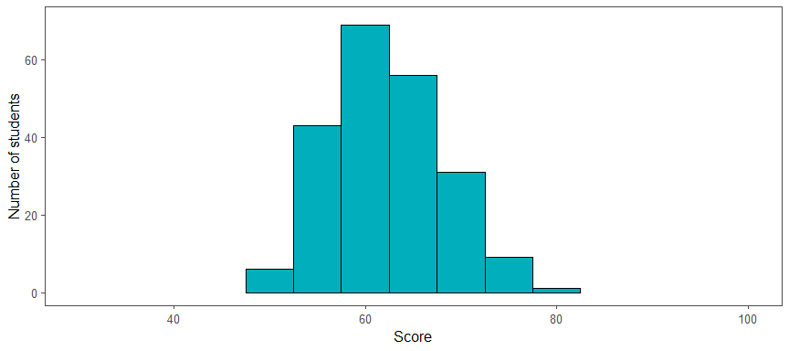
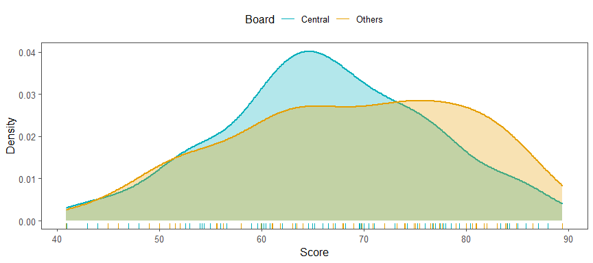
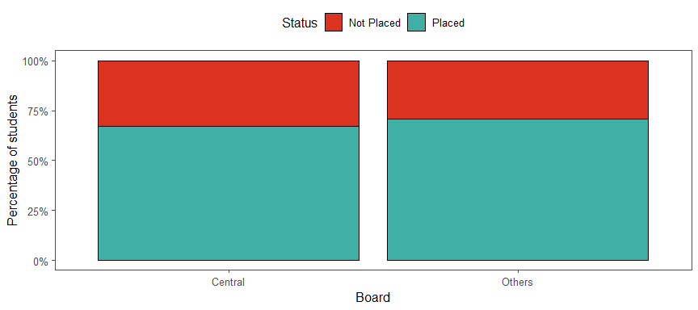
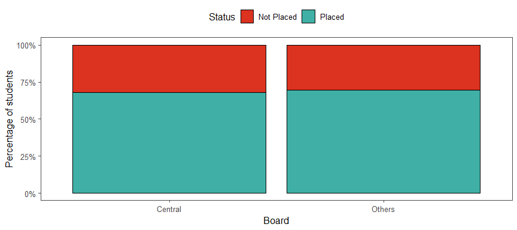
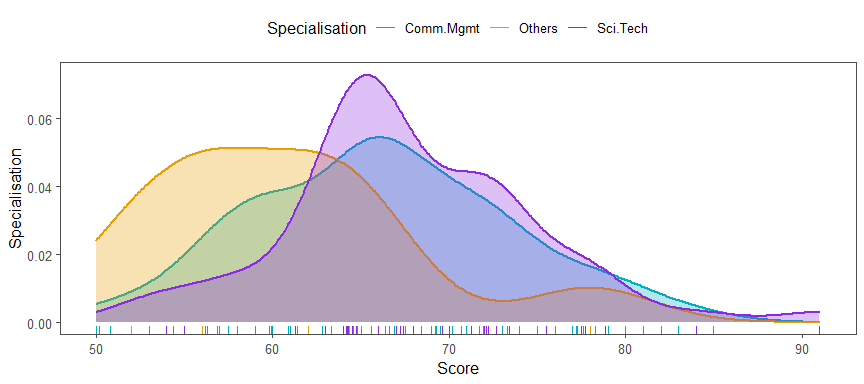
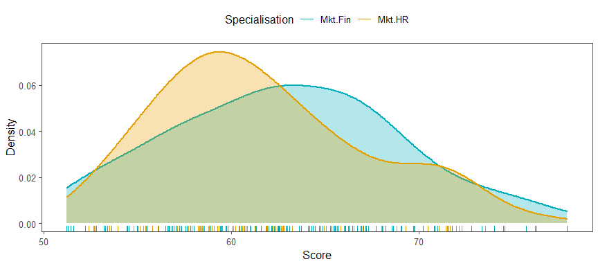
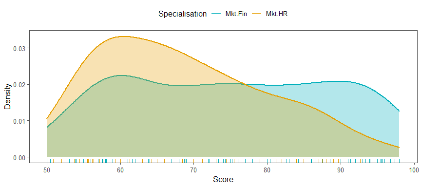
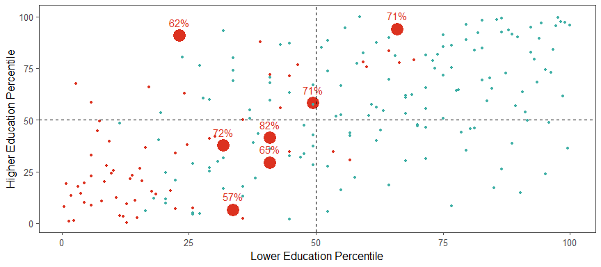

---
    output:
      html_document:
              
        toc: true
        toc_float: false
        toc_depth: 3
        number_sections: true
        
        code_folding: hide
        code_download: true
        
        fig_width: 9 
        fig_height: 4
        fig_align: "center"
        
        highlight: pygments
        theme: cerulean
        
        keep_md: true
        
    title: "Job Offer Prediction - MBA Students"
    subtitle: "Can we predict which student received a placement offer?"
    author: "by Peter Hontaru"
---


```r
knitr::opts_chunk$set(
    echo = TRUE, # show all code
    tidy = FALSE, # cleaner code printing
    size = "small", # smaller code
    
    fig.path = "figures/", #graphics location
    out.width = "100%",

    message = FALSE,
    warning = FALSE
    )

#create a colour pallete for our analysis
col_1 <- "#00AFBB"
col_2 <- "#E69F00"
col_3 <- "blueviolet"
#colour-blind friendly red/green
col_red <- "#DC3220"
col_green <- "#40B0A6"
```


```r
setwd("~/DS/AHT/Data")

#import data
raw_data <- read_csv("~/DS/Job-Offer-Prediction-MBA-Students/raw data/Placement_Data_Full_Class.csv")%>%
  mutate(gender = as.factor(gender),
         ssc_b = as.factor(ssc_b),
         hsc_b = as.factor(hsc_b),
         hsc_s = as.factor(hsc_s),
         degree_t = as.factor(make.names(degree_t)),
         specialisation = as.factor(make.names(specialisation)),
         workex = as.factor(workex),
         status = as.factor(status),
         sl_no = as.factor(sl_no))
```

<center>


</center>


# Introduction


## Problem Statement:

**Can we predict if a candiate was placed in a role after their MBA studies? If so, which factors helped the most (ie. work experience, degree, school results, gender, etc)?**


## Key takeaways


#### Students {-}

The LDA2 model might be more suitable as it did not have any false positives. This means that it correctly predicted if a student shouldn't apply for a role. 

The most important factors, as shown by the Random Forrest model were secondary scores, higher secondary schores and work experience.


#### Hiring Managers {-}

The second model might be more suitable as it achieved a higher overall accuracy and more student were predicted correctly.


## Dataset information:

* contains 15 variables and a total of 215 observations
* made available by **Ben Roshan** and it is available to download from https://www.kaggle.com/benroshan/factors-affecting-campus-placement
* raw data files are also available within the “raw data” folder of this repo


```r
attribute <- names(raw_data)

description <- c(
"Serial Number",
"Gender: Male='M', Female='F'",
"Secondary Education Percentage (grades 9 and 10) - exam at the end of 10th grade",
"Board of Education - Central/Others",
"Higher Secondary Education (grades 11 and 12) - exam at the end of 12th grade",
"Board of Education - Central/Others",
"Specialization in Higher Secondary Education",
"Degree Percentage",
"Undergraduate (Degree type) - Field of degree education",
"Work Experience - Yes/No",
"Employability test Percentage (conducted by college)",
"Post Graduation (MBA) - Specialization",
"MBA percentage",
"Status of placement - Placed/Not placed",
"Salary offered by corporate to candidates")

type <- c(
"factor",
"factor",
"numeric",
"factor",
"numeric",
"factor",
"factor",
"numeric",
"factor",
"factor",
"numeric",
"factor",
"numeric",
"factor",
"numeric")

dataset_table <-as.data.frame(cbind(attribute, type, description))

dataset_table %>%
  kbl(align = c("r", "l", "l"))%>%
  kable_paper("hover", full_width = F)%>%
  column_spec(1, bold = TRUE)%>%
  column_spec(2, italic = TRUE)
```

<table class=" lightable-paper lightable-hover" style='font-family: "Arial Narrow", arial, helvetica, sans-serif; width: auto !important; margin-left: auto; margin-right: auto;'>
 <thead>
  <tr>
   <th style="text-align:right;"> attribute </th>
   <th style="text-align:left;"> type </th>
   <th style="text-align:left;"> description </th>
  </tr>
 </thead>
<tbody>
  <tr>
   <td style="text-align:right;font-weight: bold;"> sl_no </td>
   <td style="text-align:left;font-style: italic;"> factor </td>
   <td style="text-align:left;"> Serial Number </td>
  </tr>
  <tr>
   <td style="text-align:right;font-weight: bold;"> gender </td>
   <td style="text-align:left;font-style: italic;"> factor </td>
   <td style="text-align:left;"> Gender: Male='M', Female='F' </td>
  </tr>
  <tr>
   <td style="text-align:right;font-weight: bold;"> ssc_p </td>
   <td style="text-align:left;font-style: italic;"> numeric </td>
   <td style="text-align:left;"> Secondary Education Percentage (grades 9 and 10) - exam at the end of 10th grade </td>
  </tr>
  <tr>
   <td style="text-align:right;font-weight: bold;"> ssc_b </td>
   <td style="text-align:left;font-style: italic;"> factor </td>
   <td style="text-align:left;"> Board of Education - Central/Others </td>
  </tr>
  <tr>
   <td style="text-align:right;font-weight: bold;"> hsc_p </td>
   <td style="text-align:left;font-style: italic;"> numeric </td>
   <td style="text-align:left;"> Higher Secondary Education (grades 11 and 12) - exam at the end of 12th grade </td>
  </tr>
  <tr>
   <td style="text-align:right;font-weight: bold;"> hsc_b </td>
   <td style="text-align:left;font-style: italic;"> factor </td>
   <td style="text-align:left;"> Board of Education - Central/Others </td>
  </tr>
  <tr>
   <td style="text-align:right;font-weight: bold;"> hsc_s </td>
   <td style="text-align:left;font-style: italic;"> factor </td>
   <td style="text-align:left;"> Specialization in Higher Secondary Education </td>
  </tr>
  <tr>
   <td style="text-align:right;font-weight: bold;"> degree_p </td>
   <td style="text-align:left;font-style: italic;"> numeric </td>
   <td style="text-align:left;"> Degree Percentage </td>
  </tr>
  <tr>
   <td style="text-align:right;font-weight: bold;"> degree_t </td>
   <td style="text-align:left;font-style: italic;"> factor </td>
   <td style="text-align:left;"> Undergraduate (Degree type) - Field of degree education </td>
  </tr>
  <tr>
   <td style="text-align:right;font-weight: bold;"> workex </td>
   <td style="text-align:left;font-style: italic;"> factor </td>
   <td style="text-align:left;"> Work Experience - Yes/No </td>
  </tr>
  <tr>
   <td style="text-align:right;font-weight: bold;"> etest_p </td>
   <td style="text-align:left;font-style: italic;"> numeric </td>
   <td style="text-align:left;"> Employability test Percentage (conducted by college) </td>
  </tr>
  <tr>
   <td style="text-align:right;font-weight: bold;"> specialisation </td>
   <td style="text-align:left;font-style: italic;"> factor </td>
   <td style="text-align:left;"> Post Graduation (MBA) - Specialization </td>
  </tr>
  <tr>
   <td style="text-align:right;font-weight: bold;"> mba_p </td>
   <td style="text-align:left;font-style: italic;"> numeric </td>
   <td style="text-align:left;"> MBA percentage </td>
  </tr>
  <tr>
   <td style="text-align:right;font-weight: bold;"> status </td>
   <td style="text-align:left;font-style: italic;"> factor </td>
   <td style="text-align:left;"> Status of placement - Placed/Not placed </td>
  </tr>
  <tr>
   <td style="text-align:right;font-weight: bold;"> salary </td>
   <td style="text-align:left;font-style: italic;"> numeric </td>
   <td style="text-align:left;"> Salary offered by corporate to candidates </td>
  </tr>
</tbody>
</table>

```r
#clear variables from environment
rm(attribute, type, description, dataset_table)
```


Check for *NULL*s:


```r
#check for nulls
raw_data %>% summarise_all(~ sum(is.null(.))) %>% sum()%>% 
  kbl(col.names = "Number of NULLs",
      align = c("c", "c"))%>%
  kable_paper("hover", full_width = F)%>%
  column_spec(1, color = "green", bold = TRUE)
```

<table class=" lightable-paper lightable-hover" style='font-family: "Arial Narrow", arial, helvetica, sans-serif; width: auto !important; margin-left: auto; margin-right: auto;'>
 <thead>
  <tr>
   <th style="text-align:center;"> Number of NULLs </th>
  </tr>
 </thead>
<tbody>
  <tr>
   <td style="text-align:center;font-weight: bold;color: green !important;"> 0 </td>
  </tr>
</tbody>
</table>


Check for *NA*s:


```r
#check NAs
raw_data %>% summarise_all(~ sum(is.na(.))) %>% sum()%>%
    kbl(col.names = "Number of NAs",
      align = c("c", "c"))%>%
  kable_paper("hover", full_width = F)%>%
  column_spec(1, color = "red", bold = TRUE)
```

<table class=" lightable-paper lightable-hover" style='font-family: "Arial Narrow", arial, helvetica, sans-serif; width: auto !important; margin-left: auto; margin-right: auto;'>
 <thead>
  <tr>
   <th style="text-align:center;"> Number of NAs </th>
  </tr>
 </thead>
<tbody>
  <tr>
   <td style="text-align:center;font-weight: bold;color: red !important;"> 67 </td>
  </tr>
</tbody>
</table>


Let's dig deeper and see why we have 67 NAs.


```r
#we have 67 NAs - let's see which category has these values
raw_data %>% summarise_all(~ sum(is.na(.)))%>%
    kbl()%>%
  kable_paper("hover", full_width = F)%>%
  column_spec(15, color = "red", bold = TRUE)%>%
  column_spec(1:14, color = "green", bold = TRUE)
```

<table class=" lightable-paper lightable-hover" style='font-family: "Arial Narrow", arial, helvetica, sans-serif; width: auto !important; margin-left: auto; margin-right: auto;'>
 <thead>
  <tr>
   <th style="text-align:right;"> sl_no </th>
   <th style="text-align:right;"> gender </th>
   <th style="text-align:right;"> ssc_p </th>
   <th style="text-align:right;"> ssc_b </th>
   <th style="text-align:right;"> hsc_p </th>
   <th style="text-align:right;"> hsc_b </th>
   <th style="text-align:right;"> hsc_s </th>
   <th style="text-align:right;"> degree_p </th>
   <th style="text-align:right;"> degree_t </th>
   <th style="text-align:right;"> workex </th>
   <th style="text-align:right;"> etest_p </th>
   <th style="text-align:right;"> specialisation </th>
   <th style="text-align:right;"> mba_p </th>
   <th style="text-align:right;"> status </th>
   <th style="text-align:right;"> salary </th>
  </tr>
 </thead>
<tbody>
  <tr>
   <td style="text-align:right;font-weight: bold;color: green !important;"> 0 </td>
   <td style="text-align:right;font-weight: bold;color: green !important;"> 0 </td>
   <td style="text-align:right;font-weight: bold;color: green !important;"> 0 </td>
   <td style="text-align:right;font-weight: bold;color: green !important;"> 0 </td>
   <td style="text-align:right;font-weight: bold;color: green !important;"> 0 </td>
   <td style="text-align:right;font-weight: bold;color: green !important;"> 0 </td>
   <td style="text-align:right;font-weight: bold;color: green !important;"> 0 </td>
   <td style="text-align:right;font-weight: bold;color: green !important;"> 0 </td>
   <td style="text-align:right;font-weight: bold;color: green !important;"> 0 </td>
   <td style="text-align:right;font-weight: bold;color: green !important;"> 0 </td>
   <td style="text-align:right;font-weight: bold;color: green !important;"> 0 </td>
   <td style="text-align:right;font-weight: bold;color: green !important;"> 0 </td>
   <td style="text-align:right;font-weight: bold;color: green !important;"> 0 </td>
   <td style="text-align:right;font-weight: bold;color: green !important;"> 0 </td>
   <td style="text-align:right;font-weight: bold;color: red !important;"> 67 </td>
  </tr>
</tbody>
</table>


Lastly, we need to check why we have these 67 NAs in the salary category. Is this missing data or another reason behind it? 


```r
#let's check that this is because some students did not get placed and thus, had no salary
raw_data %>% group_by(status) %>% count()%>%     
  kbl(col.names = c("Status", "n"),
      align = c("c", "c")) %>%
  kable_paper("hover", full_width = F)%>%
  row_spec(1, color = "red", bold = TRUE)%>%
  row_spec(2, color = "green", bold = TRUE)
```

<table class=" lightable-paper lightable-hover" style='font-family: "Arial Narrow", arial, helvetica, sans-serif; width: auto !important; margin-left: auto; margin-right: auto;'>
 <thead>
  <tr>
   <th style="text-align:center;"> Status </th>
   <th style="text-align:center;"> n </th>
  </tr>
 </thead>
<tbody>
  <tr>
   <td style="text-align:center;font-weight: bold;color: red !important;"> Not Placed </td>
   <td style="text-align:center;font-weight: bold;color: red !important;"> 67 </td>
  </tr>
  <tr>
   <td style="text-align:center;font-weight: bold;color: green !important;"> Placed </td>
   <td style="text-align:center;font-weight: bold;color: green !important;"> 148 </td>
  </tr>
</tbody>
</table>


It looks like we have 67 NAs in the salary column due to the fact that 67 students did not get a placement. That makes sense and no further investigation is needed.


# Exploratory Data Analysis (EDA)


## Correlation plot

**Key findings**:

* we can observe **medium correlations between the academic scores**. This suggests that the students who performed well in secondary school also tended to perform well within further education (higher secondary, university and MBA)
* interestingly, **employability test scores only had a low correlation with academic scores**. *Perhaps*, this suggests that these tests were more practical than theoretical


```r
#select all to start
raw_data_corr <- select_if(raw_data, is.numeric)%>%
  select(-salary)

#compute a correlation matrix
corr <- round(cor(raw_data_corr),2)

#compute a matrix of correlation p-values
p.mat <- cor_pmat(raw_data_corr)

#visualize the correlation matrix
ggcorrplot(corr, method = "square", 
           ggtheme = ggthemes::theme_few, 
           
           outline.col = "black",
           colors = c("#40B0A6","white", "#DC3220"),
           
           lab = TRUE,
           lab_size = 5,
           digits = 2,
           
           type = "lower",

           legend = "",
           tl.cex = 12)
```


```r
#clear variables from the environment
rm(corr, p.mat, raw_data_corr)
```


## How many students were placed?


```r
raw_data %>%
  mutate(education_total = (ssc_p+hsc_p+degree_p+mba_p)/4)%>%

  ggplot(aes(education_total, fill = status))+
  geom_histogram(binwidth = 5, col="black")+
  scale_fill_manual(values = c("#DC3220", "#40B0A6"))+
  scale_colour_manual(values = c("#DC3220", "#40B0A6"))+
  labs(x = "Average score across all four educational systems",
       y = "Number of students",
       fill = "Status",
       title = "148 out of 215 students were placed within a role (69% accepted rate)")+
  theme_few()+
  theme(legend.position = "top")
```


## What does the distribution of the scores look like for each level of education? {.tabset .tabset-fade .tabset-pills}

**Key findings**:

* the distribution become more concentated around the median range(62-66) as the student progressed in their education, **from secondary** (wide distribution) **to MBA** (narrow distribution)
* the **employability test** has a different trend, with a very wide and almost equal distribution of each bucket


```r
#create a function for our next graphs
score_distribution <- function(test, colour) 
{
  raw_data %>%
  ggplot(aes(test))+
  geom_histogram(binwidth = 5, col = "black", fill = colour)+
  coord_cartesian(xlim=c(30,100),
                  ylim=c(0,70))+
  labs(x = "Score",
       y = "Number of students")+
  theme_few()
}
```


### secondary {-}


```r
score_distribution(test = raw_data$ssc_p, 
                   colour = col_1)
```


### higher secondary {-}


```r
score_distribution(test = raw_data$hsc_p, 
                   colour = col_1)
```


### university {-}


```r
score_distribution(test = raw_data$degree_p, 
                   colour = col_1)
```


### MBA {-}


```r
score_distribution(test = raw_data$mba_p, 
                   colour = col_1)
```




### employability (non-academic) {-}


```r
score_distribution(test = raw_data$etest_p, 
                   colour = col_2)
```


## Are there any gender-specific differences in performance scores? {.tabset .tabset-fade .tabset-pills}

**Key findings**:

* females scored significantly higher than men at **university** and **MBA** levels
* no significant differences in performance during **secondary**, **higher secondary** levels and **employability test**


### university {-}


```r
t_test_degree <- raw_data%>%
  t_test(degree_p ~ gender)%>%
  add_significance()

raw_data %>% 
  ggplot(aes(degree_p, fill = gender, col = gender))+
  geom_density(alpha = 0.3, lwd = 1, show.legend = FALSE)+
  geom_rug()+
  scale_fill_manual(values = c(col_1, col_2))+
  scale_colour_manual(values = c(col_1, col_2))+
  labs(title = paste("Females scored significantly higher (", t_test_degree$p.signif, ") than males at the university level", sep = ""),
       col = "Gender",
       x = "Score",
       y = "Density")+
  theme_few()+
  theme(legend.position = "top")
```


```r
t_test_degree%>%
  kbl()%>%
  kable_paper("hover", full_width = F)
```

<table class=" lightable-paper lightable-hover" style='font-family: "Arial Narrow", arial, helvetica, sans-serif; width: auto !important; margin-left: auto; margin-right: auto;'>
 <thead>
  <tr>
   <th style="text-align:left;"> .y. </th>
   <th style="text-align:left;"> group1 </th>
   <th style="text-align:left;"> group2 </th>
   <th style="text-align:right;"> n1 </th>
   <th style="text-align:right;"> n2 </th>
   <th style="text-align:right;"> statistic </th>
   <th style="text-align:right;"> df </th>
   <th style="text-align:right;"> p </th>
   <th style="text-align:left;"> p.signif </th>
  </tr>
 </thead>
<tbody>
  <tr>
   <td style="text-align:left;"> degree_p </td>
   <td style="text-align:left;"> F </td>
   <td style="text-align:left;"> M </td>
   <td style="text-align:right;"> 76 </td>
   <td style="text-align:right;"> 139 </td>
   <td style="text-align:right;"> 2.431405 </td>
   <td style="text-align:right;"> 132.0024 </td>
   <td style="text-align:right;"> 0.0164 </td>
   <td style="text-align:left;"> * </td>
  </tr>
</tbody>
</table>


### MBA {-}


```r
t_test_mba <- raw_data%>%
  t_test(mba_p ~ gender)%>%
  add_significance()

raw_data%>% 
  ggplot(aes(mba_p, fill = gender, col = gender))+
  geom_density(alpha = 0.3, lwd = 1, show.legend = FALSE)+
  geom_rug()+
  scale_fill_manual(values = c(col_1, col_2))+
  scale_colour_manual(values = c(col_1, col_2))+
  labs(title = paste("Females scored significantly higher (", t_test_mba$p.signif, ") than males at the MBA level", sep = ""),
       col = "Gender",
       x = "Score",
       y = "Density")+
  theme_few()+
  theme(legend.position = "top")
```


```r
t_test_mba%>%
  kbl()%>%
  kable_paper("hover", full_width = F)
```

<table class=" lightable-paper lightable-hover" style='font-family: "Arial Narrow", arial, helvetica, sans-serif; width: auto !important; margin-left: auto; margin-right: auto;'>
 <thead>
  <tr>
   <th style="text-align:left;"> .y. </th>
   <th style="text-align:left;"> group1 </th>
   <th style="text-align:left;"> group2 </th>
   <th style="text-align:right;"> n1 </th>
   <th style="text-align:right;"> n2 </th>
   <th style="text-align:right;"> statistic </th>
   <th style="text-align:right;"> df </th>
   <th style="text-align:right;"> p </th>
   <th style="text-align:left;"> p.signif </th>
  </tr>
 </thead>
<tbody>
  <tr>
   <td style="text-align:left;"> mba_p </td>
   <td style="text-align:left;"> F </td>
   <td style="text-align:left;"> M </td>
   <td style="text-align:right;"> 76 </td>
   <td style="text-align:right;"> 139 </td>
   <td style="text-align:right;"> 4.725214 </td>
   <td style="text-align:right;"> 166.8781 </td>
   <td style="text-align:right;"> 4.9e-06 </td>
   <td style="text-align:left;"> **** </td>
  </tr>
</tbody>
</table>


## Did the academic peformance impact the chances of receiving an offer? {.tabset .tabset-fade .tabset-pills}

Since we know that the scores became more concentrated around the median range(62-66) as the student progressed in their education, we could infer that there was less of a chance to differentiate themselves based on grade and more based on other factors such as:

* *employability score*
* *work experience*
* *technical skills*
* *soft skills*
* *better interviewing skills*
* *extra-curricular experience*

Unfortunately, we only have data on the **employability score**.

**Key findings**:

The score differences between those who received an offer and those who did not:

* were highly significant at the **secondary**, **higher secondary** and **university** level
* significant at **employability test**
* no significance at the **MBA** level

When combining the stats as lower education (secondary and higher secondary) and higher education (university and MBA), it was interesting to see that:

* **virtually everyone that ranked in the top 25th percentile in their lower education were placed, regardless of their higher education performance**
* almost no one in the bottom 25th percentile across the lower education was placed, regardless of their higher education peformance


### overall education {-}


```r
raw_data %>%
  mutate(lower_education = (ssc_p+hsc_p)/2,
         higher_education = (degree_p+mba_p)/2,
         all_education = (ssc_p+hsc_p+degree_p+mba_p)/4,
         percentile_lower = round(rank(lower_education)/n()*100,2),
         percentile_higher = round(rank(higher_education)/n()*100,2),
         percentile_all_education = round(rank(all_education)/n()*100,2))%>%
  
  ggplot(aes(percentile_lower, percentile_higher, col = status))+
  geom_point(aes(col = status), size = 4)+
  scale_fill_manual(values = c(col_red, col_green))+
  scale_colour_manual(values = c(col_red, col_green))+
  geom_vline(xintercept =50, lty = 2)+
  geom_hline(yintercept =50, lty = 2)+
  labs(x = "Lower education percentile",
       y = "Higher education percentile",
       col = "Status")+
  theme_few()+
  theme(legend.position = "top")
```


```r
#create a function for the next graphs
score_placement <- function(test)
{
raw_data %>% 
    ggplot(aes(test, fill=status, col = status))+
    geom_density(alpha = 0.3, show.legend = FALSE, lwd = 1)+
    geom_rug()+
    scale_fill_manual(values = c(col_red, col_green))+
    scale_colour_manual(values = c(col_red, col_green))+
    labs(x = "Score",
         y = "Density",
         col = "Status")+
    theme_few()+
    theme(legend.position = "top")
}
```


### secondary {-}


```r
#get t-test stats
t_test <- raw_data%>%
  t_test(ssc_p ~ status)%>%
  add_significance()

#add graph
score_placement(test=raw_data$ssc_p)
```


```r
#add t-test stats
t_test%>%
  kbl()%>%
  kable_paper("hover", full_width = F)
```

<table class=" lightable-paper lightable-hover" style='font-family: "Arial Narrow", arial, helvetica, sans-serif; width: auto !important; margin-left: auto; margin-right: auto;'>
 <thead>
  <tr>
   <th style="text-align:left;"> .y. </th>
   <th style="text-align:left;"> group1 </th>
   <th style="text-align:left;"> group2 </th>
   <th style="text-align:right;"> n1 </th>
   <th style="text-align:right;"> n2 </th>
   <th style="text-align:right;"> statistic </th>
   <th style="text-align:right;"> df </th>
   <th style="text-align:right;"> p </th>
   <th style="text-align:left;"> p.signif </th>
  </tr>
 </thead>
<tbody>
  <tr>
   <td style="text-align:left;"> ssc_p </td>
   <td style="text-align:left;"> Not Placed </td>
   <td style="text-align:left;"> Placed </td>
   <td style="text-align:right;"> 67 </td>
   <td style="text-align:right;"> 148 </td>
   <td style="text-align:right;"> -11.33316 </td>
   <td style="text-align:right;"> 132.0192 </td>
   <td style="text-align:right;"> 0 </td>
   <td style="text-align:left;"> **** </td>
  </tr>
</tbody>
</table>


### higher secondary {-}


```r
#get t-test stats
t_test <- raw_data%>%
  t_test(hsc_p ~ status)%>%
  add_significance()

#add graph
score_placement(test=raw_data$hsc_p)
```


```r
#add t-test stats
t_test%>%
  kbl()%>%
  kable_paper("hover", full_width = F)
```

<table class=" lightable-paper lightable-hover" style='font-family: "Arial Narrow", arial, helvetica, sans-serif; width: auto !important; margin-left: auto; margin-right: auto;'>
 <thead>
  <tr>
   <th style="text-align:left;"> .y. </th>
   <th style="text-align:left;"> group1 </th>
   <th style="text-align:left;"> group2 </th>
   <th style="text-align:right;"> n1 </th>
   <th style="text-align:right;"> n2 </th>
   <th style="text-align:right;"> statistic </th>
   <th style="text-align:right;"> df </th>
   <th style="text-align:right;"> p </th>
   <th style="text-align:left;"> p.signif </th>
  </tr>
 </thead>
<tbody>
  <tr>
   <td style="text-align:left;"> hsc_p </td>
   <td style="text-align:left;"> Not Placed </td>
   <td style="text-align:left;"> Placed </td>
   <td style="text-align:right;"> 67 </td>
   <td style="text-align:right;"> 148 </td>
   <td style="text-align:right;"> -8.043664 </td>
   <td style="text-align:right;"> 120.8047 </td>
   <td style="text-align:right;"> 0 </td>
   <td style="text-align:left;"> **** </td>
  </tr>
</tbody>
</table>


### university {-}


```r
#get t-test stats
t_test <- raw_data%>%
  t_test(degree_p ~ status)%>%
  add_significance()

#add graph
score_placement(test=raw_data$degree_p)
```


```r
#add t-test stats
t_test%>%
  kbl()%>%
  kable_paper("hover", full_width = F)
```

<table class=" lightable-paper lightable-hover" style='font-family: "Arial Narrow", arial, helvetica, sans-serif; width: auto !important; margin-left: auto; margin-right: auto;'>
 <thead>
  <tr>
   <th style="text-align:left;"> .y. </th>
   <th style="text-align:left;"> group1 </th>
   <th style="text-align:left;"> group2 </th>
   <th style="text-align:right;"> n1 </th>
   <th style="text-align:right;"> n2 </th>
   <th style="text-align:right;"> statistic </th>
   <th style="text-align:right;"> df </th>
   <th style="text-align:right;"> p </th>
   <th style="text-align:left;"> p.signif </th>
  </tr>
 </thead>
<tbody>
  <tr>
   <td style="text-align:left;"> degree_p </td>
   <td style="text-align:left;"> Not Placed </td>
   <td style="text-align:left;"> Placed </td>
   <td style="text-align:right;"> 67 </td>
   <td style="text-align:right;"> 148 </td>
   <td style="text-align:right;"> -8.054153 </td>
   <td style="text-align:right;"> 130.335 </td>
   <td style="text-align:right;"> 0 </td>
   <td style="text-align:left;"> **** </td>
  </tr>
</tbody>
</table>


### MBA {-}


```r
#get t-test stats
t_test <- raw_data%>%
  t_test(mba_p ~ status)%>%
  add_significance()

#add graph
score_placement(test=raw_data$mba_p)
```


```r
#add t-test stats
t_test%>%
  kbl()%>%
  kable_paper("hover", full_width = F)
```

<table class=" lightable-paper lightable-hover" style='font-family: "Arial Narrow", arial, helvetica, sans-serif; width: auto !important; margin-left: auto; margin-right: auto;'>
 <thead>
  <tr>
   <th style="text-align:left;"> .y. </th>
   <th style="text-align:left;"> group1 </th>
   <th style="text-align:left;"> group2 </th>
   <th style="text-align:right;"> n1 </th>
   <th style="text-align:right;"> n2 </th>
   <th style="text-align:right;"> statistic </th>
   <th style="text-align:right;"> df </th>
   <th style="text-align:right;"> p </th>
   <th style="text-align:left;"> p.signif </th>
  </tr>
 </thead>
<tbody>
  <tr>
   <td style="text-align:left;"> mba_p </td>
   <td style="text-align:left;"> Not Placed </td>
   <td style="text-align:left;"> Placed </td>
   <td style="text-align:right;"> 67 </td>
   <td style="text-align:right;"> 148 </td>
   <td style="text-align:right;"> -1.139201 </td>
   <td style="text-align:right;"> 131.2069 </td>
   <td style="text-align:right;"> 0.257 </td>
   <td style="text-align:left;"> ns </td>
  </tr>
</tbody>
</table>


### employability (non-academic) {-}


```r
#get t-test stats
t_test <- raw_data%>%
  t_test(etest_p ~ status)%>%
  add_significance()

#add graph
score_placement(test=raw_data$etest_p)
```


```r
#add t-test stats
t_test%>%
  kbl()%>%
  kable_paper("hover", full_width = F)
```

<table class=" lightable-paper lightable-hover" style='font-family: "Arial Narrow", arial, helvetica, sans-serif; width: auto !important; margin-left: auto; margin-right: auto;'>
 <thead>
  <tr>
   <th style="text-align:left;"> .y. </th>
   <th style="text-align:left;"> group1 </th>
   <th style="text-align:left;"> group2 </th>
   <th style="text-align:right;"> n1 </th>
   <th style="text-align:right;"> n2 </th>
   <th style="text-align:right;"> statistic </th>
   <th style="text-align:right;"> df </th>
   <th style="text-align:right;"> p </th>
   <th style="text-align:left;"> p.signif </th>
  </tr>
 </thead>
<tbody>
  <tr>
   <td style="text-align:left;"> etest_p </td>
   <td style="text-align:left;"> Not Placed </td>
   <td style="text-align:left;"> Placed </td>
   <td style="text-align:right;"> 67 </td>
   <td style="text-align:right;"> 148 </td>
   <td style="text-align:right;"> -1.980112 </td>
   <td style="text-align:right;"> 145.392 </td>
   <td style="text-align:right;"> 0.0496 </td>
   <td style="text-align:left;"> * </td>
  </tr>
</tbody>
</table>


## Did the different boards make a significant difference in school peformance/placement offer? {.tabset .tabset-fade .tabset-pills}

**Key findings**:

* no significant differences in school performance between the two boards at either **secondary** or **higher secondary** level
* there was also no significant difference in the number of people that received an offer from either board at the **secondary** or **higher secondary** level


### secondary {-}


```r
#vs performance
raw_data %>% 
  ggplot(aes(ssc_p, fill=ssc_b, col = ssc_b))+
  geom_density(alpha = 0.3, show.legend = FALSE, lwd = 1)+
  geom_rug()+
  scale_colour_manual(values = c(col_1, col_2))+
  scale_fill_manual(values = c(col_1, col_2))+
  labs(col = "Board",
       x = "Score",
       y = "Density")+
  theme_few()+
  theme(legend.position = "top")
```



```r
#t-test
t_test <- raw_data%>%
  t_test(ssc_p ~ ssc_b)%>%
  add_significance()%>%
  kbl()%>%
  kable_paper("hover", full_width = F)

t_test
```

<table class=" lightable-paper lightable-hover" style='font-family: "Arial Narrow", arial, helvetica, sans-serif; width: auto !important; margin-left: auto; margin-right: auto;'>
 <thead>
  <tr>
   <th style="text-align:left;"> .y. </th>
   <th style="text-align:left;"> group1 </th>
   <th style="text-align:left;"> group2 </th>
   <th style="text-align:right;"> n1 </th>
   <th style="text-align:right;"> n2 </th>
   <th style="text-align:right;"> statistic </th>
   <th style="text-align:right;"> df </th>
   <th style="text-align:right;"> p </th>
   <th style="text-align:left;"> p.signif </th>
  </tr>
 </thead>
<tbody>
  <tr>
   <td style="text-align:left;"> ssc_p </td>
   <td style="text-align:left;"> Central </td>
   <td style="text-align:left;"> Others </td>
   <td style="text-align:right;"> 116 </td>
   <td style="text-align:right;"> 99 </td>
   <td style="text-align:right;"> -1.690651 </td>
   <td style="text-align:right;"> 197.3488 </td>
   <td style="text-align:right;"> 0.0925 </td>
   <td style="text-align:left;"> ns </td>
  </tr>
</tbody>
</table>

```r
#vs placement
raw_data%>% 
  ggplot(aes(ssc_b, fill = status))+
  geom_bar(position = "fill", col = "black")+
  scale_fill_manual(values = c(col_red, col_green))+
  scale_colour_manual(values = c(col_red, col_green))+
  labs(fill = "Status",
       x = "Board",
       y = "Percentage of students")+
  scale_y_continuous(label = percent)+
  theme_few()+
  theme(legend.position = "top")
```



```r
#categorical variables
tidy(chisq.test(table(raw_data$ssc_b, raw_data$status)))%>%
  kbl()%>%
  kable_paper("hover", full_width = F)
```

<table class=" lightable-paper lightable-hover" style='font-family: "Arial Narrow", arial, helvetica, sans-serif; width: auto !important; margin-left: auto; margin-right: auto;'>
 <thead>
  <tr>
   <th style="text-align:right;"> statistic </th>
   <th style="text-align:right;"> p.value </th>
   <th style="text-align:right;"> parameter </th>
   <th style="text-align:left;"> method </th>
  </tr>
 </thead>
<tbody>
  <tr>
   <td style="text-align:right;"> 0.1593313 </td>
   <td style="text-align:right;"> 0.6897729 </td>
   <td style="text-align:right;"> 1 </td>
   <td style="text-align:left;"> Pearson's Chi-squared test with Yates' continuity correction </td>
  </tr>
</tbody>
</table>


### higher secondary {-}


```r
#vs performance
raw_data%>% 
  ggplot(aes(hsc_p, fill=hsc_b, col = hsc_b))+
  geom_density(alpha = 0.3, show.legend = FALSE, lwd = 1)+
  geom_rug()+
  scale_colour_manual(values = c(col_1, col_2))+
  scale_fill_manual(values = c(col_1, col_2))+
  labs(col = "Board",
       x = "Score",
       y = "Density")+
  theme_few()+
  theme(legend.position = "top")
```


```r
#t-test for performance
t_test <- raw_data%>%
  t_test(hsc_p ~ hsc_b)%>%
  add_significance()%>%
  kbl()%>%
  kable_paper("hover", full_width = F)

t_test
```

<table class=" lightable-paper lightable-hover" style='font-family: "Arial Narrow", arial, helvetica, sans-serif; width: auto !important; margin-left: auto; margin-right: auto;'>
 <thead>
  <tr>
   <th style="text-align:left;"> .y. </th>
   <th style="text-align:left;"> group1 </th>
   <th style="text-align:left;"> group2 </th>
   <th style="text-align:right;"> n1 </th>
   <th style="text-align:right;"> n2 </th>
   <th style="text-align:right;"> statistic </th>
   <th style="text-align:right;"> df </th>
   <th style="text-align:right;"> p </th>
   <th style="text-align:left;"> p.signif </th>
  </tr>
 </thead>
<tbody>
  <tr>
   <td style="text-align:left;"> hsc_p </td>
   <td style="text-align:left;"> Central </td>
   <td style="text-align:left;"> Others </td>
   <td style="text-align:right;"> 84 </td>
   <td style="text-align:right;"> 131 </td>
   <td style="text-align:right;"> 0.2993721 </td>
   <td style="text-align:right;"> 202.6011 </td>
   <td style="text-align:right;"> 0.765 </td>
   <td style="text-align:left;"> ns </td>
  </tr>
</tbody>
</table>

```r
#vs placement
raw_data%>% 
  ggplot(aes(hsc_b, fill = status))+
  geom_bar(position = "fill", col = "black")+
  scale_fill_manual(values = c(col_red, col_green))+
  scale_colour_manual(values = c(col_red, col_green))+
  labs(fill = "Status",
       x = "Board",
       y = "Percentage of students")+
  scale_y_continuous(label = percent)+
  theme_few()+
  theme(legend.position = "top")
```



```r
#categorical variables
tidy(chisq.test(table(raw_data$hsc_b, raw_data$status)))%>%
  kbl()%>%
  kable_paper("hover", full_width = F)
```

<table class=" lightable-paper lightable-hover" style='font-family: "Arial Narrow", arial, helvetica, sans-serif; width: auto !important; margin-left: auto; margin-right: auto;'>
 <thead>
  <tr>
   <th style="text-align:right;"> statistic </th>
   <th style="text-align:right;"> p.value </th>
   <th style="text-align:right;"> parameter </th>
   <th style="text-align:left;"> method </th>
  </tr>
 </thead>
<tbody>
  <tr>
   <td style="text-align:right;"> 0.0095175 </td>
   <td style="text-align:right;"> 0.9222837 </td>
   <td style="text-align:right;"> 1 </td>
   <td style="text-align:left;"> Pearson's Chi-squared test with Yates' continuity correction </td>
  </tr>
</tbody>
</table>


## Did the specialisation impact the chances of receiving a better score or place for an offer? {.tabset .tabset-fade .tabset-pills}

**Key findings**:

* **higher secondary**:
  * Commerce students scored significantly higher than Science students
  * no significant difference between any groups in placement offers (however, this might not be accurate given that there were only 11 students in Arts versus 113 in Commerce and 91 in Science)
* **university**:
  * Science and Technology students scored significantly higher than those in Others
  * there were no significant differences between the different groups as it regarded the amount of students that received an offer (results might not be accurate due to a very low sample sample size in Others of 11 versus 145 in Commerce and Management and 59 in Science and Technology)
* **MBA**:
  * there were no significant differences in performance between the scores of the two groups
  * significantly more Marketing and Finance students received an offer when compared to those specialised in Marketing and HR
  * the Marketing and Finance students scored significantly better on the **employability test** than Marketing and HR students


### higher secondary {-}


```r
#vs performance
raw_data%>% 
  ggplot(aes(hsc_p, fill=hsc_s, col = hsc_s))+
  geom_density(alpha = 0.3, show.legend = FALSE, lwd = 1)+
  geom_rug()+
  scale_colour_manual(values = c(col_1, col_2, col_3))+
  scale_fill_manual(values = c(col_1, col_2, col_3))+
  labs(col = "Specialisation",
       x = "Score",
       y = "Density")+
  theme_few()+
  theme(legend.position = "top")
```


```r
#t-test
t_test <- raw_data%>%
  t_test(hsc_p ~ hsc_s)%>%
  add_significance()%>%
  kbl()%>%
  kable_paper("hover", full_width = F)

t_test
```

<table class=" lightable-paper lightable-hover" style='font-family: "Arial Narrow", arial, helvetica, sans-serif; width: auto !important; margin-left: auto; margin-right: auto;'>
 <thead>
  <tr>
   <th style="text-align:left;"> .y. </th>
   <th style="text-align:left;"> group1 </th>
   <th style="text-align:left;"> group2 </th>
   <th style="text-align:right;"> n1 </th>
   <th style="text-align:right;"> n2 </th>
   <th style="text-align:right;"> statistic </th>
   <th style="text-align:right;"> df </th>
   <th style="text-align:right;"> p </th>
   <th style="text-align:right;"> p.adj </th>
   <th style="text-align:left;"> p.adj.signif </th>
  </tr>
 </thead>
<tbody>
  <tr>
   <td style="text-align:left;"> hsc_p </td>
   <td style="text-align:left;"> Arts </td>
   <td style="text-align:left;"> Commerce </td>
   <td style="text-align:right;"> 11 </td>
   <td style="text-align:right;"> 113 </td>
   <td style="text-align:right;"> -1.6172999 </td>
   <td style="text-align:right;"> 11.57211 </td>
   <td style="text-align:right;"> 0.133000 </td>
   <td style="text-align:right;"> 0.266000 </td>
   <td style="text-align:left;"> ns </td>
  </tr>
  <tr>
   <td style="text-align:left;"> hsc_p </td>
   <td style="text-align:left;"> Arts </td>
   <td style="text-align:left;"> Science </td>
   <td style="text-align:right;"> 11 </td>
   <td style="text-align:right;"> 91 </td>
   <td style="text-align:right;"> -0.1837289 </td>
   <td style="text-align:right;"> 11.60227 </td>
   <td style="text-align:right;"> 0.857000 </td>
   <td style="text-align:right;"> 0.857000 </td>
   <td style="text-align:left;"> ns </td>
  </tr>
  <tr>
   <td style="text-align:left;"> hsc_p </td>
   <td style="text-align:left;"> Commerce </td>
   <td style="text-align:left;"> Science </td>
   <td style="text-align:right;"> 113 </td>
   <td style="text-align:right;"> 91 </td>
   <td style="text-align:right;"> 3.7950536 </td>
   <td style="text-align:right;"> 199.16642 </td>
   <td style="text-align:right;"> 0.000196 </td>
   <td style="text-align:right;"> 0.000588 </td>
   <td style="text-align:left;"> *** </td>
  </tr>
</tbody>
</table>

```r
#vs placement
raw_data%>% 
  ggplot(aes(hsc_s, fill = status))+
  geom_bar(position = "fill", col = "black")+
  scale_fill_manual(values = c(col_red, col_green))+
  scale_colour_manual(values = c(col_red, col_green))+
  labs(fill = "Status",
       x = "Specialisation",
       y = "Percentage of students")+
  scale_y_continuous(label = percent)+
  theme_few()+
  theme(legend.position = "top")
```


```r
#categorical variables
tidy(chisq.test(table(raw_data$hsc_s, raw_data$status)))%>%
  kbl()%>%
  kable_paper("hover", full_width = F)
```

<table class=" lightable-paper lightable-hover" style='font-family: "Arial Narrow", arial, helvetica, sans-serif; width: auto !important; margin-left: auto; margin-right: auto;'>
 <thead>
  <tr>
   <th style="text-align:right;"> statistic </th>
   <th style="text-align:right;"> p.value </th>
   <th style="text-align:right;"> parameter </th>
   <th style="text-align:left;"> method </th>
  </tr>
 </thead>
<tbody>
  <tr>
   <td style="text-align:right;"> 1.114745 </td>
   <td style="text-align:right;"> 0.5727119 </td>
   <td style="text-align:right;"> 2 </td>
   <td style="text-align:left;"> Pearson's Chi-squared test </td>
  </tr>
</tbody>
</table>


### university {-}


```r
#vs performance
raw_data%>% 
  ggplot(aes(degree_p, fill=degree_t, col = degree_t))+
  geom_density(alpha = 0.3, show.legend = FALSE, lwd = 1)+
  geom_rug()+
  scale_colour_manual(values = c(col_1, col_2, col_3))+
  scale_fill_manual(values = c(col_1, col_2, col_3))+
  labs(col = "Specialisation",
       x = "Score",
       y = "Specialisation")+
  theme_few()+
  theme(legend.position = "top")
```



```r
#t-test
t_test <- raw_data%>%
  t_test(degree_p ~ degree_t)%>%
  add_significance()%>%
  kbl()%>%
  kable_paper("hover", full_width = F)

t_test
```

<table class=" lightable-paper lightable-hover" style='font-family: "Arial Narrow", arial, helvetica, sans-serif; width: auto !important; margin-left: auto; margin-right: auto;'>
 <thead>
  <tr>
   <th style="text-align:left;"> .y. </th>
   <th style="text-align:left;"> group1 </th>
   <th style="text-align:left;"> group2 </th>
   <th style="text-align:right;"> n1 </th>
   <th style="text-align:right;"> n2 </th>
   <th style="text-align:right;"> statistic </th>
   <th style="text-align:right;"> df </th>
   <th style="text-align:right;"> p </th>
   <th style="text-align:right;"> p.adj </th>
   <th style="text-align:left;"> p.adj.signif </th>
  </tr>
 </thead>
<tbody>
  <tr>
   <td style="text-align:left;"> degree_p </td>
   <td style="text-align:left;"> Comm.Mgmt </td>
   <td style="text-align:left;"> Others </td>
   <td style="text-align:right;"> 145 </td>
   <td style="text-align:right;"> 11 </td>
   <td style="text-align:right;"> 2.368039 </td>
   <td style="text-align:right;"> 11.49141 </td>
   <td style="text-align:right;"> 0.036 </td>
   <td style="text-align:right;"> 0.073 </td>
   <td style="text-align:left;"> ns </td>
  </tr>
  <tr>
   <td style="text-align:left;"> degree_p </td>
   <td style="text-align:left;"> Comm.Mgmt </td>
   <td style="text-align:left;"> Sci.Tech </td>
   <td style="text-align:right;"> 145 </td>
   <td style="text-align:right;"> 59 </td>
   <td style="text-align:right;"> -1.496971 </td>
   <td style="text-align:right;"> 111.72355 </td>
   <td style="text-align:right;"> 0.137 </td>
   <td style="text-align:right;"> 0.137 </td>
   <td style="text-align:left;"> ns </td>
  </tr>
  <tr>
   <td style="text-align:left;"> degree_p </td>
   <td style="text-align:left;"> Others </td>
   <td style="text-align:left;"> Sci.Tech </td>
   <td style="text-align:right;"> 11 </td>
   <td style="text-align:right;"> 59 </td>
   <td style="text-align:right;"> -2.946941 </td>
   <td style="text-align:right;"> 13.47624 </td>
   <td style="text-align:right;"> 0.011 </td>
   <td style="text-align:right;"> 0.033 </td>
   <td style="text-align:left;"> * </td>
  </tr>
</tbody>
</table>

```r
#vs placement
raw_data%>% 
  ggplot(aes(degree_t, fill = status))+
  geom_bar(position = "fill", col = "black")+
  scale_fill_manual(values = c(col_red, col_green))+
  scale_colour_manual(values = c(col_red, col_green))+
  labs(fill = "Status",
       x = "Specialisation",
       y = "Percentage of students")+
  scale_y_continuous(label = percent)+
  theme_few()+
  theme(legend.position = "top")
```


```r
#categorical variables
tidy(chisq.test(table(raw_data$degree_t, raw_data$status)))%>%
  kbl()%>%
  kable_paper("hover", full_width = F)
```

<table class=" lightable-paper lightable-hover" style='font-family: "Arial Narrow", arial, helvetica, sans-serif; width: auto !important; margin-left: auto; margin-right: auto;'>
 <thead>
  <tr>
   <th style="text-align:right;"> statistic </th>
   <th style="text-align:right;"> p.value </th>
   <th style="text-align:right;"> parameter </th>
   <th style="text-align:left;"> method </th>
  </tr>
 </thead>
<tbody>
  <tr>
   <td style="text-align:right;"> 2.969043 </td>
   <td style="text-align:right;"> 0.2266108 </td>
   <td style="text-align:right;"> 2 </td>
   <td style="text-align:left;"> Pearson's Chi-squared test </td>
  </tr>
</tbody>
</table>


### MBA {-}


```r
#vs performance
raw_data%>% 
  ggplot(aes(mba_p, fill=specialisation, col = specialisation))+
  geom_density(alpha = 0.3, show.legend = FALSE, lwd = 1)+
  geom_rug()+
  scale_colour_manual(values = c(col_1, col_2))+
  scale_fill_manual(values = c(col_1, col_2))+
  labs(col = "Specialisation",
       x = "Score",
       y = "Density")+
  theme_few()+
  theme(legend.position = "top")
```



```r
#t-test
t_test <- raw_data%>%
  t_test(mba_p ~ specialisation)%>%
  add_significance()%>%
  kbl()%>%
  kable_paper("hover", full_width = F)

t_test
```

<table class=" lightable-paper lightable-hover" style='font-family: "Arial Narrow", arial, helvetica, sans-serif; width: auto !important; margin-left: auto; margin-right: auto;'>
 <thead>
  <tr>
   <th style="text-align:left;"> .y. </th>
   <th style="text-align:left;"> group1 </th>
   <th style="text-align:left;"> group2 </th>
   <th style="text-align:right;"> n1 </th>
   <th style="text-align:right;"> n2 </th>
   <th style="text-align:right;"> statistic </th>
   <th style="text-align:right;"> df </th>
   <th style="text-align:right;"> p </th>
   <th style="text-align:left;"> p.signif </th>
  </tr>
 </thead>
<tbody>
  <tr>
   <td style="text-align:left;"> mba_p </td>
   <td style="text-align:left;"> Mkt.Fin </td>
   <td style="text-align:left;"> Mkt.HR </td>
   <td style="text-align:right;"> 120 </td>
   <td style="text-align:right;"> 95 </td>
   <td style="text-align:right;"> 1.568831 </td>
   <td style="text-align:right;"> 208.8404 </td>
   <td style="text-align:right;"> 0.118 </td>
   <td style="text-align:left;"> ns </td>
  </tr>
</tbody>
</table>

```r
#vs placement
raw_data %>% 
  ggplot(aes(specialisation, fill = status))+
  geom_bar(position = "fill", col = "black")+
  scale_fill_manual(values = c(col_red, col_green))+
  scale_colour_manual(values = c(col_red, col_green))+
  labs(fill = "Status",
       x = "Specialisation",
       y = "Percentage of students")+
  scale_y_continuous(label = percent)+
  theme_few()+
  theme(legend.position = "top")
```


```r
#categorical variables
tidy(chisq.test(table(raw_data$specialisation, raw_data$status)))%>%
  kbl()%>%
  kable_paper("hover", full_width = F)
```

<table class=" lightable-paper lightable-hover" style='font-family: "Arial Narrow", arial, helvetica, sans-serif; width: auto !important; margin-left: auto; margin-right: auto;'>
 <thead>
  <tr>
   <th style="text-align:right;"> statistic </th>
   <th style="text-align:right;"> p.value </th>
   <th style="text-align:right;"> parameter </th>
   <th style="text-align:left;"> method </th>
  </tr>
 </thead>
<tbody>
  <tr>
   <td style="text-align:right;"> 12.44023 </td>
   <td style="text-align:right;"> 0.0004202 </td>
   <td style="text-align:right;"> 1 </td>
   <td style="text-align:left;"> Pearson's Chi-squared test with Yates' continuity correction </td>
  </tr>
</tbody>
</table>


### MBA - employability test {-}


```r
#vs performance (e-test)
raw_data%>% 
  ggplot(aes(etest_p, fill=specialisation, col = specialisation))+
  geom_density(alpha = 0.3, show.legend = FALSE, lwd = 1)+
  geom_rug()+
  scale_colour_manual(values = c(col_1, col_2))+
  scale_fill_manual(values = c(col_1, col_2))+
  labs(col = "Specialisation",
       x = "Score",
       y = "Density")+
  theme_few()+
  theme(legend.position = "top")
```



```r
#t-test (e-test)
t_test <- raw_data%>%
  t_test(etest_p ~ specialisation)%>%
  add_significance()%>%
  kbl()%>%
  kable_paper("hover", full_width = F)

t_test
```

<table class=" lightable-paper lightable-hover" style='font-family: "Arial Narrow", arial, helvetica, sans-serif; width: auto !important; margin-left: auto; margin-right: auto;'>
 <thead>
  <tr>
   <th style="text-align:left;"> .y. </th>
   <th style="text-align:left;"> group1 </th>
   <th style="text-align:left;"> group2 </th>
   <th style="text-align:right;"> n1 </th>
   <th style="text-align:right;"> n2 </th>
   <th style="text-align:right;"> statistic </th>
   <th style="text-align:right;"> df </th>
   <th style="text-align:right;"> p </th>
   <th style="text-align:left;"> p.signif </th>
  </tr>
 </thead>
<tbody>
  <tr>
   <td style="text-align:left;"> etest_p </td>
   <td style="text-align:left;"> Mkt.Fin </td>
   <td style="text-align:left;"> Mkt.HR </td>
   <td style="text-align:right;"> 120 </td>
   <td style="text-align:right;"> 95 </td>
   <td style="text-align:right;"> 3.636649 </td>
   <td style="text-align:right;"> 212.8795 </td>
   <td style="text-align:right;"> 0.000346 </td>
   <td style="text-align:left;"> *** </td>
  </tr>
</tbody>
</table>


## Did gender impact the chances of receving a placement offer?

**Key findings**:

* there were no significant differences in gender between the students that received a role and those that did not


```r
#graph
raw_data%>%
  group_by(gender, status)%>%
  summarise(count = n()/100)%>%
  mutate(percentage = round(count/sum(count),2))%>%
  
ggplot(aes(gender, count, fill = status))+
  geom_col(position = "fill", col = "black")+
  geom_label(aes(x=gender, 
                 y = ifelse(percentage>.5, percentage - .25, percentage + .5), 
                 label = paste(percentage*100, "%")), 
             show.legend = FALSE)+
  scale_fill_manual(values = c(col_red, col_green))+
  scale_colour_manual(values = c(col_red, col_green))+
  scale_y_continuous(label = percent)+
  labs(x = "Gender",
       y = "% of students",
       fill = "Status",
       subtitle = "Proportionaly, more males were offered a role but this was not statistically significant")+
  theme_few()+
  theme(legend.position = "top")
```


```r
#categorical variables
tidy(chisq.test(table(raw_data$gender, raw_data$status)))%>%
  kbl()%>%
  kable_paper("hover", full_width = F)
```

<table class=" lightable-paper lightable-hover" style='font-family: "Arial Narrow", arial, helvetica, sans-serif; width: auto !important; margin-left: auto; margin-right: auto;'>
 <thead>
  <tr>
   <th style="text-align:right;"> statistic </th>
   <th style="text-align:right;"> p.value </th>
   <th style="text-align:right;"> parameter </th>
   <th style="text-align:left;"> method </th>
  </tr>
 </thead>
<tbody>
  <tr>
   <td style="text-align:right;"> 1.381754 </td>
   <td style="text-align:right;"> 0.2398026 </td>
   <td style="text-align:right;"> 1 </td>
   <td style="text-align:left;"> Pearson's Chi-squared test with Yates' continuity correction </td>
  </tr>
</tbody>
</table>


## Did previous work experience matter?

**Key findings**:

* significantly more students with work experience received offers than those without any work experience


```r
#graph
raw_data %>% group_by(workex, status)%>% 
  summarise(count = n())%>%
  mutate(percentage = round(count / sum(count),2))%>%
        
  ggplot(aes(workex, percentage, fill = status))+
  geom_col(col = "black")+
  scale_fill_manual(values = c(col_red, col_green))+
  scale_colour_manual(values = c(col_red, col_green))+
  geom_label(aes(x=workex, 
                 y = ifelse(percentage>.46, percentage - .25, 
                            ifelse(percentage>.65, -.20, 
                                   .92)), 
                 label = paste(percentage*100, "%")), 
             show.legend = FALSE)+
  labs(subtitle = "86% of those with work experience were placed versus 60% of those without work experience",
       x = "Work Experience",
       y = "% of students",
       fill = "Status")+
  theme_few()+
  theme(axis.ticks.y = element_blank(),
        axis.text.y = element_blank(),
        legend.position = "top")
```


```r
#categorical variables
tidy(chisq.test(table(raw_data$workex, raw_data$status)))%>%
  kbl()%>%
  kable_paper("hover", full_width = F)
```

<table class=" lightable-paper lightable-hover" style='font-family: "Arial Narrow", arial, helvetica, sans-serif; width: auto !important; margin-left: auto; margin-right: auto;'>
 <thead>
  <tr>
   <th style="text-align:right;"> statistic </th>
   <th style="text-align:right;"> p.value </th>
   <th style="text-align:right;"> parameter </th>
   <th style="text-align:left;"> method </th>
  </tr>
 </thead>
<tbody>
  <tr>
   <td style="text-align:right;"> 15.15443 </td>
   <td style="text-align:right;"> 9.91e-05 </td>
   <td style="text-align:right;"> 1 </td>
   <td style="text-align:left;"> Pearson's Chi-squared test with Yates' continuity correction </td>
  </tr>
</tbody>
</table>


# Classification


## Data split

Based on the previous Exploratory Data Analysis, we're comfortable to keep all the current variables in our model for the following reasons:

* there are only 12 predictor variables
* we were not able to prove that any of them are insignificant

Let's split the dataset into the following:

* a **train dataset** of 80% of the raw data to train our prediction model on (173 total students with a 69% placement rate)
  * 119 placed and 54 not placed
* a **test dataset** of 20% of the raw data to then test the model on (42 total students with a 69% placement rate)
  * 29 placed and 13 not placed


```r
set.seed(123)

#clean model data
raw_data_model <- raw_data %>%
  select(-salary)%>%
  mutate(status = as.factor(make.names(status)))

#split into two datasets
split <- createDataPartition(raw_data_model$status,
                             p =0.8, 
                             list = FALSE)

train_data <- raw_data_model[split,]
test_data <- raw_data_model[-split,]
```


## Pre-processing


#### range normalisation {-}

Let's use some basic standardisation offered by the caret package:

- **centering** (subtract mean from values)
- **scaling** (divide values by standard deviation)


```r
#store the ID variable in its original format
y_test <- test_data$sl_no
y_train <- train_data$sl_no

#take out y variable temporarily as we do not want this to be processed
test_data <- test_data %>% select (-sl_no)
train_data <- train_data %>% select (-sl_no)

#center and scale our data
preProcess_range_model <- preProcess(train_data, method=c("center", "scale"))

train_data <- predict(preProcess_range_model, newdata = train_data)
test_data <- predict(preProcess_range_model, newdata = test_data)
```


#### skewness {-}

We do not neeed to worry about correcting for skewness of any of the variables (ie. log, square root or inverse transformations) since the data is not particularly skewed.


```r
apply(select_if(raw_data, is.numeric), 2, skewness)%>%
  kbl(caption = "Skewness of numerical columns",
      col.names = c("Skewness"))%>%
  kable_paper(c("hover", "striped"), full_width = F)
```

<table class=" lightable-paper lightable-striped lightable-hover" style='font-family: "Arial Narrow", arial, helvetica, sans-serif; width: auto !important; margin-left: auto; margin-right: auto;'>
<caption>Skewness of numerical columns</caption>
 <thead>
  <tr>
   <th style="text-align:left;">   </th>
   <th style="text-align:right;"> Skewness </th>
  </tr>
 </thead>
<tbody>
  <tr>
   <td style="text-align:left;"> ssc_p </td>
   <td style="text-align:right;"> -0.1308043 </td>
  </tr>
  <tr>
   <td style="text-align:left;"> hsc_p </td>
   <td style="text-align:right;"> 0.1613629 </td>
  </tr>
  <tr>
   <td style="text-align:left;"> degree_p </td>
   <td style="text-align:right;"> 0.2415103 </td>
  </tr>
  <tr>
   <td style="text-align:left;"> etest_p </td>
   <td style="text-align:right;"> 0.2783812 </td>
  </tr>
  <tr>
   <td style="text-align:left;"> mba_p </td>
   <td style="text-align:right;"> 0.3092137 </td>
  </tr>
  <tr>
   <td style="text-align:left;"> salary </td>
   <td style="text-align:right;"> NA </td>
  </tr>
</tbody>
</table>


#### redundant values {-}

Also, we know that none of our variables have particularly redudant values.


```r
nearZeroVar(raw_data)
```

```
## integer(0)
```


#### class imbalance {-}

We do not need to worry about the classes being imbalanced, given that we have a relatively balanced mix of students who were placed(69%) and not placed(31%).


## Principal Component Analysis (PCA) {.tabset .tabset-fade .tabset-pills}

PCA allows us to see the overall "shape" of the data and identify which samples are similar and which are different to one another.

In this case, our analysis only includes numerical data representative of the performance within a specific level of education. To simplify, the further a dot (each student's data) is to the right, the higher the student's performance was. 

**Key findings**:

* the further away the dot is to the right (higher grade scores across all levels of education), the more likely it is that the student was placed in a role (green dots)
* as previously shown, the Secondary Education score seems to be the variable with the highest effect
* the first two PCAs (plotted on x and y axes) account for 67.2% of the variation in the data


### PCA plot {-}


```r
#get numeric data of interest
train_data_num <- train_data %>% 
  select_if(is.numeric)

pca <- prcomp(train_data_num, scale=TRUE, center = TRUE)

#get how much variation PCA1 accounts for and the % variation
pca.var <- pca$sdev^2
pca.var.per <- round(pca.var/sum(pca.var)*100,1)

#ggplot
pca.data <- data.frame(Sample = 1:173,
                       x=pca$x[,1],
                       y=pca$x[,2],
                       status=train_data$status)

#graph it
ggplot(data=pca.data, aes(x, y, label=status, col = status))+
  geom_point(size = 2)+
  xlab(paste("PCA1 - ", pca.var.per[1], "%", sep = ""))+
  ylab(paste("PCA2 - ", pca.var.per[2], "%", sep = ""))+
  theme_few()+
  theme(legend.position = "top")+
  labs(col = "Status")+
  scale_fill_manual(values = c(col_red, col_green))+
  scale_colour_manual(values = c(col_red, col_green))+
  stat_ellipse(type="t", show.legend = FALSE)
```


```r
#get the loading scores for PCA1, since it accounts for the highest % of variance
loading_scores <- pca$rotation[,1]

var_scores <- sort(loading_scores, decreasing = TRUE)

#Which variables have the largest effect on where the samples are actually plotted in the PCA plot
var_scores%>%
  kbl(col.names = "Effect size",
      align = c("c", "c")) %>%
  kable_paper("hover", full_width = F)
```

<table class=" lightable-paper lightable-hover" style='font-family: "Arial Narrow", arial, helvetica, sans-serif; width: auto !important; margin-left: auto; margin-right: auto;'>
 <thead>
  <tr>
   <th style="text-align:left;">   </th>
   <th style="text-align:center;"> Effect size </th>
  </tr>
 </thead>
<tbody>
  <tr>
   <td style="text-align:left;"> ssc_p </td>
   <td style="text-align:center;"> 0.5096915 </td>
  </tr>
  <tr>
   <td style="text-align:left;"> degree_p </td>
   <td style="text-align:center;"> 0.4871032 </td>
  </tr>
  <tr>
   <td style="text-align:left;"> hsc_p </td>
   <td style="text-align:center;"> 0.4801011 </td>
  </tr>
  <tr>
   <td style="text-align:left;"> mba_p </td>
   <td style="text-align:center;"> 0.4213303 </td>
  </tr>
  <tr>
   <td style="text-align:left;"> etest_p </td>
   <td style="text-align:center;"> 0.3081051 </td>
  </tr>
</tbody>
</table>


### Scree Plot {-}


```r
#plot percentages
barplot(pca.var.per, main = "Scree Plot", xlab = "Principal Componenent", ylab="Percent Variation")
```


```r
#clear some variables from the environment
rm(loading_scores, pca.var, pca.var.per, var_scores, pca, pca.data)
```


## Resampling

We will perform a 10-fold Cross Validation 5 times. This means we will be dividing the training dataset randomly into 10 parts, use each of the 10 parts as a "testing dataset" for the model and "train" on the remaining 9. 

Essentially, we are "pretending" that some of our data is new and use the rest of the data to model on. We then take the average error of each of the 10 models and repeat this process 5 times. Doing it more than once will give a more realistic sense of how the model will perform on new data.


```r
train.control <- trainControl(method = "repeatedcv", 
                              number = 10, #10
                              repeats = 5, #5
                              #search = "random",
                              classProbs = T)

tune.Length <- 10

clusters <- 4
```


## Confusion matrices {.tabset .tabset-fade .tabset-pills}

We have created 8 different models in order to see which ones would perform better. Below, you can see the prediction accuracy of each of these models on the test dataset formed out of 20% (42) observations.


```r
draw_confusion_matrix <- function(cm) {

  layout(matrix(c(1,1,2)))
  par(mar=c(2,2,2,2))
  plot(c(100, 345), c(300, 450), type = "n", xlab="", ylab="", xaxt='n', yaxt='n')
  title('CONFUSION MATRIX', cex.main=2)

  # create the matrix 
  rect(150, 430, 240, 370, col='#40B0A6')
  text(195, 440, 'Not Placed', cex=1.2)
  rect(250, 430, 340, 370, col='#DC3220')
  text(295, 440, 'Placed', cex=1.2)
  text(125, 370, 'Predicted', cex=1.3, srt=90, font=2)
  text(245, 450, 'Actual', cex=1.3, font=2)
  rect(150, 305, 240, 365, col='#DC3220')
  rect(250, 305, 340, 365, col='#40B0A6')
  text(140, 400, 'Not Placed', cex=1.2, srt=90)
  text(140, 335, 'Placed', cex=1.2, srt=90)
  
  # add in the cm results 
  res <- as.numeric(cm$table)
  text(195, 400, res[1], cex=1.6, font=2, col='white')
  text(195, 335, res[2], cex=1.6, font=2, col='white')
  text(295, 400, res[3], cex=1.6, font=2, col='white')
  text(295, 335, res[4], cex=1.6, font=2, col='white')

  # add in the specifics 
  plot(c(100, 0), c(100, 0), type = "n", xlab="", ylab="", main = "DETAILS", xaxt='n', yaxt='n')
  text(10, 85, names(cm$byClass[1]), cex=1.5, font=2)
  text(10, 63, round(as.numeric(cm$byClass[1]), 3), cex=1.2)
  text(30, 85, names(cm$byClass[2]), cex=1.5, font=2)
  text(30, 63, round(as.numeric(cm$byClass[2]), 3), cex=1.2)
  text(50, 85, names(cm$byClass[5]), cex=1.5, font=2)
  text(50, 63, round(as.numeric(cm$byClass[5]), 3), cex=1.2)
  text(70, 85, names(cm$byClass[6]), cex=1.5, font=2)
  text(70, 63, round(as.numeric(cm$byClass[6]), 3), cex=1.2)
  text(90, 85, names(cm$byClass[7]), cex=1.5, font=2)
  text(90, 63, round(as.numeric(cm$byClass[7]), 3), cex=1.2)

  # add in the accuracy information 
  text(30, 40, names(cm$overall[1]), cex=1.5, font=2)
  text(30, 20, round(as.numeric(cm$overall[1]), 3), cex=1.2)
  text(70, 40, names(cm$overall[2]), cex=1.5, font=2)
  text(70, 20, round(as.numeric(cm$overall[2]), 3), cex=1.2) }
```


### 1 - GLM {-}


```r
#run them all in paralel
cl <- makeCluster(clusters, type = "SOCK")
 
#register cluster train in paralel
registerDoSNOW(cl)

#train model
model_glm <- train(status ~ .,
                   data = train_data,
                   method = "glm",
                   trControl = train.control,
                   tuneLength = tune.Length)

#shut the instances of R down
stopCluster(cl)

#show results
summary(model_glm)

#get info
#names(model_glm)

#AccuracySD
model_glm$results #gives us an esitmate of the uncertainty in our accuracy estimate

#add prediction column to test dataset
test_data$glm <- predict(model_glm, newdata = test_data)

#get probabilities instead
head(predict(model_glm, newdata = test_data, type = "prob"))
```


```r
preds <- predict(model_glm, newdata = test_data)

cm <- confusionMatrix(preds, test_data$status)

draw_confusion_matrix(cm)
```


### 2 - Naive Bayes {-}


```r
#run them all in paralel
cl <- makeCluster(clusters, type = "SOCK")
 
#register cluster train in paralel
registerDoSNOW(cl)

#train model
model_nb <- train(status ~ .,
                      data = train_data,
                      method = "nb",
                      trControl = train.control,
                      tuneLength = tune.Length)

#shut the instances of R down
stopCluster(cl)

#show results
summary(model_nb)

#get info
#names(model_nb)

#AccuracySD
model_nb$results #gives us an esitmate of the uncertainty in our accuracy estimate

#add prediction column to test dataset
test_data$nb <- predict(model_nb, newdata = test_data)

#get probabilities instead
head(predict(model_nb, newdata = test_data, type = "prob"))
```


```r
preds <- predict(model_nb, newdata = test_data)

cm <- confusionMatrix(preds, test_data$status)

draw_confusion_matrix(cm)
```


### 3 - LDA2 {-}


```r
#run them all in paralel
cl <- makeCluster(clusters, type = "SOCK")
 
#register cluster train in paralel
registerDoSNOW(cl)

#train model
model_lda2 <- train(status ~ .,
                        data = train_data,
                        method = "lda2",
                        trControl = train.control,
                        tuneLength = tune.Length)

#shut the instances of R down
stopCluster(cl)

#show results
summary(model_lda2)

#get info
#names(model_lda2)

#AccuracySD
model_lda2$results #gives us an esitmate of the uncertainty in our accuracy estimate

#add prediction column to test dataset
test_data$lda2 <- predict(model_lda2, newdata = test_data)

#get probabilities instead
head(predict(model_lda2, newdata = test_data, type = "prob"))

#get probabilities
lda2_prob <- predict(model_lda2, newdata = test_data, type = "prob")*100
```


```r
preds <- predict(model_lda2, newdata = test_data)

cm <- confusionMatrix(preds, test_data$status)

draw_confusion_matrix(cm)
```


### 4 - SVM Linear {-}


```r
#run them all in paralel
cl <- makeCluster(clusters, type = "SOCK")
 
#register cluster train in paralel
registerDoSNOW(cl)

#train model
model_svm <- train(status ~ .,
                   data = train_data,
                   method = "svmLinear",
                   trControl = train.control,
                   tuneLength = tune.Length)

#shut the instances of R down
stopCluster(cl)

#show results
summary(model_svm)

#get info
#names(model_svm)

#AccuracySD
model_svm$results #gives us an esitmate of the uncertainty in our accuracy estimate

#add prediction column to test dataset
test_data$svm <- predict(model_svm, newdata = test_data)

#get probabilities instead
head(predict(model_svm, newdata = test_data, type = "prob"))
```


```r
preds <- predict(model_svm, newdata = test_data)

cm <- confusionMatrix(preds, test_data$status)

draw_confusion_matrix(cm)
```


### 5 - KNN {-}


```r
#run them all in paralel
cl <- makeCluster(clusters, type = "SOCK")

#register cluster train in paralel
registerDoSNOW(cl)

#train model
model_knn <- train(status ~ .,
                   data = train_data,
                   method = "knn",
                   trControl = train.control,
                   tuneLength = tune.Length)

#shut the instances of R down
stopCluster(cl)

#show results
summary(model_knn)

#get info
#names(model_knn)

#AccuracySD
model_knn$results #gives us an esitmate of the uncertainty in our accuracy estimate

#add prediction column to test dataset
test_data$knn <- predict(model_knn, newdata = test_data)

#get probabilities instead
head(predict(model_knn, newdata = test_data, type = "prob"))
```


```r
preds <- predict(model_knn, newdata = test_data)

cm <- confusionMatrix(preds, test_data$status)

draw_confusion_matrix(cm)
```


### 6 - Random Forrest (ranger) {-}


```r
#run them all in paralel
cl <- makeCluster(clusters, type = "SOCK")

#register cluster train in paralel
registerDoSNOW(cl)

#train model
model_ranger <- train(status ~ .,
                  data = train_data,
                  method = "ranger",
                  trControl = train.control,
                  tuneLength = tune.Length)

#shut the instances of R down
stopCluster(cl)

#show results
summary(model_ranger)

#get info
#names(model_ranger)

#AccuracySD
model_ranger$results #gives us an esitmate of the uncertainty in our accuracy estimate

#add prediction column to test dataset
test_data$ranger <- predict(model_ranger, newdata = test_data)

#get probabilities instead
head(predict(model_ranger, newdata = test_data, type = "prob"))

#get probabilities
ranger_prob <- predict(model_ranger, newdata = test_data, type = "prob")*100
```


```r
preds <- predict(model_ranger, newdata = test_data)

cm <- confusionMatrix(preds, test_data$status)

draw_confusion_matrix(cm)
```


### 7 - Random Forrest (rf) {-}


```r
#run them all in paralel
cl <- makeCluster(clusters, type = "SOCK")

#register cluster train in paralel
registerDoSNOW(cl)

#train model
model_rf <- train(status ~ .,
                   data = train_data,
                   method = "rf",
                   trControl = train.control,
                   tuneLength = tune.Length)

#shut the instances of R down
stopCluster(cl)

#show results
summary(model_rf)

#get info
#names(model_rf)

#AccuracySD
model_rf$results #gives us an esitmate of the uncertainty in our accuracy estimate

#add prediction column to test dataset
test_data$rf <- predict(model_rf, newdata = test_data)

#get probabilities instead
head(predict(model_rf, newdata = test_data, type = "prob"))
```


```r
preds <- predict(model_rf, newdata = test_data)

cm <- confusionMatrix(preds, test_data$status)

draw_confusion_matrix(cm)
```


### 8 - MARS {-}


```r
#run them all in paralel
cl <- makeCluster(clusters, type = "SOCK")

#register cluster train in paralel
registerDoSNOW(cl)

#train model
model_mars <- train(status ~ .,
                    data = train_data,
                    method = "earth",
                    trControl = train.control,
                    tuneLength = tune.Length)

#shut the instances of R down
stopCluster(cl)

#show results
summary(model_mars)

#get info
#names(model_mars)

#AccuracySD
model_mars$results #gives us an esitmate of the uncertainty in our accuracy estimate

#add prediction column to test dataset
test_data$mars <- predict(model_mars, newdata = test_data)

#get probabilities instead
head(predict(model_mars, newdata = test_data, type = "prob"))
```


```r
preds <- predict(model_mars, newdata = test_data)

cm <- confusionMatrix(preds, test_data$status)

draw_confusion_matrix(cm)
```


## Accuracy assessment {.tabset .tabset-fade .tabset-pills}


Definitions:

- **accuracy** - % of accurate predictions out of all samples
- **kappa** - takes into account the accuracy that would be generated simply by chance (Observed - Expected)/(1 - Expected)


### graph {-}


```r
#create a vector list
models_compare <- resamples(list(glm=model_glm,
                                 lda2 = model_lda2,
                                 nb = model_nb,
                                 ranger = model_ranger,
                                 svm = model_svm,
                                 knn = model_knn,
                                 rf = model_rf,
                                 mars = model_mars))

#create a scales vector
scales <- list(x=list(relation="free"), y=list(relation="free"))

#draw a box to compare models
bwplot(models_compare, scales=scales)
```


### output {-}


```r
# Summary of the models performances
summary(models_compare)
```

```
## 
## Call:
## summary.resamples(object = models_compare)
## 
## Models: glm, lda2, nb, ranger, svm, knn, rf, mars 
## Number of resamples: 50 
## 
## Accuracy 
##             Min.   1st Qu.    Median      Mean   3rd Qu.      Max. NA's
## glm    0.6666667 0.8259804 0.8823529 0.8780637 0.9402574 1.0000000    0
## lda2   0.6875000 0.8235294 0.8823529 0.8707925 0.8888889 1.0000000    0
## nb     0.6666667 0.8152574 0.8333333 0.8424755 0.8872549 0.9444444    0
## ranger 0.7647059 0.8259804 0.8823529 0.8766830 0.9411765 1.0000000    0
## svm    0.7222222 0.8235294 0.8823529 0.8691993 0.8888889 1.0000000    0
## knn    0.6470588 0.8152574 0.8333333 0.8452369 0.8888889 0.9444444    0
## rf     0.7058824 0.8235294 0.8823529 0.8738725 0.9411765 1.0000000    0
## mars   0.6250000 0.8235294 0.8750000 0.8530392 0.8888889 1.0000000    0
## 
## Kappa 
##             Min.   1st Qu.    Median      Mean   3rd Qu.      Max. NA's
## glm    0.2500000 0.6009928 0.7166667 0.7058227 0.8487066 1.0000000    0
## lda2   0.2307692 0.5984252 0.6941681 0.6923346 0.7644231 1.0000000    0
## nb     0.1000000 0.4799078 0.5714286 0.5769307 0.7246212 0.8695652    0
## ranger 0.4000000 0.5781777 0.7166667 0.6984443 0.8495575 1.0000000    0
## svm    0.3478261 0.5984252 0.7166667 0.6840556 0.7500000 1.0000000    0
## knn    0.0000000 0.4848485 0.5984252 0.5964011 0.7272727 0.8695652    0
## rf     0.2477876 0.5486726 0.6792453 0.6694253 0.8495575 1.0000000    0
## mars   0.1272727 0.5486726 0.6763573 0.6486210 0.7272727 1.0000000    0
```


## Which model should we use? {.tabset .tabset-fade .tabset-pills}


### Performance assessment {-}

**Key findings**:

* it is important to define what "performance" means when it comes to choosing a model (one type of prediction error is costlier than the other)
* for example, incorrectly predicting that someone **would be** placed(false positive) is not as bad as incorrectly predicting that someone **would not be** placed(false negative). The cost of the former is the time spent interviewing, while the cost of the latter is losing out on a job that the student would've secured
  * **scenario a) - preferable for hiring managers/recruiters -** if we're trying to maximise accuracy and optimise hiring costs, the LDA2 model (**91% accuracy**) is more appropriate as it only has 4 incorrect predictions (3 false positives and 1 false negative)
  * **scenario b) - preferable for students -** if we're trying to minimise costly errors (false negatives), then the ranger model (83% accuracy) is more appropriate (7 false positives and **0 false negatives**)


### Quantitative assessment {-}

The difference in accuracy between these two main models was of **-0.59%**, with the LDA2 model performing slightly better overall than the ranger model.

The p value was of **0.67** and the 95% confidence interval for this difference was **(-3.38%, 2.21%)**. This indicates that there is no evidence to support the idea that the accuracy for either model is significantly better.

This makes intuitive sense; the resampled accuracies range from **68.75%** to **100**. Given this amount of variance in the results, a **-0.59%** improvement in accuracy is not meaningful. 


```r
tidy(compare_models(model_lda2, model_ranger))%>%
  kbl(caption = "Statistical comparison of the two main models")%>%
  kable_paper("hover", full_width = F)
```

<table class=" lightable-paper lightable-hover" style='font-family: "Arial Narrow", arial, helvetica, sans-serif; width: auto !important; margin-left: auto; margin-right: auto;'>
<caption>Statistical comparison of the two main models</caption>
 <thead>
  <tr>
   <th style="text-align:right;"> estimate </th>
   <th style="text-align:right;"> statistic </th>
   <th style="text-align:right;"> p.value </th>
   <th style="text-align:right;"> parameter </th>
   <th style="text-align:right;"> conf.low </th>
   <th style="text-align:right;"> conf.high </th>
   <th style="text-align:left;"> method </th>
   <th style="text-align:left;"> alternative </th>
  </tr>
 </thead>
<tbody>
  <tr>
   <td style="text-align:right;"> -0.0058905 </td>
   <td style="text-align:right;"> -0.4235256 </td>
   <td style="text-align:right;"> 0.6737652 </td>
   <td style="text-align:right;"> 49 </td>
   <td style="text-align:right;"> -0.0338403 </td>
   <td style="text-align:right;"> 0.0220593 </td>
   <td style="text-align:left;"> One Sample t-test </td>
   <td style="text-align:left;"> two.sided </td>
  </tr>
</tbody>
</table>


### Receiver Operator Characteristic (ROC) plot {-}

We could also compare the two models based on the Area Under the Curve (AUC) of each of the models. 

We can observe that the LDA2 model has a higher AUC, further emphasizing that it is a better model overall.


```r
#set the parameters for the graph to look "cleaner"
par(pty = "s")

#create the ROC
roc(test_data$status,
    predict(model_ranger, newdata = test_data, type = "prob")$Placed,
    plot = TRUE,
    legacy.axes = TRUE,
    percent = TRUE,
    xlab = "False Positive Percentage",
    ylab = "True Positive Percentage",
    col = "#00AFBB",
    lwd = 4,
    print.auc = TRUE)

#add 2nd ROC line
plot.roc(test_data$status,
         predict(model_lda2, newdata = test_data, type = "prob")$Placed,
         percent = TRUE,
         col = "#E69F00",
         lwd = 4,
         print.auc = TRUE,
         add=TRUE,
         print.auc.y=40)

#add legend
legend("bottomright",
       legend = c("ranger", "LDA2"),
       col=c("#00AFBB", "#E69F00"),
       lwd = 4)
```


```r
#reset the graph parameter to use the maximum space amount provided to draw graphs
par(pty = "m")
```


## Predictions table


We can see the actual predictions of each model below.


**Key findings**:

* whenever the LDA2 algorithm made a wrong prediction on someone who did not actually get a role, almost all others models made the same prediction (1 exception out of 24 predictions)
  * in simple terms, the algorithms said "these people should've received a role based on the data" but did not
* the LDA2 model had one wrong prediction on a student who did get a role when they were predicted not to
  * we'd like to avoid this as possible in order to not discourage students from applying to a role they're likely to get

We will investigate and visualise the data for the above two points shortly.


```r
test_data%>%
  select(status, lda2, ranger, nb, rf, svm, glm, mars, knn)%>%
  rename(Actual = status)%>%
  mutate(lda2 = ifelse(Actual == lda2, 
                      cell_spec(lda2, "html", color = "limegreen", bold = T, underline = T), 
                      cell_spec(lda2, "html", color = "red", bold = T, underline = T)),
         ranger = ifelse(Actual == ranger, 
                      cell_spec(ranger, "html", color = "limegreen", bold = T, underline = T), 
                      cell_spec(ranger, "html", color = "red", bold = T, underline = T)),
         svm = ifelse(Actual == svm, 
                      cell_spec(svm, "html", color = "limegreen", bold = F), 
                      cell_spec(svm, "html", color = "red", bold = F)),
         glm = ifelse(Actual == glm, 
                      cell_spec(glm, "html", color = "limegreen", bold = F), 
                      cell_spec(glm, "html", color = "red", bold = F)),
         rf = ifelse(Actual == rf, 
                      cell_spec(rf, "html", color = "limegreen", bold = F), 
                      cell_spec(rf, "html", color = "red", bold = F)),
         mars = ifelse(Actual == mars, 
                      cell_spec(mars, "html", color = "limegreen", bold = F), 
                      cell_spec(mars, "html", color = "red", bold = F)),
         knn = ifelse(Actual == knn, 
                      cell_spec(knn, "html", color = "limegreen", bold = F), 
                      cell_spec(knn, "html", color = "red", bold = F)),
         nb = ifelse(Actual == nb, 
                      cell_spec(nb, "html", color = "limegreen", bold = F), 
                      cell_spec(nb, "html", color = "red", bold = F))) %>%
  
  kbl(escape = FALSE,
    caption = "Prediction table: Actual performance (first column) vs each model's prediction")%>%
  kable_paper(c("hover", "striped"), full_width = F)%>%
  column_spec(1, bold = T, color = "black")%>%
  scroll_box(height = "400px")
```

<div style="border: 1px solid #ddd; padding: 0px; overflow-y: scroll; height:400px; "><table class=" lightable-paper lightable-striped lightable-hover" style='font-family: "Arial Narrow", arial, helvetica, sans-serif; width: auto !important; margin-left: auto; margin-right: auto;'>
<caption>Prediction table: Actual performance (first column) vs each model's prediction</caption>
 <thead>
  <tr>
   <th style="text-align:left;position: sticky; top:0; background-color: #FFFFFF;"> Actual </th>
   <th style="text-align:left;position: sticky; top:0; background-color: #FFFFFF;"> lda2 </th>
   <th style="text-align:left;position: sticky; top:0; background-color: #FFFFFF;"> ranger </th>
   <th style="text-align:left;position: sticky; top:0; background-color: #FFFFFF;"> nb </th>
   <th style="text-align:left;position: sticky; top:0; background-color: #FFFFFF;"> rf </th>
   <th style="text-align:left;position: sticky; top:0; background-color: #FFFFFF;"> svm </th>
   <th style="text-align:left;position: sticky; top:0; background-color: #FFFFFF;"> glm </th>
   <th style="text-align:left;position: sticky; top:0; background-color: #FFFFFF;"> mars </th>
   <th style="text-align:left;position: sticky; top:0; background-color: #FFFFFF;"> knn </th>
  </tr>
 </thead>
<tbody>
  <tr>
   <td style="text-align:left;font-weight: bold;color: black !important;"> Not.Placed </td>
   <td style="text-align:left;"> <span style=" font-weight: bold;   text-decoration: underline; color: red !important;">Placed</span> </td>
   <td style="text-align:left;"> <span style=" font-weight: bold;   text-decoration: underline; color: red !important;">Placed</span> </td>
   <td style="text-align:left;"> <span style="     color: red !important;">Placed</span> </td>
   <td style="text-align:left;"> <span style="     color: red !important;">Placed</span> </td>
   <td style="text-align:left;"> <span style="     color: red !important;">Placed</span> </td>
   <td style="text-align:left;"> <span style="     color: red !important;">Placed</span> </td>
   <td style="text-align:left;"> <span style="     color: red !important;">Placed</span> </td>
   <td style="text-align:left;"> <span style="     color: red !important;">Placed</span> </td>
  </tr>
  <tr>
   <td style="text-align:left;font-weight: bold;color: black !important;"> Placed </td>
   <td style="text-align:left;"> <span style=" font-weight: bold;   text-decoration: underline; color: limegreen !important;">Placed</span> </td>
   <td style="text-align:left;"> <span style=" font-weight: bold;   text-decoration: underline; color: limegreen !important;">Placed</span> </td>
   <td style="text-align:left;"> <span style="     color: limegreen !important;">Placed</span> </td>
   <td style="text-align:left;"> <span style="     color: limegreen !important;">Placed</span> </td>
   <td style="text-align:left;"> <span style="     color: limegreen !important;">Placed</span> </td>
   <td style="text-align:left;"> <span style="     color: limegreen !important;">Placed</span> </td>
   <td style="text-align:left;"> <span style="     color: limegreen !important;">Placed</span> </td>
   <td style="text-align:left;"> <span style="     color: limegreen !important;">Placed</span> </td>
  </tr>
  <tr>
   <td style="text-align:left;font-weight: bold;color: black !important;"> Placed </td>
   <td style="text-align:left;"> <span style=" font-weight: bold;   text-decoration: underline; color: red !important;">Not.Placed</span> </td>
   <td style="text-align:left;"> <span style=" font-weight: bold;   text-decoration: underline; color: limegreen !important;">Placed</span> </td>
   <td style="text-align:left;"> <span style="     color: limegreen !important;">Placed</span> </td>
   <td style="text-align:left;"> <span style="     color: limegreen !important;">Placed</span> </td>
   <td style="text-align:left;"> <span style="     color: red !important;">Not.Placed</span> </td>
   <td style="text-align:left;"> <span style="     color: red !important;">Not.Placed</span> </td>
   <td style="text-align:left;"> <span style="     color: limegreen !important;">Placed</span> </td>
   <td style="text-align:left;"> <span style="     color: limegreen !important;">Placed</span> </td>
  </tr>
  <tr>
   <td style="text-align:left;font-weight: bold;color: black !important;"> Placed </td>
   <td style="text-align:left;"> <span style=" font-weight: bold;   text-decoration: underline; color: limegreen !important;">Placed</span> </td>
   <td style="text-align:left;"> <span style=" font-weight: bold;   text-decoration: underline; color: limegreen !important;">Placed</span> </td>
   <td style="text-align:left;"> <span style="     color: limegreen !important;">Placed</span> </td>
   <td style="text-align:left;"> <span style="     color: limegreen !important;">Placed</span> </td>
   <td style="text-align:left;"> <span style="     color: limegreen !important;">Placed</span> </td>
   <td style="text-align:left;"> <span style="     color: limegreen !important;">Placed</span> </td>
   <td style="text-align:left;"> <span style="     color: limegreen !important;">Placed</span> </td>
   <td style="text-align:left;"> <span style="     color: limegreen !important;">Placed</span> </td>
  </tr>
  <tr>
   <td style="text-align:left;font-weight: bold;color: black !important;"> Placed </td>
   <td style="text-align:left;"> <span style=" font-weight: bold;   text-decoration: underline; color: limegreen !important;">Placed</span> </td>
   <td style="text-align:left;"> <span style=" font-weight: bold;   text-decoration: underline; color: limegreen !important;">Placed</span> </td>
   <td style="text-align:left;"> <span style="     color: limegreen !important;">Placed</span> </td>
   <td style="text-align:left;"> <span style="     color: limegreen !important;">Placed</span> </td>
   <td style="text-align:left;"> <span style="     color: limegreen !important;">Placed</span> </td>
   <td style="text-align:left;"> <span style="     color: limegreen !important;">Placed</span> </td>
   <td style="text-align:left;"> <span style="     color: limegreen !important;">Placed</span> </td>
   <td style="text-align:left;"> <span style="     color: limegreen !important;">Placed</span> </td>
  </tr>
  <tr>
   <td style="text-align:left;font-weight: bold;color: black !important;"> Placed </td>
   <td style="text-align:left;"> <span style=" font-weight: bold;   text-decoration: underline; color: limegreen !important;">Placed</span> </td>
   <td style="text-align:left;"> <span style=" font-weight: bold;   text-decoration: underline; color: limegreen !important;">Placed</span> </td>
   <td style="text-align:left;"> <span style="     color: limegreen !important;">Placed</span> </td>
   <td style="text-align:left;"> <span style="     color: limegreen !important;">Placed</span> </td>
   <td style="text-align:left;"> <span style="     color: limegreen !important;">Placed</span> </td>
   <td style="text-align:left;"> <span style="     color: limegreen !important;">Placed</span> </td>
   <td style="text-align:left;"> <span style="     color: limegreen !important;">Placed</span> </td>
   <td style="text-align:left;"> <span style="     color: limegreen !important;">Placed</span> </td>
  </tr>
  <tr>
   <td style="text-align:left;font-weight: bold;color: black !important;"> Placed </td>
   <td style="text-align:left;"> <span style=" font-weight: bold;   text-decoration: underline; color: limegreen !important;">Placed</span> </td>
   <td style="text-align:left;"> <span style=" font-weight: bold;   text-decoration: underline; color: limegreen !important;">Placed</span> </td>
   <td style="text-align:left;"> <span style="     color: limegreen !important;">Placed</span> </td>
   <td style="text-align:left;"> <span style="     color: limegreen !important;">Placed</span> </td>
   <td style="text-align:left;"> <span style="     color: limegreen !important;">Placed</span> </td>
   <td style="text-align:left;"> <span style="     color: limegreen !important;">Placed</span> </td>
   <td style="text-align:left;"> <span style="     color: limegreen !important;">Placed</span> </td>
   <td style="text-align:left;"> <span style="     color: limegreen !important;">Placed</span> </td>
  </tr>
  <tr>
   <td style="text-align:left;font-weight: bold;color: black !important;"> Not.Placed </td>
   <td style="text-align:left;"> <span style=" font-weight: bold;   text-decoration: underline; color: limegreen !important;">Not.Placed</span> </td>
   <td style="text-align:left;"> <span style=" font-weight: bold;   text-decoration: underline; color: limegreen !important;">Not.Placed</span> </td>
   <td style="text-align:left;"> <span style="     color: limegreen !important;">Not.Placed</span> </td>
   <td style="text-align:left;"> <span style="     color: limegreen !important;">Not.Placed</span> </td>
   <td style="text-align:left;"> <span style="     color: limegreen !important;">Not.Placed</span> </td>
   <td style="text-align:left;"> <span style="     color: limegreen !important;">Not.Placed</span> </td>
   <td style="text-align:left;"> <span style="     color: limegreen !important;">Not.Placed</span> </td>
   <td style="text-align:left;"> <span style="     color: limegreen !important;">Not.Placed</span> </td>
  </tr>
  <tr>
   <td style="text-align:left;font-weight: bold;color: black !important;"> Placed </td>
   <td style="text-align:left;"> <span style=" font-weight: bold;   text-decoration: underline; color: limegreen !important;">Placed</span> </td>
   <td style="text-align:left;"> <span style=" font-weight: bold;   text-decoration: underline; color: limegreen !important;">Placed</span> </td>
   <td style="text-align:left;"> <span style="     color: limegreen !important;">Placed</span> </td>
   <td style="text-align:left;"> <span style="     color: limegreen !important;">Placed</span> </td>
   <td style="text-align:left;"> <span style="     color: limegreen !important;">Placed</span> </td>
   <td style="text-align:left;"> <span style="     color: limegreen !important;">Placed</span> </td>
   <td style="text-align:left;"> <span style="     color: red !important;">Not.Placed</span> </td>
   <td style="text-align:left;"> <span style="     color: limegreen !important;">Placed</span> </td>
  </tr>
  <tr>
   <td style="text-align:left;font-weight: bold;color: black !important;"> Not.Placed </td>
   <td style="text-align:left;"> <span style=" font-weight: bold;   text-decoration: underline; color: limegreen !important;">Not.Placed</span> </td>
   <td style="text-align:left;"> <span style=" font-weight: bold;   text-decoration: underline; color: limegreen !important;">Not.Placed</span> </td>
   <td style="text-align:left;"> <span style="     color: limegreen !important;">Not.Placed</span> </td>
   <td style="text-align:left;"> <span style="     color: limegreen !important;">Not.Placed</span> </td>
   <td style="text-align:left;"> <span style="     color: limegreen !important;">Not.Placed</span> </td>
   <td style="text-align:left;"> <span style="     color: limegreen !important;">Not.Placed</span> </td>
   <td style="text-align:left;"> <span style="     color: limegreen !important;">Not.Placed</span> </td>
   <td style="text-align:left;"> <span style="     color: limegreen !important;">Not.Placed</span> </td>
  </tr>
  <tr>
   <td style="text-align:left;font-weight: bold;color: black !important;"> Placed </td>
   <td style="text-align:left;"> <span style=" font-weight: bold;   text-decoration: underline; color: limegreen !important;">Placed</span> </td>
   <td style="text-align:left;"> <span style=" font-weight: bold;   text-decoration: underline; color: limegreen !important;">Placed</span> </td>
   <td style="text-align:left;"> <span style="     color: limegreen !important;">Placed</span> </td>
   <td style="text-align:left;"> <span style="     color: limegreen !important;">Placed</span> </td>
   <td style="text-align:left;"> <span style="     color: limegreen !important;">Placed</span> </td>
   <td style="text-align:left;"> <span style="     color: limegreen !important;">Placed</span> </td>
   <td style="text-align:left;"> <span style="     color: limegreen !important;">Placed</span> </td>
   <td style="text-align:left;"> <span style="     color: limegreen !important;">Placed</span> </td>
  </tr>
  <tr>
   <td style="text-align:left;font-weight: bold;color: black !important;"> Not.Placed </td>
   <td style="text-align:left;"> <span style=" font-weight: bold;   text-decoration: underline; color: limegreen !important;">Not.Placed</span> </td>
   <td style="text-align:left;"> <span style=" font-weight: bold;   text-decoration: underline; color: red !important;">Placed</span> </td>
   <td style="text-align:left;"> <span style="     color: red !important;">Placed</span> </td>
   <td style="text-align:left;"> <span style="     color: red !important;">Placed</span> </td>
   <td style="text-align:left;"> <span style="     color: red !important;">Placed</span> </td>
   <td style="text-align:left;"> <span style="     color: red !important;">Placed</span> </td>
   <td style="text-align:left;"> <span style="     color: limegreen !important;">Not.Placed</span> </td>
   <td style="text-align:left;"> <span style="     color: red !important;">Placed</span> </td>
  </tr>
  <tr>
   <td style="text-align:left;font-weight: bold;color: black !important;"> Placed </td>
   <td style="text-align:left;"> <span style=" font-weight: bold;   text-decoration: underline; color: limegreen !important;">Placed</span> </td>
   <td style="text-align:left;"> <span style=" font-weight: bold;   text-decoration: underline; color: limegreen !important;">Placed</span> </td>
   <td style="text-align:left;"> <span style="     color: limegreen !important;">Placed</span> </td>
   <td style="text-align:left;"> <span style="     color: limegreen !important;">Placed</span> </td>
   <td style="text-align:left;"> <span style="     color: limegreen !important;">Placed</span> </td>
   <td style="text-align:left;"> <span style="     color: limegreen !important;">Placed</span> </td>
   <td style="text-align:left;"> <span style="     color: limegreen !important;">Placed</span> </td>
   <td style="text-align:left;"> <span style="     color: limegreen !important;">Placed</span> </td>
  </tr>
  <tr>
   <td style="text-align:left;font-weight: bold;color: black !important;"> Placed </td>
   <td style="text-align:left;"> <span style=" font-weight: bold;   text-decoration: underline; color: limegreen !important;">Placed</span> </td>
   <td style="text-align:left;"> <span style=" font-weight: bold;   text-decoration: underline; color: limegreen !important;">Placed</span> </td>
   <td style="text-align:left;"> <span style="     color: limegreen !important;">Placed</span> </td>
   <td style="text-align:left;"> <span style="     color: limegreen !important;">Placed</span> </td>
   <td style="text-align:left;"> <span style="     color: limegreen !important;">Placed</span> </td>
   <td style="text-align:left;"> <span style="     color: limegreen !important;">Placed</span> </td>
   <td style="text-align:left;"> <span style="     color: limegreen !important;">Placed</span> </td>
   <td style="text-align:left;"> <span style="     color: limegreen !important;">Placed</span> </td>
  </tr>
  <tr>
   <td style="text-align:left;font-weight: bold;color: black !important;"> Placed </td>
   <td style="text-align:left;"> <span style=" font-weight: bold;   text-decoration: underline; color: limegreen !important;">Placed</span> </td>
   <td style="text-align:left;"> <span style=" font-weight: bold;   text-decoration: underline; color: limegreen !important;">Placed</span> </td>
   <td style="text-align:left;"> <span style="     color: limegreen !important;">Placed</span> </td>
   <td style="text-align:left;"> <span style="     color: limegreen !important;">Placed</span> </td>
   <td style="text-align:left;"> <span style="     color: limegreen !important;">Placed</span> </td>
   <td style="text-align:left;"> <span style="     color: limegreen !important;">Placed</span> </td>
   <td style="text-align:left;"> <span style="     color: limegreen !important;">Placed</span> </td>
   <td style="text-align:left;"> <span style="     color: limegreen !important;">Placed</span> </td>
  </tr>
  <tr>
   <td style="text-align:left;font-weight: bold;color: black !important;"> Placed </td>
   <td style="text-align:left;"> <span style=" font-weight: bold;   text-decoration: underline; color: limegreen !important;">Placed</span> </td>
   <td style="text-align:left;"> <span style=" font-weight: bold;   text-decoration: underline; color: limegreen !important;">Placed</span> </td>
   <td style="text-align:left;"> <span style="     color: limegreen !important;">Placed</span> </td>
   <td style="text-align:left;"> <span style="     color: limegreen !important;">Placed</span> </td>
   <td style="text-align:left;"> <span style="     color: limegreen !important;">Placed</span> </td>
   <td style="text-align:left;"> <span style="     color: limegreen !important;">Placed</span> </td>
   <td style="text-align:left;"> <span style="     color: limegreen !important;">Placed</span> </td>
   <td style="text-align:left;"> <span style="     color: limegreen !important;">Placed</span> </td>
  </tr>
  <tr>
   <td style="text-align:left;font-weight: bold;color: black !important;"> Placed </td>
   <td style="text-align:left;"> <span style=" font-weight: bold;   text-decoration: underline; color: limegreen !important;">Placed</span> </td>
   <td style="text-align:left;"> <span style=" font-weight: bold;   text-decoration: underline; color: limegreen !important;">Placed</span> </td>
   <td style="text-align:left;"> <span style="     color: limegreen !important;">Placed</span> </td>
   <td style="text-align:left;"> <span style="     color: limegreen !important;">Placed</span> </td>
   <td style="text-align:left;"> <span style="     color: limegreen !important;">Placed</span> </td>
   <td style="text-align:left;"> <span style="     color: limegreen !important;">Placed</span> </td>
   <td style="text-align:left;"> <span style="     color: limegreen !important;">Placed</span> </td>
   <td style="text-align:left;"> <span style="     color: limegreen !important;">Placed</span> </td>
  </tr>
  <tr>
   <td style="text-align:left;font-weight: bold;color: black !important;"> Not.Placed </td>
   <td style="text-align:left;"> <span style=" font-weight: bold;   text-decoration: underline; color: limegreen !important;">Not.Placed</span> </td>
   <td style="text-align:left;"> <span style=" font-weight: bold;   text-decoration: underline; color: red !important;">Placed</span> </td>
   <td style="text-align:left;"> <span style="     color: red !important;">Placed</span> </td>
   <td style="text-align:left;"> <span style="     color: red !important;">Placed</span> </td>
   <td style="text-align:left;"> <span style="     color: limegreen !important;">Not.Placed</span> </td>
   <td style="text-align:left;"> <span style="     color: limegreen !important;">Not.Placed</span> </td>
   <td style="text-align:left;"> <span style="     color: limegreen !important;">Not.Placed</span> </td>
   <td style="text-align:left;"> <span style="     color: red !important;">Placed</span> </td>
  </tr>
  <tr>
   <td style="text-align:left;font-weight: bold;color: black !important;"> Placed </td>
   <td style="text-align:left;"> <span style=" font-weight: bold;   text-decoration: underline; color: limegreen !important;">Placed</span> </td>
   <td style="text-align:left;"> <span style=" font-weight: bold;   text-decoration: underline; color: limegreen !important;">Placed</span> </td>
   <td style="text-align:left;"> <span style="     color: limegreen !important;">Placed</span> </td>
   <td style="text-align:left;"> <span style="     color: limegreen !important;">Placed</span> </td>
   <td style="text-align:left;"> <span style="     color: limegreen !important;">Placed</span> </td>
   <td style="text-align:left;"> <span style="     color: limegreen !important;">Placed</span> </td>
   <td style="text-align:left;"> <span style="     color: limegreen !important;">Placed</span> </td>
   <td style="text-align:left;"> <span style="     color: limegreen !important;">Placed</span> </td>
  </tr>
  <tr>
   <td style="text-align:left;font-weight: bold;color: black !important;"> Placed </td>
   <td style="text-align:left;"> <span style=" font-weight: bold;   text-decoration: underline; color: limegreen !important;">Placed</span> </td>
   <td style="text-align:left;"> <span style=" font-weight: bold;   text-decoration: underline; color: limegreen !important;">Placed</span> </td>
   <td style="text-align:left;"> <span style="     color: limegreen !important;">Placed</span> </td>
   <td style="text-align:left;"> <span style="     color: limegreen !important;">Placed</span> </td>
   <td style="text-align:left;"> <span style="     color: limegreen !important;">Placed</span> </td>
   <td style="text-align:left;"> <span style="     color: limegreen !important;">Placed</span> </td>
   <td style="text-align:left;"> <span style="     color: limegreen !important;">Placed</span> </td>
   <td style="text-align:left;"> <span style="     color: limegreen !important;">Placed</span> </td>
  </tr>
  <tr>
   <td style="text-align:left;font-weight: bold;color: black !important;"> Placed </td>
   <td style="text-align:left;"> <span style=" font-weight: bold;   text-decoration: underline; color: limegreen !important;">Placed</span> </td>
   <td style="text-align:left;"> <span style=" font-weight: bold;   text-decoration: underline; color: limegreen !important;">Placed</span> </td>
   <td style="text-align:left;"> <span style="     color: limegreen !important;">Placed</span> </td>
   <td style="text-align:left;"> <span style="     color: limegreen !important;">Placed</span> </td>
   <td style="text-align:left;"> <span style="     color: limegreen !important;">Placed</span> </td>
   <td style="text-align:left;"> <span style="     color: limegreen !important;">Placed</span> </td>
   <td style="text-align:left;"> <span style="     color: limegreen !important;">Placed</span> </td>
   <td style="text-align:left;"> <span style="     color: limegreen !important;">Placed</span> </td>
  </tr>
  <tr>
   <td style="text-align:left;font-weight: bold;color: black !important;"> Placed </td>
   <td style="text-align:left;"> <span style=" font-weight: bold;   text-decoration: underline; color: limegreen !important;">Placed</span> </td>
   <td style="text-align:left;"> <span style=" font-weight: bold;   text-decoration: underline; color: limegreen !important;">Placed</span> </td>
   <td style="text-align:left;"> <span style="     color: limegreen !important;">Placed</span> </td>
   <td style="text-align:left;"> <span style="     color: limegreen !important;">Placed</span> </td>
   <td style="text-align:left;"> <span style="     color: limegreen !important;">Placed</span> </td>
   <td style="text-align:left;"> <span style="     color: limegreen !important;">Placed</span> </td>
   <td style="text-align:left;"> <span style="     color: limegreen !important;">Placed</span> </td>
   <td style="text-align:left;"> <span style="     color: limegreen !important;">Placed</span> </td>
  </tr>
  <tr>
   <td style="text-align:left;font-weight: bold;color: black !important;"> Placed </td>
   <td style="text-align:left;"> <span style=" font-weight: bold;   text-decoration: underline; color: limegreen !important;">Placed</span> </td>
   <td style="text-align:left;"> <span style=" font-weight: bold;   text-decoration: underline; color: limegreen !important;">Placed</span> </td>
   <td style="text-align:left;"> <span style="     color: limegreen !important;">Placed</span> </td>
   <td style="text-align:left;"> <span style="     color: limegreen !important;">Placed</span> </td>
   <td style="text-align:left;"> <span style="     color: limegreen !important;">Placed</span> </td>
   <td style="text-align:left;"> <span style="     color: limegreen !important;">Placed</span> </td>
   <td style="text-align:left;"> <span style="     color: limegreen !important;">Placed</span> </td>
   <td style="text-align:left;"> <span style="     color: limegreen !important;">Placed</span> </td>
  </tr>
  <tr>
   <td style="text-align:left;font-weight: bold;color: black !important;"> Not.Placed </td>
   <td style="text-align:left;"> <span style=" font-weight: bold;   text-decoration: underline; color: limegreen !important;">Not.Placed</span> </td>
   <td style="text-align:left;"> <span style=" font-weight: bold;   text-decoration: underline; color: red !important;">Placed</span> </td>
   <td style="text-align:left;"> <span style="     color: red !important;">Placed</span> </td>
   <td style="text-align:left;"> <span style="     color: red !important;">Placed</span> </td>
   <td style="text-align:left;"> <span style="     color: red !important;">Placed</span> </td>
   <td style="text-align:left;"> <span style="     color: red !important;">Placed</span> </td>
   <td style="text-align:left;"> <span style="     color: limegreen !important;">Not.Placed</span> </td>
   <td style="text-align:left;"> <span style="     color: red !important;">Placed</span> </td>
  </tr>
  <tr>
   <td style="text-align:left;font-weight: bold;color: black !important;"> Placed </td>
   <td style="text-align:left;"> <span style=" font-weight: bold;   text-decoration: underline; color: limegreen !important;">Placed</span> </td>
   <td style="text-align:left;"> <span style=" font-weight: bold;   text-decoration: underline; color: limegreen !important;">Placed</span> </td>
   <td style="text-align:left;"> <span style="     color: limegreen !important;">Placed</span> </td>
   <td style="text-align:left;"> <span style="     color: limegreen !important;">Placed</span> </td>
   <td style="text-align:left;"> <span style="     color: limegreen !important;">Placed</span> </td>
   <td style="text-align:left;"> <span style="     color: limegreen !important;">Placed</span> </td>
   <td style="text-align:left;"> <span style="     color: red !important;">Not.Placed</span> </td>
   <td style="text-align:left;"> <span style="     color: limegreen !important;">Placed</span> </td>
  </tr>
  <tr>
   <td style="text-align:left;font-weight: bold;color: black !important;"> Placed </td>
   <td style="text-align:left;"> <span style=" font-weight: bold;   text-decoration: underline; color: limegreen !important;">Placed</span> </td>
   <td style="text-align:left;"> <span style=" font-weight: bold;   text-decoration: underline; color: limegreen !important;">Placed</span> </td>
   <td style="text-align:left;"> <span style="     color: limegreen !important;">Placed</span> </td>
   <td style="text-align:left;"> <span style="     color: limegreen !important;">Placed</span> </td>
   <td style="text-align:left;"> <span style="     color: limegreen !important;">Placed</span> </td>
   <td style="text-align:left;"> <span style="     color: limegreen !important;">Placed</span> </td>
   <td style="text-align:left;"> <span style="     color: limegreen !important;">Placed</span> </td>
   <td style="text-align:left;"> <span style="     color: limegreen !important;">Placed</span> </td>
  </tr>
  <tr>
   <td style="text-align:left;font-weight: bold;color: black !important;"> Not.Placed </td>
   <td style="text-align:left;"> <span style=" font-weight: bold;   text-decoration: underline; color: red !important;">Placed</span> </td>
   <td style="text-align:left;"> <span style=" font-weight: bold;   text-decoration: underline; color: red !important;">Placed</span> </td>
   <td style="text-align:left;"> <span style="     color: red !important;">Placed</span> </td>
   <td style="text-align:left;"> <span style="     color: red !important;">Placed</span> </td>
   <td style="text-align:left;"> <span style="     color: red !important;">Placed</span> </td>
   <td style="text-align:left;"> <span style="     color: red !important;">Placed</span> </td>
   <td style="text-align:left;"> <span style="     color: limegreen !important;">Not.Placed</span> </td>
   <td style="text-align:left;"> <span style="     color: red !important;">Placed</span> </td>
  </tr>
  <tr>
   <td style="text-align:left;font-weight: bold;color: black !important;"> Placed </td>
   <td style="text-align:left;"> <span style=" font-weight: bold;   text-decoration: underline; color: limegreen !important;">Placed</span> </td>
   <td style="text-align:left;"> <span style=" font-weight: bold;   text-decoration: underline; color: limegreen !important;">Placed</span> </td>
   <td style="text-align:left;"> <span style="     color: limegreen !important;">Placed</span> </td>
   <td style="text-align:left;"> <span style="     color: limegreen !important;">Placed</span> </td>
   <td style="text-align:left;"> <span style="     color: limegreen !important;">Placed</span> </td>
   <td style="text-align:left;"> <span style="     color: limegreen !important;">Placed</span> </td>
   <td style="text-align:left;"> <span style="     color: limegreen !important;">Placed</span> </td>
   <td style="text-align:left;"> <span style="     color: limegreen !important;">Placed</span> </td>
  </tr>
  <tr>
   <td style="text-align:left;font-weight: bold;color: black !important;"> Placed </td>
   <td style="text-align:left;"> <span style=" font-weight: bold;   text-decoration: underline; color: limegreen !important;">Placed</span> </td>
   <td style="text-align:left;"> <span style=" font-weight: bold;   text-decoration: underline; color: limegreen !important;">Placed</span> </td>
   <td style="text-align:left;"> <span style="     color: limegreen !important;">Placed</span> </td>
   <td style="text-align:left;"> <span style="     color: limegreen !important;">Placed</span> </td>
   <td style="text-align:left;"> <span style="     color: limegreen !important;">Placed</span> </td>
   <td style="text-align:left;"> <span style="     color: limegreen !important;">Placed</span> </td>
   <td style="text-align:left;"> <span style="     color: limegreen !important;">Placed</span> </td>
   <td style="text-align:left;"> <span style="     color: limegreen !important;">Placed</span> </td>
  </tr>
  <tr>
   <td style="text-align:left;font-weight: bold;color: black !important;"> Not.Placed </td>
   <td style="text-align:left;"> <span style=" font-weight: bold;   text-decoration: underline; color: red !important;">Placed</span> </td>
   <td style="text-align:left;"> <span style=" font-weight: bold;   text-decoration: underline; color: red !important;">Placed</span> </td>
   <td style="text-align:left;"> <span style="     color: red !important;">Placed</span> </td>
   <td style="text-align:left;"> <span style="     color: red !important;">Placed</span> </td>
   <td style="text-align:left;"> <span style="     color: red !important;">Placed</span> </td>
   <td style="text-align:left;"> <span style="     color: red !important;">Placed</span> </td>
   <td style="text-align:left;"> <span style="     color: red !important;">Placed</span> </td>
   <td style="text-align:left;"> <span style="     color: red !important;">Placed</span> </td>
  </tr>
  <tr>
   <td style="text-align:left;font-weight: bold;color: black !important;"> Not.Placed </td>
   <td style="text-align:left;"> <span style=" font-weight: bold;   text-decoration: underline; color: limegreen !important;">Not.Placed</span> </td>
   <td style="text-align:left;"> <span style=" font-weight: bold;   text-decoration: underline; color: limegreen !important;">Not.Placed</span> </td>
   <td style="text-align:left;"> <span style="     color: limegreen !important;">Not.Placed</span> </td>
   <td style="text-align:left;"> <span style="     color: limegreen !important;">Not.Placed</span> </td>
   <td style="text-align:left;"> <span style="     color: limegreen !important;">Not.Placed</span> </td>
   <td style="text-align:left;"> <span style="     color: limegreen !important;">Not.Placed</span> </td>
   <td style="text-align:left;"> <span style="     color: limegreen !important;">Not.Placed</span> </td>
   <td style="text-align:left;"> <span style="     color: limegreen !important;">Not.Placed</span> </td>
  </tr>
  <tr>
   <td style="text-align:left;font-weight: bold;color: black !important;"> Placed </td>
   <td style="text-align:left;"> <span style=" font-weight: bold;   text-decoration: underline; color: limegreen !important;">Placed</span> </td>
   <td style="text-align:left;"> <span style=" font-weight: bold;   text-decoration: underline; color: limegreen !important;">Placed</span> </td>
   <td style="text-align:left;"> <span style="     color: limegreen !important;">Placed</span> </td>
   <td style="text-align:left;"> <span style="     color: limegreen !important;">Placed</span> </td>
   <td style="text-align:left;"> <span style="     color: limegreen !important;">Placed</span> </td>
   <td style="text-align:left;"> <span style="     color: limegreen !important;">Placed</span> </td>
   <td style="text-align:left;"> <span style="     color: limegreen !important;">Placed</span> </td>
   <td style="text-align:left;"> <span style="     color: limegreen !important;">Placed</span> </td>
  </tr>
  <tr>
   <td style="text-align:left;font-weight: bold;color: black !important;"> Not.Placed </td>
   <td style="text-align:left;"> <span style=" font-weight: bold;   text-decoration: underline; color: limegreen !important;">Not.Placed</span> </td>
   <td style="text-align:left;"> <span style=" font-weight: bold;   text-decoration: underline; color: red !important;">Placed</span> </td>
   <td style="text-align:left;"> <span style="     color: red !important;">Placed</span> </td>
   <td style="text-align:left;"> <span style="     color: red !important;">Placed</span> </td>
   <td style="text-align:left;"> <span style="     color: red !important;">Placed</span> </td>
   <td style="text-align:left;"> <span style="     color: red !important;">Placed</span> </td>
   <td style="text-align:left;"> <span style="     color: red !important;">Placed</span> </td>
   <td style="text-align:left;"> <span style="     color: red !important;">Placed</span> </td>
  </tr>
  <tr>
   <td style="text-align:left;font-weight: bold;color: black !important;"> Not.Placed </td>
   <td style="text-align:left;"> <span style=" font-weight: bold;   text-decoration: underline; color: limegreen !important;">Not.Placed</span> </td>
   <td style="text-align:left;"> <span style=" font-weight: bold;   text-decoration: underline; color: limegreen !important;">Not.Placed</span> </td>
   <td style="text-align:left;"> <span style="     color: red !important;">Placed</span> </td>
   <td style="text-align:left;"> <span style="     color: red !important;">Placed</span> </td>
   <td style="text-align:left;"> <span style="     color: red !important;">Placed</span> </td>
   <td style="text-align:left;"> <span style="     color: red !important;">Placed</span> </td>
   <td style="text-align:left;"> <span style="     color: red !important;">Placed</span> </td>
   <td style="text-align:left;"> <span style="     color: red !important;">Placed</span> </td>
  </tr>
  <tr>
   <td style="text-align:left;font-weight: bold;color: black !important;"> Placed </td>
   <td style="text-align:left;"> <span style=" font-weight: bold;   text-decoration: underline; color: limegreen !important;">Placed</span> </td>
   <td style="text-align:left;"> <span style=" font-weight: bold;   text-decoration: underline; color: limegreen !important;">Placed</span> </td>
   <td style="text-align:left;"> <span style="     color: limegreen !important;">Placed</span> </td>
   <td style="text-align:left;"> <span style="     color: limegreen !important;">Placed</span> </td>
   <td style="text-align:left;"> <span style="     color: limegreen !important;">Placed</span> </td>
   <td style="text-align:left;"> <span style="     color: limegreen !important;">Placed</span> </td>
   <td style="text-align:left;"> <span style="     color: limegreen !important;">Placed</span> </td>
   <td style="text-align:left;"> <span style="     color: limegreen !important;">Placed</span> </td>
  </tr>
  <tr>
   <td style="text-align:left;font-weight: bold;color: black !important;"> Not.Placed </td>
   <td style="text-align:left;"> <span style=" font-weight: bold;   text-decoration: underline; color: limegreen !important;">Not.Placed</span> </td>
   <td style="text-align:left;"> <span style=" font-weight: bold;   text-decoration: underline; color: limegreen !important;">Not.Placed</span> </td>
   <td style="text-align:left;"> <span style="     color: limegreen !important;">Not.Placed</span> </td>
   <td style="text-align:left;"> <span style="     color: limegreen !important;">Not.Placed</span> </td>
   <td style="text-align:left;"> <span style="     color: limegreen !important;">Not.Placed</span> </td>
   <td style="text-align:left;"> <span style="     color: limegreen !important;">Not.Placed</span> </td>
   <td style="text-align:left;"> <span style="     color: limegreen !important;">Not.Placed</span> </td>
   <td style="text-align:left;"> <span style="     color: red !important;">Placed</span> </td>
  </tr>
  <tr>
   <td style="text-align:left;font-weight: bold;color: black !important;"> Placed </td>
   <td style="text-align:left;"> <span style=" font-weight: bold;   text-decoration: underline; color: limegreen !important;">Placed</span> </td>
   <td style="text-align:left;"> <span style=" font-weight: bold;   text-decoration: underline; color: limegreen !important;">Placed</span> </td>
   <td style="text-align:left;"> <span style="     color: limegreen !important;">Placed</span> </td>
   <td style="text-align:left;"> <span style="     color: limegreen !important;">Placed</span> </td>
   <td style="text-align:left;"> <span style="     color: limegreen !important;">Placed</span> </td>
   <td style="text-align:left;"> <span style="     color: limegreen !important;">Placed</span> </td>
   <td style="text-align:left;"> <span style="     color: limegreen !important;">Placed</span> </td>
   <td style="text-align:left;"> <span style="     color: limegreen !important;">Placed</span> </td>
  </tr>
  <tr>
   <td style="text-align:left;font-weight: bold;color: black !important;"> Placed </td>
   <td style="text-align:left;"> <span style=" font-weight: bold;   text-decoration: underline; color: limegreen !important;">Placed</span> </td>
   <td style="text-align:left;"> <span style=" font-weight: bold;   text-decoration: underline; color: limegreen !important;">Placed</span> </td>
   <td style="text-align:left;"> <span style="     color: limegreen !important;">Placed</span> </td>
   <td style="text-align:left;"> <span style="     color: limegreen !important;">Placed</span> </td>
   <td style="text-align:left;"> <span style="     color: limegreen !important;">Placed</span> </td>
   <td style="text-align:left;"> <span style="     color: limegreen !important;">Placed</span> </td>
   <td style="text-align:left;"> <span style="     color: red !important;">Not.Placed</span> </td>
   <td style="text-align:left;"> <span style="     color: limegreen !important;">Placed</span> </td>
  </tr>
  <tr>
   <td style="text-align:left;font-weight: bold;color: black !important;"> Not.Placed </td>
   <td style="text-align:left;"> <span style=" font-weight: bold;   text-decoration: underline; color: limegreen !important;">Not.Placed</span> </td>
   <td style="text-align:left;"> <span style=" font-weight: bold;   text-decoration: underline; color: limegreen !important;">Not.Placed</span> </td>
   <td style="text-align:left;"> <span style="     color: limegreen !important;">Not.Placed</span> </td>
   <td style="text-align:left;"> <span style="     color: limegreen !important;">Not.Placed</span> </td>
   <td style="text-align:left;"> <span style="     color: limegreen !important;">Not.Placed</span> </td>
   <td style="text-align:left;"> <span style="     color: limegreen !important;">Not.Placed</span> </td>
   <td style="text-align:left;"> <span style="     color: limegreen !important;">Not.Placed</span> </td>
   <td style="text-align:left;"> <span style="     color: limegreen !important;">Not.Placed</span> </td>
  </tr>
  <tr>
   <td style="text-align:left;font-weight: bold;color: black !important;"> Placed </td>
   <td style="text-align:left;"> <span style=" font-weight: bold;   text-decoration: underline; color: limegreen !important;">Placed</span> </td>
   <td style="text-align:left;"> <span style=" font-weight: bold;   text-decoration: underline; color: limegreen !important;">Placed</span> </td>
   <td style="text-align:left;"> <span style="     color: limegreen !important;">Placed</span> </td>
   <td style="text-align:left;"> <span style="     color: limegreen !important;">Placed</span> </td>
   <td style="text-align:left;"> <span style="     color: limegreen !important;">Placed</span> </td>
   <td style="text-align:left;"> <span style="     color: limegreen !important;">Placed</span> </td>
   <td style="text-align:left;"> <span style="     color: limegreen !important;">Placed</span> </td>
   <td style="text-align:left;"> <span style="     color: limegreen !important;">Placed</span> </td>
  </tr>
  <tr>
   <td style="text-align:left;font-weight: bold;color: black !important;"> Placed </td>
   <td style="text-align:left;"> <span style=" font-weight: bold;   text-decoration: underline; color: limegreen !important;">Placed</span> </td>
   <td style="text-align:left;"> <span style=" font-weight: bold;   text-decoration: underline; color: limegreen !important;">Placed</span> </td>
   <td style="text-align:left;"> <span style="     color: limegreen !important;">Placed</span> </td>
   <td style="text-align:left;"> <span style="     color: limegreen !important;">Placed</span> </td>
   <td style="text-align:left;"> <span style="     color: limegreen !important;">Placed</span> </td>
   <td style="text-align:left;"> <span style="     color: limegreen !important;">Placed</span> </td>
   <td style="text-align:left;"> <span style="     color: limegreen !important;">Placed</span> </td>
   <td style="text-align:left;"> <span style="     color: limegreen !important;">Placed</span> </td>
  </tr>
  <tr>
   <td style="text-align:left;font-weight: bold;color: black !important;"> Placed </td>
   <td style="text-align:left;"> <span style=" font-weight: bold;   text-decoration: underline; color: limegreen !important;">Placed</span> </td>
   <td style="text-align:left;"> <span style=" font-weight: bold;   text-decoration: underline; color: limegreen !important;">Placed</span> </td>
   <td style="text-align:left;"> <span style="     color: limegreen !important;">Placed</span> </td>
   <td style="text-align:left;"> <span style="     color: limegreen !important;">Placed</span> </td>
   <td style="text-align:left;"> <span style="     color: limegreen !important;">Placed</span> </td>
   <td style="text-align:left;"> <span style="     color: limegreen !important;">Placed</span> </td>
   <td style="text-align:left;"> <span style="     color: red !important;">Not.Placed</span> </td>
   <td style="text-align:left;"> <span style="     color: limegreen !important;">Placed</span> </td>
  </tr>
</tbody>
</table></div>


```r
#Append the Y variable back on with original values
test_data$sl_no <- y_test  
train_data$sl_no <- y_train

#clear variables from memory
rm(y_test, y_train)

#backup test_data
test_data2 <- test_data

#bind the two newly formed data frames to the main test dataframe and rename the columns
test_data2 <- cbind(test_data2, ranger_prob)%>%
  rename("ranger_Not.Placed" = "Not.Placed",
         "ranger_Placed" = "Placed")

test_data2 <- cbind(test_data2, lda2_prob)%>%
  rename("lda2_Not.Placed" = "Not.Placed",
         "lda2_Placed" = "Placed")

#remove old dataframes from both sets
test_data2$ranger_prob <- NULL
test_data2$lda2_prob <- NULL

test_data <- test_data2

rm(test_data2)
```


### What did the prediction probabilities look like when assessing each model? {.tabset .tabset-fade .tabset-pills -}

**Key findings**:

* the LDA2 algorithm placed fewer people in the equivocal (less confident) area than the ranger algorithm (4 vs 12, respectively, between 30% and 70%)
* **in other words, it predicted a more extreme probability (high or low) on whether a student will receive a placement offer**
  * the ranger algorithm shown some errors within the 55%-85% range (total of 7 errors)
  * the LDA2 algorithm shown errors errors at the 30%, 75%, 85% and 95% probability (total of 4 errors)


#### ranger(count) {-}


```r
test_data %>%
  mutate(prediction_accuracy = ranger==status)%>%
  
  ggplot(aes(ranger_Placed, fill = prediction_accuracy))+
  geom_histogram(bins = 20, col = "black")+
  scale_fill_manual(values = c("#DC3220", "#40B0A6"))+
  scale_colour_manual(values = c("#DC3220", "#40B0A6"))+
  scale_y_continuous(breaks = seq(0,100, by = 1)) +
  scale_x_continuous(breaks = seq(0,100, by = 5)) +
  labs(x = "Predicted probability to get a placement (%)",
       y = "Total occurences",
       fill = "Prediction accuracy")+
  theme_few()
```


#### ranger(prop) {-}


```r
test_data %>%
  mutate(prediction_accuracy = ranger==status)%>%
  
  ggplot(aes(ranger_Placed, fill = prediction_accuracy))+
  geom_histogram(bins = 20, col = "black", position = "fill")+
  scale_fill_manual(values = c("#DC3220", "#40B0A6"))+
  scale_colour_manual(values = c("#DC3220", "#40B0A6"))+
  scale_y_continuous(breaks = seq(0,1, by = 0.1), label = percent) +
  scale_x_continuous(breaks = seq(0,100, by = 5)) +
  labs(x = "Predicted probability to get a placement (%)",
       y = "Proportion",
       fill = "Prediction accuracy")+
  theme_few()
```


#### LDA2(count) {-}


```r
test_data %>%
  mutate(prediction_accuracy = lda2==status)%>%
  
  ggplot(aes(lda2_Placed, fill = prediction_accuracy))+
  geom_histogram(bins = 20, col = "black")+
  scale_fill_manual(values = c("#DC3220", "#40B0A6"))+
  scale_colour_manual(values = c("#DC3220", "#40B0A6"))+
  scale_y_continuous(breaks = seq(0,100, by = 1)) +
  scale_x_continuous(breaks = seq(0,100, by = 5)) +
  labs(x = "Predicted probability to get a placement (%)",
       y = "Total occurences",
       fill = "Prediction accuracy")+
  theme_few()
```


#### LDA2(prop) {-}


```r
test_data %>%
  mutate(prediction_accuracy = lda2==status)%>%
  
  ggplot(aes(lda2_Placed, fill = prediction_accuracy))+
  geom_histogram(bins = 20, col = "black", position = "fill")+
  scale_fill_manual(values = c("#DC3220", "#40B0A6"))+
  scale_colour_manual(values = c("#DC3220", "#40B0A6"))+
  scale_y_continuous(breaks = seq(0,1, by = 0.1), label = percent) +
  scale_x_continuous(breaks = seq(0,100, by = 5)) +
  labs(x = "Predicted probability to get a placement (%)",
       y = "Proportion",
       fill = "Prediction accuracy")+
  theme_few()
```


### Why did the ranger model incorrectly predict that 7 students **will** get a placement? {.tabset .tabset-fade .tabset-pills -}

**Key findings**:

* the ranger alogorithm shown low (57%) to moderately high (82%) probabilities that these students will get a placement
* none of them had work experience
* the students scored somewhere in the middle percentiles in their Secondary and Higher Secondary education which usually resulted in a high probability to be placed
* it is also possible that these students looked right on paper, but had major flaws in their interviewing skills or other similar factors that were not captured in the data


#### visualisation {-}


```r
#get student's id
filter_ids <- test_data%>%
  filter(ranger!=status & status == "Not.Placed")%>%
  select(sl_no)

#get probabilities of errors
probabilities <- test_data%>% 
  filter(ranger!=status & status == "Not.Placed")%>%
  select(sl_no, ranger_Placed, ranger_Not.Placed)  

#graph it
prediction_error <-   raw_data %>% 
  mutate(class = ifelse(sl_no %in% c(10, 76, 98, 131, 142, 159, 166), "Yes", "No"),
                    size = as.numeric(ifelse(sl_no %in% c(10, 76, 98, 131, 142, 159, 166), 1, 0.5)))%>%
  mutate(lower_education = (ssc_p+hsc_p)/2,
         higher_education = (degree_p+mba_p)/2,
         percentile_lower = round(rank(lower_education)/n()*100,2),
         percentile_higher = round(rank(higher_education)/n()*100,2))%>%
  #join probabilities
  left_join(probabilities, by = "sl_no")%>%
  mutate(probability = ifelse(sl_no %in% c(10, 76, 98, 131, 142, 159, 166), round(ranger_Placed), ""))
  
  ggplot(prediction_error, aes(percentile_lower, percentile_higher, col = status))+
  geom_point(show.legend = FALSE, aes(size = size))+
  geom_text(prediction_error %>% filter(sl_no %in% c(10, 76, 98, 131, 142, 159, 166)), mapping = aes(label = paste(round(ranger_Placed), "%", sep = "")), show.legend = FALSE, nudge_y = 6.5)+
  scale_fill_manual(values = c("#DC3220", "#40B0A6"))+
  scale_colour_manual(values = c("#DC3220", "#40B0A6"))+
  geom_vline(xintercept =50, lty = 2)+
  geom_hline(yintercept =50, lty = 2)+
  labs(x = "Lower Education Percentile",
       y = "Higher Education Percentile",
       col = "Status")+
  theme_few()
```




#### table {-}


```r
#see original data
raw_data %>%
  select(-salary)%>%
  mutate(prediction = "Placed")%>%
  #get percentiles for each student
  mutate(percentile_ssc = round(rank(ssc_p)/n()*100,2),
         percentile_hsc = round(rank(hsc_p)/n()*100,2),
         percentile_degree = round(rank(degree_p)/n()*100,2),
         percentile_mba = round(rank(mba_p)/n()*100,2),
         percentile_etest = round(rank(etest_p)/n()*100,2),
         lower_education = (ssc_p+hsc_p)/2,
         higher_education = (degree_p+mba_p)/2,
         percentile_lower_education = round(rank(lower_education)/n()*100,2),
         percentile_higher_education = round(rank(higher_education)/n()*100,2))%>%
  filter(sl_no %in% c(filter_ids$sl_no))%>%
  select(-ssc_p, -hsc_p, -degree_p, -mba_p, -etest_p, -lower_education, -higher_education)%>%
  #format the cell based on the value
  mutate(percentile_ssc = ifelse(percentile_ssc <= 33, 
                      cell_spec(percentile_ssc, "html", color = "red", bold = T),
                      ifelse(percentile_ssc <= 66,
                      cell_spec(percentile_ssc, "html", color = "orange", bold = T),
                      cell_spec(percentile_ssc, "html", color = "limegreen", bold = T))),
         percentile_hsc = ifelse(percentile_hsc <= 33, 
                      cell_spec(percentile_hsc, "html", color = "red", bold = T),
                      ifelse(percentile_hsc <= 66,
                      cell_spec(percentile_hsc, "html", color = "orange", bold = T),
                      cell_spec(percentile_hsc, "html", color = "limegreen", bold = T))),
         percentile_degree = ifelse(percentile_degree <= 33, 
                      cell_spec(percentile_degree, "html", color = "red", bold = T),
                      ifelse(percentile_degree <= 66,
                      cell_spec(percentile_degree, "html", color = "orange", bold = T),
                      cell_spec(percentile_degree, "html", color = "limegreen", bold = T))),
         percentile_mba = ifelse(percentile_mba <= 33, 
                      cell_spec(percentile_mba, "html", color = "red", bold = T),
                      ifelse(percentile_mba <= 66,
                      cell_spec(percentile_mba, "html", color = "orange", bold = T),
                      cell_spec(percentile_mba, "html", color = "limegreen", bold = T))),
         percentile_lower_education = ifelse(percentile_lower_education <= 33, 
                      cell_spec(percentile_lower_education, "html", color = "red", bold = T),
                      ifelse(percentile_lower_education <= 66,
                      cell_spec(percentile_lower_education, "html", color = "orange", bold = T),
                      cell_spec(percentile_lower_education, "html", color = "limegreen", bold = T))),
         percentile_higher_education = ifelse(percentile_higher_education <= 33, 
                      cell_spec(percentile_higher_education, "html", color = "red", bold = T),
                      ifelse(percentile_higher_education <= 66,
                      cell_spec(percentile_higher_education, "html", color = "orange", bold = T),
                      cell_spec(percentile_higher_education, "html", color = "limegreen", bold = T))),
         percentile_etest = ifelse(percentile_etest <= 33, 
                      cell_spec(percentile_etest, "html", color = "red", bold = T),
                      ifelse(percentile_etest <= 66,
                      cell_spec(percentile_etest, "html", color = "orange", bold = T),
                      cell_spec(percentile_etest, "html", color = "limegreen", bold = T))))%>%
  #join probabilities
  left_join(probabilities, by = "sl_no")%>%
  
  #build table
  kbl(escape = FALSE,
    caption = "")%>%
  kable_paper(c("hover", "striped"), full_width = T)%>%
  column_spec(2:10, bold = T, color = "black")%>%
  scroll_box(width = "100%")
```

<div style="border: 1px solid #ddd; padding: 5px; overflow-x: scroll; width:100%; "><table class=" lightable-paper lightable-striped lightable-hover" style='font-family: "Arial Narrow", arial, helvetica, sans-serif; margin-left: auto; margin-right: auto;'>
<caption></caption>
 <thead>
  <tr>
   <th style="text-align:left;"> sl_no </th>
   <th style="text-align:left;"> gender </th>
   <th style="text-align:left;"> ssc_b </th>
   <th style="text-align:left;"> hsc_b </th>
   <th style="text-align:left;"> hsc_s </th>
   <th style="text-align:left;"> degree_t </th>
   <th style="text-align:left;"> workex </th>
   <th style="text-align:left;"> specialisation </th>
   <th style="text-align:left;"> status </th>
   <th style="text-align:left;"> prediction </th>
   <th style="text-align:left;"> percentile_ssc </th>
   <th style="text-align:left;"> percentile_hsc </th>
   <th style="text-align:left;"> percentile_degree </th>
   <th style="text-align:left;"> percentile_mba </th>
   <th style="text-align:left;"> percentile_etest </th>
   <th style="text-align:left;"> percentile_lower_education </th>
   <th style="text-align:left;"> percentile_higher_education </th>
   <th style="text-align:right;"> ranger_Placed </th>
   <th style="text-align:right;"> ranger_Not.Placed </th>
  </tr>
 </thead>
<tbody>
  <tr>
   <td style="text-align:left;"> 10 </td>
   <td style="text-align:left;font-weight: bold;color: black !important;"> M </td>
   <td style="text-align:left;font-weight: bold;color: black !important;"> Central </td>
   <td style="text-align:left;font-weight: bold;color: black !important;"> Central </td>
   <td style="text-align:left;font-weight: bold;color: black !important;"> Commerce </td>
   <td style="text-align:left;font-weight: bold;color: black !important;"> Comm.Mgmt </td>
   <td style="text-align:left;font-weight: bold;color: black !important;"> No </td>
   <td style="text-align:left;font-weight: bold;color: black !important;"> Mkt.Fin </td>
   <td style="text-align:left;font-weight: bold;color: black !important;"> Not Placed </td>
   <td style="text-align:left;font-weight: bold;color: black !important;"> Placed </td>
   <td style="text-align:left;"> <span style=" font-weight: bold;    color: red !important;">19.77</span> </td>
   <td style="text-align:left;"> <span style=" font-weight: bold;    color: orange !important;">65.81</span> </td>
   <td style="text-align:left;"> <span style=" font-weight: bold;    color: red !important;">24.88</span> </td>
   <td style="text-align:left;"> <span style=" font-weight: bold;    color: red !important;">2.33</span> </td>
   <td style="text-align:left;"> <span style=" font-weight: bold;    color: red !important;">5.12</span> </td>
   <td style="text-align:left;"> <span style=" font-weight: bold;    color: orange !important;">33.72</span> </td>
   <td style="text-align:left;"> <span style=" font-weight: bold;    color: red !important;">6.51</span> </td>
   <td style="text-align:right;"> 56.8 </td>
   <td style="text-align:right;"> 43.2 </td>
  </tr>
  <tr>
   <td style="text-align:left;"> 76 </td>
   <td style="text-align:left;font-weight: bold;color: black !important;"> F </td>
   <td style="text-align:left;font-weight: bold;color: black !important;"> Central </td>
   <td style="text-align:left;font-weight: bold;color: black !important;"> Others </td>
   <td style="text-align:left;font-weight: bold;color: black !important;"> Commerce </td>
   <td style="text-align:left;font-weight: bold;color: black !important;"> Comm.Mgmt </td>
   <td style="text-align:left;font-weight: bold;color: black !important;"> No </td>
   <td style="text-align:left;font-weight: bold;color: black !important;"> Mkt.HR </td>
   <td style="text-align:left;font-weight: bold;color: black !important;"> Not Placed </td>
   <td style="text-align:left;font-weight: bold;color: black !important;"> Placed </td>
   <td style="text-align:left;"> <span style=" font-weight: bold;    color: red !important;">21.86</span> </td>
   <td style="text-align:left;"> <span style=" font-weight: bold;    color: red !important;">32.33</span> </td>
   <td style="text-align:left;"> <span style=" font-weight: bold;    color: limegreen !important;">91.86</span> </td>
   <td style="text-align:left;"> <span style=" font-weight: bold;    color: limegreen !important;">79.07</span> </td>
   <td style="text-align:left;"> <span style=" font-weight: bold;    color: orange !important;">57.21</span> </td>
   <td style="text-align:left;"> <span style=" font-weight: bold;    color: red !important;">23.26</span> </td>
   <td style="text-align:left;"> <span style=" font-weight: bold;    color: limegreen !important;">90.7</span> </td>
   <td style="text-align:right;"> 61.6 </td>
   <td style="text-align:right;"> 38.4 </td>
  </tr>
  <tr>
   <td style="text-align:left;"> 98 </td>
   <td style="text-align:left;font-weight: bold;color: black !important;"> F </td>
   <td style="text-align:left;font-weight: bold;color: black !important;"> Central </td>
   <td style="text-align:left;font-weight: bold;color: black !important;"> Others </td>
   <td style="text-align:left;font-weight: bold;color: black !important;"> Commerce </td>
   <td style="text-align:left;font-weight: bold;color: black !important;"> Comm.Mgmt </td>
   <td style="text-align:left;font-weight: bold;color: black !important;"> No </td>
   <td style="text-align:left;font-weight: bold;color: black !important;"> Mkt.Fin </td>
   <td style="text-align:left;font-weight: bold;color: black !important;"> Not Placed </td>
   <td style="text-align:left;font-weight: bold;color: black !important;"> Placed </td>
   <td style="text-align:left;"> <span style=" font-weight: bold;    color: orange !important;">61.4</span> </td>
   <td style="text-align:left;"> <span style=" font-weight: bold;    color: orange !important;">35.58</span> </td>
   <td style="text-align:left;"> <span style=" font-weight: bold;    color: red !important;">24.88</span> </td>
   <td style="text-align:left;"> <span style=" font-weight: bold;    color: limegreen !important;">86.05</span> </td>
   <td style="text-align:left;"> <span style=" font-weight: bold;    color: limegreen !important;">92.56</span> </td>
   <td style="text-align:left;"> <span style=" font-weight: bold;    color: orange !important;">49.53</span> </td>
   <td style="text-align:left;"> <span style=" font-weight: bold;    color: orange !important;">58.14</span> </td>
   <td style="text-align:right;"> 71.4 </td>
   <td style="text-align:right;"> 28.6 </td>
  </tr>
  <tr>
   <td style="text-align:left;"> 131 </td>
   <td style="text-align:left;font-weight: bold;color: black !important;"> M </td>
   <td style="text-align:left;font-weight: bold;color: black !important;"> Central </td>
   <td style="text-align:left;font-weight: bold;color: black !important;"> Others </td>
   <td style="text-align:left;font-weight: bold;color: black !important;"> Commerce </td>
   <td style="text-align:left;font-weight: bold;color: black !important;"> Comm.Mgmt </td>
   <td style="text-align:left;font-weight: bold;color: black !important;"> No </td>
   <td style="text-align:left;font-weight: bold;color: black !important;"> Mkt.Fin </td>
   <td style="text-align:left;font-weight: bold;color: black !important;"> Not Placed </td>
   <td style="text-align:left;font-weight: bold;color: black !important;"> Placed </td>
   <td style="text-align:left;"> <span style=" font-weight: bold;    color: red !important;">31.16</span> </td>
   <td style="text-align:left;"> <span style=" font-weight: bold;    color: orange !important;">50.47</span> </td>
   <td style="text-align:left;"> <span style=" font-weight: bold;    color: red !important;">20.7</span> </td>
   <td style="text-align:left;"> <span style=" font-weight: bold;    color: orange !important;">63.95</span> </td>
   <td style="text-align:left;"> <span style=" font-weight: bold;    color: limegreen !important;">76.28</span> </td>
   <td style="text-align:left;"> <span style=" font-weight: bold;    color: red !important;">31.86</span> </td>
   <td style="text-align:left;"> <span style=" font-weight: bold;    color: orange !important;">37.67</span> </td>
   <td style="text-align:right;"> 72.0 </td>
   <td style="text-align:right;"> 28.0 </td>
  </tr>
  <tr>
   <td style="text-align:left;"> 142 </td>
   <td style="text-align:left;font-weight: bold;color: black !important;"> M </td>
   <td style="text-align:left;font-weight: bold;color: black !important;"> Central </td>
   <td style="text-align:left;font-weight: bold;color: black !important;"> Central </td>
   <td style="text-align:left;font-weight: bold;color: black !important;"> Science </td>
   <td style="text-align:left;font-weight: bold;color: black !important;"> Comm.Mgmt </td>
   <td style="text-align:left;font-weight: bold;color: black !important;"> No </td>
   <td style="text-align:left;font-weight: bold;color: black !important;"> Mkt.HR </td>
   <td style="text-align:left;font-weight: bold;color: black !important;"> Not Placed </td>
   <td style="text-align:left;font-weight: bold;color: black !important;"> Placed </td>
   <td style="text-align:left;"> <span style=" font-weight: bold;    color: orange !important;">46.05</span> </td>
   <td style="text-align:left;"> <span style=" font-weight: bold;    color: orange !important;">45.35</span> </td>
   <td style="text-align:left;"> <span style=" font-weight: bold;    color: red !important;">20.7</span> </td>
   <td style="text-align:left;"> <span style=" font-weight: bold;    color: orange !important;">49.77</span> </td>
   <td style="text-align:left;"> <span style=" font-weight: bold;    color: red !important;">24.42</span> </td>
   <td style="text-align:left;"> <span style=" font-weight: bold;    color: orange !important;">40.93</span> </td>
   <td style="text-align:left;"> <span style=" font-weight: bold;    color: red !important;">29.3</span> </td>
   <td style="text-align:right;"> 65.4 </td>
   <td style="text-align:right;"> 34.6 </td>
  </tr>
  <tr>
   <td style="text-align:left;"> 159 </td>
   <td style="text-align:left;font-weight: bold;color: black !important;"> M </td>
   <td style="text-align:left;font-weight: bold;color: black !important;"> Others </td>
   <td style="text-align:left;font-weight: bold;color: black !important;"> Others </td>
   <td style="text-align:left;font-weight: bold;color: black !important;"> Science </td>
   <td style="text-align:left;font-weight: bold;color: black !important;"> Sci.Tech </td>
   <td style="text-align:left;font-weight: bold;color: black !important;"> No </td>
   <td style="text-align:left;font-weight: bold;color: black !important;"> Mkt.Fin </td>
   <td style="text-align:left;font-weight: bold;color: black !important;"> Not Placed </td>
   <td style="text-align:left;font-weight: bold;color: black !important;"> Placed </td>
   <td style="text-align:left;"> <span style=" font-weight: bold;    color: orange !important;">50.23</span> </td>
   <td style="text-align:left;"> <span style=" font-weight: bold;    color: orange !important;">39.77</span> </td>
   <td style="text-align:left;"> <span style=" font-weight: bold;    color: red !important;">32.56</span> </td>
   <td style="text-align:left;"> <span style=" font-weight: bold;    color: orange !important;">49.3</span> </td>
   <td style="text-align:left;"> <span style=" font-weight: bold;    color: red !important;">24.42</span> </td>
   <td style="text-align:left;"> <span style=" font-weight: bold;    color: orange !important;">40.93</span> </td>
   <td style="text-align:left;"> <span style=" font-weight: bold;    color: orange !important;">41.4</span> </td>
   <td style="text-align:right;"> 82.2 </td>
   <td style="text-align:right;"> 17.8 </td>
  </tr>
  <tr>
   <td style="text-align:left;"> 166 </td>
   <td style="text-align:left;font-weight: bold;color: black !important;"> F </td>
   <td style="text-align:left;font-weight: bold;color: black !important;"> Central </td>
   <td style="text-align:left;font-weight: bold;color: black !important;"> Others </td>
   <td style="text-align:left;font-weight: bold;color: black !important;"> Commerce </td>
   <td style="text-align:left;font-weight: bold;color: black !important;"> Comm.Mgmt </td>
   <td style="text-align:left;font-weight: bold;color: black !important;"> No </td>
   <td style="text-align:left;font-weight: bold;color: black !important;"> Mkt.Fin </td>
   <td style="text-align:left;font-weight: bold;color: black !important;"> Not Placed </td>
   <td style="text-align:left;font-weight: bold;color: black !important;"> Placed </td>
   <td style="text-align:left;"> <span style=" font-weight: bold;    color: orange !important;">38.6</span> </td>
   <td style="text-align:left;"> <span style=" font-weight: bold;    color: limegreen !important;">87.67</span> </td>
   <td style="text-align:left;"> <span style=" font-weight: bold;    color: limegreen !important;">86.98</span> </td>
   <td style="text-align:left;"> <span style=" font-weight: bold;    color: limegreen !important;">98.14</span> </td>
   <td style="text-align:left;"> <span style=" font-weight: bold;    color: limegreen !important;">70</span> </td>
   <td style="text-align:left;"> <span style=" font-weight: bold;    color: limegreen !important;">66.05</span> </td>
   <td style="text-align:left;"> <span style=" font-weight: bold;    color: limegreen !important;">93.95</span> </td>
   <td style="text-align:right;"> 70.8 </td>
   <td style="text-align:right;"> 29.2 </td>
  </tr>
</tbody>
</table></div>


### Why did the LDA2 model incorrrectly predict that 1 student **will not** get a placement? {.tabset .tabset-fade .tabset-pills -}

**Key findings**:

* the LDA2 algorithm was fairly confident that this student will not get the role (79% probability to not receive a placement)
* the student scored in the bottom 25% of the higher secondary score and 10% of the employability test, which our model considered it was low enough not to award a placement
* did not have work experience
* scored very highly in their degree (80th percentile) and MBA studies (86th percentile)

The more recent improvement in performance could mean that alongside their education, they improved in other aspects not captured in our dataset (interviewing, technical skills), and thus, received a placement.


#### visualisation {-}


```r
#get student's id
filter_ids <- test_data%>%
  filter(lda2!=status & status == "Placed")%>%
  select(sl_no)

#get probabilities of errors
probabilities <- test_data%>% 
  filter(lda2!=status & status == "Placed")%>%
  select(sl_no, lda2_Not.Placed, lda2_Placed)

#graph it
prediction_error <- raw_data %>% 
  mutate(class = ifelse(sl_no == 23, "Yes", "No"),
                    size = as.numeric(ifelse(sl_no == 23, 5, 4)))%>%
  mutate(lower_education = (ssc_p+hsc_p)/2,
         higher_education = (degree_p+mba_p)/2,
         percentile_lower = round(rank(lower_education)/n()*100,2),
         percentile_higher = round(rank(higher_education)/n()*100,2))%>%
  #join probabilities
  left_join(probabilities, by = "sl_no")%>%
  mutate(probability = ifelse(sl_no == 23, round(lda2_Not.Placed), ""))
  
  ggplot(prediction_error, aes(percentile_lower, percentile_higher, col = status))+
  geom_point(show.legend = FALSE, aes(size = size))+
  geom_text(prediction_error %>% filter(sl_no == 23), mapping = aes(label = paste(round(lda2_Not.Placed), "%", sep = "")), show.legend = FALSE, nudge_y = 6.5)+
  scale_fill_manual(values = c("#DC3220", "#40B0A6"))+
  scale_colour_manual(values = c("#DC3220", "#40B0A6"))+
  geom_vline(xintercept =50, lty = 2)+
  geom_hline(yintercept =50, lty = 2)+
  labs(x = "Lower Education Percentile",
       y = "Higher Education Percentile",
       col = "Status")+
  theme_few()
```


#### table {-}


```r
#see original data
raw_data %>%
  select(-salary)%>%
  mutate(prediction = "Not.Placed")%>%
   #get percentiles for each student
  mutate(percentile_ssc = round(rank(ssc_p)/n()*100,2),
         percentile_hsc = round(rank(hsc_p)/n()*100,2),
         percentile_degree = round(rank(degree_p)/n()*100,2),
         percentile_mba = round(rank(mba_p)/n()*100,2),
         percentile_etest = round(rank(etest_p)/n()*100,2),
         lower_education = (ssc_p+hsc_p)/2,
         higher_education = (degree_p+mba_p)/2,
         percentile_lower_education = round(rank(lower_education)/n()*100,2),
         percentile_higher_education = round(rank(higher_education)/n()*100,2))%>%
  filter(sl_no %in% c(filter_ids$sl_no))%>%
  select(-ssc_p, -hsc_p, -degree_p, -mba_p, -etest_p, -lower_education, -higher_education)%>%
  #format the cell based on the value
  mutate(percentile_ssc = ifelse(percentile_ssc <= 33, 
                      cell_spec(percentile_ssc, "html", color = "red", bold = T),
                      ifelse(percentile_ssc <= 66,
                      cell_spec(percentile_ssc, "html", color = "orange", bold = T),
                      cell_spec(percentile_ssc, "html", color = "limegreen", bold = T))),
         percentile_hsc = ifelse(percentile_hsc <= 33, 
                      cell_spec(percentile_hsc, "html", color = "red", bold = T),
                      ifelse(percentile_hsc <= 66,
                      cell_spec(percentile_hsc, "html", color = "orange", bold = T),
                      cell_spec(percentile_hsc, "html", color = "limegreen", bold = T))),
         percentile_degree = ifelse(percentile_degree <= 33, 
                      cell_spec(percentile_degree, "html", color = "red", bold = T),
                      ifelse(percentile_degree <= 66,
                      cell_spec(percentile_degree, "html", color = "orange", bold = T),
                      cell_spec(percentile_degree, "html", color = "limegreen", bold = T))),
         percentile_mba = ifelse(percentile_mba <= 33, 
                      cell_spec(percentile_mba, "html", color = "red", bold = T),
                      ifelse(percentile_mba <= 66,
                      cell_spec(percentile_mba, "html", color = "orange", bold = T),
                      cell_spec(percentile_mba, "html", color = "limegreen", bold = T))),
         percentile_lower_education = ifelse(percentile_lower_education <= 33, 
                      cell_spec(percentile_lower_education, "html", color = "red", bold = T),
                      ifelse(percentile_lower_education <= 66,
                      cell_spec(percentile_lower_education, "html", color = "orange", bold = T),
                      cell_spec(percentile_lower_education, "html", color = "limegreen", bold = T))),
         percentile_higher_education = ifelse(percentile_higher_education <= 33, 
                      cell_spec(percentile_higher_education, "html", color = "red", bold = T),
                      ifelse(percentile_higher_education <= 66,
                      cell_spec(percentile_higher_education, "html", color = "orange", bold = T),
                      cell_spec(percentile_higher_education, "html", color = "limegreen", bold = T))),
         percentile_etest = ifelse(percentile_etest <= 33, 
                      cell_spec(percentile_etest, "html", color = "red", bold = T),
                      ifelse(percentile_etest <= 66,
                      cell_spec(percentile_etest, "html", color = "orange", bold = T),
                      cell_spec(percentile_etest, "html", color = "limegreen", bold = T))))%>%
  
  #join probabilities
  left_join(probabilities, by = "sl_no")%>%
  #build table
  kbl(escape = FALSE,
      caption = "")%>%
  kable_paper(c("hover", "striped"), full_width = F)%>%
  column_spec(2:10, bold = T, color = "black")%>%
  scroll_box(width = "100%")
```

<div style="border: 1px solid #ddd; padding: 5px; overflow-x: scroll; width:100%; "><table class=" lightable-paper lightable-striped lightable-hover" style='font-family: "Arial Narrow", arial, helvetica, sans-serif; width: auto !important; margin-left: auto; margin-right: auto;'>
<caption></caption>
 <thead>
  <tr>
   <th style="text-align:left;"> sl_no </th>
   <th style="text-align:left;"> gender </th>
   <th style="text-align:left;"> ssc_b </th>
   <th style="text-align:left;"> hsc_b </th>
   <th style="text-align:left;"> hsc_s </th>
   <th style="text-align:left;"> degree_t </th>
   <th style="text-align:left;"> workex </th>
   <th style="text-align:left;"> specialisation </th>
   <th style="text-align:left;"> status </th>
   <th style="text-align:left;"> prediction </th>
   <th style="text-align:left;"> percentile_ssc </th>
   <th style="text-align:left;"> percentile_hsc </th>
   <th style="text-align:left;"> percentile_degree </th>
   <th style="text-align:left;"> percentile_mba </th>
   <th style="text-align:left;"> percentile_etest </th>
   <th style="text-align:left;"> percentile_lower_education </th>
   <th style="text-align:left;"> percentile_higher_education </th>
   <th style="text-align:right;"> lda2_Not.Placed </th>
   <th style="text-align:right;"> lda2_Placed </th>
  </tr>
 </thead>
<tbody>
  <tr>
   <td style="text-align:left;"> 23 </td>
   <td style="text-align:left;font-weight: bold;color: black !important;"> F </td>
   <td style="text-align:left;font-weight: bold;color: black !important;"> Others </td>
   <td style="text-align:left;font-weight: bold;color: black !important;"> Others </td>
   <td style="text-align:left;font-weight: bold;color: black !important;"> Science </td>
   <td style="text-align:left;font-weight: bold;color: black !important;"> Sci.Tech </td>
   <td style="text-align:left;font-weight: bold;color: black !important;"> No </td>
   <td style="text-align:left;font-weight: bold;color: black !important;"> Mkt.HR </td>
   <td style="text-align:left;font-weight: bold;color: black !important;"> Placed </td>
   <td style="text-align:left;font-weight: bold;color: black !important;"> Not.Placed </td>
   <td style="text-align:left;"> <span style=" font-weight: bold;    color: orange !important;">59.53</span> </td>
   <td style="text-align:left;"> <span style=" font-weight: bold;    color: red !important;">25.12</span> </td>
   <td style="text-align:left;"> <span style=" font-weight: bold;    color: limegreen !important;">80.47</span> </td>
   <td style="text-align:left;"> <span style=" font-weight: bold;    color: limegreen !important;">85.58</span> </td>
   <td style="text-align:left;"> <span style=" font-weight: bold;    color: red !important;">9.3</span> </td>
   <td style="text-align:left;"> <span style=" font-weight: bold;    color: orange !important;">43.02</span> </td>
   <td style="text-align:left;"> <span style=" font-weight: bold;    color: limegreen !important;">86.51</span> </td>
   <td style="text-align:right;"> 70.32403 </td>
   <td style="text-align:right;"> 29.67597 </td>
  </tr>
</tbody>
</table></div>


## How many predictors did the most optimal model have?

Despite the result, selecting the lowest number of predictors is not always optimal, as they might've not had the chance to show their worth (common with low sample sizes).


```r
plot(model_rf, 
     main = "The most optimal model was that with 2 predictors")
```


## What were the most important variables?

**Key findings**:

* it is interesting to observe that the scores mattered in their cronological order with secondary first, followed by higher secondary, undergraduate and then masters. This could be due to 2 main factors:
  * the students who perform better early on are more likely to be the type of an ambitious student with a passion for learning that makes for a better hire
  * there is less of a chance to differentiate based on performance scores alone towards the end of the formal education since we've seen that most vary around the median (between 60% and 70%) instead of the much wider range early on


```r
imp <- varImp(model_rf) #can also use glm here

plot(imp, main = "Top variables ranked by importance")
```


# Summary:


### Exploratory Data Analysis {-}

* overall, the grades became more concentrated as the students progressed in their education; it could be that it is harder for students to differentiate on grades alone and that they will focus on other achievements (work experience, voluntary roles)
* successfuly placed students performed significantly better than their counterparts during secondary, highschool and university, but not at the MBA level
* females performed significantly better than males during university and mba studies but it did not lead to significant differences in placement rate


### Classification Analysis {-}

* it is important to define what "performance" means when it comes to choosing a model (one type of prediction error is costlier than the other)
* for example, incorrectly predicting that someone **would be** placed(false positive) is not as bad as incorrectly predicting that someone **would not be** placed(false negative). The cost of the former is the time spent interviewing, while the cost of the latter is losing out on a job that the student would've secured
  * **scenario a) - preferable for hiring managers/recruiters -** if we're trying to maximise accuracy and optimise hiring costs, the LDA2 model (**91% test accuracy**) is more appropriate as it only has 4 incorrect predictions (3 false positives and 1 false negative)
  * **scenario b) - preferable for students -** if we're trying to minimise costly errors (false negatives), then the ranger model (83% test accuracy) is more appropriate (7 false positives and **0 false negatives**)
* the scores mattered in their cronological order with secondary first, followed by higher secondary, undergraduate and then masters; this could be due to 2 main factors:
  * the students who perform better early on are more likely to be the type of an ambitious student with a passion for learning that makes for a better hire
  * there is less of a chance to differentiate based on performance scores alone towards the end of the formal education since we've seen that most vary around the median (between 60% and 70%) instead of the much wider range early on
  

# Next steps/recommendations: 

* predictive algorithm to see if we could anticipate placement salaries and understand which factors contributed the most
* creating a dashboard where someone can input their scores and see whether the model would predict that they would get the role or not
* it would be very useful to gather more data, especially that of other generations of graduates


