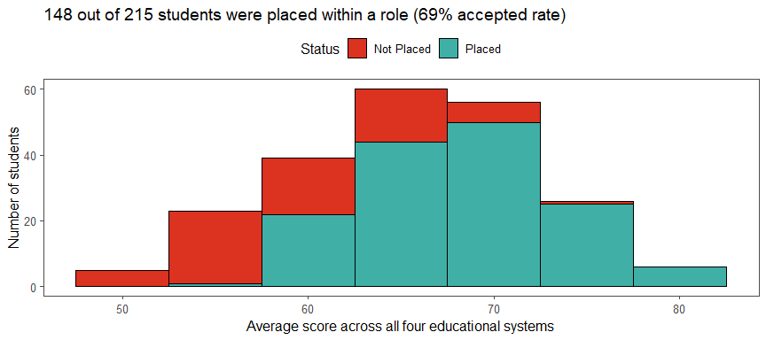
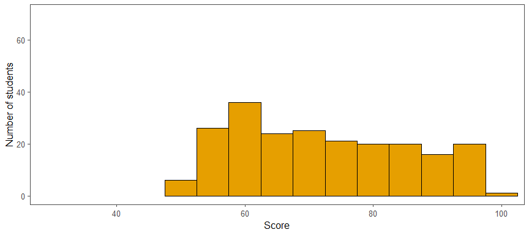
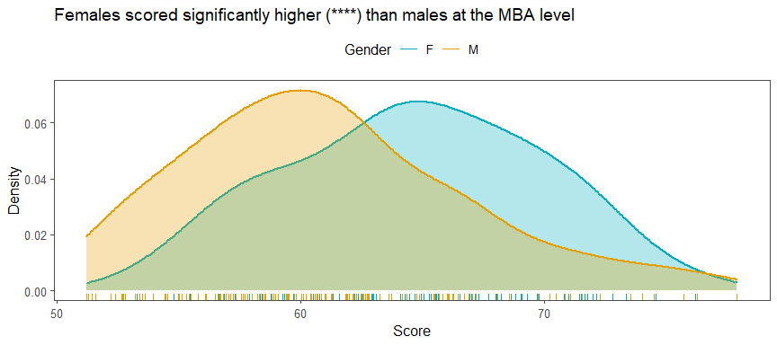
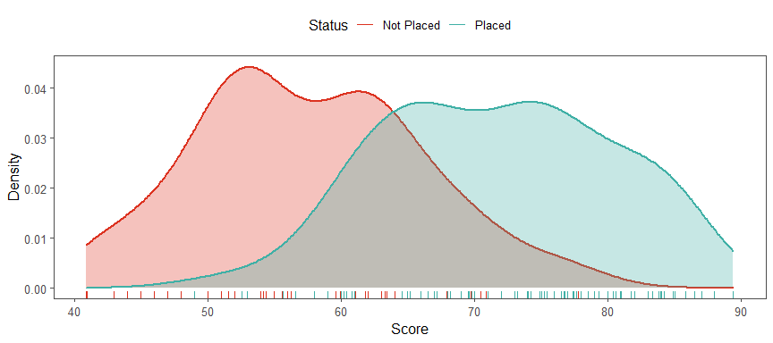
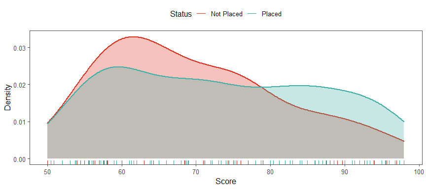
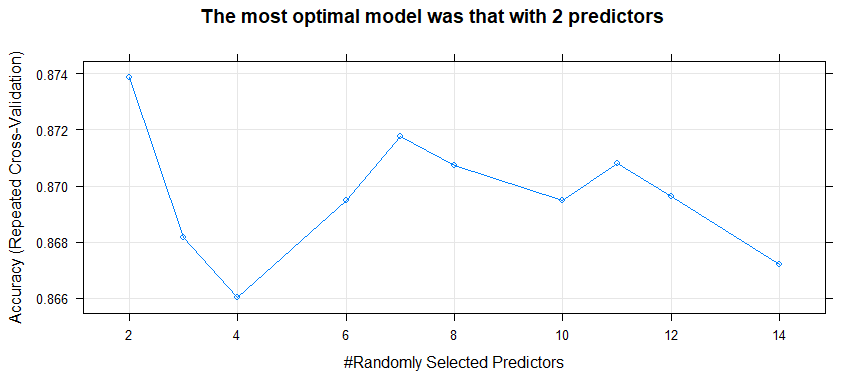

---
    output:
      html_document:
              
        toc: true
        toc_float: false
        toc_depth: 3
        number_sections: true
        
        code_folding: hide
        code_download: true
        
        fig_width: 9 
        fig_height: 4
        fig_align: "center"
        
        highlight: pygments
        theme: cerulean
        
        keep_md: true
        
    title: "Placement Prediction - University Students"
    subtitle: "I'm... hired? Can we predict which student received a placement offer?"
    author: "by Peter Hontaru"
---


```r
knitr::opts_chunk$set(
    echo = TRUE, # show all code
    tidy = FALSE, # cleaner code printing
    size = "small", # smaller code
    
    fig.path = "figures/",# where the figures will end up
    out.width = "100%",

    message = FALSE,
    warning = FALSE
    )
```


```r
setwd("~/DS/AHT/Data")

#import data
raw_data <- read_csv("~/DS/Placement-Prediction-University-Students/raw data/Placement_Data_Full_Class.csv")%>%
  mutate(gender = as.factor(gender),
               ssc_b = as.factor(ssc_b),
               hsc_b = as.factor(hsc_b),
               hsc_s = as.factor(hsc_s),
               degree_t = as.factor(make.names(degree_t)),
               specialisation = as.factor(make.names(specialisation)),
               workex = as.factor(workex),
               status = as.factor(status))
```


# Introduction


## Problem Statement:

Can we predict which candiates was placed in a role? If so, which factors helped the most (ie. work experience, degree, school results, gender, etc)?


## Dataset information:


```r
attribute <- names(raw_data)

description <- c(
"Serial Number",
"Gender: Male='M', Female='F'",
"Secondary Education percentage - 10th Grade",
"Board of Education - Central/Others",
"Higher Secondary Education percentage - 12th Grade",
"Board of Education - Central/Others",
"Specialization in Higher Secondary Education",
"Degree Percentage",
"Undergraduate(Degree type) - Field of degree education",
"Work Experience",
"Employability test percentage (conducted by college)",
"Post Graduation(MBA)- Specialization",
"MBA percentage",
"Status of placement - Placed/Not placed",
"Salary offered by corporate to candidates")

dataset_table <-as.data.frame(cbind(attribute,description))

dataset_table %>%   kbl() %>%
  kable_paper("hover", full_width = F)%>%
  column_spec(1, bold = TRUE)
```

<table class=" lightable-paper lightable-hover" style='font-family: "Arial Narrow", arial, helvetica, sans-serif; width: auto !important; margin-left: auto; margin-right: auto;'>
 <thead>
  <tr>
   <th style="text-align:left;"> attribute </th>
   <th style="text-align:left;"> description </th>
  </tr>
 </thead>
<tbody>
  <tr>
   <td style="text-align:left;font-weight: bold;"> sl_no </td>
   <td style="text-align:left;"> Serial Number </td>
  </tr>
  <tr>
   <td style="text-align:left;font-weight: bold;"> gender </td>
   <td style="text-align:left;"> Gender: Male='M', Female='F' </td>
  </tr>
  <tr>
   <td style="text-align:left;font-weight: bold;"> ssc_p </td>
   <td style="text-align:left;"> Secondary Education percentage - 10th Grade </td>
  </tr>
  <tr>
   <td style="text-align:left;font-weight: bold;"> ssc_b </td>
   <td style="text-align:left;"> Board of Education - Central/Others </td>
  </tr>
  <tr>
   <td style="text-align:left;font-weight: bold;"> hsc_p </td>
   <td style="text-align:left;"> Higher Secondary Education percentage - 12th Grade </td>
  </tr>
  <tr>
   <td style="text-align:left;font-weight: bold;"> hsc_b </td>
   <td style="text-align:left;"> Board of Education - Central/Others </td>
  </tr>
  <tr>
   <td style="text-align:left;font-weight: bold;"> hsc_s </td>
   <td style="text-align:left;"> Specialization in Higher Secondary Education </td>
  </tr>
  <tr>
   <td style="text-align:left;font-weight: bold;"> degree_p </td>
   <td style="text-align:left;"> Degree Percentage </td>
  </tr>
  <tr>
   <td style="text-align:left;font-weight: bold;"> degree_t </td>
   <td style="text-align:left;"> Undergraduate(Degree type) - Field of degree education </td>
  </tr>
  <tr>
   <td style="text-align:left;font-weight: bold;"> workex </td>
   <td style="text-align:left;"> Work Experience </td>
  </tr>
  <tr>
   <td style="text-align:left;font-weight: bold;"> etest_p </td>
   <td style="text-align:left;"> Employability test percentage (conducted by college) </td>
  </tr>
  <tr>
   <td style="text-align:left;font-weight: bold;"> specialisation </td>
   <td style="text-align:left;"> Post Graduation(MBA)- Specialization </td>
  </tr>
  <tr>
   <td style="text-align:left;font-weight: bold;"> mba_p </td>
   <td style="text-align:left;"> MBA percentage </td>
  </tr>
  <tr>
   <td style="text-align:left;font-weight: bold;"> status </td>
   <td style="text-align:left;"> Status of placement - Placed/Not placed </td>
  </tr>
  <tr>
   <td style="text-align:left;font-weight: bold;"> salary </td>
   <td style="text-align:left;"> Salary offered by corporate to candidates </td>
  </tr>
</tbody>
</table>

```r
#clear variables from environment
rm(attribute, description, dataset_table)
```


Check for *NULL*s:


```r
#check for nulls
raw_data %>% summarise_all(~ sum(is.null(.))) %>% sum() %>% 
  kbl(col.names = "Number of NULLs",
      align = c("c", "c")) %>%
  kable_paper("hover", full_width = F)
```

<table class=" lightable-paper lightable-hover" style='font-family: "Arial Narrow", arial, helvetica, sans-serif; width: auto !important; margin-left: auto; margin-right: auto;'>
 <thead>
  <tr>
   <th style="text-align:center;"> Number of NULLs </th>
  </tr>
 </thead>
<tbody>
  <tr>
   <td style="text-align:center;"> 0 </td>
  </tr>
</tbody>
</table>


Check for *NA*s:


```r
#check NAs
raw_data %>% summarise_all(~ sum(is.na(.))) %>% sum() %>%
    kbl(col.names = "Number of NAs",
      align = c("c", "c")) %>%
  kable_paper("hover", full_width = F)
```

<table class=" lightable-paper lightable-hover" style='font-family: "Arial Narrow", arial, helvetica, sans-serif; width: auto !important; margin-left: auto; margin-right: auto;'>
 <thead>
  <tr>
   <th style="text-align:center;"> Number of NAs </th>
  </tr>
 </thead>
<tbody>
  <tr>
   <td style="text-align:center;"> 67 </td>
  </tr>
</tbody>
</table>


Let's dig deeper and see why we have 67 NAs.


```r
#we have 67 NAs - let's see which category has these values
raw_data %>% summarise_all(~ sum(is.na(.))) %>%
    kbl()%>%
  kable_paper("hover", full_width = F)
```

<table class=" lightable-paper lightable-hover" style='font-family: "Arial Narrow", arial, helvetica, sans-serif; width: auto !important; margin-left: auto; margin-right: auto;'>
 <thead>
  <tr>
   <th style="text-align:right;"> sl_no </th>
   <th style="text-align:right;"> gender </th>
   <th style="text-align:right;"> ssc_p </th>
   <th style="text-align:right;"> ssc_b </th>
   <th style="text-align:right;"> hsc_p </th>
   <th style="text-align:right;"> hsc_b </th>
   <th style="text-align:right;"> hsc_s </th>
   <th style="text-align:right;"> degree_p </th>
   <th style="text-align:right;"> degree_t </th>
   <th style="text-align:right;"> workex </th>
   <th style="text-align:right;"> etest_p </th>
   <th style="text-align:right;"> specialisation </th>
   <th style="text-align:right;"> mba_p </th>
   <th style="text-align:right;"> status </th>
   <th style="text-align:right;"> salary </th>
  </tr>
 </thead>
<tbody>
  <tr>
   <td style="text-align:right;"> 0 </td>
   <td style="text-align:right;"> 0 </td>
   <td style="text-align:right;"> 0 </td>
   <td style="text-align:right;"> 0 </td>
   <td style="text-align:right;"> 0 </td>
   <td style="text-align:right;"> 0 </td>
   <td style="text-align:right;"> 0 </td>
   <td style="text-align:right;"> 0 </td>
   <td style="text-align:right;"> 0 </td>
   <td style="text-align:right;"> 0 </td>
   <td style="text-align:right;"> 0 </td>
   <td style="text-align:right;"> 0 </td>
   <td style="text-align:right;"> 0 </td>
   <td style="text-align:right;"> 0 </td>
   <td style="text-align:right;"> 67 </td>
  </tr>
</tbody>
</table>


Lastly, we need to check why we have these 67 NAs in the salary category. Is this missing data or another reason behind it? 


```r
#let's check that this is because some students did not get placed and thus, had no salary
raw_data %>% group_by(status) %>% count() %>%     
  kbl(col.names = c("Status", "n"),
      align = c("c", "c")) %>%
  kable_paper("hover", full_width = F)
```

<table class=" lightable-paper lightable-hover" style='font-family: "Arial Narrow", arial, helvetica, sans-serif; width: auto !important; margin-left: auto; margin-right: auto;'>
 <thead>
  <tr>
   <th style="text-align:center;"> Status </th>
   <th style="text-align:center;"> n </th>
  </tr>
 </thead>
<tbody>
  <tr>
   <td style="text-align:center;"> Not Placed </td>
   <td style="text-align:center;"> 67 </td>
  </tr>
  <tr>
   <td style="text-align:center;"> Placed </td>
   <td style="text-align:center;"> 148 </td>
  </tr>
</tbody>
</table>


It looks like we have 67 NAs in the salary column due to the fact that 67 students did not get a placement. That makes sense and no further investigation is needed.


# Exploratory Data Analysis (EDA)


## Correlation plot


```r
#select all to start
raw_data_corr <- select_if(raw_data, is.numeric)%>%
  select(-sl_no, -salary)

# Compute a correlation matrix
corr <- round(cor(raw_data_corr),2)

# Compute a matrix of correlation p-values
p.mat <- cor_pmat(raw_data_corr)

# Visualize the correlation matrix
ggcorrplot(corr, method = "square", 
           ggtheme = ggthemes::theme_few, 
           
           outline.col = "black",
           colors = c("#00AFBB","white", "red"),
           
           lab = TRUE,
           lab_size = 5,
           digits = 2,
           
           type = "lower",
           legend = "",
           tl.cex = 12,
           
           title = "We can observe low to medium correlations \nbetween our main variables")
```


```r
#clear variables from the environment
rm(corr, p.mat, raw_data_corr)
```


**Key findings**:

* we can observe **medium correlations between the academic scores**. This suggests that students who performed well in secondary school were likely to also perform well within further education (high school, university and MBA)
* interestingly, **employability test scores only had a low correlation with academic scores**. Perhaps, this suggests that these tests were more practical than theoretical?


## Grade distribution {.tabset .tabset-fade .tabset-pills}


### secondary {-}


```r
raw_data %>%
  ggplot(aes(ssc_p))+
  geom_histogram(binwidth = 5, fill = "#00AFBB", col = "black")+
  coord_cartesian(xlim=c(30,100),
                  ylim=c(0,70))+
  labs(x = "Score",
       y = "Number of students")+
  theme_few()
```




### high school {-}


```r
raw_data %>%
  ggplot(aes(hsc_p))+
  geom_histogram(binwidth = 5, fill = "#00AFBB", col = "black")+
  coord_cartesian(xlim=c(30,100),
                  ylim=c(0,70))+
  labs(x = "Score",
       y = "Number of students")+
  theme_few()
```


### university {-}


```r
raw_data %>%
  ggplot(aes(degree_p))+
  geom_histogram(binwidth = 5, fill = "#00AFBB", col = "black")+
  coord_cartesian(xlim=c(30,100),
                  ylim=c(0,70))+
  labs(x = "Score",
       y = "Number of students")+
  theme_few()
```


### MBA {-}


```r
raw_data %>%
  ggplot(aes(mba_p))+
  geom_histogram(binwidth = 5, fill = "#00AFBB", col = "black")+
  coord_cartesian(xlim=c(30,100),
                  ylim=c(0,70))+
  labs(x = "Score",
       y = "Number of students")+
  theme_few()
```


### employability (non-academic) {-}


```r
raw_data %>%
  ggplot(aes(etest_p))+
  geom_histogram(binwidth = 5, fill = "#E69F00", col = "black")+
  coord_cartesian(xlim=c(30,100),
                  ylim=c(0,70))+
  labs(x = "Score",
       y = "Number of Students")+
  theme_few()
```


We can see that the distribution is more concentated around the median as a student progresses in their education, from secondary school (wide distribution) to MBA (narrow distribution).

The employability test has a different trend, with a very wide and almost equal distribution of each score group.


## Are there any gender-specific differences in performance scores? {.tabset .tabset-fade .tabset-pills}


### university {-}


```r
t_test_degree <- raw_data%>%
  t_test(degree_p ~ gender)%>%
  add_significance()

raw_data %>% ggplot(aes(gender, degree_p, fill = gender))+
        geom_boxplot(varwidth = TRUE)+
  scale_fill_manual(values = c("#00AFBB", "#E69F00"))+
  labs(title = paste("Females scored significantly higher (", t_test_degree$p.signif, ") than males at the university level"),
       fill = "Gender",
       x = NULL,
       y = "Score")+
  theme_few()
```


```r
t_test_degree%>%
  kbl() %>%
  kable_paper("hover", full_width = F)
```

<table class=" lightable-paper lightable-hover" style='font-family: "Arial Narrow", arial, helvetica, sans-serif; width: auto !important; margin-left: auto; margin-right: auto;'>
 <thead>
  <tr>
   <th style="text-align:left;"> .y. </th>
   <th style="text-align:left;"> group1 </th>
   <th style="text-align:left;"> group2 </th>
   <th style="text-align:right;"> n1 </th>
   <th style="text-align:right;"> n2 </th>
   <th style="text-align:right;"> statistic </th>
   <th style="text-align:right;"> df </th>
   <th style="text-align:right;"> p </th>
   <th style="text-align:left;"> p.signif </th>
  </tr>
 </thead>
<tbody>
  <tr>
   <td style="text-align:left;"> degree_p </td>
   <td style="text-align:left;"> F </td>
   <td style="text-align:left;"> M </td>
   <td style="text-align:right;"> 76 </td>
   <td style="text-align:right;"> 139 </td>
   <td style="text-align:right;"> 2.431405 </td>
   <td style="text-align:right;"> 132.0024 </td>
   <td style="text-align:right;"> 0.0164 </td>
   <td style="text-align:left;"> * </td>
  </tr>
</tbody>
</table>


### MBA {-}


```r
t_test_mba <- raw_data%>%
  t_test(mba_p ~ gender)%>%
  add_significance()

raw_data %>% ggplot(aes(gender, mba_p, fill = gender))+
        geom_boxplot(varwidth = TRUE)+
  scale_fill_manual(values = c("#00AFBB", "#E69F00"))+
  labs(title = paste("Females scored significantly higher (", t_test_mba$p.signif, ") than males at the MBA level"),
       fill = "Gender",
       x = NULL,
       y = "Score")+
  theme_few()
```



```r
t_test_mba %>%
  kbl() %>%
  kable_paper("hover", full_width = F)
```

<table class=" lightable-paper lightable-hover" style='font-family: "Arial Narrow", arial, helvetica, sans-serif; width: auto !important; margin-left: auto; margin-right: auto;'>
 <thead>
  <tr>
   <th style="text-align:left;"> .y. </th>
   <th style="text-align:left;"> group1 </th>
   <th style="text-align:left;"> group2 </th>
   <th style="text-align:right;"> n1 </th>
   <th style="text-align:right;"> n2 </th>
   <th style="text-align:right;"> statistic </th>
   <th style="text-align:right;"> df </th>
   <th style="text-align:right;"> p </th>
   <th style="text-align:left;"> p.signif </th>
  </tr>
 </thead>
<tbody>
  <tr>
   <td style="text-align:left;"> mba_p </td>
   <td style="text-align:left;"> F </td>
   <td style="text-align:left;"> M </td>
   <td style="text-align:right;"> 76 </td>
   <td style="text-align:right;"> 139 </td>
   <td style="text-align:right;"> 4.725214 </td>
   <td style="text-align:right;"> 166.8781 </td>
   <td style="text-align:right;"> 4.9e-06 </td>
   <td style="text-align:left;"> **** </td>
  </tr>
</tbody>
</table>


There were no significant differences in performance during secondary, high school and employability test.


Next, we would like to know if these differences led to a better chance of receiving a placement role.


## Did the academic peformance help in receiving an offer? {.tabset .tabset-fade .tabset-pills}


### secondary {-}


```r
t_test <- raw_data%>%
  t_test(ssc_p ~ status)%>%
  add_significance()

raw_data %>% 
  ggplot(aes(ssc_p, fill=status, col = status))+
  geom_density(alpha = 0.2, show.legend = FALSE)+
  geom_rug()+
  #theme(legend.position = "top")+
  scale_fill_manual(values = c("#DC3220", "#40B0A6"))+
  scale_colour_manual(values = c("#DC3220", "#40B0A6"))+
  labs(title = "",
       subtitle = paste("The students placed a role had significantly (", t_test$p.signif, ") fewer low scores and more high scores than those who did not"))+
  theme_few()
```


### high school {-}


```r
t_test <- raw_data%>%
  t_test(hsc_p ~ status)%>%
  add_significance()

raw_data %>% 
  ggplot(aes(hsc_p, fill=status, col = status))+
  geom_density(alpha = 0.2, show.legend = FALSE)+
  geom_rug()+
  #theme(legend.position = "top")+
  scale_fill_manual(values = c("#DC3220", "#40B0A6"))+
  scale_colour_manual(values = c("#DC3220", "#40B0A6"))+
  labs(title = "",
       subtitle = paste("The students placed a role had significantly (", t_test$p.signif, ") fewer low scores and more high scores than those who did not"))+
  theme_few()
```




### university {-}


```r
t_test <- raw_data%>%
  t_test(degree_p ~ status)%>%
  add_significance()

raw_data %>% 
  ggplot(aes(degree_p, fill=status, col = status))+
  geom_density(alpha = 0.2, show.legend = FALSE)+
  geom_rug()+
  #theme(legend.position = "top")+
  scale_fill_manual(values = c("#DC3220", "#40B0A6"))+
  scale_colour_manual(values = c("#DC3220", "#40B0A6"))+
  labs(title = "",
       subtitle = paste("The students placed a role had significantly (", t_test$p.signif, ") fewer low scores and more high scores than those who did not"))+
  theme_few()
```


### MBA {-}


```r
t_test <- raw_data%>%
  t_test(mba_p ~ status)%>%
  add_significance()

raw_data %>% 
  ggplot(aes(mba_p, fill=status, col = status))+
  geom_density(alpha = 0.2, show.legend = FALSE)+
  geom_rug()+
  #theme(legend.position = "top")+
  scale_fill_manual(values = c("#DC3220", "#40B0A6"))+
  scale_colour_manual(values = c("#DC3220", "#40B0A6"))+
  labs(title = "",
       subtitle = paste("The students placed a role had significantly (", t_test$p.signif, ") fewer low scores and more high scores than those who did not"))+
  theme_few()
```




### employability (non-academic) {-}


```r
t_test <- raw_data%>%
  t_test(etest_p ~ status)%>%
  add_significance()

raw_data %>% 
  ggplot(aes(etest_p, fill=status, col = status))+
  geom_density(alpha = 0.2, show.legend = FALSE)+
  geom_rug()+
  #theme(legend.position = "top")+
  scale_fill_manual(values = c("#DC3220", "#40B0A6"))+
  scale_colour_manual(values = c("#DC3220", "#40B0A6"))+
  labs(title = "While a high employability score does not guarantee a placement, it does help",
       subtitle = paste("The students placed a role had significantly (", t_test$p.signif, ") fewer low scores and more high scores than those who did not"))+
  theme_few()
```


Knowing that the results got more concentrated around the mean, we could maybe infer that there was less of a chance for a student to differentiate themselves based on grade, and more based on other factors such as employability score, work experience, technical skills, soft skills, better interviews, etc. Unfortunately, out of these factors, we only have data on the employability score.


## Did the different boards make a significant difference in school peformance/placement offer? {.tabset .tabset-fade .tabset-pills}


### secondary {-}


```r
t_test <- raw_data%>%
  t_test(ssc_p ~ ssc_b)%>%
  add_significance()

raw_data %>% 
  ggplot(aes(ssc_p, fill=ssc_b, col = ssc_b))+
  geom_density(alpha = 0.2, show.legend = FALSE)+
  geom_rug()+
  #theme(legend.position = "top")+
  scale_fill_manual(values = c("#DC3220", "#40B0A6"))+
  scale_colour_manual(values = c("#DC3220", "#40B0A6"))+
  labs(title = "While a high employability score does not guarantee a placement, it does help",
       subtitle = paste("The students placed a role had significantly (", t_test$p.signif, ") fewer low scores and more high scores than those who did not"))+
  theme_few()
```


```r
#fix this
raw_data %>% 
  ggplot(aes(ssc_b, fill = status))+
  geom_bar(show.legend = FALSE, position = "fill", col = "black")+
  #theme(legend.position = "top")+
  scale_fill_manual(values = c("#DC3220", "#40B0A6"))+
  scale_colour_manual(values = c("#DC3220", "#40B0A6"))+
  labs(title = "While a high employability score does not guarantee a placement, it does help",
       subtitle = paste("The students placed a role had significantly (", t_test$p.signif, ") fewer low scores and more high scores than those who did not"))+
  theme_few()
```


### high school {-}


```r
t_test <- raw_data%>%
  t_test(hsc_p ~ hsc_b)%>%
  add_significance()

raw_data %>% 
  ggplot(aes(hsc_p, fill=specialisation))+
  geom_density(alpha = 0.2, show.legend = FALSE, col = "black")+
  geom_rug()+
  #theme(legend.position = "top")+
  scale_fill_manual(values = c("#DC3220", "#40B0A6"))+
  scale_colour_manual(values = c("#DC3220", "#40B0A6"))+
  labs(title = "While a high employability score does not guarantee a placement, it does help",
       subtitle = paste("The students placed a role had significantly (", t_test$p.signif, ") fewer low scores and more high scores than those who did not"))+
  theme_few()
```


```r
#fix this
raw_data %>% 
  ggplot(aes(hsc_b, fill = status))+
  geom_bar(show.legend = FALSE, position = "fill", col = "black")+
  #theme(legend.position = "top")+
  scale_fill_manual(values = c("#DC3220", "#40B0A6"))+
  scale_colour_manual(values = c("#DC3220", "#40B0A6"))+
  labs(title = "While a high employability score does not guarantee a placement, it does help",
       subtitle = paste("The students placed a role had significantly (", t_test$p.signif, ") fewer low scores and more high scores than those who did not"))+
  theme_few()
```


## Did the specialisation help in getting a role? {.tabset .tabset-fade .tabset-pills}


### high school {-}


```r
t_test <- raw_data%>%
  t_test(hsc_p ~ hsc_s)%>%
  add_significance()

raw_data %>% 
  ggplot(aes(hsc_p, hsc_s, fill=hsc_s))+
  geom_boxplot(show.legend = FALSE, col = "black")+
  theme(legend.position = "top")+
  scale_fill_manual(values = c("#DC3220", "#40B0A6", "black"))+
  scale_colour_manual(values = c("#DC3220", "#40B0A6", "black"))+
  labs(title = "While a high employability score does not guarantee a placement, it does help",
       subtitle = paste("The students placed a role had significantly (", t_test$p.signif, ") fewer low scores and more high scores than those who did not"))+
  theme_few()
```



```r
raw_data %>% 
  ggplot(aes(hsc_s, fill = status))+
  geom_bar(show.legend = FALSE, position = "fill", col = "black")+
  #theme(legend.position = "top")+
  scale_fill_manual(values = c("#DC3220", "#40B0A6"))+
  scale_colour_manual(values = c("#DC3220", "#40B0A6"))+
  labs(title = "While a high employability score does not guarantee a placement, it does help",
       subtitle = paste("The students placed a role had significantly (", t_test$p.signif, ") fewer low scores and more high scores than those who did not"))+
  theme_few()
```


### university {-}


```r
t_test <- raw_data%>%
  t_test(degree_p ~ degree_t)%>%
  add_significance()

raw_data %>% 
  ggplot(aes(degree_p, degree_t, fill=degree_t))+
  geom_boxplot(show.legend = FALSE, col = "black")+
  #theme(legend.position = "top")+
  scale_fill_manual(values = c("#DC3220", "#40B0A6", "black"))+
  scale_colour_manual(values = c("#DC3220", "#40B0A6", "black"))+
  labs(title = "While a high employability score does not guarantee a placement, it does help",
       subtitle = paste("The students placed a role had significantly (", t_test$p.signif, ") fewer low scores and more high scores than those who did not"))+
  theme_few()
```


```r
raw_data %>% 
  ggplot(aes(degree_t, fill = status))+
  geom_bar(show.legend = FALSE, position = "fill", col = "black")+
  #theme(legend.position = "top")+
  scale_fill_manual(values = c("#DC3220", "#40B0A6"))+
  scale_colour_manual(values = c("#DC3220", "#40B0A6"))+
  labs(title = "While a high employability score does not guarantee a placement, it does help",
       subtitle = paste("The students placed a role had significantly (", t_test$p.signif, ") fewer low scores and more high scores than those who did not"))+
  theme_few()
```


### MBA {-}


```r
t_test <- raw_data%>%
  t_test(mba_p ~ specialisation)%>%
  add_significance()

raw_data %>% 
  ggplot(aes(mba_p, specialisation, fill=specialisation, col = specialisation))+
  geom_boxplot(show.legend = FALSE, col = "black")+
  #theme(legend.position = "top")+
  scale_fill_manual(values = c("#DC3220", "#40B0A6", "black"))+
  scale_colour_manual(values = c("#DC3220", "#40B0A6", "black"))+
  labs(title = "While a high employability score does not guarantee a placement, it does help",
       subtitle = paste("The students placed a role had significantly (", t_test$p.signif, ") fewer low scores and more high scores than those who did not"))+
  theme_few()
```


```r
raw_data %>% 
  ggplot(aes(specialisation, fill = status))+
  geom_bar(show.legend = FALSE, position = "fill", col = "black")+
  #theme(legend.position = "top")+
  scale_fill_manual(values = c("#DC3220", "#40B0A6"))+
  scale_colour_manual(values = c("#DC3220", "#40B0A6"))+
  labs(title = "While a high employability score does not guarantee a placement, it does help",
       subtitle = paste("The students placed a role had significantly (", t_test$p.signif, ") fewer low scores and more high scores than those who did not"))+
  theme_few()
```


## Is there a difference between the two genders in getting a placement?


```r
raw_data %>%
  group_by(gender, status)%>%
  summarise(count = n())%>%
  mutate(percentage = round(count/sum(count),2)*100)%>%
        
  ggplot(aes(status, percentage, fill = status))+
  geom_col(position = "dodge", col = "black")+
  geom_label(aes(label = paste(percentage, "%")), show.legend = FALSE)+
  scale_fill_manual(values = c("#DC3220", "#40B0A6"))+
  facet_wrap(.~gender)+
  labs(title = "A higher proportion of females failed to receive a placement than males, \ndespite females performing better at university and MBA",
       x = NULL,
       y = "Number of students",
       fill = "Status")+
  theme_few()
```


## Does work experience matter in getting a role?


```r
raw_data %>% group_by(workex, status)%>% 
  summarise(count = n())%>%
  mutate(perc = round(count / sum(count),2)*100,
         diff = perc - 50)%>%
        
  ggplot(aes(workex, perc, fill = status))+
  geom_col(col = "black")+
  scale_fill_manual(values = c("#DC3220", "#40B0A6"))+
  geom_label(aes(label = paste(perc, "%"), y = 55 - diff), show.legend = FALSE)+
  labs(title = "Work experience significantly increases the chance of getting placed",
       subtitle = "87% of peple with work experience were placed versus 60% of those without work experience",
       x = "Work Experience",
       y = "% of students",
       fill = "Status")+
  theme_few()+
  theme(axis.ticks.y = element_blank(),
        axis.text.y = element_blank())
```


# Classification


## Data split


Based on the previous Exploratory Data Analysis, we have no reason to believe that any of the features are insignificant, so none of them are to be removed from the modelling.

Let's split the dataset into the following:

* a train dataset of 80% of the raw data to train our prediction model on
* a test dataset of 20% of the raw data to then test it on


```r
set.seed(123)

#clean model data
raw_data_model <- raw_data %>%
  select(-sl_no, -salary)%>%
  mutate(status = as.factor(make.names(status)))

#split into two datasets
split <- createDataPartition(raw_data_model$status,
                             p =0.8, 
                             list = FALSE)

train_data <- raw_data_model[split,]
test_data <- raw_data_model[-split,]
```


## Pre-processing


Before we dive into the model building, we need to think about any pre-processing that might need doing.


### missing values {-}


We've seen before that there was no missing data to worry about, so we can skip that step.


### one hot encoding {-}


### range normalisation {-}


Let's use some basic standardisation offered by the caret package such as **centering** (subtract mean from values) and **scaling** (divide values by standard deviation).


```r
#store the y variable in its original format
#y <- train_data$status

#take out y variable temporarily as we do not want this to be processed
#train_data <- train_data %>% select (-status)

#center and scale our data
preProcess_range_model <- preProcess(train_data, method=c("center", "scale"))

train_data <- predict(preProcess_range_model, newdata = train_data)
test_data <- predict(preProcess_range_model, newdata = test_data)
 
#Append the Y variable back on with original values
#train_data$status <- y
```


## Resampling


We will perform a 10-fold Cross Validation 5 times. This means we will be dividing the training dataset randomly into 10 parts, use each of the 10 parts as a "testing dataset" for the model and "train" on the remaining 9. 

Essentially, we are "pretending" that some of our data is new and use the rest of the data to model on. We then take the average error of each of the 10 models and repeat this process 5 times. Doing it more than once will give a more realistic sense of how the model will perform on new data.


```r
train.control <- trainControl(method = "repeatedcv", 
                              number = 10, #10
                              repeats = 5, #5
                              search = "random",
                              classProbs = T)

tune.Length <- 10

clusters <- 4
```


## Model building {.tabset .tabset-fade .tabset-pills}

The data has a higher number of observations than features so we will be choosing appropriates algorithms  KNN, Decision trees, or kernel SVM). Let's build a few of these models and see how they compare.


### 1 - GLM {-}


```r
#run them all in paralel
cl <- makeCluster(clusters, type = "SOCK")
 
#register cluster train in paralel
registerDoSNOW(cl)

#train model
model_glm <- train(status ~ .,
                   data = train_data,
                   method = "glm",
                   trControl = train.control,
                   tuneLength = tune.Length)

#shut the instances of R down
stopCluster(cl)

#show results
summary(model_glm)

#get info
#names(model_glm)

#AccuracySD
model_glm$results #gives us an esitmate of the uncertainty in our accuracy estimate

#add prediction column to test dataset
test_data$glm <- predict(model_glm, newdata = test_data)

#get probabilities instead
head(predict(model_glm, newdata = test_data, type = "prob"))
```


```r
preds <- predict(model_glm, newdata = test_data)

confusionMatrix(preds, test_data$status)
```

```
## Confusion Matrix and Statistics
## 
##             Reference
## Prediction   Not.Placed Placed
##   Not.Placed          6      1
##   Placed              7     28
##                                          
##                Accuracy : 0.8095         
##                  95% CI : (0.6588, 0.914)
##     No Information Rate : 0.6905         
##     P-Value [Acc > NIR] : 0.06218        
##                                          
##                   Kappa : 0.4894         
##                                          
##  Mcnemar's Test P-Value : 0.07710        
##                                          
##             Sensitivity : 0.4615         
##             Specificity : 0.9655         
##          Pos Pred Value : 0.8571         
##          Neg Pred Value : 0.8000         
##              Prevalence : 0.3095         
##          Detection Rate : 0.1429         
##    Detection Prevalence : 0.1667         
##       Balanced Accuracy : 0.7135         
##                                          
##        'Positive' Class : Not.Placed     
## 
```


### 2 - Decision tree {-}


```r
#run them all in paralel
cl <- makeCluster(clusters, type = "SOCK")
 
#register cluster train in paralel
registerDoSNOW(cl)

#train model
model_rpart <- train(status ~ .,
                      data = train_data,
                      method = "rpart",
                      trControl = train.control,
                      tuneLength = tune.Length)

#shut the instances of R down
stopCluster(cl)

#show results
summary(model_rpart)

#get info
#names(model_rpart)

#AccuracySD
model_rpart$results #gives us an esitmate of the uncertainty in our accuracy estimate

#add prediction column to test dataset
test_data$rpart <- predict(model_rpart, newdata = test_data)

#get probabilities instead
head(predict(model_rpart, newdata = test_data, type = "prob"))
```


```r
preds <- predict(model_rpart, newdata = test_data)

confusionMatrix(preds, test_data$status)
```

```
## Confusion Matrix and Statistics
## 
##             Reference
## Prediction   Not.Placed Placed
##   Not.Placed          5      1
##   Placed              8     28
##                                          
##                Accuracy : 0.7857         
##                  95% CI : (0.6319, 0.897)
##     No Information Rate : 0.6905         
##     P-Value [Acc > NIR] : 0.1194         
##                                          
##                   Kappa : 0.4112         
##                                          
##  Mcnemar's Test P-Value : 0.0455         
##                                          
##             Sensitivity : 0.3846         
##             Specificity : 0.9655         
##          Pos Pred Value : 0.8333         
##          Neg Pred Value : 0.7778         
##              Prevalence : 0.3095         
##          Detection Rate : 0.1190         
##    Detection Prevalence : 0.1429         
##       Balanced Accuracy : 0.6751         
##                                          
##        'Positive' Class : Not.Placed     
## 
```


### 3 - LDA2 {-}


```r
#run them all in paralel
cl <- makeCluster(clusters, type = "SOCK")
 
#register cluster train in paralel
registerDoSNOW(cl)

#train model
model_lda2 <- train(status ~ .,
                        data = train_data,
                        method = "lda2",
                        trControl = train.control,
                        tuneLength = tune.Length)

#shut the instances of R down
stopCluster(cl)

#show results
summary(model_lda2)

#get info
#names(model_lda2)

#AccuracySD
model_lda2$results #gives us an esitmate of the uncertainty in our accuracy estimate

#add prediction column to test dataset
test_data$lda2 <- predict(model_lda2, newdata = test_data)

#get probabilities instead
head(predict(model_lda2, newdata = test_data, type = "prob"))
```


```r
preds <- predict(model_lda2, newdata = test_data)

confusionMatrix(preds, test_data$status)
```

```
## Confusion Matrix and Statistics
## 
##             Reference
## Prediction   Not.Placed Placed
##   Not.Placed         10      1
##   Placed              3     28
##                                           
##                Accuracy : 0.9048          
##                  95% CI : (0.7738, 0.9734)
##     No Information Rate : 0.6905          
##     P-Value [Acc > NIR] : 0.001009        
##                                           
##                   Kappa : 0.7673          
##                                           
##  Mcnemar's Test P-Value : 0.617075        
##                                           
##             Sensitivity : 0.7692          
##             Specificity : 0.9655          
##          Pos Pred Value : 0.9091          
##          Neg Pred Value : 0.9032          
##              Prevalence : 0.3095          
##          Detection Rate : 0.2381          
##    Detection Prevalence : 0.2619          
##       Balanced Accuracy : 0.8674          
##                                           
##        'Positive' Class : Not.Placed      
## 
```


### 4 - SVM Linear {-}


```r
#run them all in paralel
cl <- makeCluster(clusters, type = "SOCK")
 
#register cluster train in paralel
registerDoSNOW(cl)

#train model
model_svm <- train(status ~ .,
                   data = train_data,
                   method = "svmLinear",
                   trControl = train.control,
                   tuneLength = tune.Length)

#shut the instances of R down
stopCluster(cl)

#show results
summary(model_svm)

#get info
#names(model_svm)

#AccuracySD
model_svm$results #gives us an esitmate of the uncertainty in our accuracy estimate

#add prediction column to test dataset
test_data$svm <- predict(model_svm, newdata = test_data)

#get probabilities instead
head(predict(model_svm, newdata = test_data, type = "prob"))
```


```r
preds <- predict(model_svm, newdata = test_data)

confusionMatrix(preds, test_data$status)
```

```
## Confusion Matrix and Statistics
## 
##             Reference
## Prediction   Not.Placed Placed
##   Not.Placed          8      1
##   Placed              5     28
##                                           
##                Accuracy : 0.8571          
##                  95% CI : (0.7146, 0.9457)
##     No Information Rate : 0.6905          
##     P-Value [Acc > NIR] : 0.01118         
##                                           
##                   Kappa : 0.6348          
##                                           
##  Mcnemar's Test P-Value : 0.22067         
##                                           
##             Sensitivity : 0.6154          
##             Specificity : 0.9655          
##          Pos Pred Value : 0.8889          
##          Neg Pred Value : 0.8485          
##              Prevalence : 0.3095          
##          Detection Rate : 0.1905          
##    Detection Prevalence : 0.2143          
##       Balanced Accuracy : 0.7905          
##                                           
##        'Positive' Class : Not.Placed      
## 
```


### 5 - xgboost {-}


```r
#run them all in paralel
cl <- makeCluster(clusters, type = "SOCK")

#register cluster train in paralel
registerDoSNOW(cl)

#train model
model_xgb <- train(status ~ .,
                   data = train_data,
                   method = "xgbTree",
                   trControl = train.control,
                   tuneLength = tune.Length)

#shut the instances of R down
stopCluster(cl)

#show results
summary(model_xgb)

#get info
#names(model_xgb)

#AccuracySD
model_xgb$results #gives us an esitmate of the uncertainty in our accuracy estimate

#add prediction column to test dataset
test_data$xgb <- predict(model_xgb, newdata = test_data)

#get probabilities instead
head(predict(model_xgb, newdata = test_data, type = "prob"))
```


```r
preds <- predict(model_xgb, newdata = test_data)

confusionMatrix(preds, test_data$status)
```

```
## Confusion Matrix and Statistics
## 
##             Reference
## Prediction   Not.Placed Placed
##   Not.Placed          5      1
##   Placed              8     28
##                                          
##                Accuracy : 0.7857         
##                  95% CI : (0.6319, 0.897)
##     No Information Rate : 0.6905         
##     P-Value [Acc > NIR] : 0.1194         
##                                          
##                   Kappa : 0.4112         
##                                          
##  Mcnemar's Test P-Value : 0.0455         
##                                          
##             Sensitivity : 0.3846         
##             Specificity : 0.9655         
##          Pos Pred Value : 0.8333         
##          Neg Pred Value : 0.7778         
##              Prevalence : 0.3095         
##          Detection Rate : 0.1190         
##    Detection Prevalence : 0.1429         
##       Balanced Accuracy : 0.6751         
##                                          
##        'Positive' Class : Not.Placed     
## 
```


### 6 - KNN {-}


```r
#run them all in paralel
cl <- makeCluster(clusters, type = "SOCK")

#register cluster train in paralel
registerDoSNOW(cl)

#train model
model_knn <- train(status ~ .,
                   data = train_data,
                   method = "knn",
                   trControl = train.control,
                   tuneLength = tune.Length)

#shut the instances of R down
stopCluster(cl)

#show results
summary(model_knn)

#get info
#names(model_knn)

#AccuracySD
model_knn$results #gives us an esitmate of the uncertainty in our accuracy estimate

#add prediction column to test dataset
test_data$knn <- predict(model_knn, newdata = test_data)

#get probabilities instead
head(predict(model_knn, newdata = test_data, type = "prob"))
```


```r
preds <- predict(model_knn, newdata = test_data)

confusionMatrix(preds, test_data$status)
```

```
## Confusion Matrix and Statistics
## 
##             Reference
## Prediction   Not.Placed Placed
##   Not.Placed          5      0
##   Placed              8     29
##                                          
##                Accuracy : 0.8095         
##                  95% CI : (0.6588, 0.914)
##     No Information Rate : 0.6905         
##     P-Value [Acc > NIR] : 0.06218        
##                                          
##                   Kappa : 0.4633         
##                                          
##  Mcnemar's Test P-Value : 0.01333        
##                                          
##             Sensitivity : 0.3846         
##             Specificity : 1.0000         
##          Pos Pred Value : 1.0000         
##          Neg Pred Value : 0.7838         
##              Prevalence : 0.3095         
##          Detection Rate : 0.1190         
##    Detection Prevalence : 0.1190         
##       Balanced Accuracy : 0.6923         
##                                          
##        'Positive' Class : Not.Placed     
## 
```


### 7 - Random Forrest (ranger) {-}


```r
#run them all in paralel
cl <- makeCluster(clusters, type = "SOCK")

#register cluster train in paralel
registerDoSNOW(cl)

#train model
model_ranger <- train(status ~ .,
                  data = train_data,
                  method = "ranger",
                  trControl = train.control,
                  tuneLength = tune.Length)

#shut the instances of R down
stopCluster(cl)

#show results
summary(model_ranger)

#get info
#names(model_ranger)

#AccuracySD
model_ranger$results #gives us an esitmate of the uncertainty in our accuracy estimate

#add prediction column to test dataset
test_data$ranger <- predict(model_ranger, newdata = test_data)

#get probabilities instead
#head(predict(model_ranger, newdata = test_data, type = "prob"))


###----------------------------------why can we not predict?
```


```r
preds <- predict(model_ranger, newdata = test_data)

confusionMatrix(preds, test_data$status)
```

```
## Confusion Matrix and Statistics
## 
##             Reference
## Prediction   Not.Placed Placed
##   Not.Placed          6      0
##   Placed              7     29
##                                           
##                Accuracy : 0.8333          
##                  95% CI : (0.6864, 0.9303)
##     No Information Rate : 0.6905          
##     P-Value [Acc > NIR] : 0.02840         
##                                           
##                   Kappa : 0.5421          
##                                           
##  Mcnemar's Test P-Value : 0.02334         
##                                           
##             Sensitivity : 0.4615          
##             Specificity : 1.0000          
##          Pos Pred Value : 1.0000          
##          Neg Pred Value : 0.8056          
##              Prevalence : 0.3095          
##          Detection Rate : 0.1429          
##    Detection Prevalence : 0.1429          
##       Balanced Accuracy : 0.7308          
##                                           
##        'Positive' Class : Not.Placed      
## 
```


### 8 - Extreme Gradient Boosting {-}


```r
#run them all in paralel
cl <- makeCluster(clusters, type = "SOCK")

#register cluster train in paralel
registerDoSNOW(cl)

#train model
model_xgbDART <- train(status ~ .,
                       data = train_data,
                       method = "xgbDART",
                       trControl = train.control,
                       tuneLength = tune.Length)

#shut the instances of R down
stopCluster(cl)

#show results
summary(model_xgbDART)

#get info
#names(model_xgbDART)

#AccuracySD
model_xgbDART$results #gives us an esitmate of the uncertainty in our accuracy estimate

#add prediction column to test dataset
test_data$xgbDART <- predict(model_xgbDART, newdata = test_data)

#get probabilities instead
head(predict(model_xgbDART, newdata = test_data, type = "prob"))
```


```r
preds <- predict(model_xgbDART, newdata = test_data)

confusionMatrix(preds, test_data$status)
```

```
## Confusion Matrix and Statistics
## 
##             Reference
## Prediction   Not.Placed Placed
##   Not.Placed          5      0
##   Placed              8     29
##                                          
##                Accuracy : 0.8095         
##                  95% CI : (0.6588, 0.914)
##     No Information Rate : 0.6905         
##     P-Value [Acc > NIR] : 0.06218        
##                                          
##                   Kappa : 0.4633         
##                                          
##  Mcnemar's Test P-Value : 0.01333        
##                                          
##             Sensitivity : 0.3846         
##             Specificity : 1.0000         
##          Pos Pred Value : 1.0000         
##          Neg Pred Value : 0.7838         
##              Prevalence : 0.3095         
##          Detection Rate : 0.1190         
##    Detection Prevalence : 0.1190         
##       Balanced Accuracy : 0.6923         
##                                          
##        'Positive' Class : Not.Placed     
## 
```


### 9 - Random Forrest (rf) {-}


```r
#run them all in paralel
cl <- makeCluster(clusters, type = "SOCK")

#register cluster train in paralel
registerDoSNOW(cl)

#train model
model_rf <- train(status ~ .,
                   data = train_data,
                   method = "rf",
                   trControl = train.control,
                   tuneLength = tune.Length)

#shut the instances of R down
stopCluster(cl)

#show results
summary(model_rf)

#get info
#names(model_rf)

#AccuracySD
model_rf$results #gives us an esitmate of the uncertainty in our accuracy estimate

#add prediction column to test dataset
test_data$rf <- predict(model_rf, newdata = test_data)

#get probabilities instead
head(predict(model_rf, newdata = test_data, type = "prob"))
```


```r
preds <- predict(model_rf, newdata = test_data)

confusionMatrix(preds, test_data$status)
```

```
## Confusion Matrix and Statistics
## 
##             Reference
## Prediction   Not.Placed Placed
##   Not.Placed          5      0
##   Placed              8     29
##                                          
##                Accuracy : 0.8095         
##                  95% CI : (0.6588, 0.914)
##     No Information Rate : 0.6905         
##     P-Value [Acc > NIR] : 0.06218        
##                                          
##                   Kappa : 0.4633         
##                                          
##  Mcnemar's Test P-Value : 0.01333        
##                                          
##             Sensitivity : 0.3846         
##             Specificity : 1.0000         
##          Pos Pred Value : 1.0000         
##          Neg Pred Value : 0.7838         
##              Prevalence : 0.3095         
##          Detection Rate : 0.1190         
##    Detection Prevalence : 0.1190         
##       Balanced Accuracy : 0.6923         
##                                          
##        'Positive' Class : Not.Placed     
## 
```


### 10 - MARS {-}


```r
#run them all in paralel
cl <- makeCluster(clusters, type = "SOCK")

#register cluster train in paralel
registerDoSNOW(cl)

#train model
model_mars <- train(status ~ .,
                    data = train_data,
                    method = "earth",
                    trControl = train.control,
                    tuneLength = tune.Length)

#shut the instances of R down
stopCluster(cl)

#show results
summary(model_mars)

#get info
#names(model_mars)

#AccuracySD
model_mars$results #gives us an esitmate of the uncertainty in our accuracy estimate

#add prediction column to test dataset
test_data$mars <- predict(model_mars, newdata = test_data)

#get probabilities instead
head(predict(model_mars, newdata = test_data, type = "prob"))
```


```r
preds <- predict(model_mars, newdata = test_data)

confusionMatrix(preds, test_data$status)
```

```
## Confusion Matrix and Statistics
## 
##             Reference
## Prediction   Not.Placed Placed
##   Not.Placed          9      4
##   Placed              4     25
##                                          
##                Accuracy : 0.8095         
##                  95% CI : (0.6588, 0.914)
##     No Information Rate : 0.6905         
##     P-Value [Acc > NIR] : 0.06218        
##                                          
##                   Kappa : 0.5544         
##                                          
##  Mcnemar's Test P-Value : 1.00000        
##                                          
##             Sensitivity : 0.6923         
##             Specificity : 0.8621         
##          Pos Pred Value : 0.6923         
##          Neg Pred Value : 0.8621         
##              Prevalence : 0.3095         
##          Detection Rate : 0.2143         
##    Detection Prevalence : 0.3095         
##       Balanced Accuracy : 0.7772         
##                                          
##        'Positive' Class : Not.Placed     
## 
```


## Which was the best model?


```r
#create a vector list
models_compare <- resamples(list(glm=model_glm,
                                 lda2 = model_lda2,
                                 rpart = model_rpart,
                                 ranger = model_ranger,
                                 svm = model_svm,
                                 xgb = model_xgb,
                                 knn = model_knn,
                                 xgbDART = model_xgbDART,
                                 rf = model_rf,
                                 mars = model_mars))

#create a scales vector
scales <- list(x=list(relation="free"), y=list(relation="free"))

#draw a box to compare models
bwplot(models_compare, scales=scales)
```


```r
# Summary of the models performances
summary(models_compare)
```

```
## 
## Call:
## summary.resamples(object = models_compare)
## 
## Models: glm, lda2, rpart, ranger, svm, xgb, knn, xgbDART, rf, mars 
## Number of resamples: 50 
## 
## Accuracy 
##              Min.   1st Qu.    Median      Mean   3rd Qu.      Max. NA's
## glm     0.6666667 0.8259804 0.8823529 0.8780637 0.9402574 1.0000000    0
## lda2    0.7058824 0.8235294 0.8823529 0.8695915 0.8888889 1.0000000    0
## rpart   0.6470588 0.7679739 0.8235294 0.8219444 0.8823529 1.0000000    0
## ranger  0.6470588 0.8235294 0.8823529 0.8671487 0.9411765 1.0000000    0
## svm     0.7058824 0.8333333 0.8823529 0.8851225 0.9411765 1.0000000    0
## xgb     0.6470588 0.7777778 0.8284314 0.8347467 0.8888889 1.0000000    0
## knn     0.6111111 0.8152574 0.8284314 0.8431781 0.8888889 0.9444444    0
## xgbDART 0.6666667 0.8235294 0.8823529 0.8576879 0.8888889 0.9444444    0
## rf      0.7058824 0.8235294 0.8823529 0.8752533 0.9402574 1.0000000    0
## mars    0.6666667 0.8235294 0.8823529 0.8519608 0.8888889 1.0000000    0
## 
## Kappa 
##               Min.   1st Qu.    Median      Mean   3rd Qu.      Max. NA's
## glm     0.25000000 0.6009928 0.7166667 0.7058227 0.8487066 1.0000000    0
## lda2    0.33070866 0.5984252 0.7166667 0.6871909 0.7500000 1.0000000    0
## rpart   0.14141414 0.4430783 0.5486726 0.5737722 0.7166667 1.0000000    0
## ranger  0.03773585 0.4848485 0.6792453 0.6547975 0.8495575 1.0000000    0
## svm     0.14141414 0.6086957 0.7272727 0.7209908 0.8495575 1.0000000    0
## xgb     0.15000000 0.4545455 0.5984252 0.5878107 0.7272727 1.0000000    0
## knn     0.00000000 0.4848485 0.5714286 0.5867360 0.7386364 0.8695652    0
## xgbDART 0.24778761 0.5486726 0.6792453 0.6438340 0.7500000 0.8800000    0
## rf      0.21052632 0.5984252 0.6792453 0.6870569 0.8651235 1.0000000    0
## mars    0.25000000 0.5486726 0.6979560 0.6444819 0.7462687 1.0000000    0
```

```r
#The xgbDART model appears to be the be best performing model overall because of the high ROC. But if you need a model that predicts the positives better, you might want to consider MARS, given its high sensitivity.
```


We also need to consider that while the SVM model was the most accurate, there is a difference between the type of error that a model can make. In other words, predicting that one person will get the job when they ended up not getting the job is not as bad as predicting that a person won't get the job when they will end up getting the job.

a) if the first case is seen as favourable, the SVM model is more appropriate because it has a higher overall accuracy as it cause one false positive and one false positive
b) if the second is favourable, then the Random Forrest might be a better alternative. While it had a lower overall accuracy, it did not cause any X errors


## LDA2 vs Ranger


We can observe that there are no statistically significant differences between the two main models.


```r
compare_models(model_lda2, model_ranger)
```

```
## 
## 	One Sample t-test
## 
## data:  x
## t = 0.17365, df = 49, p-value = 0.8629
## alternative hypothesis: true mean is not equal to 0
## 95 percent confidence interval:
##  -0.02582703  0.03071265
## sample estimates:
##  mean of x 
## 0.00244281
```


## Predictions table


We can see the actual predictions of each model below.


```r
test_data%>%
  select(status, lda2, ranger, svm, glm, xgb, rf, knn, mars, xgbDART, rpart)%>%
  rename(Actual = status)%>%
  mutate(lda2 = ifelse(Actual == lda2, 
                      cell_spec(lda2, "html", color = "limegreen", bold = T), 
                      cell_spec(lda2, "html", color = "red", bold = T)),
         ranger = ifelse(Actual == ranger, 
                      cell_spec(ranger, "html", color = "limegreen", bold = T), 
                      cell_spec(ranger, "html", color = "red", bold = T)),
         svm = ifelse(Actual == svm, 
                      cell_spec(svm, "html", color = "limegreen", bold = T), 
                      cell_spec(svm, "html", color = "red", bold = T)),
         glm = ifelse(Actual == glm, 
                      cell_spec(glm, "html", color = "limegreen", bold = T), 
                      cell_spec(glm, "html", color = "red", bold = T)),
         xgb = ifelse(Actual == xgb, 
                      cell_spec(xgb, "html", color = "limegreen", bold = T), 
                      cell_spec(xgb, "html", color = "red", bold = T)),
         rf = ifelse(Actual == rf, 
                      cell_spec(rf, "html", color = "limegreen", bold = T), 
                      cell_spec(rf, "html", color = "red", bold = T)),
         knn = ifelse(Actual == knn, 
                      cell_spec(knn, "html", color = "limegreen", bold = T), 
                      cell_spec(knn, "html", color = "red", bold = T)),
         mars = ifelse(Actual == mars, 
                      cell_spec(mars, "html", color = "limegreen", bold = T), 
                      cell_spec(mars, "html", color = "red", bold = T)),
         xgbDART = ifelse(Actual == xgbDART, 
                      cell_spec(xgbDART, "html", color = "limegreen", bold = T), 
                      cell_spec(xgbDART, "html", color = "red", bold = T)), 
         rpart = ifelse(Actual == rpart, 
                      cell_spec(rpart, "html", color = "limegreen", bold = T), 
                      cell_spec(rpart, "html", color = "red", bold = T))) %>%
  
  kbl(escape = FALSE,
    caption = "Actual performance vs prediction (in order of descending accuracy performance)")%>%
  kable_paper(c("hover", "striped"), full_width = F)%>%
  column_spec(1, bold = T, color = "black")%>%
  scroll_box(height = "400px")
```

<div style="border: 1px solid #ddd; padding: 0px; overflow-y: scroll; height:400px; "><table class=" lightable-paper lightable-striped lightable-hover" style='font-family: "Arial Narrow", arial, helvetica, sans-serif; width: auto !important; margin-left: auto; margin-right: auto;'>
<caption>Actual performance vs prediction (in order of descending accuracy performance)</caption>
 <thead>
  <tr>
   <th style="text-align:left;position: sticky; top:0; background-color: #FFFFFF;"> Actual </th>
   <th style="text-align:left;position: sticky; top:0; background-color: #FFFFFF;"> lda2 </th>
   <th style="text-align:left;position: sticky; top:0; background-color: #FFFFFF;"> ranger </th>
   <th style="text-align:left;position: sticky; top:0; background-color: #FFFFFF;"> svm </th>
   <th style="text-align:left;position: sticky; top:0; background-color: #FFFFFF;"> glm </th>
   <th style="text-align:left;position: sticky; top:0; background-color: #FFFFFF;"> xgb </th>
   <th style="text-align:left;position: sticky; top:0; background-color: #FFFFFF;"> rf </th>
   <th style="text-align:left;position: sticky; top:0; background-color: #FFFFFF;"> knn </th>
   <th style="text-align:left;position: sticky; top:0; background-color: #FFFFFF;"> mars </th>
   <th style="text-align:left;position: sticky; top:0; background-color: #FFFFFF;"> xgbDART </th>
   <th style="text-align:left;position: sticky; top:0; background-color: #FFFFFF;"> rpart </th>
  </tr>
 </thead>
<tbody>
  <tr>
   <td style="text-align:left;font-weight: bold;color: black !important;"> Not.Placed </td>
   <td style="text-align:left;"> <span style=" font-weight: bold;    color: red !important;">Placed</span> </td>
   <td style="text-align:left;"> <span style=" font-weight: bold;    color: red !important;">Placed</span> </td>
   <td style="text-align:left;"> <span style=" font-weight: bold;    color: red !important;">Placed</span> </td>
   <td style="text-align:left;"> <span style=" font-weight: bold;    color: red !important;">Placed</span> </td>
   <td style="text-align:left;"> <span style=" font-weight: bold;    color: red !important;">Placed</span> </td>
   <td style="text-align:left;"> <span style=" font-weight: bold;    color: red !important;">Placed</span> </td>
   <td style="text-align:left;"> <span style=" font-weight: bold;    color: red !important;">Placed</span> </td>
   <td style="text-align:left;"> <span style=" font-weight: bold;    color: red !important;">Placed</span> </td>
   <td style="text-align:left;"> <span style=" font-weight: bold;    color: red !important;">Placed</span> </td>
   <td style="text-align:left;"> <span style=" font-weight: bold;    color: red !important;">Placed</span> </td>
  </tr>
  <tr>
   <td style="text-align:left;font-weight: bold;color: black !important;"> Placed </td>
   <td style="text-align:left;"> <span style=" font-weight: bold;    color: limegreen !important;">Placed</span> </td>
   <td style="text-align:left;"> <span style=" font-weight: bold;    color: limegreen !important;">Placed</span> </td>
   <td style="text-align:left;"> <span style=" font-weight: bold;    color: limegreen !important;">Placed</span> </td>
   <td style="text-align:left;"> <span style=" font-weight: bold;    color: limegreen !important;">Placed</span> </td>
   <td style="text-align:left;"> <span style=" font-weight: bold;    color: limegreen !important;">Placed</span> </td>
   <td style="text-align:left;"> <span style=" font-weight: bold;    color: limegreen !important;">Placed</span> </td>
   <td style="text-align:left;"> <span style=" font-weight: bold;    color: limegreen !important;">Placed</span> </td>
   <td style="text-align:left;"> <span style=" font-weight: bold;    color: limegreen !important;">Placed</span> </td>
   <td style="text-align:left;"> <span style=" font-weight: bold;    color: limegreen !important;">Placed</span> </td>
   <td style="text-align:left;"> <span style=" font-weight: bold;    color: limegreen !important;">Placed</span> </td>
  </tr>
  <tr>
   <td style="text-align:left;font-weight: bold;color: black !important;"> Placed </td>
   <td style="text-align:left;"> <span style=" font-weight: bold;    color: red !important;">Not.Placed</span> </td>
   <td style="text-align:left;"> <span style=" font-weight: bold;    color: limegreen !important;">Placed</span> </td>
   <td style="text-align:left;"> <span style=" font-weight: bold;    color: red !important;">Not.Placed</span> </td>
   <td style="text-align:left;"> <span style=" font-weight: bold;    color: red !important;">Not.Placed</span> </td>
   <td style="text-align:left;"> <span style=" font-weight: bold;    color: limegreen !important;">Placed</span> </td>
   <td style="text-align:left;"> <span style=" font-weight: bold;    color: limegreen !important;">Placed</span> </td>
   <td style="text-align:left;"> <span style=" font-weight: bold;    color: limegreen !important;">Placed</span> </td>
   <td style="text-align:left;"> <span style=" font-weight: bold;    color: limegreen !important;">Placed</span> </td>
   <td style="text-align:left;"> <span style=" font-weight: bold;    color: limegreen !important;">Placed</span> </td>
   <td style="text-align:left;"> <span style=" font-weight: bold;    color: limegreen !important;">Placed</span> </td>
  </tr>
  <tr>
   <td style="text-align:left;font-weight: bold;color: black !important;"> Placed </td>
   <td style="text-align:left;"> <span style=" font-weight: bold;    color: limegreen !important;">Placed</span> </td>
   <td style="text-align:left;"> <span style=" font-weight: bold;    color: limegreen !important;">Placed</span> </td>
   <td style="text-align:left;"> <span style=" font-weight: bold;    color: limegreen !important;">Placed</span> </td>
   <td style="text-align:left;"> <span style=" font-weight: bold;    color: limegreen !important;">Placed</span> </td>
   <td style="text-align:left;"> <span style=" font-weight: bold;    color: limegreen !important;">Placed</span> </td>
   <td style="text-align:left;"> <span style=" font-weight: bold;    color: limegreen !important;">Placed</span> </td>
   <td style="text-align:left;"> <span style=" font-weight: bold;    color: limegreen !important;">Placed</span> </td>
   <td style="text-align:left;"> <span style=" font-weight: bold;    color: limegreen !important;">Placed</span> </td>
   <td style="text-align:left;"> <span style=" font-weight: bold;    color: limegreen !important;">Placed</span> </td>
   <td style="text-align:left;"> <span style=" font-weight: bold;    color: limegreen !important;">Placed</span> </td>
  </tr>
  <tr>
   <td style="text-align:left;font-weight: bold;color: black !important;"> Placed </td>
   <td style="text-align:left;"> <span style=" font-weight: bold;    color: limegreen !important;">Placed</span> </td>
   <td style="text-align:left;"> <span style=" font-weight: bold;    color: limegreen !important;">Placed</span> </td>
   <td style="text-align:left;"> <span style=" font-weight: bold;    color: limegreen !important;">Placed</span> </td>
   <td style="text-align:left;"> <span style=" font-weight: bold;    color: limegreen !important;">Placed</span> </td>
   <td style="text-align:left;"> <span style=" font-weight: bold;    color: limegreen !important;">Placed</span> </td>
   <td style="text-align:left;"> <span style=" font-weight: bold;    color: limegreen !important;">Placed</span> </td>
   <td style="text-align:left;"> <span style=" font-weight: bold;    color: limegreen !important;">Placed</span> </td>
   <td style="text-align:left;"> <span style=" font-weight: bold;    color: limegreen !important;">Placed</span> </td>
   <td style="text-align:left;"> <span style=" font-weight: bold;    color: limegreen !important;">Placed</span> </td>
   <td style="text-align:left;"> <span style=" font-weight: bold;    color: limegreen !important;">Placed</span> </td>
  </tr>
  <tr>
   <td style="text-align:left;font-weight: bold;color: black !important;"> Placed </td>
   <td style="text-align:left;"> <span style=" font-weight: bold;    color: limegreen !important;">Placed</span> </td>
   <td style="text-align:left;"> <span style=" font-weight: bold;    color: limegreen !important;">Placed</span> </td>
   <td style="text-align:left;"> <span style=" font-weight: bold;    color: limegreen !important;">Placed</span> </td>
   <td style="text-align:left;"> <span style=" font-weight: bold;    color: limegreen !important;">Placed</span> </td>
   <td style="text-align:left;"> <span style=" font-weight: bold;    color: limegreen !important;">Placed</span> </td>
   <td style="text-align:left;"> <span style=" font-weight: bold;    color: limegreen !important;">Placed</span> </td>
   <td style="text-align:left;"> <span style=" font-weight: bold;    color: limegreen !important;">Placed</span> </td>
   <td style="text-align:left;"> <span style=" font-weight: bold;    color: limegreen !important;">Placed</span> </td>
   <td style="text-align:left;"> <span style=" font-weight: bold;    color: limegreen !important;">Placed</span> </td>
   <td style="text-align:left;"> <span style=" font-weight: bold;    color: limegreen !important;">Placed</span> </td>
  </tr>
  <tr>
   <td style="text-align:left;font-weight: bold;color: black !important;"> Placed </td>
   <td style="text-align:left;"> <span style=" font-weight: bold;    color: limegreen !important;">Placed</span> </td>
   <td style="text-align:left;"> <span style=" font-weight: bold;    color: limegreen !important;">Placed</span> </td>
   <td style="text-align:left;"> <span style=" font-weight: bold;    color: limegreen !important;">Placed</span> </td>
   <td style="text-align:left;"> <span style=" font-weight: bold;    color: limegreen !important;">Placed</span> </td>
   <td style="text-align:left;"> <span style=" font-weight: bold;    color: limegreen !important;">Placed</span> </td>
   <td style="text-align:left;"> <span style=" font-weight: bold;    color: limegreen !important;">Placed</span> </td>
   <td style="text-align:left;"> <span style=" font-weight: bold;    color: limegreen !important;">Placed</span> </td>
   <td style="text-align:left;"> <span style=" font-weight: bold;    color: limegreen !important;">Placed</span> </td>
   <td style="text-align:left;"> <span style=" font-weight: bold;    color: limegreen !important;">Placed</span> </td>
   <td style="text-align:left;"> <span style=" font-weight: bold;    color: limegreen !important;">Placed</span> </td>
  </tr>
  <tr>
   <td style="text-align:left;font-weight: bold;color: black !important;"> Not.Placed </td>
   <td style="text-align:left;"> <span style=" font-weight: bold;    color: limegreen !important;">Not.Placed</span> </td>
   <td style="text-align:left;"> <span style=" font-weight: bold;    color: limegreen !important;">Not.Placed</span> </td>
   <td style="text-align:left;"> <span style=" font-weight: bold;    color: limegreen !important;">Not.Placed</span> </td>
   <td style="text-align:left;"> <span style=" font-weight: bold;    color: limegreen !important;">Not.Placed</span> </td>
   <td style="text-align:left;"> <span style=" font-weight: bold;    color: limegreen !important;">Not.Placed</span> </td>
   <td style="text-align:left;"> <span style=" font-weight: bold;    color: limegreen !important;">Not.Placed</span> </td>
   <td style="text-align:left;"> <span style=" font-weight: bold;    color: limegreen !important;">Not.Placed</span> </td>
   <td style="text-align:left;"> <span style=" font-weight: bold;    color: limegreen !important;">Not.Placed</span> </td>
   <td style="text-align:left;"> <span style=" font-weight: bold;    color: limegreen !important;">Not.Placed</span> </td>
   <td style="text-align:left;"> <span style=" font-weight: bold;    color: limegreen !important;">Not.Placed</span> </td>
  </tr>
  <tr>
   <td style="text-align:left;font-weight: bold;color: black !important;"> Placed </td>
   <td style="text-align:left;"> <span style=" font-weight: bold;    color: limegreen !important;">Placed</span> </td>
   <td style="text-align:left;"> <span style=" font-weight: bold;    color: limegreen !important;">Placed</span> </td>
   <td style="text-align:left;"> <span style=" font-weight: bold;    color: limegreen !important;">Placed</span> </td>
   <td style="text-align:left;"> <span style=" font-weight: bold;    color: limegreen !important;">Placed</span> </td>
   <td style="text-align:left;"> <span style=" font-weight: bold;    color: limegreen !important;">Placed</span> </td>
   <td style="text-align:left;"> <span style=" font-weight: bold;    color: limegreen !important;">Placed</span> </td>
   <td style="text-align:left;"> <span style=" font-weight: bold;    color: limegreen !important;">Placed</span> </td>
   <td style="text-align:left;"> <span style=" font-weight: bold;    color: red !important;">Not.Placed</span> </td>
   <td style="text-align:left;"> <span style=" font-weight: bold;    color: limegreen !important;">Placed</span> </td>
   <td style="text-align:left;"> <span style=" font-weight: bold;    color: limegreen !important;">Placed</span> </td>
  </tr>
  <tr>
   <td style="text-align:left;font-weight: bold;color: black !important;"> Not.Placed </td>
   <td style="text-align:left;"> <span style=" font-weight: bold;    color: limegreen !important;">Not.Placed</span> </td>
   <td style="text-align:left;"> <span style=" font-weight: bold;    color: limegreen !important;">Not.Placed</span> </td>
   <td style="text-align:left;"> <span style=" font-weight: bold;    color: limegreen !important;">Not.Placed</span> </td>
   <td style="text-align:left;"> <span style=" font-weight: bold;    color: limegreen !important;">Not.Placed</span> </td>
   <td style="text-align:left;"> <span style=" font-weight: bold;    color: limegreen !important;">Not.Placed</span> </td>
   <td style="text-align:left;"> <span style=" font-weight: bold;    color: limegreen !important;">Not.Placed</span> </td>
   <td style="text-align:left;"> <span style=" font-weight: bold;    color: limegreen !important;">Not.Placed</span> </td>
   <td style="text-align:left;"> <span style=" font-weight: bold;    color: limegreen !important;">Not.Placed</span> </td>
   <td style="text-align:left;"> <span style=" font-weight: bold;    color: limegreen !important;">Not.Placed</span> </td>
   <td style="text-align:left;"> <span style=" font-weight: bold;    color: limegreen !important;">Not.Placed</span> </td>
  </tr>
  <tr>
   <td style="text-align:left;font-weight: bold;color: black !important;"> Placed </td>
   <td style="text-align:left;"> <span style=" font-weight: bold;    color: limegreen !important;">Placed</span> </td>
   <td style="text-align:left;"> <span style=" font-weight: bold;    color: limegreen !important;">Placed</span> </td>
   <td style="text-align:left;"> <span style=" font-weight: bold;    color: limegreen !important;">Placed</span> </td>
   <td style="text-align:left;"> <span style=" font-weight: bold;    color: limegreen !important;">Placed</span> </td>
   <td style="text-align:left;"> <span style=" font-weight: bold;    color: limegreen !important;">Placed</span> </td>
   <td style="text-align:left;"> <span style=" font-weight: bold;    color: limegreen !important;">Placed</span> </td>
   <td style="text-align:left;"> <span style=" font-weight: bold;    color: limegreen !important;">Placed</span> </td>
   <td style="text-align:left;"> <span style=" font-weight: bold;    color: limegreen !important;">Placed</span> </td>
   <td style="text-align:left;"> <span style=" font-weight: bold;    color: limegreen !important;">Placed</span> </td>
   <td style="text-align:left;"> <span style=" font-weight: bold;    color: limegreen !important;">Placed</span> </td>
  </tr>
  <tr>
   <td style="text-align:left;font-weight: bold;color: black !important;"> Not.Placed </td>
   <td style="text-align:left;"> <span style=" font-weight: bold;    color: limegreen !important;">Not.Placed</span> </td>
   <td style="text-align:left;"> <span style=" font-weight: bold;    color: red !important;">Placed</span> </td>
   <td style="text-align:left;"> <span style=" font-weight: bold;    color: limegreen !important;">Not.Placed</span> </td>
   <td style="text-align:left;"> <span style=" font-weight: bold;    color: red !important;">Placed</span> </td>
   <td style="text-align:left;"> <span style=" font-weight: bold;    color: limegreen !important;">Not.Placed</span> </td>
   <td style="text-align:left;"> <span style=" font-weight: bold;    color: red !important;">Placed</span> </td>
   <td style="text-align:left;"> <span style=" font-weight: bold;    color: red !important;">Placed</span> </td>
   <td style="text-align:left;"> <span style=" font-weight: bold;    color: limegreen !important;">Not.Placed</span> </td>
   <td style="text-align:left;"> <span style=" font-weight: bold;    color: red !important;">Placed</span> </td>
   <td style="text-align:left;"> <span style=" font-weight: bold;    color: red !important;">Placed</span> </td>
  </tr>
  <tr>
   <td style="text-align:left;font-weight: bold;color: black !important;"> Placed </td>
   <td style="text-align:left;"> <span style=" font-weight: bold;    color: limegreen !important;">Placed</span> </td>
   <td style="text-align:left;"> <span style=" font-weight: bold;    color: limegreen !important;">Placed</span> </td>
   <td style="text-align:left;"> <span style=" font-weight: bold;    color: limegreen !important;">Placed</span> </td>
   <td style="text-align:left;"> <span style=" font-weight: bold;    color: limegreen !important;">Placed</span> </td>
   <td style="text-align:left;"> <span style=" font-weight: bold;    color: limegreen !important;">Placed</span> </td>
   <td style="text-align:left;"> <span style=" font-weight: bold;    color: limegreen !important;">Placed</span> </td>
   <td style="text-align:left;"> <span style=" font-weight: bold;    color: limegreen !important;">Placed</span> </td>
   <td style="text-align:left;"> <span style=" font-weight: bold;    color: limegreen !important;">Placed</span> </td>
   <td style="text-align:left;"> <span style=" font-weight: bold;    color: limegreen !important;">Placed</span> </td>
   <td style="text-align:left;"> <span style=" font-weight: bold;    color: limegreen !important;">Placed</span> </td>
  </tr>
  <tr>
   <td style="text-align:left;font-weight: bold;color: black !important;"> Placed </td>
   <td style="text-align:left;"> <span style=" font-weight: bold;    color: limegreen !important;">Placed</span> </td>
   <td style="text-align:left;"> <span style=" font-weight: bold;    color: limegreen !important;">Placed</span> </td>
   <td style="text-align:left;"> <span style=" font-weight: bold;    color: limegreen !important;">Placed</span> </td>
   <td style="text-align:left;"> <span style=" font-weight: bold;    color: limegreen !important;">Placed</span> </td>
   <td style="text-align:left;"> <span style=" font-weight: bold;    color: limegreen !important;">Placed</span> </td>
   <td style="text-align:left;"> <span style=" font-weight: bold;    color: limegreen !important;">Placed</span> </td>
   <td style="text-align:left;"> <span style=" font-weight: bold;    color: limegreen !important;">Placed</span> </td>
   <td style="text-align:left;"> <span style=" font-weight: bold;    color: limegreen !important;">Placed</span> </td>
   <td style="text-align:left;"> <span style=" font-weight: bold;    color: limegreen !important;">Placed</span> </td>
   <td style="text-align:left;"> <span style=" font-weight: bold;    color: limegreen !important;">Placed</span> </td>
  </tr>
  <tr>
   <td style="text-align:left;font-weight: bold;color: black !important;"> Placed </td>
   <td style="text-align:left;"> <span style=" font-weight: bold;    color: limegreen !important;">Placed</span> </td>
   <td style="text-align:left;"> <span style=" font-weight: bold;    color: limegreen !important;">Placed</span> </td>
   <td style="text-align:left;"> <span style=" font-weight: bold;    color: limegreen !important;">Placed</span> </td>
   <td style="text-align:left;"> <span style=" font-weight: bold;    color: limegreen !important;">Placed</span> </td>
   <td style="text-align:left;"> <span style=" font-weight: bold;    color: limegreen !important;">Placed</span> </td>
   <td style="text-align:left;"> <span style=" font-weight: bold;    color: limegreen !important;">Placed</span> </td>
   <td style="text-align:left;"> <span style=" font-weight: bold;    color: limegreen !important;">Placed</span> </td>
   <td style="text-align:left;"> <span style=" font-weight: bold;    color: limegreen !important;">Placed</span> </td>
   <td style="text-align:left;"> <span style=" font-weight: bold;    color: limegreen !important;">Placed</span> </td>
   <td style="text-align:left;"> <span style=" font-weight: bold;    color: limegreen !important;">Placed</span> </td>
  </tr>
  <tr>
   <td style="text-align:left;font-weight: bold;color: black !important;"> Placed </td>
   <td style="text-align:left;"> <span style=" font-weight: bold;    color: limegreen !important;">Placed</span> </td>
   <td style="text-align:left;"> <span style=" font-weight: bold;    color: limegreen !important;">Placed</span> </td>
   <td style="text-align:left;"> <span style=" font-weight: bold;    color: limegreen !important;">Placed</span> </td>
   <td style="text-align:left;"> <span style=" font-weight: bold;    color: limegreen !important;">Placed</span> </td>
   <td style="text-align:left;"> <span style=" font-weight: bold;    color: limegreen !important;">Placed</span> </td>
   <td style="text-align:left;"> <span style=" font-weight: bold;    color: limegreen !important;">Placed</span> </td>
   <td style="text-align:left;"> <span style=" font-weight: bold;    color: limegreen !important;">Placed</span> </td>
   <td style="text-align:left;"> <span style=" font-weight: bold;    color: limegreen !important;">Placed</span> </td>
   <td style="text-align:left;"> <span style=" font-weight: bold;    color: limegreen !important;">Placed</span> </td>
   <td style="text-align:left;"> <span style=" font-weight: bold;    color: limegreen !important;">Placed</span> </td>
  </tr>
  <tr>
   <td style="text-align:left;font-weight: bold;color: black !important;"> Placed </td>
   <td style="text-align:left;"> <span style=" font-weight: bold;    color: limegreen !important;">Placed</span> </td>
   <td style="text-align:left;"> <span style=" font-weight: bold;    color: limegreen !important;">Placed</span> </td>
   <td style="text-align:left;"> <span style=" font-weight: bold;    color: limegreen !important;">Placed</span> </td>
   <td style="text-align:left;"> <span style=" font-weight: bold;    color: limegreen !important;">Placed</span> </td>
   <td style="text-align:left;"> <span style=" font-weight: bold;    color: limegreen !important;">Placed</span> </td>
   <td style="text-align:left;"> <span style=" font-weight: bold;    color: limegreen !important;">Placed</span> </td>
   <td style="text-align:left;"> <span style=" font-weight: bold;    color: limegreen !important;">Placed</span> </td>
   <td style="text-align:left;"> <span style=" font-weight: bold;    color: limegreen !important;">Placed</span> </td>
   <td style="text-align:left;"> <span style=" font-weight: bold;    color: limegreen !important;">Placed</span> </td>
   <td style="text-align:left;"> <span style=" font-weight: bold;    color: limegreen !important;">Placed</span> </td>
  </tr>
  <tr>
   <td style="text-align:left;font-weight: bold;color: black !important;"> Not.Placed </td>
   <td style="text-align:left;"> <span style=" font-weight: bold;    color: limegreen !important;">Not.Placed</span> </td>
   <td style="text-align:left;"> <span style=" font-weight: bold;    color: red !important;">Placed</span> </td>
   <td style="text-align:left;"> <span style=" font-weight: bold;    color: limegreen !important;">Not.Placed</span> </td>
   <td style="text-align:left;"> <span style=" font-weight: bold;    color: limegreen !important;">Not.Placed</span> </td>
   <td style="text-align:left;"> <span style=" font-weight: bold;    color: red !important;">Placed</span> </td>
   <td style="text-align:left;"> <span style=" font-weight: bold;    color: red !important;">Placed</span> </td>
   <td style="text-align:left;"> <span style=" font-weight: bold;    color: red !important;">Placed</span> </td>
   <td style="text-align:left;"> <span style=" font-weight: bold;    color: limegreen !important;">Not.Placed</span> </td>
   <td style="text-align:left;"> <span style=" font-weight: bold;    color: red !important;">Placed</span> </td>
   <td style="text-align:left;"> <span style=" font-weight: bold;    color: red !important;">Placed</span> </td>
  </tr>
  <tr>
   <td style="text-align:left;font-weight: bold;color: black !important;"> Placed </td>
   <td style="text-align:left;"> <span style=" font-weight: bold;    color: limegreen !important;">Placed</span> </td>
   <td style="text-align:left;"> <span style=" font-weight: bold;    color: limegreen !important;">Placed</span> </td>
   <td style="text-align:left;"> <span style=" font-weight: bold;    color: limegreen !important;">Placed</span> </td>
   <td style="text-align:left;"> <span style=" font-weight: bold;    color: limegreen !important;">Placed</span> </td>
   <td style="text-align:left;"> <span style=" font-weight: bold;    color: limegreen !important;">Placed</span> </td>
   <td style="text-align:left;"> <span style=" font-weight: bold;    color: limegreen !important;">Placed</span> </td>
   <td style="text-align:left;"> <span style=" font-weight: bold;    color: limegreen !important;">Placed</span> </td>
   <td style="text-align:left;"> <span style=" font-weight: bold;    color: limegreen !important;">Placed</span> </td>
   <td style="text-align:left;"> <span style=" font-weight: bold;    color: limegreen !important;">Placed</span> </td>
   <td style="text-align:left;"> <span style=" font-weight: bold;    color: limegreen !important;">Placed</span> </td>
  </tr>
  <tr>
   <td style="text-align:left;font-weight: bold;color: black !important;"> Placed </td>
   <td style="text-align:left;"> <span style=" font-weight: bold;    color: limegreen !important;">Placed</span> </td>
   <td style="text-align:left;"> <span style=" font-weight: bold;    color: limegreen !important;">Placed</span> </td>
   <td style="text-align:left;"> <span style=" font-weight: bold;    color: limegreen !important;">Placed</span> </td>
   <td style="text-align:left;"> <span style=" font-weight: bold;    color: limegreen !important;">Placed</span> </td>
   <td style="text-align:left;"> <span style=" font-weight: bold;    color: limegreen !important;">Placed</span> </td>
   <td style="text-align:left;"> <span style=" font-weight: bold;    color: limegreen !important;">Placed</span> </td>
   <td style="text-align:left;"> <span style=" font-weight: bold;    color: limegreen !important;">Placed</span> </td>
   <td style="text-align:left;"> <span style=" font-weight: bold;    color: limegreen !important;">Placed</span> </td>
   <td style="text-align:left;"> <span style=" font-weight: bold;    color: limegreen !important;">Placed</span> </td>
   <td style="text-align:left;"> <span style=" font-weight: bold;    color: limegreen !important;">Placed</span> </td>
  </tr>
  <tr>
   <td style="text-align:left;font-weight: bold;color: black !important;"> Placed </td>
   <td style="text-align:left;"> <span style=" font-weight: bold;    color: limegreen !important;">Placed</span> </td>
   <td style="text-align:left;"> <span style=" font-weight: bold;    color: limegreen !important;">Placed</span> </td>
   <td style="text-align:left;"> <span style=" font-weight: bold;    color: limegreen !important;">Placed</span> </td>
   <td style="text-align:left;"> <span style=" font-weight: bold;    color: limegreen !important;">Placed</span> </td>
   <td style="text-align:left;"> <span style=" font-weight: bold;    color: limegreen !important;">Placed</span> </td>
   <td style="text-align:left;"> <span style=" font-weight: bold;    color: limegreen !important;">Placed</span> </td>
   <td style="text-align:left;"> <span style=" font-weight: bold;    color: limegreen !important;">Placed</span> </td>
   <td style="text-align:left;"> <span style=" font-weight: bold;    color: limegreen !important;">Placed</span> </td>
   <td style="text-align:left;"> <span style=" font-weight: bold;    color: limegreen !important;">Placed</span> </td>
   <td style="text-align:left;"> <span style=" font-weight: bold;    color: limegreen !important;">Placed</span> </td>
  </tr>
  <tr>
   <td style="text-align:left;font-weight: bold;color: black !important;"> Placed </td>
   <td style="text-align:left;"> <span style=" font-weight: bold;    color: limegreen !important;">Placed</span> </td>
   <td style="text-align:left;"> <span style=" font-weight: bold;    color: limegreen !important;">Placed</span> </td>
   <td style="text-align:left;"> <span style=" font-weight: bold;    color: limegreen !important;">Placed</span> </td>
   <td style="text-align:left;"> <span style=" font-weight: bold;    color: limegreen !important;">Placed</span> </td>
   <td style="text-align:left;"> <span style=" font-weight: bold;    color: limegreen !important;">Placed</span> </td>
   <td style="text-align:left;"> <span style=" font-weight: bold;    color: limegreen !important;">Placed</span> </td>
   <td style="text-align:left;"> <span style=" font-weight: bold;    color: limegreen !important;">Placed</span> </td>
   <td style="text-align:left;"> <span style=" font-weight: bold;    color: limegreen !important;">Placed</span> </td>
   <td style="text-align:left;"> <span style=" font-weight: bold;    color: limegreen !important;">Placed</span> </td>
   <td style="text-align:left;"> <span style=" font-weight: bold;    color: limegreen !important;">Placed</span> </td>
  </tr>
  <tr>
   <td style="text-align:left;font-weight: bold;color: black !important;"> Placed </td>
   <td style="text-align:left;"> <span style=" font-weight: bold;    color: limegreen !important;">Placed</span> </td>
   <td style="text-align:left;"> <span style=" font-weight: bold;    color: limegreen !important;">Placed</span> </td>
   <td style="text-align:left;"> <span style=" font-weight: bold;    color: limegreen !important;">Placed</span> </td>
   <td style="text-align:left;"> <span style=" font-weight: bold;    color: limegreen !important;">Placed</span> </td>
   <td style="text-align:left;"> <span style=" font-weight: bold;    color: limegreen !important;">Placed</span> </td>
   <td style="text-align:left;"> <span style=" font-weight: bold;    color: limegreen !important;">Placed</span> </td>
   <td style="text-align:left;"> <span style=" font-weight: bold;    color: limegreen !important;">Placed</span> </td>
   <td style="text-align:left;"> <span style=" font-weight: bold;    color: limegreen !important;">Placed</span> </td>
   <td style="text-align:left;"> <span style=" font-weight: bold;    color: limegreen !important;">Placed</span> </td>
   <td style="text-align:left;"> <span style=" font-weight: bold;    color: limegreen !important;">Placed</span> </td>
  </tr>
  <tr>
   <td style="text-align:left;font-weight: bold;color: black !important;"> Not.Placed </td>
   <td style="text-align:left;"> <span style=" font-weight: bold;    color: limegreen !important;">Not.Placed</span> </td>
   <td style="text-align:left;"> <span style=" font-weight: bold;    color: red !important;">Placed</span> </td>
   <td style="text-align:left;"> <span style=" font-weight: bold;    color: red !important;">Placed</span> </td>
   <td style="text-align:left;"> <span style=" font-weight: bold;    color: red !important;">Placed</span> </td>
   <td style="text-align:left;"> <span style=" font-weight: bold;    color: red !important;">Placed</span> </td>
   <td style="text-align:left;"> <span style=" font-weight: bold;    color: red !important;">Placed</span> </td>
   <td style="text-align:left;"> <span style=" font-weight: bold;    color: red !important;">Placed</span> </td>
   <td style="text-align:left;"> <span style=" font-weight: bold;    color: limegreen !important;">Not.Placed</span> </td>
   <td style="text-align:left;"> <span style=" font-weight: bold;    color: red !important;">Placed</span> </td>
   <td style="text-align:left;"> <span style=" font-weight: bold;    color: red !important;">Placed</span> </td>
  </tr>
  <tr>
   <td style="text-align:left;font-weight: bold;color: black !important;"> Placed </td>
   <td style="text-align:left;"> <span style=" font-weight: bold;    color: limegreen !important;">Placed</span> </td>
   <td style="text-align:left;"> <span style=" font-weight: bold;    color: limegreen !important;">Placed</span> </td>
   <td style="text-align:left;"> <span style=" font-weight: bold;    color: limegreen !important;">Placed</span> </td>
   <td style="text-align:left;"> <span style=" font-weight: bold;    color: limegreen !important;">Placed</span> </td>
   <td style="text-align:left;"> <span style=" font-weight: bold;    color: limegreen !important;">Placed</span> </td>
   <td style="text-align:left;"> <span style=" font-weight: bold;    color: limegreen !important;">Placed</span> </td>
   <td style="text-align:left;"> <span style=" font-weight: bold;    color: limegreen !important;">Placed</span> </td>
   <td style="text-align:left;"> <span style=" font-weight: bold;    color: red !important;">Not.Placed</span> </td>
   <td style="text-align:left;"> <span style=" font-weight: bold;    color: limegreen !important;">Placed</span> </td>
   <td style="text-align:left;"> <span style=" font-weight: bold;    color: limegreen !important;">Placed</span> </td>
  </tr>
  <tr>
   <td style="text-align:left;font-weight: bold;color: black !important;"> Placed </td>
   <td style="text-align:left;"> <span style=" font-weight: bold;    color: limegreen !important;">Placed</span> </td>
   <td style="text-align:left;"> <span style=" font-weight: bold;    color: limegreen !important;">Placed</span> </td>
   <td style="text-align:left;"> <span style=" font-weight: bold;    color: limegreen !important;">Placed</span> </td>
   <td style="text-align:left;"> <span style=" font-weight: bold;    color: limegreen !important;">Placed</span> </td>
   <td style="text-align:left;"> <span style=" font-weight: bold;    color: limegreen !important;">Placed</span> </td>
   <td style="text-align:left;"> <span style=" font-weight: bold;    color: limegreen !important;">Placed</span> </td>
   <td style="text-align:left;"> <span style=" font-weight: bold;    color: limegreen !important;">Placed</span> </td>
   <td style="text-align:left;"> <span style=" font-weight: bold;    color: limegreen !important;">Placed</span> </td>
   <td style="text-align:left;"> <span style=" font-weight: bold;    color: limegreen !important;">Placed</span> </td>
   <td style="text-align:left;"> <span style=" font-weight: bold;    color: limegreen !important;">Placed</span> </td>
  </tr>
  <tr>
   <td style="text-align:left;font-weight: bold;color: black !important;"> Not.Placed </td>
   <td style="text-align:left;"> <span style=" font-weight: bold;    color: red !important;">Placed</span> </td>
   <td style="text-align:left;"> <span style=" font-weight: bold;    color: red !important;">Placed</span> </td>
   <td style="text-align:left;"> <span style=" font-weight: bold;    color: red !important;">Placed</span> </td>
   <td style="text-align:left;"> <span style=" font-weight: bold;    color: red !important;">Placed</span> </td>
   <td style="text-align:left;"> <span style=" font-weight: bold;    color: red !important;">Placed</span> </td>
   <td style="text-align:left;"> <span style=" font-weight: bold;    color: red !important;">Placed</span> </td>
   <td style="text-align:left;"> <span style=" font-weight: bold;    color: red !important;">Placed</span> </td>
   <td style="text-align:left;"> <span style=" font-weight: bold;    color: limegreen !important;">Not.Placed</span> </td>
   <td style="text-align:left;"> <span style=" font-weight: bold;    color: red !important;">Placed</span> </td>
   <td style="text-align:left;"> <span style=" font-weight: bold;    color: red !important;">Placed</span> </td>
  </tr>
  <tr>
   <td style="text-align:left;font-weight: bold;color: black !important;"> Placed </td>
   <td style="text-align:left;"> <span style=" font-weight: bold;    color: limegreen !important;">Placed</span> </td>
   <td style="text-align:left;"> <span style=" font-weight: bold;    color: limegreen !important;">Placed</span> </td>
   <td style="text-align:left;"> <span style=" font-weight: bold;    color: limegreen !important;">Placed</span> </td>
   <td style="text-align:left;"> <span style=" font-weight: bold;    color: limegreen !important;">Placed</span> </td>
   <td style="text-align:left;"> <span style=" font-weight: bold;    color: limegreen !important;">Placed</span> </td>
   <td style="text-align:left;"> <span style=" font-weight: bold;    color: limegreen !important;">Placed</span> </td>
   <td style="text-align:left;"> <span style=" font-weight: bold;    color: limegreen !important;">Placed</span> </td>
   <td style="text-align:left;"> <span style=" font-weight: bold;    color: limegreen !important;">Placed</span> </td>
   <td style="text-align:left;"> <span style=" font-weight: bold;    color: limegreen !important;">Placed</span> </td>
   <td style="text-align:left;"> <span style=" font-weight: bold;    color: limegreen !important;">Placed</span> </td>
  </tr>
  <tr>
   <td style="text-align:left;font-weight: bold;color: black !important;"> Placed </td>
   <td style="text-align:left;"> <span style=" font-weight: bold;    color: limegreen !important;">Placed</span> </td>
   <td style="text-align:left;"> <span style=" font-weight: bold;    color: limegreen !important;">Placed</span> </td>
   <td style="text-align:left;"> <span style=" font-weight: bold;    color: limegreen !important;">Placed</span> </td>
   <td style="text-align:left;"> <span style=" font-weight: bold;    color: limegreen !important;">Placed</span> </td>
   <td style="text-align:left;"> <span style=" font-weight: bold;    color: limegreen !important;">Placed</span> </td>
   <td style="text-align:left;"> <span style=" font-weight: bold;    color: limegreen !important;">Placed</span> </td>
   <td style="text-align:left;"> <span style=" font-weight: bold;    color: limegreen !important;">Placed</span> </td>
   <td style="text-align:left;"> <span style=" font-weight: bold;    color: limegreen !important;">Placed</span> </td>
   <td style="text-align:left;"> <span style=" font-weight: bold;    color: limegreen !important;">Placed</span> </td>
   <td style="text-align:left;"> <span style=" font-weight: bold;    color: limegreen !important;">Placed</span> </td>
  </tr>
  <tr>
   <td style="text-align:left;font-weight: bold;color: black !important;"> Not.Placed </td>
   <td style="text-align:left;"> <span style=" font-weight: bold;    color: red !important;">Placed</span> </td>
   <td style="text-align:left;"> <span style=" font-weight: bold;    color: red !important;">Placed</span> </td>
   <td style="text-align:left;"> <span style=" font-weight: bold;    color: red !important;">Placed</span> </td>
   <td style="text-align:left;"> <span style=" font-weight: bold;    color: red !important;">Placed</span> </td>
   <td style="text-align:left;"> <span style=" font-weight: bold;    color: red !important;">Placed</span> </td>
   <td style="text-align:left;"> <span style=" font-weight: bold;    color: red !important;">Placed</span> </td>
   <td style="text-align:left;"> <span style=" font-weight: bold;    color: red !important;">Placed</span> </td>
   <td style="text-align:left;"> <span style=" font-weight: bold;    color: red !important;">Placed</span> </td>
   <td style="text-align:left;"> <span style=" font-weight: bold;    color: red !important;">Placed</span> </td>
   <td style="text-align:left;"> <span style=" font-weight: bold;    color: red !important;">Placed</span> </td>
  </tr>
  <tr>
   <td style="text-align:left;font-weight: bold;color: black !important;"> Not.Placed </td>
   <td style="text-align:left;"> <span style=" font-weight: bold;    color: limegreen !important;">Not.Placed</span> </td>
   <td style="text-align:left;"> <span style=" font-weight: bold;    color: limegreen !important;">Not.Placed</span> </td>
   <td style="text-align:left;"> <span style=" font-weight: bold;    color: limegreen !important;">Not.Placed</span> </td>
   <td style="text-align:left;"> <span style=" font-weight: bold;    color: limegreen !important;">Not.Placed</span> </td>
   <td style="text-align:left;"> <span style=" font-weight: bold;    color: limegreen !important;">Not.Placed</span> </td>
   <td style="text-align:left;"> <span style=" font-weight: bold;    color: limegreen !important;">Not.Placed</span> </td>
   <td style="text-align:left;"> <span style=" font-weight: bold;    color: limegreen !important;">Not.Placed</span> </td>
   <td style="text-align:left;"> <span style=" font-weight: bold;    color: limegreen !important;">Not.Placed</span> </td>
   <td style="text-align:left;"> <span style=" font-weight: bold;    color: limegreen !important;">Not.Placed</span> </td>
   <td style="text-align:left;"> <span style=" font-weight: bold;    color: limegreen !important;">Not.Placed</span> </td>
  </tr>
  <tr>
   <td style="text-align:left;font-weight: bold;color: black !important;"> Placed </td>
   <td style="text-align:left;"> <span style=" font-weight: bold;    color: limegreen !important;">Placed</span> </td>
   <td style="text-align:left;"> <span style=" font-weight: bold;    color: limegreen !important;">Placed</span> </td>
   <td style="text-align:left;"> <span style=" font-weight: bold;    color: limegreen !important;">Placed</span> </td>
   <td style="text-align:left;"> <span style=" font-weight: bold;    color: limegreen !important;">Placed</span> </td>
   <td style="text-align:left;"> <span style=" font-weight: bold;    color: limegreen !important;">Placed</span> </td>
   <td style="text-align:left;"> <span style=" font-weight: bold;    color: limegreen !important;">Placed</span> </td>
   <td style="text-align:left;"> <span style=" font-weight: bold;    color: limegreen !important;">Placed</span> </td>
   <td style="text-align:left;"> <span style=" font-weight: bold;    color: limegreen !important;">Placed</span> </td>
   <td style="text-align:left;"> <span style=" font-weight: bold;    color: limegreen !important;">Placed</span> </td>
   <td style="text-align:left;"> <span style=" font-weight: bold;    color: limegreen !important;">Placed</span> </td>
  </tr>
  <tr>
   <td style="text-align:left;font-weight: bold;color: black !important;"> Not.Placed </td>
   <td style="text-align:left;"> <span style=" font-weight: bold;    color: limegreen !important;">Not.Placed</span> </td>
   <td style="text-align:left;"> <span style=" font-weight: bold;    color: red !important;">Placed</span> </td>
   <td style="text-align:left;"> <span style=" font-weight: bold;    color: red !important;">Placed</span> </td>
   <td style="text-align:left;"> <span style=" font-weight: bold;    color: red !important;">Placed</span> </td>
   <td style="text-align:left;"> <span style=" font-weight: bold;    color: red !important;">Placed</span> </td>
   <td style="text-align:left;"> <span style=" font-weight: bold;    color: red !important;">Placed</span> </td>
   <td style="text-align:left;"> <span style=" font-weight: bold;    color: red !important;">Placed</span> </td>
   <td style="text-align:left;"> <span style=" font-weight: bold;    color: red !important;">Placed</span> </td>
   <td style="text-align:left;"> <span style=" font-weight: bold;    color: red !important;">Placed</span> </td>
   <td style="text-align:left;"> <span style=" font-weight: bold;    color: red !important;">Placed</span> </td>
  </tr>
  <tr>
   <td style="text-align:left;font-weight: bold;color: black !important;"> Not.Placed </td>
   <td style="text-align:left;"> <span style=" font-weight: bold;    color: limegreen !important;">Not.Placed</span> </td>
   <td style="text-align:left;"> <span style=" font-weight: bold;    color: limegreen !important;">Not.Placed</span> </td>
   <td style="text-align:left;"> <span style=" font-weight: bold;    color: limegreen !important;">Not.Placed</span> </td>
   <td style="text-align:left;"> <span style=" font-weight: bold;    color: red !important;">Placed</span> </td>
   <td style="text-align:left;"> <span style=" font-weight: bold;    color: red !important;">Placed</span> </td>
   <td style="text-align:left;"> <span style=" font-weight: bold;    color: red !important;">Placed</span> </td>
   <td style="text-align:left;"> <span style=" font-weight: bold;    color: red !important;">Placed</span> </td>
   <td style="text-align:left;"> <span style=" font-weight: bold;    color: red !important;">Placed</span> </td>
   <td style="text-align:left;"> <span style=" font-weight: bold;    color: red !important;">Placed</span> </td>
   <td style="text-align:left;"> <span style=" font-weight: bold;    color: red !important;">Placed</span> </td>
  </tr>
  <tr>
   <td style="text-align:left;font-weight: bold;color: black !important;"> Placed </td>
   <td style="text-align:left;"> <span style=" font-weight: bold;    color: limegreen !important;">Placed</span> </td>
   <td style="text-align:left;"> <span style=" font-weight: bold;    color: limegreen !important;">Placed</span> </td>
   <td style="text-align:left;"> <span style=" font-weight: bold;    color: limegreen !important;">Placed</span> </td>
   <td style="text-align:left;"> <span style=" font-weight: bold;    color: limegreen !important;">Placed</span> </td>
   <td style="text-align:left;"> <span style=" font-weight: bold;    color: limegreen !important;">Placed</span> </td>
   <td style="text-align:left;"> <span style=" font-weight: bold;    color: limegreen !important;">Placed</span> </td>
   <td style="text-align:left;"> <span style=" font-weight: bold;    color: limegreen !important;">Placed</span> </td>
   <td style="text-align:left;"> <span style=" font-weight: bold;    color: limegreen !important;">Placed</span> </td>
   <td style="text-align:left;"> <span style=" font-weight: bold;    color: limegreen !important;">Placed</span> </td>
   <td style="text-align:left;"> <span style=" font-weight: bold;    color: limegreen !important;">Placed</span> </td>
  </tr>
  <tr>
   <td style="text-align:left;font-weight: bold;color: black !important;"> Not.Placed </td>
   <td style="text-align:left;"> <span style=" font-weight: bold;    color: limegreen !important;">Not.Placed</span> </td>
   <td style="text-align:left;"> <span style=" font-weight: bold;    color: limegreen !important;">Not.Placed</span> </td>
   <td style="text-align:left;"> <span style=" font-weight: bold;    color: limegreen !important;">Not.Placed</span> </td>
   <td style="text-align:left;"> <span style=" font-weight: bold;    color: limegreen !important;">Not.Placed</span> </td>
   <td style="text-align:left;"> <span style=" font-weight: bold;    color: red !important;">Placed</span> </td>
   <td style="text-align:left;"> <span style=" font-weight: bold;    color: limegreen !important;">Not.Placed</span> </td>
   <td style="text-align:left;"> <span style=" font-weight: bold;    color: limegreen !important;">Not.Placed</span> </td>
   <td style="text-align:left;"> <span style=" font-weight: bold;    color: limegreen !important;">Not.Placed</span> </td>
   <td style="text-align:left;"> <span style=" font-weight: bold;    color: limegreen !important;">Not.Placed</span> </td>
   <td style="text-align:left;"> <span style=" font-weight: bold;    color: limegreen !important;">Not.Placed</span> </td>
  </tr>
  <tr>
   <td style="text-align:left;font-weight: bold;color: black !important;"> Placed </td>
   <td style="text-align:left;"> <span style=" font-weight: bold;    color: limegreen !important;">Placed</span> </td>
   <td style="text-align:left;"> <span style=" font-weight: bold;    color: limegreen !important;">Placed</span> </td>
   <td style="text-align:left;"> <span style=" font-weight: bold;    color: limegreen !important;">Placed</span> </td>
   <td style="text-align:left;"> <span style=" font-weight: bold;    color: limegreen !important;">Placed</span> </td>
   <td style="text-align:left;"> <span style=" font-weight: bold;    color: limegreen !important;">Placed</span> </td>
   <td style="text-align:left;"> <span style=" font-weight: bold;    color: limegreen !important;">Placed</span> </td>
   <td style="text-align:left;"> <span style=" font-weight: bold;    color: limegreen !important;">Placed</span> </td>
   <td style="text-align:left;"> <span style=" font-weight: bold;    color: limegreen !important;">Placed</span> </td>
   <td style="text-align:left;"> <span style=" font-weight: bold;    color: limegreen !important;">Placed</span> </td>
   <td style="text-align:left;"> <span style=" font-weight: bold;    color: limegreen !important;">Placed</span> </td>
  </tr>
  <tr>
   <td style="text-align:left;font-weight: bold;color: black !important;"> Placed </td>
   <td style="text-align:left;"> <span style=" font-weight: bold;    color: limegreen !important;">Placed</span> </td>
   <td style="text-align:left;"> <span style=" font-weight: bold;    color: limegreen !important;">Placed</span> </td>
   <td style="text-align:left;"> <span style=" font-weight: bold;    color: limegreen !important;">Placed</span> </td>
   <td style="text-align:left;"> <span style=" font-weight: bold;    color: limegreen !important;">Placed</span> </td>
   <td style="text-align:left;"> <span style=" font-weight: bold;    color: red !important;">Not.Placed</span> </td>
   <td style="text-align:left;"> <span style=" font-weight: bold;    color: limegreen !important;">Placed</span> </td>
   <td style="text-align:left;"> <span style=" font-weight: bold;    color: limegreen !important;">Placed</span> </td>
   <td style="text-align:left;"> <span style=" font-weight: bold;    color: red !important;">Not.Placed</span> </td>
   <td style="text-align:left;"> <span style=" font-weight: bold;    color: limegreen !important;">Placed</span> </td>
   <td style="text-align:left;"> <span style=" font-weight: bold;    color: red !important;">Not.Placed</span> </td>
  </tr>
  <tr>
   <td style="text-align:left;font-weight: bold;color: black !important;"> Not.Placed </td>
   <td style="text-align:left;"> <span style=" font-weight: bold;    color: limegreen !important;">Not.Placed</span> </td>
   <td style="text-align:left;"> <span style=" font-weight: bold;    color: limegreen !important;">Not.Placed</span> </td>
   <td style="text-align:left;"> <span style=" font-weight: bold;    color: limegreen !important;">Not.Placed</span> </td>
   <td style="text-align:left;"> <span style=" font-weight: bold;    color: limegreen !important;">Not.Placed</span> </td>
   <td style="text-align:left;"> <span style=" font-weight: bold;    color: limegreen !important;">Not.Placed</span> </td>
   <td style="text-align:left;"> <span style=" font-weight: bold;    color: limegreen !important;">Not.Placed</span> </td>
   <td style="text-align:left;"> <span style=" font-weight: bold;    color: limegreen !important;">Not.Placed</span> </td>
   <td style="text-align:left;"> <span style=" font-weight: bold;    color: limegreen !important;">Not.Placed</span> </td>
   <td style="text-align:left;"> <span style=" font-weight: bold;    color: limegreen !important;">Not.Placed</span> </td>
   <td style="text-align:left;"> <span style=" font-weight: bold;    color: limegreen !important;">Not.Placed</span> </td>
  </tr>
  <tr>
   <td style="text-align:left;font-weight: bold;color: black !important;"> Placed </td>
   <td style="text-align:left;"> <span style=" font-weight: bold;    color: limegreen !important;">Placed</span> </td>
   <td style="text-align:left;"> <span style=" font-weight: bold;    color: limegreen !important;">Placed</span> </td>
   <td style="text-align:left;"> <span style=" font-weight: bold;    color: limegreen !important;">Placed</span> </td>
   <td style="text-align:left;"> <span style=" font-weight: bold;    color: limegreen !important;">Placed</span> </td>
   <td style="text-align:left;"> <span style=" font-weight: bold;    color: limegreen !important;">Placed</span> </td>
   <td style="text-align:left;"> <span style=" font-weight: bold;    color: limegreen !important;">Placed</span> </td>
   <td style="text-align:left;"> <span style=" font-weight: bold;    color: limegreen !important;">Placed</span> </td>
   <td style="text-align:left;"> <span style=" font-weight: bold;    color: limegreen !important;">Placed</span> </td>
   <td style="text-align:left;"> <span style=" font-weight: bold;    color: limegreen !important;">Placed</span> </td>
   <td style="text-align:left;"> <span style=" font-weight: bold;    color: limegreen !important;">Placed</span> </td>
  </tr>
  <tr>
   <td style="text-align:left;font-weight: bold;color: black !important;"> Placed </td>
   <td style="text-align:left;"> <span style=" font-weight: bold;    color: limegreen !important;">Placed</span> </td>
   <td style="text-align:left;"> <span style=" font-weight: bold;    color: limegreen !important;">Placed</span> </td>
   <td style="text-align:left;"> <span style=" font-weight: bold;    color: limegreen !important;">Placed</span> </td>
   <td style="text-align:left;"> <span style=" font-weight: bold;    color: limegreen !important;">Placed</span> </td>
   <td style="text-align:left;"> <span style=" font-weight: bold;    color: limegreen !important;">Placed</span> </td>
   <td style="text-align:left;"> <span style=" font-weight: bold;    color: limegreen !important;">Placed</span> </td>
   <td style="text-align:left;"> <span style=" font-weight: bold;    color: limegreen !important;">Placed</span> </td>
   <td style="text-align:left;"> <span style=" font-weight: bold;    color: limegreen !important;">Placed</span> </td>
   <td style="text-align:left;"> <span style=" font-weight: bold;    color: limegreen !important;">Placed</span> </td>
   <td style="text-align:left;"> <span style=" font-weight: bold;    color: limegreen !important;">Placed</span> </td>
  </tr>
  <tr>
   <td style="text-align:left;font-weight: bold;color: black !important;"> Placed </td>
   <td style="text-align:left;"> <span style=" font-weight: bold;    color: limegreen !important;">Placed</span> </td>
   <td style="text-align:left;"> <span style=" font-weight: bold;    color: limegreen !important;">Placed</span> </td>
   <td style="text-align:left;"> <span style=" font-weight: bold;    color: limegreen !important;">Placed</span> </td>
   <td style="text-align:left;"> <span style=" font-weight: bold;    color: limegreen !important;">Placed</span> </td>
   <td style="text-align:left;"> <span style=" font-weight: bold;    color: limegreen !important;">Placed</span> </td>
   <td style="text-align:left;"> <span style=" font-weight: bold;    color: limegreen !important;">Placed</span> </td>
   <td style="text-align:left;"> <span style=" font-weight: bold;    color: limegreen !important;">Placed</span> </td>
   <td style="text-align:left;"> <span style=" font-weight: bold;    color: red !important;">Not.Placed</span> </td>
   <td style="text-align:left;"> <span style=" font-weight: bold;    color: limegreen !important;">Placed</span> </td>
   <td style="text-align:left;"> <span style=" font-weight: bold;    color: limegreen !important;">Placed</span> </td>
  </tr>
</tbody>
</table></div>


Two interesting things stand out here:

* whenever the LDA2 algorithm made a wrong prediction on someone who did not actually get a role, all others models made the same prediction. In simple terms, ALL algorithms said "these people should've received a role based on the data" but did not. This could be due to a multitude of factors that were not captured here
* the most accurate model had one wrong prediction on a student who did get a role, which was predicted not to (we'd like to avoid this as possible in order to not discourage students from applying to a role they're likely to get)

We should investigate to see what's special about these two groups of students.


### Why do the models agree that 3 students should've gotten the role?


Let's graph these students against the top 2-3 variables by importance and see if there are any trends


### Why do the most accurate models say that one person shouldn't have gotten the role?


It is possible that these people looked right on paper, but had major flaws in their interviewing skills or other similar factors that were not captured in the data. If that's the case, they should improve on those specific issues.


What was the probability of each of these? Was it 1-99 or 45-55?


## How many predictors did the most optimal model have?


Picking the lowest number of predictors is not always the wisest: they might've not had the chance to show their worth (low sample) or even due to the fact that we already know a specific factor is important. The number of predictors was calculated based on the Random Forrest (rf) Model.


```r
plot(model_rf, 
     main = "The most optimal model was that with 9 predictors")
```




## What were the most important variables?


As calculated by the 2nd most accurate model, GLM, since SVM and Random Forrest do not support this function.


```r
imp <- varImp(model_rf) #can also use glm here

plot(imp, main = "Top variables ranked by importance",
     sub = "s")
```


# Summary EDA:

* grades became more concentrated around the median from secondary to MBA
* females performed significantly better than males during university and mba
* a higher proportion of males were placed in a role than females
* the students who received a role performed significantly better during secondary, highschool and university, not just MBA, irrespective of gender


# Summary algorithm:

* two algorithms seemed to outperform the others, depending on the purpose of the prediction
  * if we're trying to ensure the highest accuracy, the SVM model was the most accurate
  * if we're trying to minimise the false positive (ensure this is correct, to minimise the number of people that are predicted to NOT get the job when they would've otherwise got the job), the Random Forrest model was the best choice


# Next steps: 

* predictive algorithm on salary and which factors contributed


Classification:
* what do the probability estimates for each class tell us about the model's confidence? (51% vs 99%) - equivocal areas


1) cost vs profit matrix (put in a nice table) - page 260


Observed
Response     Non response
TP             FP              26.4       2      Response
FN             TN              28.4       -      Non-response


2) describe the issue then of how this applies to the models that we have

3) draw a ROC

4) combine proportion of the model


* finish data exploration
* read others' project and learn from them


* try and understand why it failed on those people that the model failed on


- metric = "ROC"?
