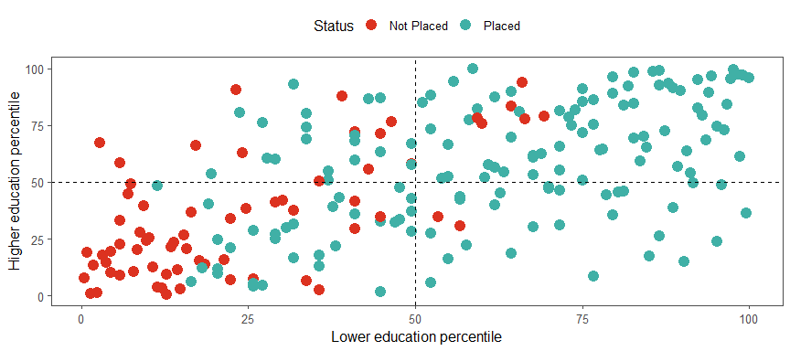
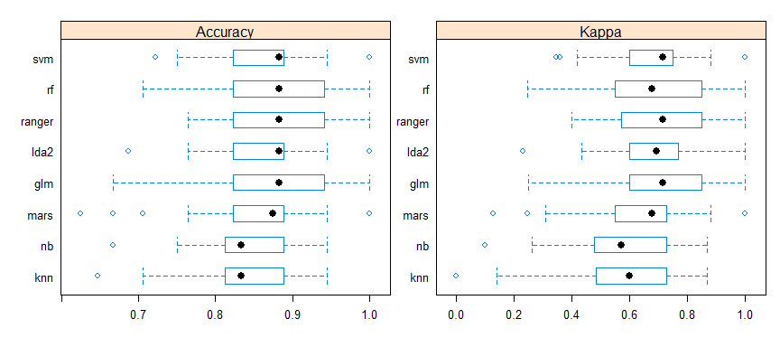
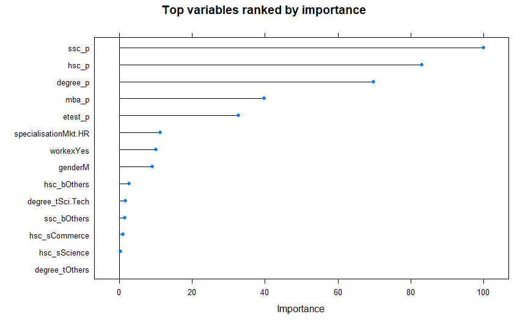

---
    output:
      github_document:

      fig_width: 9
      fig_height: 4
      fig_align: "center"
    
      code_folding: hide
      
    title: "Job Offer Prediction - MBA Students"
    subtitle: "Can we predict which student received a placement offer?"
    author: "by Peter Hontaru"
---

# Introduction

## Problem Statement:

**Can we predict if a candiate was placed in a role after their MBA studies? If so, which factors helped the most (ie. work experience, degree, school results, gender, etc)?**

## Who is this project intended for?

* **students** looking to assess whether they're likely to receive a placement offer or not
* **hiring managers/recruiters** trying to optimise their process
* *those generally interested in what improves a candidate's chance to receive a placement role at the MBA level*

## Why this dataset?

As a school governor, I am very interested in the importance of education in preparing a student for the job market as well as the current trends in the job market itself. This project would prove as an excellent way to further improve my data science skills while learning more about these topics.

# Key insights

## Summary:

* when combining the stats as lower education (secondary and higher secondary) and higher education (university and MBA), it was interesting to see that:
  * **virtually everyone that ranked in the top 25th percentile in their lower education were placed, regardless of their higher education performance**
  * almost no one in the bottom 25th percentile across the lower education was placed, regardless of their higher education peformance

* it is important to define what "performance" means when it comes to choosing a model (one type of prediction error is costlier than the other). For example, incorrectly predicting that someone **would be** placed(false positive) is not as bad as incorrectly predicting that someone **would not be** placed(false negative). The cost of the former is the time spent interviewing, while the cost of the latter is losing out on a job that the student would've secured
  * **scenario a) - preferable for hiring managers/recruiters -** if we're trying to maximise accuracy and optimise hiring costs, the LDA2 model (**91% test accuracy**) is more appropriate as it only has 4 incorrect predictions (3 false positives and 1 false negative)
  * **scenario b) - preferable for students -** if we're trying to minimise costly errors (false negatives), then the ranger model (83% test accuracy) is more appropriate (7 false positives and **0 false negatives**)

* the scores mattered in their cronological order with secondary first, followed by higher secondary, undergraduate and then masters; this could be due to 2 main factors:
  * the students who perform better early on are more likely to be the type of an ambitious student with a passion for learning that makes for a better hire
  * there is less of a chance to differentiate based on performance scores alone towards the end of the formal education since we've seen that most vary around the median (between 60% and 70%) instead of the much wider range early on

## Next steps/recommendations: 

* predictive algorithm to see if we could anticipate placement salaries and understand which factors contributed the most
* creating a dashboard where someone can input their scores and see whether the model would predict that they would get the role or not
* it would be very useful to gather more data, especially that of other generations of graduates

## Where did the data come from?

The dataset was downloaded from kaggle (link below). It was made available to the public by Ben Roshan and it is representative of the MBA students cohort of an anonymous university. 

https://www.kaggle.com/benroshan/factors-affecting-campus-placement

# Extended analysis

Full project available

* at the following [link](http://htmlpreview.github.io/?https://github.com/peterhontaru/Job-Offer-Prediction-MBA-Students/blob/master/Placement-Prediction.html), in HTML format
* in the **Placement-Prediction.md** file of this repo (however, I recommend previewing it at the link above since it was originally designed as a html document)